# 将 Dialogflow 与 Kotlin 配合使用的语音助手

> 原文：<https://dev.to/fevziomurtekin/voice-assistant-using-dialogflow-with-kotlin-3p98>

[](https://res.cloudinary.com/practicaldev/image/fetch/s--S7Fdwu-x--/c_limit%2Cf_auto%2Cfl_progressive%2Cq_auto%2Cw_880/https://thepracticaldev.s3.amazonaws.com/i/kl1jo37h27jl8x4jjw1f.png)
T4】

大家好，

在本文中，我将使用 Dialogflow 平台，一步一步地讲述 Kotlin 的一个简单助手应用程序的实现。

## 什么是 Dialogflow？

Google 2016 年终(原 Api.ai)公司是一个平台，用于为多种设备开发具有 ai 端语音和语音接口的聊天机器人。

让我们了解一下组件，以便更好地理解 Dialogflow。

[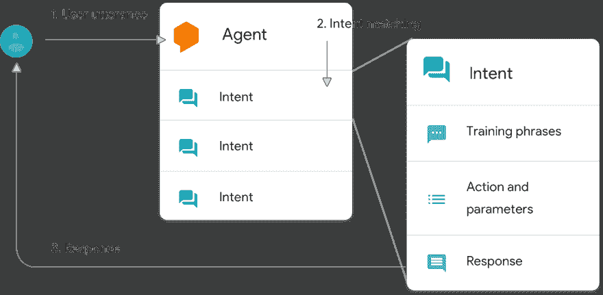](https://res.cloudinary.com/practicaldev/image/fetch/s--mRz56t4g--/c_limit%2Cf_auto%2Cfl_progressive%2Cq_auto%2Cw_880/https://thepracticaldev.s3.amazonaws.com/i/anz1og6h1cwcyxhau0pt.png)
T4】

### 代理

它帮助您处理已配置的数据，以便对用户的输入返回适当的响应。

该代理由 3 种不同的成分组成。

*   **训练短语:**定义用户说的样本表达。Dialogflow 使用这些表达式，并使用类似的表达式进行扩展，以创建匹配的模型。

*   **动作和参数:**(我们会在意向项中解释这个项目。)

*   **响应**

[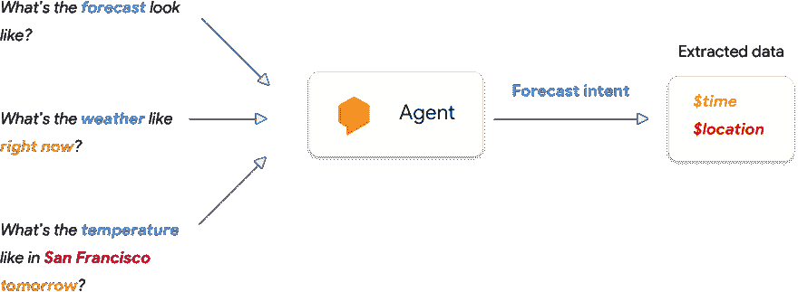](https://res.cloudinary.com/practicaldev/image/fetch/s--11n9MKhU--/c_limit%2Cf_auto%2Cfl_progressive%2Cq_auto%2Cw_880/https://thepracticaldev.s3.amazonaws.com/i/0w3jwva1vtfjb7eh1g9s.png)
T4】

### 意图

意图表示与用户所说内容相对应的匹配。你可以根据我们的目的创造不同的意图。

为了更好的解释；这是我们在该组件中创建不同类型的问题并创建这些问题的答案的地方。

### 履行

实现是采取必要的行动来返回我们从任何 web 服务中提出的问题的答案的地方。

[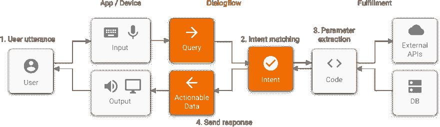](https://res.cloudinary.com/practicaldev/image/fetch/s--wcwPBimQ--/c_limit%2Cf_auto%2Cfl_progressive%2Cq_auto%2Cw_880/https://thepracticaldev.s3.amazonaws.com/i/u6h5cxmvvixk1f1yesgn.png)
T4】

如果我们对组成部分有所了解，让我们一步一步地开始这个项目。

## 发展阶段

我们将开发的项目场景:

> **用户:**你好/嘿/嗨
> 
> **助手:**欢迎光临！我怎么帮你？
> 
> **用户:**你是谁？/你能解释一下吗？
> 
> **助手:**步助手。我一周了。在土耳其境内你告诉我任何一个城市的名字，它也会帮助你了解天气:)
> 
> **用户:**布尔萨的天气怎么样？布尔萨怎么样？/Bursa——(要提到其他省份而不是 Bursa。)
> 
> **助手:**在布尔萨，天气 8 度局部多云。

#### **创建我们的新代理**

首先，我们去 link 创建我们的代理。

[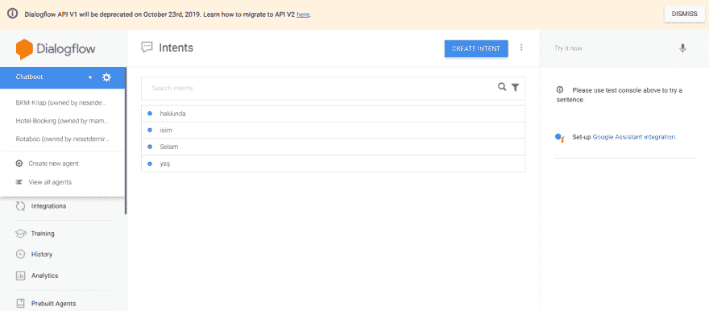](https://res.cloudinary.com/practicaldev/image/fetch/s--NMfnFE36--/c_limit%2Cf_auto%2Cfl_progressive%2Cq_auto%2Cw_880/https://thepracticaldev.s3.amazonaws.com/i/nuailex32jhbu0xx0aj2.png)
T4】

#### **创造意图**

创建代理后，我们确定我们的场景，并确定我们的助理将回答什么问题。

我们正在创造意向->创造意向并创造我们的新意向。

[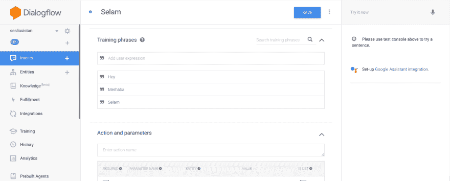](https://res.cloudinary.com/practicaldev/image/fetch/s--M_XiOiEK--/c_limit%2Cf_auto%2Cfl_progressive%2Cq_auto%2Cw_880/https://thepracticaldev.s3.amazonaws.com/i/xcksbxwzs6kzjd04a9xr.png)

[](https://res.cloudinary.com/practicaldev/image/fetch/s--K741NUCE--/c_limit%2Cf_auto%2Cfl_progressive%2Cq_auto%2Cw_880/https://thepracticaldev.s3.amazonaws.com/i/xkuuc9i53u4trxordpie.png)

然后我们识别并记录问题和答案。如你所见，我输入了我们会得到相同答案的问题，并找出了一个答案。

#### **Web 服务对我们问题的回答**

这个阶段是可选的。您也可以在不使用 web 服务的情况下创建和使用意图。

选择完成；我们可以确保答案是从行内编辑器或我们的 web 服务接收的。

> 我还使用了 webhook，并利用了当前 http://i.apixu.com 和 T2 的天气 api。你可以从。

[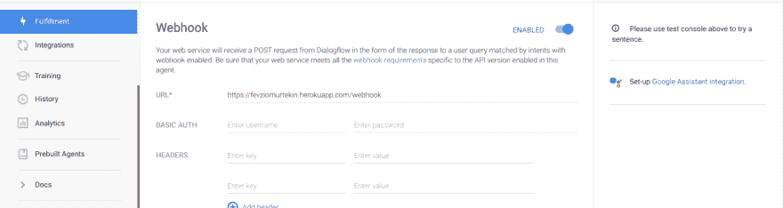](https://res.cloudinary.com/practicaldev/image/fetch/s--ClgaBBO7--/c_limit%2Cf_auto%2Cfl_progressive%2Cq_auto%2Cw_880/https://thepracticaldev.s3.amazonaws.com/i/1atjadl0s5bul3wxiyd7.png)
T4】

然后，根据我们刚刚创建的意图，我们确定哪些问题将从 web 服务返回数据。

[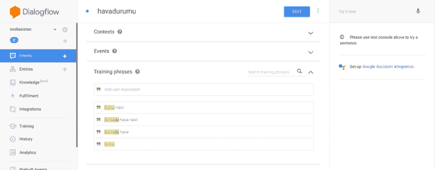](https://res.cloudinary.com/practicaldev/image/fetch/s--7pv2ICqR--/c_limit%2Cf_auto%2Cfl_progressive%2Cq_auto%2Cw_880/https://thepracticaldev.s3.amazonaws.com/i/p6pur019bevrkuiao3yx.png)

[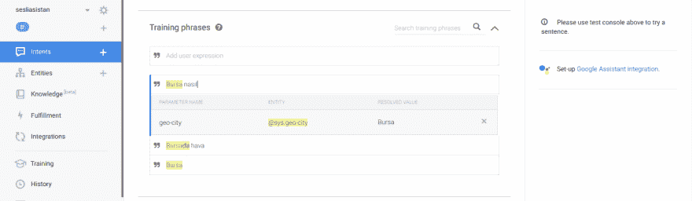](https://res.cloudinary.com/practicaldev/image/fetch/s--wQwXq8Vo--/c_limit%2Cf_auto%2Cfl_progressive%2Cq_auto%2Cw_880/https://thepracticaldev.s3.amazonaws.com/i/qxdmpcs556qv91vw56kz.png)

这里重要的部分是。囊(变量)使选定的部分，并使其成为一个关键点。我已经分配了地理城市。按照这个键，我还做了必要的服务。有关 Webhook 的更多信息，请访问

#### kot Lin 与 Dialogflow 平台的集成

我们按照 app -> build.gradle 添加 dialogflow 和 java 客户端 v2 库。

```
 // DialogFlow SDK depencies <br>
    implementation 'ai.api:sdk:2.0.7@aar' <br>
    implementation 'ai.api:libai:1.6.12' <br>
    // Java v2 <br>
    implementation 'com.google.cloud:google-cloud-dialogflow:0.67.0-alpha' <br>
    implementation 'io.grpc:grpc-okhttp:1.15.1' <br> 
```

Enter fullscreen mode Exit fullscreen mode

> java 客户端 v2 是用于 dialogflow 的 Java 客户端。(也可以使用 v1 版本，但 v1 将于 2019 年 10 月 23 日上市。)

为了使用 Java 客户端库，我们希望从 Google IAM 控制台创建一个 json。要创建这个 json，

首先，我们将进入我们在 IAM 控制台中创建的项目。

[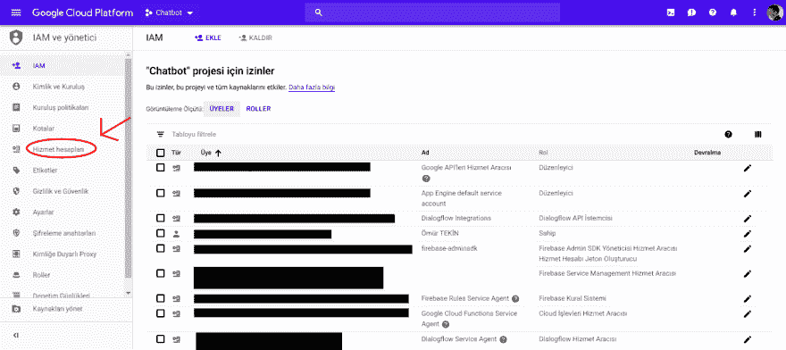](https://res.cloudinary.com/practicaldev/image/fetch/s--Ki-vk6nJ--/c_limit%2Cf_auto%2Cfl_progressive%2Cq_auto%2Cw_880/https://thepracticaldev.s3.amazonaws.com/i/mcqhlt9d4qf30xogr1cx.png)

[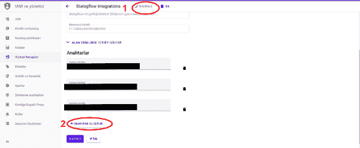](https://res.cloudinary.com/practicaldev/image/fetch/s---YhRTJIw--/c_limit%2Cf_auto%2Cfl_progressive%2Cq_auto%2Cw_880/https://thepracticaldev.s3.amazonaws.com/i/opbtyxggk4ffe5ww6hit.png)

先点击编辑后，我们称之为创建新键。

[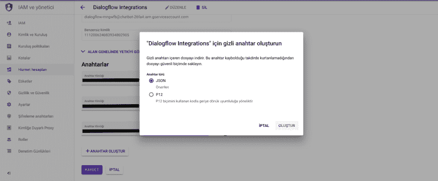](https://res.cloudinary.com/practicaldev/image/fetch/s---ieCCf4_--/c_limit%2Cf_auto%2Cfl_progressive%2Cq_auto%2Cw_880/https://thepracticaldev.s3.amazonaws.com/i/t5562c82ztdl9v0gs46q.png)
T4】

Json。它会在创建后自动下载到我们的计算机中。这个文件在我们的应用程序中创建一个原始目录，并将。json 文件转换成 raw。

```
 private fun initAsisstant() {
            try {
                val stream = resources.openRawResource(R.raw.asistan)
                val credentials = GoogleCredentials.fromStream(stream)
                val projectId = (credentials as ServiceAccountCredentials).projectId

                val settingsBuilder = SessionsSettings.newBuilder()
                val sessionsSettings =
                    settingsBuilder.setCredentialsProvider(FixedCredentialsProvider.create(credentials)).build()
                client = SessionsClient.create(sessionsSettings)
                session = SessionName.of(projectId, uuid)
            } catch (e: Exception) {
                e.printStackTrace()
            }

        } 
```

Enter fullscreen mode Exit fullscreen mode

通过读取在活动中创建的 json 文件，我们定义了我们的客户端。

然后，我们创建一个允许我们的消息与 Dialogflow 通信的类。

```
class RequestTask : AsyncTask<Void, Void, DetectIntentResponse> {

    var activity: Activity? = null
    private var session: SessionName? = null
    private var sessionsClient: SessionsClient? = null
    private var queryInput: QueryInput? = null

    constructor(activity: Activity,session:SessionName,sessionsClient: SessionsClient,queryInput: QueryInput){
        this.activity=activity
        this.session=session
        this.queryInput=queryInput
        this.sessionsClient=sessionsClient
    }

    override fun doInBackground(vararg params: Void?): DetectIntentResponse? {
        try {
            val detectIntentRequest = DetectIntentRequest.newBuilder()
                .setSession(session.toString())
                .setQueryInput(queryInput)
                .build()
            return sessionsClient?.detectIntent(detectIntentRequest)
        } catch (e: Exception) {
            e.printStackTrace()
        }

        return null
    }

    override fun onPostExecute(result: DetectIntentResponse?) {
        (activity as MainActivity).onResult(result)
    }

} 
```

Enter fullscreen mode Exit fullscreen mode

返回消息在结果函数的活动函数中。

#### 整合 TextToSpeech 和 SpeechToText

```
 private fun sendMicrophoneMessage(view:View){
           val intent: Intent = Intent(RecognizerIntent.ACTION_RECOGNIZE_SPEECH)
           intent.putExtra(
               RecognizerIntent.EXTRA_LANGUAGE_MODEL,
               RecognizerIntent.LANGUAGE_MODEL_FREE_FORM
           )
           intent.putExtra(RecognizerIntent.EXTRA_LANGUAGE, Locale.getDefault())
           intent.putExtra(
               RecognizerIntent.EXTRA_PROMPT,
               getString(R.string.speech_prompt)
           )
           try {
               startActivityForResult(intent, SPEECH_INPUT)
           } catch (a: ActivityNotFoundException) {
               Toast.makeText(
                   applicationContext,
                   getString(R.string.speech_not_supported),
                   Toast.LENGTH_SHORT
               ).show()
           }

       } 
```

Enter fullscreen mode Exit fullscreen mode

语音转文本功能。

```
 private fun sendMicrophoneMessage(view:View){
           val intent: Intent = Intent(RecognizerIntent.ACTION_RECOGNIZE_SPEECH)
           intent.putExtra(
               RecognizerIntent.EXTRA_LANGUAGE_MODEL,
               RecognizerIntent.LANGUAGE_MODEL_FREE_FORM
           )
           intent.putExtra(RecognizerIntent.EXTRA_LANGUAGE, Locale.getDefault())
           intent.putExtra(
               RecognizerIntent.EXTRA_PROMPT,
               getString(R.string.speech_prompt)
           )
           try {
               startActivityForResult(intent, SPEECH_INPUT)
           } catch (a: ActivityNotFoundException) {
               Toast.makeText(
                   applicationContext,
                   getString(R.string.speech_not_supported),
                   Toast.LENGTH_SHORT
               ).show()
           }

       } 
```

Enter fullscreen mode Exit fullscreen mode

语音转文本功能在检测到文本后很长时间都不起作用。

```
 private fun initAsisstantVoice() {

```
 asistan_voice= TextToSpeech(applicationContext,object : TextToSpeech.OnInitListener {
          override fun onInit(status: Int) {
              if (status!=TextToSpeech.ERROR){
                  asistan_voice?.language=Locale("tr")
              }
          }

      })

  } 
```

    Enter fullscreen mode 

    Exit fullscreen mode 
```

Enter fullscreen mode Exit fullscreen mode

#### 
  
阅读消息并添加版面

RequestTask 类返回到我们的 activity onResult 函数的返回函数值。我们将 onResult 函数中的响应值添加到布局中。

> 如果用户类型是 BOT，我们就完成了 TextToSpeech。

```
 fun onResult(response: DetectIntentResponse?) {

           try {

               if (response != null) {

                   var botReply:String=""

                   if(response.queryResult.fulfillmentText==" ")

                       botReply= response.queryResult.fulfillmentMessagesList[0].text.textList[0].toString()

                   else

                       botReply= response.queryResult.fulfillmentText

```
 appendText(botReply, BOT)
           } else {
               appendText(getString(R.string.anlasilmadi), BOT)
           }
       }catch (e:Exception){
           appendText(getString(R.string.anlasilmadi), BOT)
       }
   } 
```

    Enter fullscreen mode 

    Exit fullscreen mode 
```

Enter fullscreen mode Exit fullscreen mode

```
 private fun appendText(message: String, type: Int) {

            val layout: FrameLayout

            when (type) {

                USER -> layout = appendUserText()

                BOT -> layout = appendBotText()

                else -> layout = appendBotText()

            }

            layout.isFocusableInTouchMode = true

            linear_chat.addView(layout)

            val tv = layout.findViewById<TextView>(R.id.chatMsg)

            tv.setText(message)

            Util.hideKeyboard(this)

            layout.requestFocus()

            edittext.requestFocus() // change focus back to edit text to continue typing

            if(type!= USER) asistan_voice?.speak(message,TextToSpeech.QUEUE_FLUSH,null)

        } 
```

Enter fullscreen mode Exit fullscreen mode

# 
  
应用

 [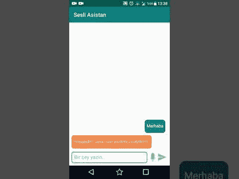
T4】](https://medium.com/@fevziomurtekin/kotlin-ile-dialogflow-kullanarak-sesli-asistan-yap%C4%B1m%C4%B1-205ef81e78d0?_branch_match_id=580614660615400010)

# 中等

 [
T4】](https://medium.com/@fevziomurtekin/kotlin-ile-dialogflow-kullanarak-sesli-asistan-yap%C4%B1m%C4%B1-205ef81e78d0?_branch_match_id=580614660615400010)

# Github

 [
T4】](https://github.com/fevziomurtekin/dialogflow-voice-assistant)

有了 Dialogflow，我试着尽可能多的解释语音助手。我希望我已经成功了。

在项目的后期，我的目标是让谷歌的辅助集成变得更加复杂。完成这些整合后，再来讨论新的文章。