# 定制和改进 VS 代码

> 原文：<https://dev.to/matthewbrophy/vs-code-configuration-favorites-4hl1>

作为 web 开发人员，我们花了大量的时间盯着我们的 IDE(集成开发环境。我们应该努力让这种经历尽可能的愉快和无痛，这才是有意义的。我个人选择的 IDE 是微软 Visual Studio 代码。虽然它是开箱即用的基本框架，但实际上可以添加无限量的定制和扩展来创建非常完美的工具，以满足您在开发过程中的任何需求。下面是一些我最喜欢的扩展和定制，帮助我完成代码。

## 扩展ˌ扩张


VS Code comes along with a robust, active developer community that lives to make developers lives easier through the creation and maintenance of some amazing extensions. In fact, there are so many available to do just about anything you can think of, that it can be quite overwhelming trying to choose which ones you want to implement into your development environment. My personal advice would be that when you think of something you want to improve, start by installing one extension and seeing if that serves your needs before installing another one with a similar name/function.

### 生活质量扩展

#### 简单的反应片段

我最喜欢的扩展类型之一。无论您使用哪种语言，都有健壮的代码片段扩展，可以节省您大量重复的击键。目前，我的大部分工作都是在 React 中完成的，下面你会找到我目前最喜欢的代码片段包。**注意，如果你还在上学或者在训练营，你可能想避免使用太多的代码片段扩展。虽然它们非常有帮助，但是在利用一个代码片段为你做繁重的工作之前，最好是巩固对语法的理解并把它记住。**
[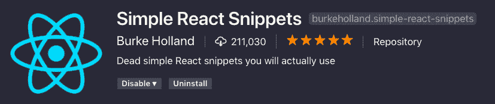](https://res.cloudinary.com/practicaldev/image/fetch/s--mfVU-IKO--/c_limit%2Cf_auto%2Cfl_progressive%2Cq_auto%2Cw_880/https://thepracticaldev.s3.amazonaws.com/i/4pjhfh73rqvpf333q8vv.png) 
包含一个简短的击键命令列表，可以让您从重复的工作中解脱出来，例如为类创建脚手架或导入组件。
[](https://i.giphy.com/media/l378pxefkBefLrjXO/giphy.gif)

```

Typing "imrc" produces:

import React, { Component } from 'react';

键入“ccc”产生:
类扩展组件{ 
构造函数(props) { 
超级(props)；
this . state = { }
}
render(){
return()；
 } 
 }

导出默认值；

```

There are tons of snippet extensions for just about every language out there.

#### 代码拼写检查器

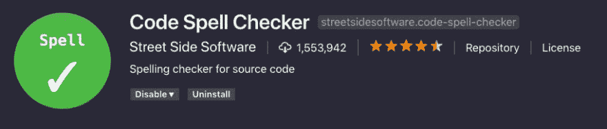Does exactly what it sounds like. A simple spellchecker that responds well to camelCase code.

#### 巴别塔 Javascript

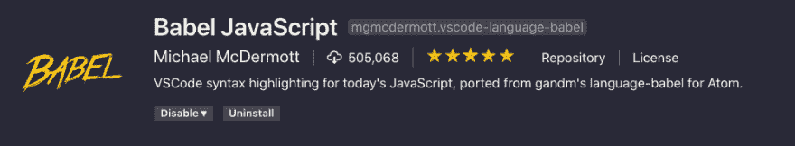An excellent syntax highlighter for Javascript. It will highlight a portion of code when the syntax is not going to make it past the compiler. Syntax highlighters also exist for most languages out there.

#### 在默认浏览器中打开 HTML

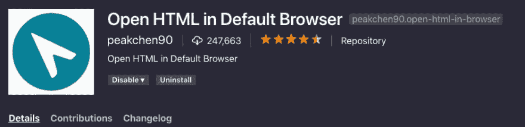Another extremely accurate named extension. It adds an option that appears when right-clicking on a file in the file-browser pane to simply open that given file in whatever is set as your default browser.

#### 路径智能感知

Adds intellisense auto-complete to file paths. For instance if you are importing a component from another file in your file tree, it will make suggestions for pathing: 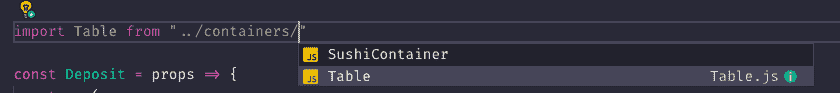

#### 敏感替换

When replacing multiple selections, it will preserve the casing on each item even if they are all differently cased.

#### 漂亮的代码格式化程序

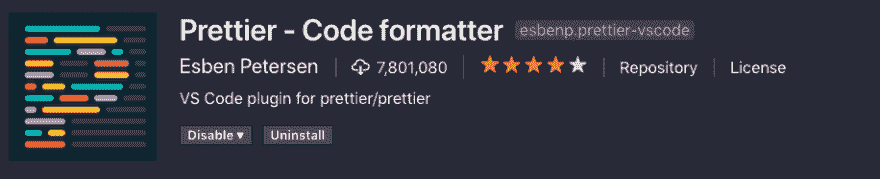One of my favorite extensions at the moment. It formats Javascript/TypeScript/CSS on save. It will format your code based on the length of lines, and other attributes to make your code more readable and a lot "Prettier" It will also automatically delete trailing commas, and unnecessary parenthesis and semicolons. It it completely customizable in the event you want it to ignore its formatting rules.

##### 之前更漂亮:

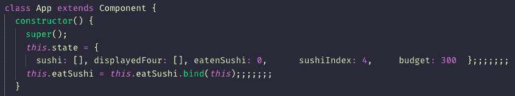

##### 更漂亮之后:

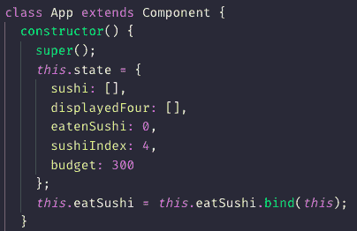


### 审美延伸

如果我们要在醒着的大部分时间里盯着某样东西看，我们最好尽可能让它看起来更舒服。VS Code 有数以千计的主题(大多数是免费的，有些需要购买)来让我们的编码体验如我们所愿。某些颜色主题也比默认代码更悦目，或者提供特定的配色方案，使得识别应用程序的特定组件和/或属性更加容易。

#### 吸血鬼官方&夜猫子

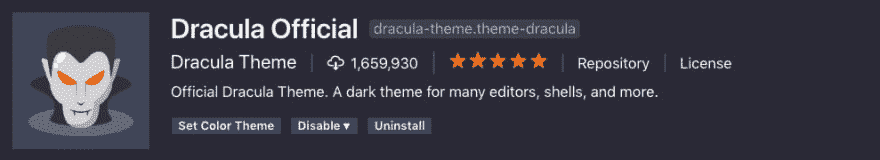 My favorite theme at the moment. I think the colors are fun and it makes it extremely easy to identify different aspects of the code I am working on: 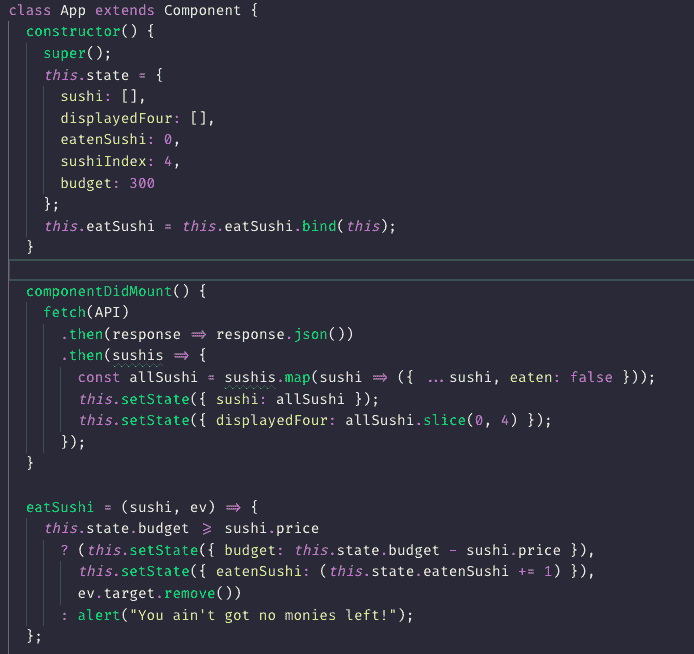
Another one of my favorite themes. Similar colors, really easy on the eyes at night: 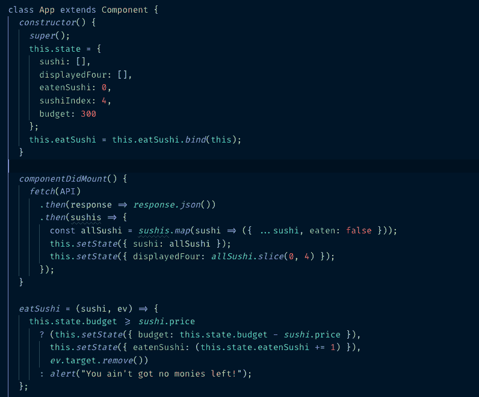

#### 材料图标主题

Add some flair to your icons: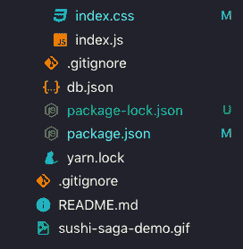


#### 找到你喜欢的字体。我的选择是 Fira 代码

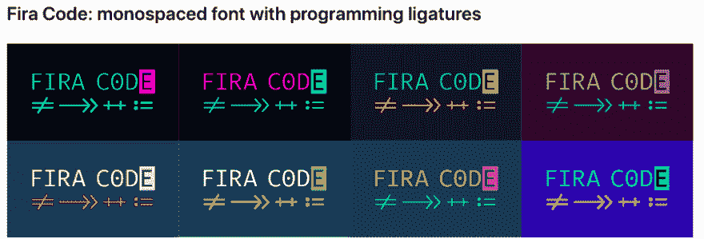Fira Code has Ligatures enabled. This just means that it supports symbols taking the place of common comparison operators: 

### 最后的想法和一个定制

总而言之，让 VS 代码成为你自己的。尽可能让你喜欢使用它，让它看起来赏心悦目。如果你发现自己在语法上有困难，或者一遍又一遍地重复相同的按键，去看看是否有一个扩展可以让你的生活变得更容易。

### 最后一个定制，去掉烦人的“参数提示”,它会在你打字时挡住你一半的屏幕

[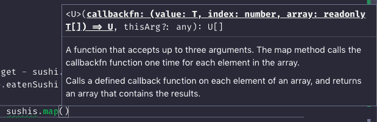](https://res.cloudinary.com/practicaldev/image/fetch/s--AD2G_Wuw--/c_limit%2Cf_auto%2Cfl_progressive%2Cq_auto%2Cw_880/https://thepracticaldev.s3.amazonaws.com/i/w9z32zyu0nlvtxnfek4z.png) 
这个弹出框默认是启用的。有时它会挡住你一半的屏幕，你将再也看不到你的代码。导航到你的 settings.json 文件，如果你想禁用这个烦人的建议框，添加下面一行:
[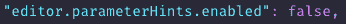](https://res.cloudinary.com/practicaldev/image/fetch/s--1q4DC-XD--/c_limit%2Cf_auto%2Cfl_progressive%2Cq_auto%2Cw_880/https://thepracticaldev.s3.amazonaws.com/i/vj3lz14vgxjlkmbh3nks.png)

### 编码快乐！