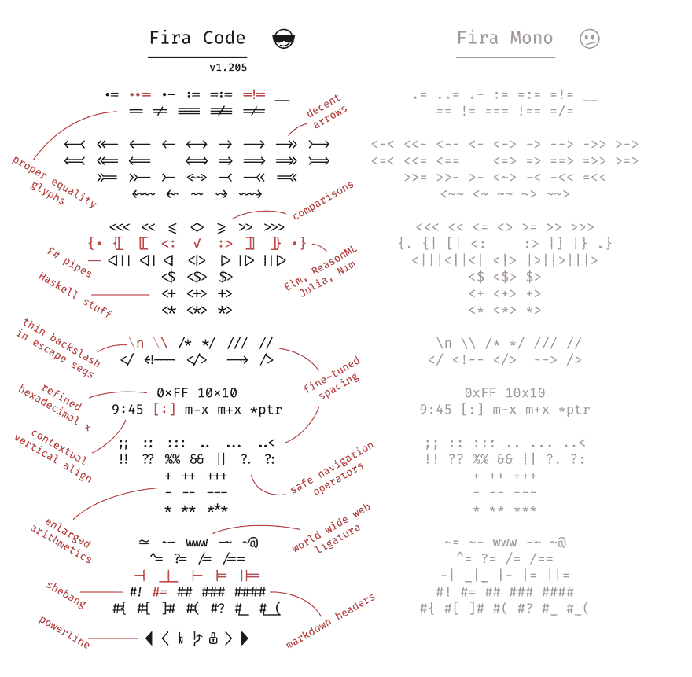
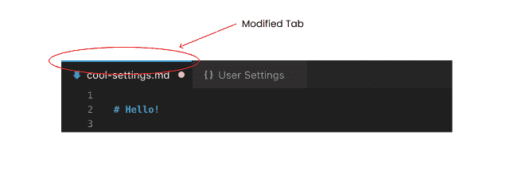

# 您应该自定义的 VS 代码设置

> 原文：<https://dev.to/softwaredotcom/vs-code-settings-you-should-customize-5e75>

VS Code 是一个高度可扩展的代码编辑器，拥有大量的扩展来增强你的工作流程。但是有许多现成的强大设置和定制，可以让 VS 代码更好地为您工作。

## 如何编辑您的设置

您的 VS 代码设置方便地存储在一个名为`settings.json`的 JSON 文件中。要在`settings.json`中编辑您的设置，首先用`CMD/CTRL + SHIFT + P`打开命令面板。

从命令选项板中，您可以在两个编辑设置的命令之间进行选择:

*   **打开设置(JSON)** 命令将让你直接编辑设置 JSON 文件。

*   **打开设置(UI)** 命令将打开一个用户友好的 UI，间接编辑设置 JSON 文件。

这两个选项工作得一样好，并且呈现相同的选项。进入设置选项卡后，您可以编辑**用户**或**工作区**设置。用户设置全局适用于任何 VS 代码实例，而工作区设置仅适用于您当前工作的工作区。工作空间设置会覆盖用户设置。

## 通过自动格式化粘贴的代码节省时间

如果你使用格式化程序，比如[更漂亮的](https://prettier.io/)或者[美化的](https://marketplace.visualstudio.com/items?itemName=HookyQR.beautify)，你可以通过将编辑器的粘贴格式设置为`true` :
来强制 VS 代码在文本粘贴到文件时格式化文本

```
 "editor.formatOnPaste":  true 
```

Enter fullscreen mode Exit fullscreen mode

通过自动格式化，您可以在每次粘贴时节省一次额外的点击。

## 保存时自动格式化，节省更多时间

除了能够在粘贴时格式化之外，VS Code 还允许您在每次保存文件时进行格式化。与格式化粘贴的文本类似，保存时格式化需要一个格式化程序，如 Prettier 或美化。

```
"editor.formatOnSave":  true 
```

Enter fullscreen mode Exit fullscreen mode

保存格式还可以确保文件的样式一致。不要太担心如何正确格式化代码，让格式化程序来处理每次保存。

## 用字体连字让代码更简洁

当两个或多个字符组合成一个字符时，就会出现连字。比如`<=`会转换成`≤`。在许多情况下，连字有助于提高代码的可读性。

向 VS 代码添加连字非常简单。为此，您需要更新两个设置。

首先，确保您使用的字体支持连字，并将其添加到编辑器的字体系列设置中。Fira Code 是一种流行的字体，可以使用，并有如何在 GitHub repo 中下载的说明。

```
"editor.fontFamily":  "Fira Code" 
```

Enter fullscreen mode Exit fullscreen mode

一旦有了喜欢的字体，只需将字体连字设置的值更改为`true`。

```
"editor.fontLigatures":  true 
```

Enter fullscreen mode Exit fullscreen mode

现在，您可以访问有用的多字符组合，使您的代码阅读速度更快。以下是 Fira 代码中可能出现的连字类型:

<figure>

[](https://res.cloudinary.com/practicaldev/image/fetch/s--uzH3ViYK--/c_limit%2Cf_auto%2Cfl_progressive%2Cq_auto%2Cw_880/https://raw.githubusercontent.com/tonsky/FiraCode/master/showcases/all_ligatures.png)

<figcaption>The ligatures available with Fira Code</figcaption>

</figure>

## 通过高亮显示已修改的标签快速找到您未保存的工作

VS 代码在编辑器的标签页中已经编辑过但还没有保存的文件旁边放一个小点。更改编辑器的设置以突出显示修改过的标签，会在标签顶部添加一条彩色线。

```
"workbench.editor.highlightModifiedTabs":  true 
```

Enter fullscreen mode Exit fullscreen mode

圆点可能更难找到，尤其是当您打开许多标签时，但是更新此设置会使未保存的文件突出出来，以便于导航。

<figure>

[](https://res.cloudinary.com/practicaldev/image/fetch/s--ess15JVS--/c_limit%2Cf_auto%2Cfl_progressive%2Cq_auto%2Cw_880/https://thepracticaldev.s3.amazonaws.com/i/u6n0cp4x9bdsy7l5r8s6.png)

<figcaption>Note the blue line at the top of the tab</figcaption>

</figure>

## 打开自动保存，不要丢失您的工作

如果您不希望修改标签，当焦点离开脏文件的编辑器，或者当焦点离开 VS 代码窗口时，文件可以在一段延迟后自动保存。

为此，将自动保存设置从`off`更改为`afterDelay`、`onFocusChange`或`onWindowChange`。

```
 "files.autoSave":  "afterDelay" 
```

Enter fullscreen mode Exit fullscreen mode

Autosave 并不适合所有人或所有项目，但在需要时或在特定工作区切换会很好。

## 通过按类型或最近更改对文件进行排序，增强文件浏览器的性能

默认情况下，VS 代码将按照字母顺序对文件资源管理器中的文件进行排序，但是也有其他可用的选项。

将排序顺序更改为`type`会将具有相似扩展名的文件分组在一起，而将排序顺序更改为`modified`会将您最近修改的文件放在顶部。

```
"explorer.sortOrder":  "type" 
```

Enter fullscreen mode Exit fullscreen mode

另一个选项是`filesFirst`,它按字母顺序排列所有内容，但是将文件放在文件夹之前。根据项目的大小和复杂程度，对文件进行排序可以使工作流程的导航更加直观。

## 通过定制光标改变事物

我们花很多时间盯着我们的光标。为什么不定制呢？

光标可以改变为以下任意形状:
`block``block-outline``line``line-thin``underline`或`underline-thin`。将光标样式更改为您喜欢的任何形状:

```
 "editor.cursorStyle":  "block" 
```

Enter fullscreen mode Exit fullscreen mode

闪烁动画也可以改变为`blink`、`smooth`、`phase`、`expand`或`solid`。只需更新光标闪烁设置:

```
"editor.cursorBlinking":  "smooth" 
```

Enter fullscreen mode Exit fullscreen mode

## 清理你的文件，修剪多余的换行符

当一个文件被保存时，VS 代码会在文件的末尾修剪掉多余的换行符。

```
"files.trimFinalNewlines":  true 
```

Enter fullscreen mode Exit fullscreen mode

我犯了在文件结尾积累空行的错误，所以自动清理东西是很棒的。

## 输入新的一行而不接受建议

默认情况下，VS 代码允许您使用`Enter`或`Tab`键接受建议。

可以关闭用`Enter`接受建议(或更改为`smart`，当它进行文本更改时，用`Enter`接受建议)。

```
 "editor.acceptSuggestionOnEnter":  "off" 
```

Enter fullscreen mode Exit fullscreen mode

该开关有助于避免插入新行和接受建议之间的歧义。

## 保存您的设置并发现其他功能

现在您已经自定义了您的设置，您可以使用扩展[设置同步](https://marketplace.visualstudio.com/items?itemName=Shan.code-settings-sync)来保存您的设置。设置同步通过使用 GitHub 和 gists 来同步 VS 代码中的自定义设置。

如果你正在寻找更多的想法， [VS 代码文档](https://code.visualstudio.com/docs/getstarted/tips-and-tricks)给出了一些有用的建议。另一个名为 [VS Code 的网站能做到这一点吗？！](https://vscodecandothat.com/)列出了一系列有价值的建议。

我以前也写过一篇关于 [VS 代码扩展的文章，如果你正在寻找其他扩展 VS 代码的方法，你可能在](https://dev.to/thegeoffstevens/vs-code-extensions-you-may-not-have-heard-of-before--5ed3)之前没有听说过。

我也很想听听随着时间的推移你调整了哪些设置！

*试试我们的 VS 代码扩展[代码时间](https://marketplace.visualstudio.com/items?itemName=softwaredotcom.swdc-vscode)或者订阅我们的简讯 [SRC](https://www.software.com/src) 。*