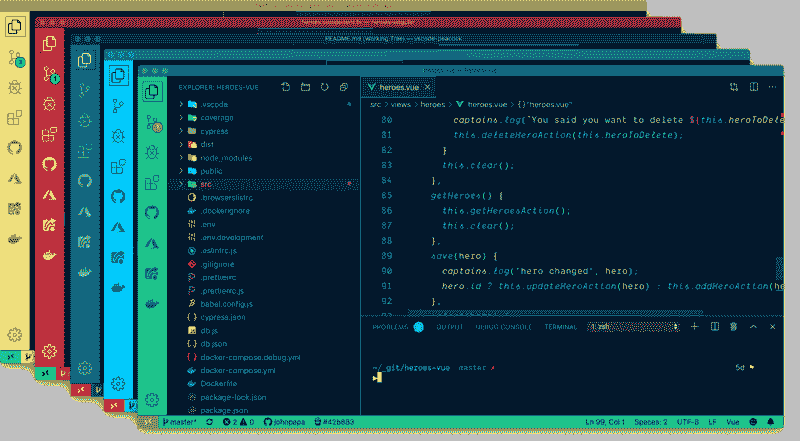

# VSCode 扩展 Peacock

> 原文：<https://dev.to/codingcatdev/vscode-extension-peacock-18m3>

> 原帖:[https://ajonp.com/blog/vscode-extension-peacock/](https://ajonp.com/blog/vscode-extension-peacock/)
> 请注意视频来自版本 2。

# VSCode 扩展孔雀

[https://www.youtube.com/embed/VYuSbZxbBoE](https://www.youtube.com/embed/VYuSbZxbBoE)

微妙地改变 Visual Studio 代码工作区的颜色。当您有多个 VS 代码实例，使用 VS Live Share，或者使用 VS Code 的远程特性，并且希望快速识别您的编辑器时，这是理想的选择。

[Visual Studio 市场](https://marketplace.visualstudio.com/items?itemName=johnpapa.vscode-peacock)

[完整文档](https://papapeacockstorage.z13.web.core.windows.net/)