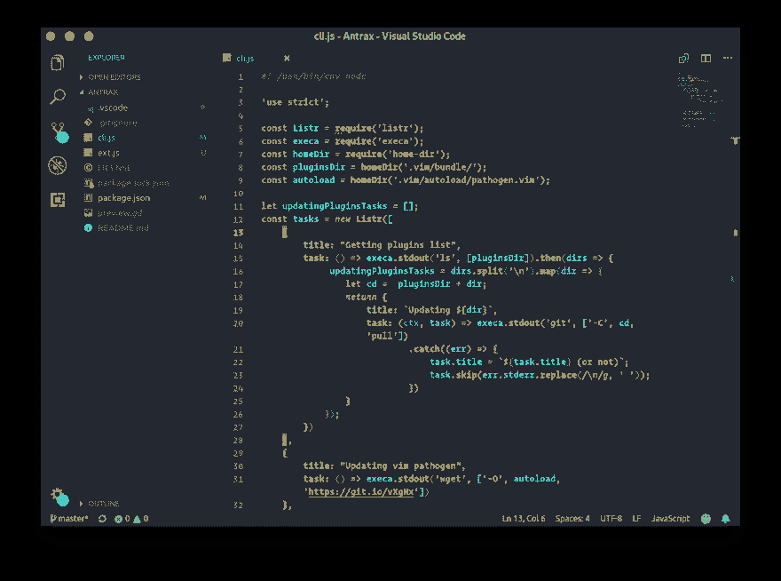
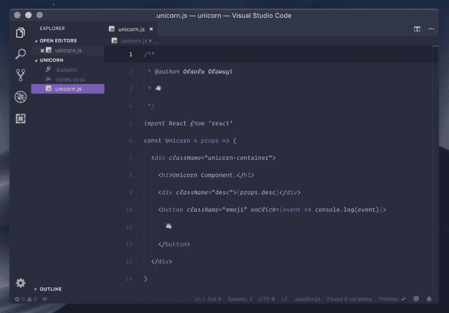
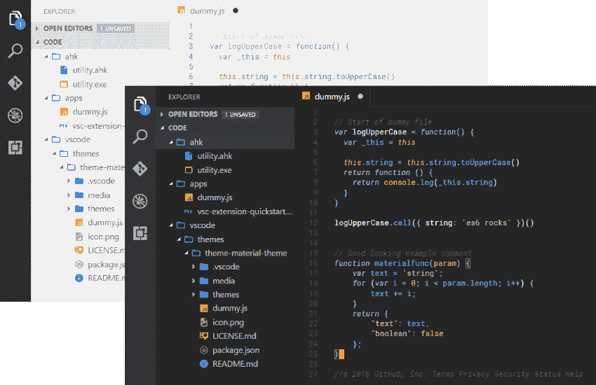
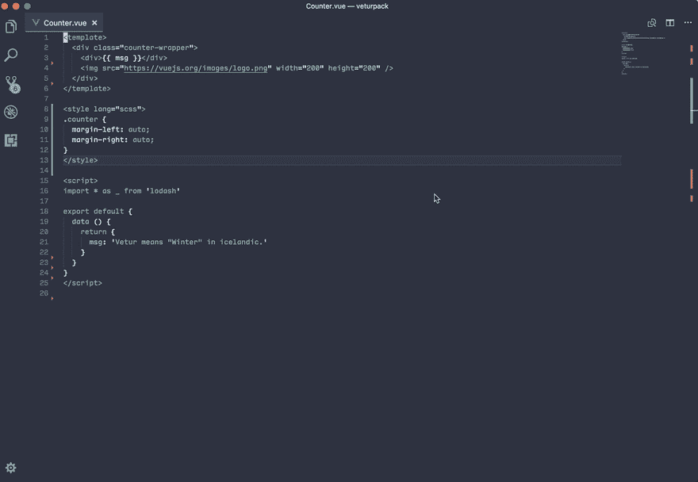

# VSCode 扩展

> 原文：<https://dev.to/lucasalt/vscode-extensions-j76>

我的博客上的法语原文，由 [Deepl](https://deepl.com) 翻译

如果你是一名开发人员或者你对开发感兴趣，你不可能错过 Visual Studio 代码。在本文中，我将向您介绍一些从技术或美学角度改进工作空间的扩展。

### 技术改进

#### [维特](https://marketplace.visualstudio.com/items?itemName=octref.vetur)

Vetur 是一个扩展，用于使用 **VueJS** 进行应用程序或网站开发。它允许您为`.vue`文件启用语法高亮显示，拥有一个特定于 VueJS 的自动完成系统，并建议通过安装 **Node.js** 模块来启用应用程序的格式化和调试。

#### [Python](https://marketplace.visualstudio.com/items?itemName=ms-python.python)

该扩展由微软开发，在 VSCode 中提供了对 Python 语言的全面支持。像 Vetur 一样，该扩展提供了一个自动完成、调试、格式化文件等功能的系统。

#### [StandardJS-Javascript 标准样式](https://marketplace.visualstudio.com/items?itemName=chenxsan.vscode-standardjs)

为了促进团队中应用程序的开发，已经创建了指南来就固定的规则达成一致。有几个比如 **Airbnb** 或者 **Standard** 。使用此扩展，当您不遵守指南中的规则时，将显示一条错误消息和一个解释，以便可以更正错误。由于有了命令面板，您还可以格式化整个文件，以便纠正所有可纠正的错误。

#### [vs code 的编辑器配置](https://marketplace.visualstudio.com/items?itemName=EditorConfig.EditorConfig)

就像 **StandardJS - Javascript 标准样式**一样， **EditorConfig for VSCode** 扩展允许你根据项目设置不同的代码规则。使用这个扩展，当您的项目中有一个`.editorconfig`文件时，它将覆盖您的配置中的设置。例如，您将 VSCode 配置为使用 4 个空格缩进代码，而在您的`.editorconfig`文件中，您没有使用 4 个空格而不是 1 个制表符缩进代码。扩展将加载这个来修改您的配置，只在当前项目中遵循这个规则。

### 视觉改善

#### [漂亮的 UI](https://marketplace.visualstudio.com/items?itemName=swashata.beautiful-ui)

该扩展提供了基于各种来源的 32 种不同颜色的主题，如 *Monokai Classic* 、 *Base16* 、 *One Dark* 等等。

#### [T2](#andromeda)仙女座

#### [古夜主题](https://marketplace.visualstudio.com/items?itemName=whizkydee.material-palenight-theme)

#### [崇高的物质主题](https://marketplace.visualstudio.com/items?itemName=jprestidge.theme-material-theme)

#### [素材图标主题](https://marketplace.visualstudio.com/items?itemName=PKief.material-icon-theme)

**材质图标主题**为你的文件和文件夹提供多达 400 种不同的图标，同时尊重谷歌与 **[材质设计](https://material.io/)** 达成的标准。

#### [vscode-icons](https://marketplace.visualstudio.com/items?itemName=vscode-icons-team.vscode-icons)

像**材质图标主题**一样，该扩展提供了广泛的图标，但由微软团队开发。

### 各种扩展

#### [波拉科德](https://marketplace.visualstudio.com/items?itemName=pnp.polacode)

**Polacode** 允许你像 **[carbon](https://carbon.now.sh)** 一样给你的代码“拍照”，但是直接在 VSCode 中。

#### [上色](https://marketplace.visualstudio.com/items?itemName=kamikillerto.vscode-colorize)

**着色**允许你直接在 css/sass/scss/scss/stylus/中查看颜色...
T3T5】

#### [设置同步](https://marketplace.visualstudio.com/items?itemName=Shan.code-settings-sync)

如果您在多台计算机上工作，并且希望在每台计算机上都有相同的配置和扩展，**设置同步**适合您！每次添加扩展或更改 VSCode 设置时，扩展都会更新 Gist 上的一组文件。当你更换电脑时，只需安装**设置同步**并将扩展连接到包含所有配置文件的 Gist。