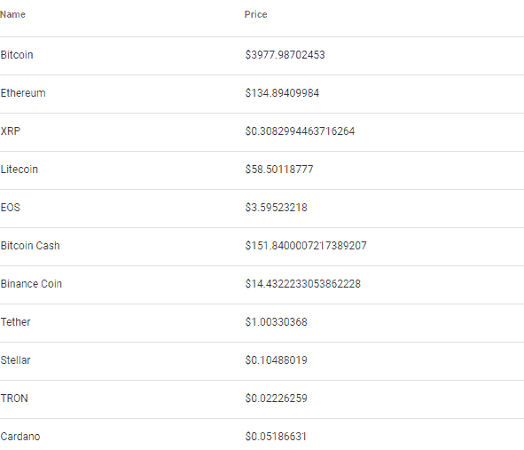

# Vue coincap api

> 原文：<https://dev.to/alicannklc/vue-coincap-api-5ecb>

Websocket 支持

[WebSocket 支持](https://docs.coincap.io/#9d1f0874-aa46-420c-9091-8bf9859c0743)

[演示现场](https://alicannklc.github.io/Vuejs-coincap-api/)

[基础 app 回购](https://github.com/Alicannklc/Vuejs-coincap-api)