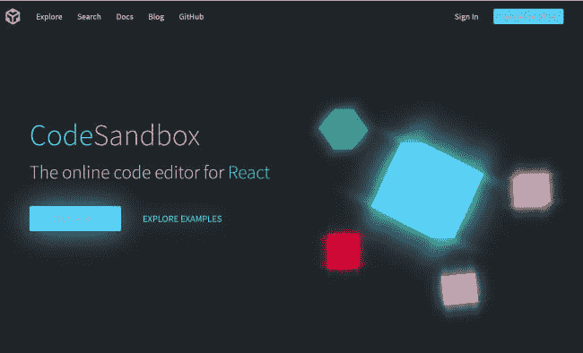
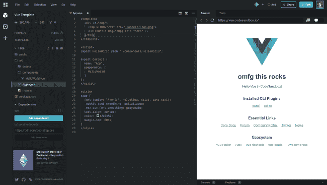
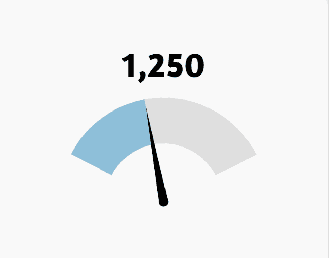
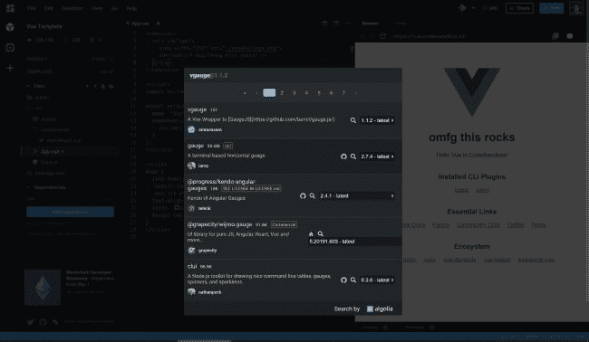

# Vue 组件 FTW - VGauge(以及给 CodeSandbox 的情书)

> 原文：<https://dev.to/raymondcamden/vue-components-ftw-vgauge-and-a-love-letter-to-codesandbox-26jl>

当我[开始这个系列](https://dev.to/raymondcamden/vue-components-ftw---toasted-386h)的时候，我有一些想法——突出那些很酷并且容易使用的 Vue 组件。作为我的“简单”原则的一部分，我只想使用支持脚本标签安装的组件。换句话说，您不必使用完整的 Vue 应用程序，只需在页面上添加一个脚本标签即可。这使得使用 CodePen 变得特别容易，我最近一直是 CodePen 的忠实粉丝。这并不是说我反对不支持这一点的组件，或者认为不支持脚本标签的使用是一件可怕的事情，我只是想表达我对一个支持两种用例的组件的欣赏。

今天我破例一次。在浏览 [Awesome Vue](https://github.com/vuejs/awesome-vue) 列表来挑选我的下一个要审查的组件时，我发现了 [VGauge](https://github.com/amroessam/vgauge) ，一个需要安装 npm 的超级简单的组件。心血来潮，在 [Jen Looper](https://www.jenlooper.com/) 推荐之后，我看了一下 [CodeSandbox](https://codesandbox.io/) 。

[](https://res.cloudinary.com/practicaldev/image/fetch/s--Ybrbuyzu--/c_limit%2Cf_auto%2Cfl_progressive%2Cq_auto%2Cw_880/https://static.raymondcamden.cimg/2019/04/gauge1.png)

CodeSandbox 是(另一个)在线编辑器，但我立刻被它的高性能所震撼。它支持许多不同类型的项目模板，包括许多不同的前端和后端框架。我能够在不到一秒的时间内启动并运行一个完整的 Vue 应用程序。在线编辑器工作良好，自动预览非常快。你甚至可以把它弹出到一个新的标签页，它会在你工作的时候自动更新。

[](https://res.cloudinary.com/practicaldev/image/fetch/s--F-vTFokC--/c_limit%2Cf_auto%2Cfl_progressive%2Cq_auto%2Cw_880/https://static.raymondcamden.cimg/2019/04/gauge2.png)

它有很好的 npm 支持，很好的 GitHub 集成，还有一大堆非常好的功能。我计划从现在开始广泛使用它，给它一个很好的测试，我绝对推荐人们也看看它。

好了，就这样，正如我说的，我今天选择的组件是 [VGauge](https://github.com/amroessam/vgauge) 。这是为 [gauge.js](http://bernii.github.io/gauge.js/) 包装的 Vue。如果你不知道什么是仪表，这里有一个简单的例子:

[](https://res.cloudinary.com/practicaldev/image/fetch/s--EIAfBj4j--/c_limit%2Cf_auto%2Cfl_progressive%2Cq_auto%2Cw_880/https://static.raymondcamden.cimg/2019/04/gauge3.png)

该组件包括许多风格的变化，也有一个很好的动画风格时，改变价值。这使得它对于可能随时间更新的值特别有用。

正如我上面所说的，这个特定的组件需要 npm 安装，这意味着您将只为 Vue 应用程序使用它，而不是一个简单的脚本。在你的终端上，你可以简单地做`npm i vgauge --save`。在 CodeSandbox 中，这是通过`Add Dependency`按钮完成的:

[](https://res.cloudinary.com/practicaldev/image/fetch/s--5Kw1S6Mh--/c_limit%2Cf_auto%2Cfl_progressive%2Cq_auto%2Cw_880/https://static.raymondcamden.cimg/2019/04/gauge4.png)

这在截屏上看不出来，但是当我输入“vgauge”进行搜索时，得到的回复非常快。我不知道开发者在幕后做了什么，但这无疑是我见过的最敏捷的网络应用之一。

一旦安装，使用非常简单。这里有一个修改自项目自述文件的例子:

```
<template>
<v-gauge :value="value"/>
</template>

<script>
import VGauge from 'vgauge'

export default {
  components: {
    VGauge
  },
  data() {
    return {
      value: 42
    }
  }
}
</script> 
```

正如我所说的，您可以选择多种仪表的外观和感觉，还可以设置最小值和最大值，以便正确定位指针。我制作了一个快速演示，我认为它很好地展示了动画。这是代码。

```
<template>
  <div>
    <v-gauge :value="score"/>
  </div>
</template>

<script>
import VGauge from "vgauge";

export default {
  components: {
    VGauge
  },
  name: "HelloWorld",
  props: {
    msg: String
  },
  data() {
    return {
      score: 40
    };
  },
  created() {
    setInterval(() => {
      this.score += getRandomInt(-10, 10);
      if (this.score < 0) this.score = 0;
      else if (this.score > 100) this.score = 100;
    }, 2000);
  }
};

function getRandomInt(min, max) {
  min = Math.ceil(min);
  max = Math.floor(max);
  return Math.floor(Math.random() * (max - min + 1)) + min;
}
</script> 
```

我从初始值 40 开始。然后，我用两秒钟的间隔将标尺从 1 点上下移动到 10 点。想看看实际情况吗？CodeSandbox 可以一键式部署到 Zeit 的 Now 服务和 Netlify(尽管支持还在测试阶段)。在写这篇博文的时候，我正在测试 Netlify 部署。这是它正在进行中的屏幕截图:

[](https://res.cloudinary.com/practicaldev/image/fetch/s--N38DVw4e--/c_limit%2Cf_auto%2Cfl_progressive%2Cq_auto%2Cw_880/https://static.raymondcamden.cimg/2019/04/gauge5.png)

整个过程花了大约 2 分钟，你可以在这里看到结果:[https://csb-042l64jx5l.netlify.com/](https://csb-042l64jx5l.netlify.com/)

出于完整性考虑，这里有一个 CodeSandbox 如何嵌入的示例:

[https://codesandbox.io/embed/042l64jx5l](https://codesandbox.io/embed/042l64jx5l)

你也可以分享一个二维码，我认为这在会议上会非常酷。不管怎样，一如既往，在下面留言让我知道你的想法。