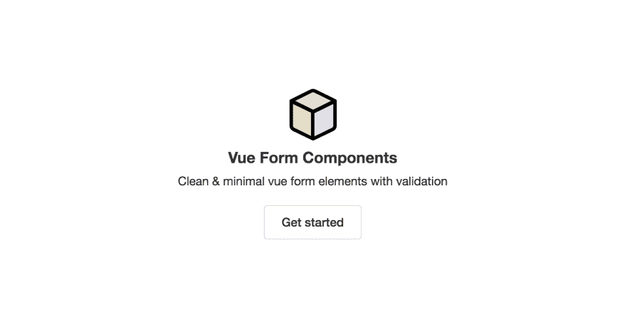

# 带验证的 Vue 表单组件

> 原文：<https://dev.to/antonreshetov/vue-form-components-with-validation-5ckf>

我想分享我的小型开源项目，在 Vue 上创建带验证的表单。

这个项目有一个简单和简约的设计。

当然，通过在 Vue 上构建一个 UI，我的库就像大海中的一滴水，但是我仍然想为开源社区做点什么，做点贡献。当然，我想提高我在 Vue 上开发组件的技能。

如果任何人对这个项目感兴趣，或者你有任何问题，总是很乐意谈论这个话题。

组件的组成:

*   输入(也是文本区域)
*   挑选
*   检验盒
*   收音机
*   纽扣
*   形式

感谢关注！

[https://antonreshetov.github.io/vue-form-components](https://antonreshetov.github.io/vue-form-components)