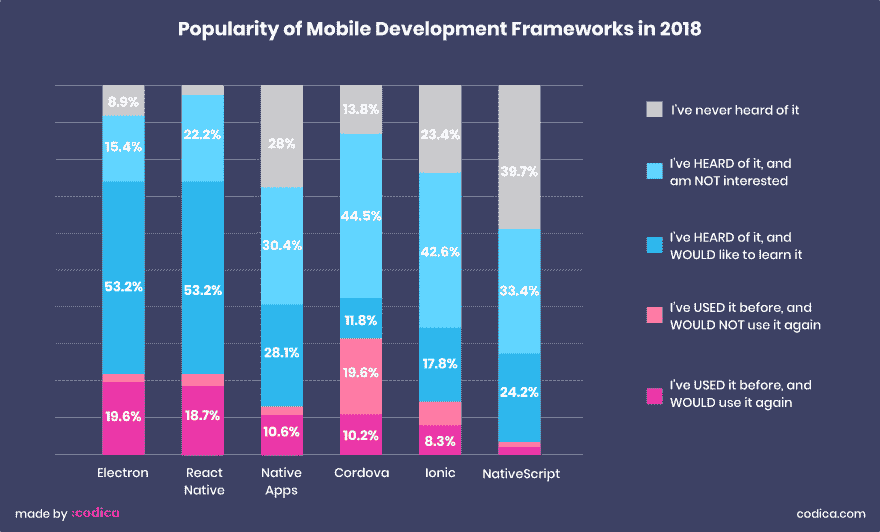
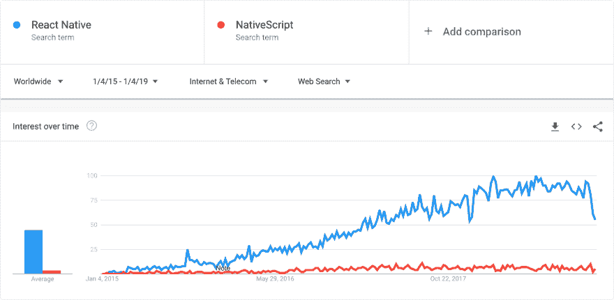

# vue vs React:2019 年为你的项目选择最好的工具。第二部分

> 原文：<https://dev.to/codicacom/vue-vs-react-choosing-the-best-tool-for-your-project-in-2019-part-2-53b2>

今天，我们想为您提供关于 Vue vs React 的文章的第二部分。在这里，我们从技术方面比较这些工具，比如工具、灵活性、移动开发和组件方法。如果你错过了第一部分，这里是[链接](https://dev.to/codicacom/vue-vs-react-part-1-1i57)为您提供方便。

让我们开始吧。

## 技术特征

### 工装

**React**
首先， **React** 提供第三方工具 [create-react-app (CRA)](https://github.com/facebook/create-react-app) 。此选项可让您快速开始创建 React 应用程序。它可以帮助您避免耗时的配置过程，并且可用于可扩展的大型项目。

在 CRA 正式发布之前，程序员需要在开始开发新应用程序或手动配置时，处理以前应用程序的 Webpack-config 和其他`.rc`文件。如果不使用 CRA，您需要将相同的配置从一个应用程序放到另一个应用程序中。事实上，这并不太费时间，但相当乏味。

此外，React 对主要的 ide 有很大的支持。

**Vue**
[Vue-cli](https://cli.vuejs.org/) 是 **Vue.js** 快速创建项目的集成工具。这些项目有一个现成的结构，一个已安装的配置，以及一些基本文件。

Vue-CLI 的主要优势:

*   现成的特性(Babel、TypeScript、ESLint、PostCSS、PWA 等。).
*   图形用户界面。
*   完全可配置，你不需要弹出。
*   开发者构建自己的插件和模板的机会。

### 灵活性

**React** 都是关于 UI 的，所以最初，你在构建 UI 组件中获得支持。

ReactJS 给你一个操作状态管理的机会。但是，如果您有一个大型项目，为了方便起见，您需要使用 Redux 作为状态管理工具。它大大简化了状态管理。

再者，如果考虑到 React 路由器——它不是官方包，也是第三方包。

另一方面， **Vue.js** 是一个动态框架，它提供开箱即用的工具来创建应用程序。但是，如有必要，它还提供了您可能需要的所有功能:

*   [Vuex](https://vuex.vuejs.org/) 进行状态管理。
*   [Vue 路由器](https://router.vuejs.org/)用于应用 URL 管理。
*   [Vue.js 服务器端渲染器](https://vuejs.org/v2/guide/ssr.html)用于服务器端渲染。

### 移动开发

**React Native** 是一个使用 JavaScript 创建跨平台 iOS 和 Android 应用的框架。简而言之，它给了 React 开发者一个创建移动应用的机会。它于 2015 年发布，基于 React。它不使用 WebView 和 HTML，但是原生组件在 JS 中有绑定，并且包装在 React 中。

另一方面，Vue 与 **NativeScript** (NS)配对，这提供了在 XML、CSS、JavaScript 的帮助下创建跨平台应用的机会。实际上，NativeScript 处理的问题与上面提到的 React Native 相同，但它们有一些区别。

使用 HTML / CSS / JavaScript，web 开发人员更容易理解 NativeScript 语法和实现。在标记创建中，XML 的用法也类似于 HTML。NativeScript 可以直接访问本机平台 API。

为了比较和了解两个框架的受欢迎程度和开发者社区使用情况，我们为您提供以下对比表[JS 2018 图表](https://2018.stateofjs.com/mobile-and-desktop/overview/)状态。

[](https://res.cloudinary.com/practicaldev/image/fetch/s--516skKDq--/c_limit%2Cf_auto%2Cfl_progressive%2Cq_auto%2Cw_880/https://thepracticaldev.s3.amazonaws.com/i/y6tj02yie8p3583igmep.png)

此外，下面我们提供了一个 Google 趋势图，显示了 React Native 和 NativeScript 在过去 4 年中的搜索结果。

[](https://res.cloudinary.com/practicaldev/image/fetch/s--PNrlaBHs--/c_limit%2Cf_auto%2Cfl_progressive%2Cq_auto%2Cw_880/https://thepracticaldev.s3.amazonaws.com/i/h5rijgffsq58s6mudqwm.jpg)

来源:[谷歌趋势](https://trends.google.com/trends/explore?cat=13&date=2015-01-04%202019-01-04&q=React%20Native,NativeScript)

如您所见，React Native 在软件开发人员中更受欢迎，这意味着有更多现成的解决方案可用。

### 构件进场

一般来说，Vue 和 React 在开发中遵循相同的组件方法:这意味着一个组件有一个文件。然而，仍然有一些有趣的不同方面有待发现。

**React**
许多年来，开发人员一直试图将模板和嵌入式 Javascript 逻辑分开，但在 JSX，他们再次混杂在一起。也许这听起来很全能，但你应该听听彼得·亨特的演讲[“反应:重新思考最佳实践”](https://www.youtube.com/watch?v=x7cQ3mrcKaY)。

[https://www.youtube.com/embed/x7cQ3mrcKaY](https://www.youtube.com/embed/x7cQ3mrcKaY)

JSX 是一个可选的预处理器，具有类似 HTML 的语法，然后被编译成 JavaScript。因此有些奇怪——例如，您需要使用`className`而不是`class`,因为后者是 JavaScript 中的保留关键字。

**Vue**
Vue 提供[【单列元件】](https://vuejs.org/v2/guide/single-file-components.html)。这就像是关于责任划分的一种妥协——模板、脚本和样式不在一个文件中，而是在三个不同的、有序的部分中。这意味着您可以获得语法高亮、CSS 支持以及轻松使用像 Jade 或 SCSS 这样的预处理程序的能力。

让我们熟悉一下 React 和 Vue 中为待办事项列表应用程序创建的同一个组件，看看 ReactJS JSX 和 Vue.js 模板之间的区别。

Vue 组件结构:

```
<template>
  <div class="ToDoItem">
    <p class="ToDoItem-Text">{{todo.text}}</p>
      <div class="ToDoItem-Delete"
        @click="deleteItem(todo)">-
      </div>
  </div> </template> 
```

Enter fullscreen mode Exit fullscreen mode

反应组件结构:

```
import React, {Component{ from 'react';
import './ToDoItem.css';

class ToDoItem extends Component {
  render() {
    return {
      <div className="ToDoItem">
        <p className="ToDoItem-Text">{this.props.item}</p>
        <div className="ToDoItem-Delete" onClick={this.props.deleteItem}>-</div>
      </div>
    );
  }
}

export default ToDoItem; 
```

Enter fullscreen mode Exit fullscreen mode

## 结论

在这里，我们向您展示了文章的第二部分，涵盖了诸如**工具、灵活性、移动开发和组件方法**等技术问题。

第三部分(最后一部分)即将推出，届时我们将比较 Vue，并通过此类技术特性做出反应，如**性能、状态管理(Redux 和 Vuex)和存储数据接收**。

敬请关注，点击此处阅读全文版本:Vue vs React:[2019 年为你的项目选择最佳工具](https://www.codica.com/blog/react-vs-vue-2019/)。