# 想成为 React 开发者吗？这是一个由顶尖技术学校创建的 48 部分的大型教程

> 原文：<https://dev.to/scrimba/want-to-become-a-react-developer-here-s-a-massive-48-part-tutorial-created-by-a-top-technology-school-33pk>

[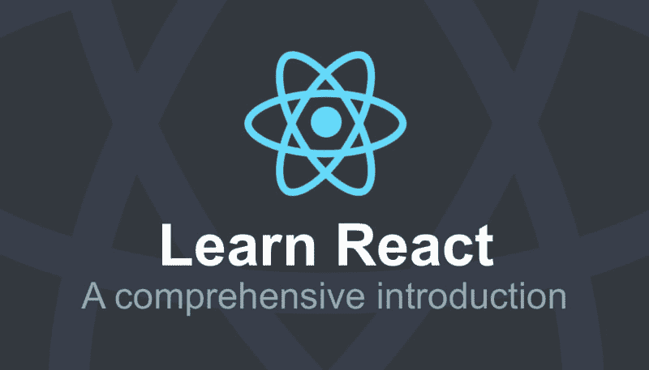](https://res.cloudinary.com/practicaldev/image/fetch/s--BkbfBYLt--/c_limit%2Cf_auto%2Cfl_progressive%2Cq_auto%2Cw_880/https://cdn-images-1.medium.com/max/800/1%2AB9uqLg7-TM2-bAIwa7Zxuw.png)

自从我们开始在 Scrimba 上创建课程，我们的用户就要求我们在 React 上开设一门适当的入门课程。所以，当我们最终找到它时，我们决定让它成为我们有史以来最全面的课程。

它叫做 [Learn React](https://scrimba.com/g/glearnreact?utm_source=dev.to&utm_medium=referral&utm_campaign=glearnreact_launch_article) ，总共包含 48 个章节——混合了讲座和互动作业。

> 伯根[@伯根](https://dev.to/perborgen)课程启动🚀
> 
> 我们与 [@bobziroll](https://twitter.com/bobziroll) 在 [@VSCHOOLHQ](https://twitter.com/VSCHOOLHQ) 合作，创建了一个🆓React 课程在 [@scrimba_com](https://twitter.com/scrimba_com) 。它很大，总共有 48 章，并且充满了互动的挑战。
> 
> 如果你觉得你的关注者可能会喜欢，请 RT！
> 2018 年 11 月 28 日下午 17:26[](https://twitter.com/intent/tweet?in_reply_to=1067832208889651202)[](https://twitter.com/intent/retweet?tweet_id=1067832208889651202)81[](https://twitter.com/intent/like?tweet_id=1067832208889651202)126

这是 Scrimba 上有史以来最全面的介绍课程。它总共包含 48 章——混合了演讲和互动作业。

课程背后的人是著名的教师鲍勃·齐罗尔。鲍勃是 V School 的教育总监，这是一所技术教育学校，教授全栈 Javascript 和 UX 课程。

根据[课程报告](https://www.coursereport.com/best-coding-bootcamps)，V School 是顶尖的编码学校之一，所以我们非常兴奋能与他们合作。

所以如果你喜欢这门课，一定要去看看 V Schools 沉浸式[全栈项目](https://vschool.io/fullstack/)。现在我们来看看课程是怎么布局的！

### 第一部分。介绍&哲学

Bob 自 2014 年以来一直在 bootcamps 任教，并形成了自己的学习理念。所以在第一个视频中，我们会熟悉这个哲学。在下图中，你会看到它的要点。

[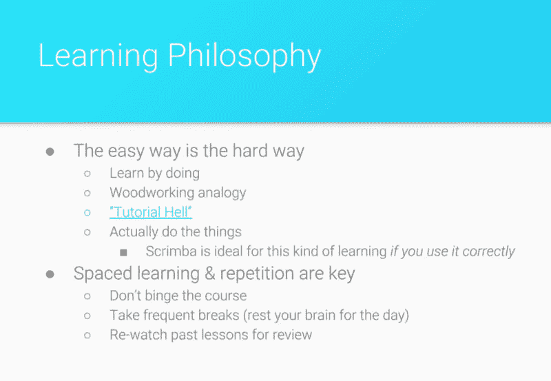](https://res.cloudinary.com/practicaldev/image/fetch/s--2f6uzqCd--/c_limit%2Cf_auto%2Cfl_progressive%2Cq_auto%2Cw_880/https://cdn-images-1.medium.com/max/800/1%2A2S7jU91WeeVGAA__NQth8g.png)

### 第二部分。我们将会建造什么

在下一个视频中，Bob 给出了课程的概述，他让我们快速浏览了我们将要构建的两个项目:一个简单的待办事项列表应用程序，它涵盖了许多 React 核心主题；和一个顶点项目，这将是一个热图生成器应用程序。

### 第三部分。为什么要反应？

[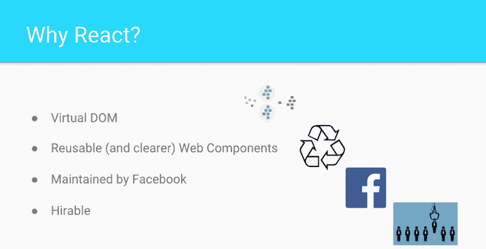](https://res.cloudinary.com/practicaldev/image/fetch/s--RyEjerkV--/c_limit%2Cf_auto%2Cfl_progressive%2Cq_auto%2Cw_880/https://cdn-images-1.medium.com/max/800/1%2AkI7-rNRdWKKPa22BQ6jytQ.png)

首先，Bob 让我们知道了为什么我们甚至应该考虑使用 React 这样的东西，而不是仅仅用普通的 JavaScript 编写它，以及为什么这么多开发人员已经选择使用 React。

### 第 4 部分。反应堆〔T2〕jsx

在这个屏幕截图中，我们直接跳到代码中，使用 JSX 编写我们的 Hello World 一个特定于 React 的**JavaScript extend**，所以我们可以同时编写 HTML 和 JavaScript！

```
import React from "react"  
import ReactDOM from "react-dom"

ReactDOM.render(<h1>Hello world!</h1>, document.getElementById("root")) 
```

鲍勃也很快涵盖了一些问题，如正确的反应进口和 JSX 不喜欢当你试图渲染两个相邻的元素。

```
// Hm, not sure which element I should render here... 
   ReactDOM.render(  
     <h1>Hello world!</h1>  
     <p>I'm a paragraph</p>,   
   document.getElementById("root"))

// This is much better! 
   ReactDOM.render(  
     <div>  
       <h1>Hello world!</h1>  
       <p>I'm a paragraph</p>  
     </div>,   
   document.getElementById("root")) 
```

### 第五部分。反应堆& JSX 实践

这是我们这门课的第一次练习。在实践中，Bob 为我们设定了一个目标，并给了我们一些提示。

[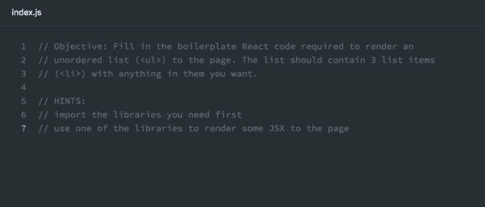](https://res.cloudinary.com/practicaldev/image/fetch/s--Dh5bHOxa--/c_limit%2Cf_auto%2Cfl_progressive%2Cq_auto%2Cw_880/https://cdn-images-1.medium.com/max/800/1%2ArfsPYSNkwMA-ttqGH6u5Ag.png)

Bob 鼓励我们花一些时间来思考和解决这个问题以及随后的挑战，因为我们付出的努力越多，我们就越能记住 React。

最后，Bob 向我们展示了解决方案，但这个博客不会透露任何剧透😃，所以你可以在[的实际截屏](https://scrimba.com/p/p7P5Hd/cM7K3Hk?utm_source=dev.to&utm_medium=referral&utm_campaign=glearnreact_launch_article)中随意查看。

### 第六部分。功能组件

在本期节目中，Bob 向我们简要介绍了功能组件。

```
import React from "react"  
import ReactDOM from "react-dom"

function MyApp() {  
  return (  
    <ul>  
       <li>1</li>  
       <li>2</li>  
       <li>3</li>  
    </ul>  
)}

ReactDOM.render(  
   <MyApp />,  
   document.getElementById("root")  
) 
```

我们将`MyApp()`定义为一个简单的 JS 函数，它返回一个非常简单的 HTML 列表元素，但这正是 React 的亮点，因为稍后我们将该函数用作`<MyApp />` HTML 元素！

### 第七部分。功能组件实践

是时候做更多的练习了。

[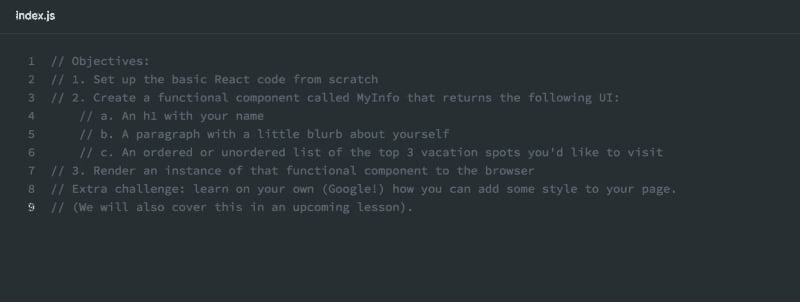](https://res.cloudinary.com/practicaldev/image/fetch/s--FY68Z4ok--/c_limit%2Cf_auto%2Cfl_progressive%2Cq_auto%2Cw_880/https://cdn-images-1.medium.com/max/800/1%2Ah1rFdXDsaD_3N3nKh_3BNA.png)

因此，就像在之前的练习中一样，这里不会有剧透，但可以自由地[直接进入代码](https://scrimba.com/p/p7P5Hd/cPLv2cZ?utm_source=dev.to&utm_medium=referral&utm_campaign=glearnreact_launch_article)并提出自己的解决方案。最后，鲍勃像以前一样带我们看了一遍。

### 第八部分。将组件移动到单独的文件中

在这一章中，Bob 给了我们一些组织代码的好的和常见的 React 实践，例如用与组件本身相同的组件命名文件。

然后，我们学习如何将组件提取到它们自己的单独文件中，以及如何将它们导出以供以后在我们的应用程序中使用。

```
// MyInfo.js

import React from "react"  
function MyInfo() {  
  return (  
   // component code 
  )  
}

export default MyInfo 
```

然后，我们可以将组件放到`components`文件夹中，并将`<MyInfo />`导入到`index.js`和

```
// index.js

import React from "react"  
import ReactDOM from "react-dom"

import MyInfo from "./components/MyInfo"

ReactDOM.render(  
   <MyInfo />,   
   document.getElementById("root")  
) 
```

### 第九部分。父/子组件

在这个截屏中，Bob 谈到了父组件和子组件。常规应用程序远比呈现给 DOM 的一个组件复杂。相反，我们通常有复杂的组件层次结构。

我们从编写我们的功能组件`<App />`开始，它将位于组件层次结构
的顶端

```
// index.js

import React from "react"  
import ReactDOM from "react-dom"

import App from "./App"

ReactDOM.render(<App />, document.getElementById("root")) 
```

而在`App.js`本身:

```
// App.js

import React from "react"

function App() {  
  return (  
    <div>  
      <nav>  
        <h1>Hello a third time!</h1>  
        <ul>  
          <li>Thing 1</li>  
          <li>Thing 2</li>  
          <li>Thing 3</li>  
        </ul>  
      </nav>  
      <main>  
        <p>This is where most of my content will go...</p>  
      </main>  
    </div>  
  )  
}

export default App 
```

如你所见，我们可以用`<App />`编写页面，但是这违背了 React 的目的。我们可以把每个 HTML 片段放入一个单独的组件中。

这就是我们的`<App />`可能的样子:

[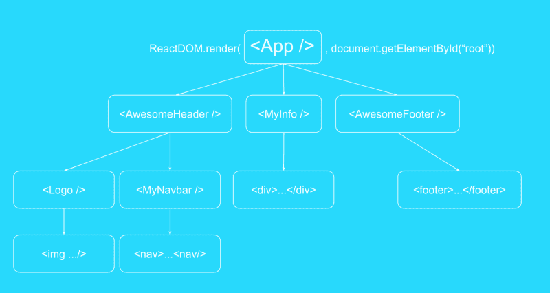](https://res.cloudinary.com/practicaldev/image/fetch/s--KtUgw2zn--/c_limit%2Cf_auto%2Cfl_progressive%2Cq_auto%2Cw_880/https://cdn-images-1.medium.com/max/800/1%2ACTJ4NU3XVU53licZiFurCw.png) 
在 React 中，以大写字母开头的 HTML 元素表示我们创建的组件

使用这个概念，我们的`<App />`组件看起来应该是这样的:

```
import React from "react"  
import MainContent from "./MainContent"  
import Footer from "./Footer"

function App() {  
  return (  
    <div>  
      <Header />  
      <MainContent />  
      <Footer />  
    </div>  
  )  
}

export default App 
```

这要好得多，而且是一种非常简洁的组织代码的方式。

### 第十部分。父/子组件练习

练习时间到了。这是鲍勃交给我们的任务，让我们开始吧。

[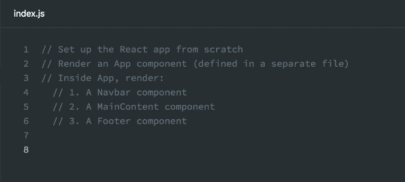](https://res.cloudinary.com/practicaldev/image/fetch/s--r0Xa4LJf--/c_limit%2Cf_auto%2Cfl_progressive%2Cq_auto%2Cw_880/https://cdn-images-1.medium.com/max/800/1%2ANxkmipjNqprMwLkEckeBMQ.png)

像往常一样，在这个博客中没有剧透，所以请随意进入 Bob 截屏中的解决方案[。](https://scrimba.com/p/p7P5Hd/caQwRHM?utm_source=dev.to&utm_medium=referral&utm_campaign=glearnreact_launch_article)

如果你不太确定从哪里开始，Bob 建议你先看一下前面的章节，尝试想出一个解决方案，即使在这个阶段还不完美。这将是最好的学习方法。

### 第十一部分。待办事项应用程序—第 1 阶段

好吧！恭喜你，我们已经掌握了 React 的最基本知识，这个基础足以让我们开始构建我们的第一个真实应用程序。

首先，我们需要为我们的应用程序创建一个结构，这是一个练习我们在之前的截屏中所学内容的绝佳机会。这是任务，让我们开始吧。

[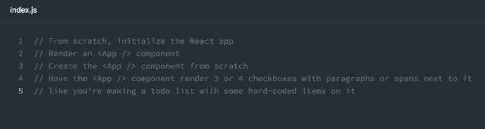](https://res.cloudinary.com/practicaldev/image/fetch/s--3yIKscJe--/c_limit%2Cf_auto%2Cfl_progressive%2Cq_auto%2Cw_880/https://cdn-images-1.medium.com/max/800/1%2A50Gm9c-XRI67WtKVGJBOkQ.png)

现在这应该很简单了，Bob 和我们一起完成了解决方案。

[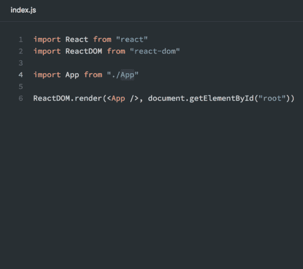](https://res.cloudinary.com/practicaldev/image/fetch/s--bUhc4a8x--/c_limit%2Cf_auto%2Cfl_progressive%2Cq_auto%2Cw_880/https://cdn-images-1.medium.com/max/600/1%2ASj_r9rbQb0Ha4oFtc8OHfw.png)
[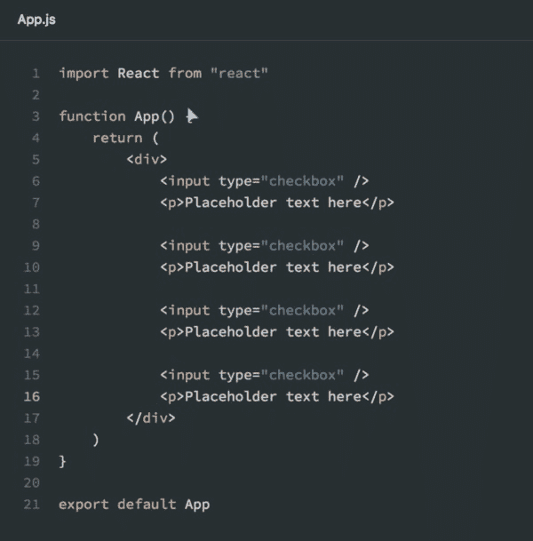T6】](https://res.cloudinary.com/practicaldev/image/fetch/s--Pgomm2hZ--/c_limit%2Cf_auto%2Cfl_progressive%2Cq_auto%2Cw_880/https://cdn-images-1.medium.com/max/600/1%2A2XfHnrp5DVQYnbNF5H3uoQ.png)

### 第十二部分。样式与 CSS 类反应

在这个演员表中，Bob 向我们介绍了 React 中的样式。在 React 中有几种不同的方式来设计组件，我们将从 CSS 类开始，因为这是我们大多数人应该非常熟悉的一种。

让我们从一个简单的例子开始。这个例子的结构和上一章的一样。

[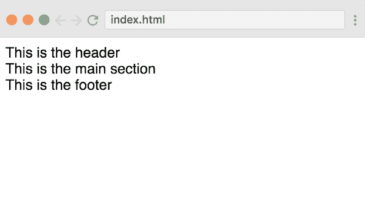](https://res.cloudinary.com/practicaldev/image/fetch/s--vqh4SV1Z--/c_limit%2Cf_auto%2Cfl_progressive%2Cq_auto%2Cw_880/https://cdn-images-1.medium.com/max/600/1%2AR8e7YRgaN8rVvK8YKnQJ4w.png)
[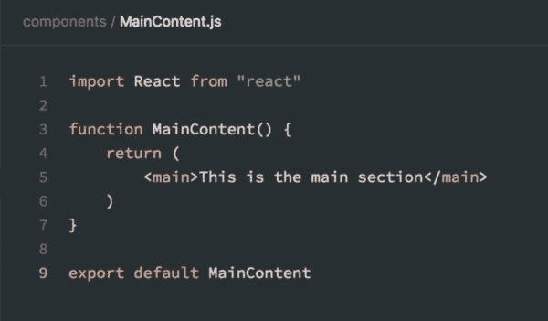T6】](https://res.cloudinary.com/practicaldev/image/fetch/s--mHZkixx4--/c_limit%2Cf_auto%2Cfl_progressive%2Cq_auto%2Cw_880/https://cdn-images-1.medium.com/max/600/1%2AhZoSleZmE-c3EvKIcmdrBw.png)

在 React 中，它非常类似于普通的 HTML，但是我们需要使用`className` :
来代替`class`

```
function Header() {  
  return (  
    <header className="navbar">This is the header</header>  
  )  
} 
```

很多地方会告诉你，我们需要写`className`，因为`class`是 JS 中的保留字，但事实是，在引擎盖下，JSX 正在使用香草 JS DOM API。

```
document.getElementById("something").className += "new-class-name" 
```

现在我们可以只写普通的 CSS:

[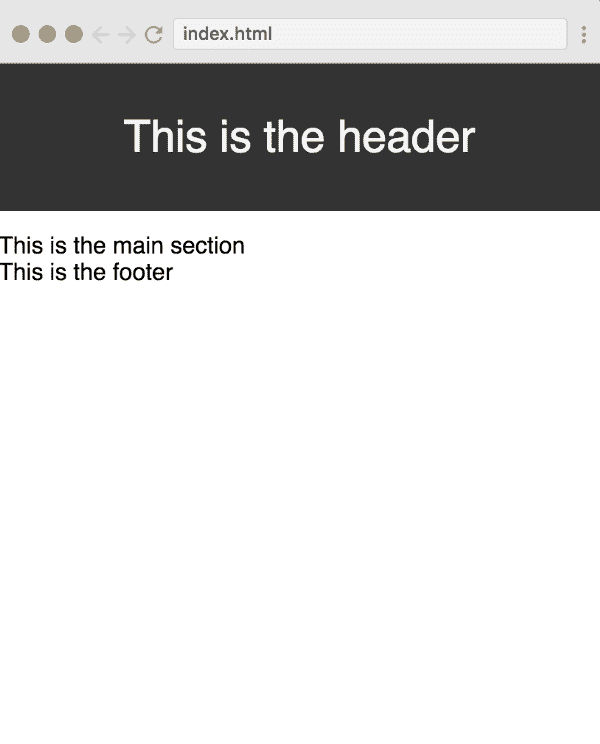](https://res.cloudinary.com/practicaldev/image/fetch/s--1uI3wm00--/c_limit%2Cf_auto%2Cfl_progressive%2Cq_auto%2Cw_880/https://cdn-images-1.medium.com/max/600/1%2AbwANslPGNxTwPDUV5iP5RQ.png)
[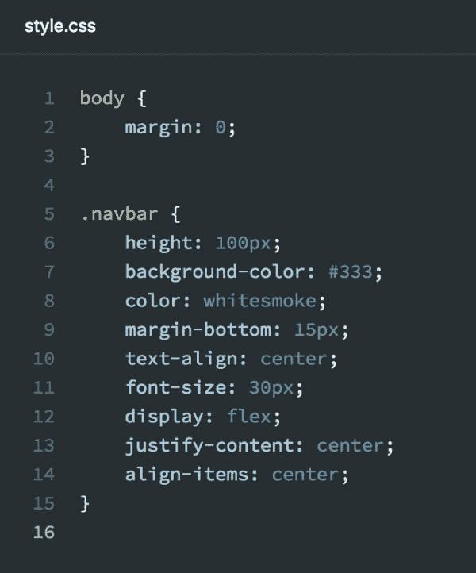T6】](https://res.cloudinary.com/practicaldev/image/fetch/s--uaOqh4HQ--/c_limit%2Cf_auto%2Cfl_progressive%2Cq_auto%2Cw_880/https://cdn-images-1.medium.com/max/600/1%2ARDIboVLpeoLSUKVG4tDigA.png)

### 第十三部分。一些警告

顺便说一下，Bob 只是让我们知道他个人喜欢的某些风格选择，所以我们知道有不同的做事方式。如果您希望以稍微不同的方式编写代码，我们非常欢迎您这样做。

```
// Bob likes to avoid semicolons, where possible 
import React from 'react'

// but there is no way to avoid them here 
for (let i = 0; i < 10; i++) {}

// Bob prefers regular functions 
function App() {  
  return (  
    <h1>Hello world!</h1>  
  )  
}

// Although you can write ES6 arrow functions if you wish 
const App = () => <h1>Hello world!</h1> 
```

### 第十四部分。从 JSX 到 JavaScript 再到 JavaScript

在我们继续前进之前，我们真的应该看看 JSX 和 JS 是如何合作的。我们看到在我们的 JS 函数中，我们如何返回看起来像 HTML，但却是 JSX 的东西。

现在，如果我们想用一个变量呢？我们可以用`{}` :
来做

```
function App() {  
  const firstName = "Bob"  
  const lastName = "Ziroll"  

  return (  
    <h1>Hello {\`${firstName}  ${lastName}\`}!</h1>  
  )  
} 
```

`{}`是 JSX 使用普通 JS 的一种方式。简单地说，它看起来像`<h1>This is JSX {now we're writing JS} and we're back to JSX</h1>`

### 第十五部分。带有 Style 属性的内联样式

在 React 中应用样式的一个非常快速的技巧是使用内联样式。

```
<h1 style={{color: "#FF8C00"}}>Hello World!</h1> 
```

注意我们如何使用花括号`{{}}`。这是因为 React 期望样式作为一个对象被传递，但是我们也需要告诉 JSX 我们正在使用 JS 对象。

不过有一个问题。

```
// This is going to error 
<h1 style={{background-color: "#FF8C00"}}>Hello World!</h1>

// This is what we need to do, because JS doesn't like dashes in the 
// middle of our property names 
<h1 style={{backgroundColor: "#FF8C00"}}>Hello World!</h1> 
```

### 第十六部分。待办事项应用程序—第 2 阶段。

在这个截屏中，我们将继续我们离开待办事项列表的地方。首先，Bob 要求我们通过提取下面的代码来创建`<TodoItem />`组件。

```
<input type="checkbox" />  
<p>Placeholder text here</p> 
```

现在我们可以添加一些样式，并有一个好看的待办事项列表。很快我们将学习如何自定义`<p>`标签内的文本，但在此之前，我们需要了解一下道具。

### 第十七部分。道具第 1 部分—理解概念

让我们看看一些普通的 HTML，想想这些元素到底出了什么问题。

```
<a>This is a link</a>  
<input />  
 
```

他们中没有人真正做任何重要的事情。我们真的需要将这些属性添加到元素中。

```
<a href="https://google.com">This is a link</a>  
<input placeholder="First Name" name="firstName" type="text"/>  
 
```

很多时候这些属性被称为`properties`,如果这个 HTML 概念对你有意义，那么你就会理解 React 中的`props`。因为我们正在创建自己的组件，所以我们可以允许`props`修改我们自己的组件的行为方式。

### 第十八部分。Props 第 2 部分—可重复使用的组件

在本期节目中，Bob 将带我们到 YouTube，在一个简单的视频切片上演示可重用组件的概念。如果它是在 React 中创建的，我们不会只是在整个页面上复制粘贴一个磁贴，相反，我们可能会创建一个磁贴，并确保它可以根据不同的属性(如图像 URL 或标题)而变化。

[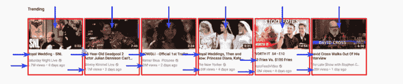](https://res.cloudinary.com/practicaldev/image/fetch/s--N-KrCB5H--/c_limit%2Cf_auto%2Cfl_progressive%2Cq_auto%2Cw_880/https://cdn-images-1.medium.com/max/800/1%2A8dHohoFeUT49gFnZPxqypw.png)

### 第十九部分。React 中的道具

在这个截屏视频中，Bob 将向我们展示如何结合本课程第 17 和 18 部分的道具概念，并且他创建了一个基本的联系人卡片列表应用程序供我们练习。

首先，为联系人卡片创建一个组件并学习如何使其动态化，这样我们就可以为所有卡片重用一个组件，这真的很好。

[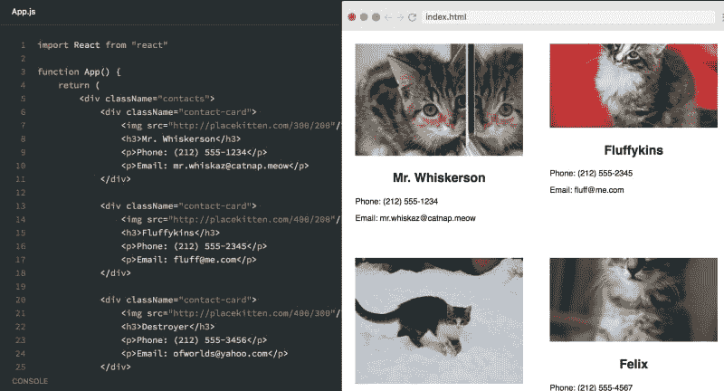](https://res.cloudinary.com/practicaldev/image/fetch/s--NaPqXD2c--/c_limit%2Cf_auto%2Cfl_progressive%2Cq_auto%2Cw_880/https://cdn-images-1.medium.com/max/800/1%2A_WsaHhdMlb4LF5MZj0HZUA.png)

使用联系卡的一个很好的方式是:

```
// App.js 
...  
<ContactCard  
  name="Mr. Whiskerson"  
  imgUrl="http://placekitten.com/300/200"  
  phone="(212) 555-1234"  
  email="mr.whiskaz@catnap.meow"  
/>  
...

// instead of 
<div className="contact-card">  
    
  <h3>Mr. Whiskerson</h3>  
  <p>Phone: (212) 555-1234</p>  
  <p>Email: mr.whiskaz@catnap.meow</p>  
</div> 
```

让我们创建`ContactCard`并使用`props`来动态显示数据。

```
import React from "react"

function ContactCard(props) {  
  return (  
    <div className="contact-card">  
        
      <h3>{props.name}</h3>  
      <p>Phone: {props.phone}</p>  
      <p>Email: {props.email}</p>  
    </div>  
  )  
}

export default ContactCard 
```

### 第二十部分。道具和造型练习

好了，我们来练习吧！就像之前的练习一样，您的任务如下:

[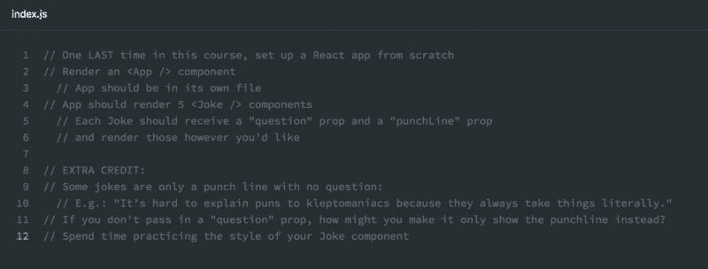](https://res.cloudinary.com/practicaldev/image/fetch/s--aEiejnRw--/c_limit%2Cf_auto%2Cfl_progressive%2Cq_auto%2Cw_880/https://cdn-images-1.medium.com/max/800/1%2A_NfbLfH-KN4CutXNyppVcg.png)

因为这是我们现在的传统，为了避免任何剧透并真正学习 React，[深入 Bob 的演练。](https://scrimba.com/p/p7P5Hd/cbykBfa?utm_source=dev.to&utm_medium=referral&utm_campaign=glearnreact_launch_article)

像往常一样，试着自己解决这个问题，并随意参考前面的章节，因为它们包含了你需要的一切。

### 第二十一部分。映射组件

所以从练习课开始，你可能已经注意到我们重复了一些`<Joke />`组件，并且可能想知道是否有一种方法可以只写一次。当然啦！我们可以使用 JavaScript `.map`来帮助我们实现这一点。

```
function App() {

const jokeComponents = jokesData.map(joke => <Joke key={joke.id} question={joke.question} punchLine={joke.punchLine} />)

return (  
    <div>  
      {jokeComponents}  
    </div>  
  )  
} 
```

让我们在这里快速分解一些东西。

我们的数据通常来自 API，所以为了模仿它，我们使用`jokesData`来假装它拥有我们需要的所有数据。

```
const jokesData = [  
  {  
    id: 1,  
    punchLine: "It’s hard to explain puns to kleptomaniacs because they always take things literally."  
  },  
  {  
    id: 2,  
    question: "What's the best thing about Switzerland?",  
    punchLine: "I don't know, but the flag is a big plus!"  
  },  
  ...  
] 
```

你可能也注意到了`<Joke key={joke.id} ... />`中的`key`道具。这实际上是一个 React 需求，无论何时你反复创建一个组件，你都需要传递一个带有一些独特参数的`key`道具。大多数时候，它是一个从 API 中获得的`id`。

### 第二十二部分。映射组件实践

又到了练习的时间了。这是你的任务，Bob 也为我们创建了一些样板代码，所以我们不需要从头开始创建那么多。

[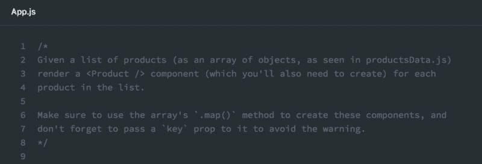](https://res.cloudinary.com/practicaldev/image/fetch/s--JckJY2so--/c_limit%2Cf_auto%2Cfl_progressive%2Cq_auto%2Cw_880/https://cdn-images-1.medium.com/max/800/1%2A95xsFlvFIj_m4upfWxpisA.png)

和往常一样，你可以随意与 Bob 一起完成解决方案，但一定要先试着自己完成。

### 第二十三部分。待办事项应用程序—第 3 阶段

现在让我们应用我们所学的映射和道具，让我们的待办事项列表更加动态。我们现在可以映射项目数据，并为我们拥有的每个项目呈现`<TodoItem />`。

[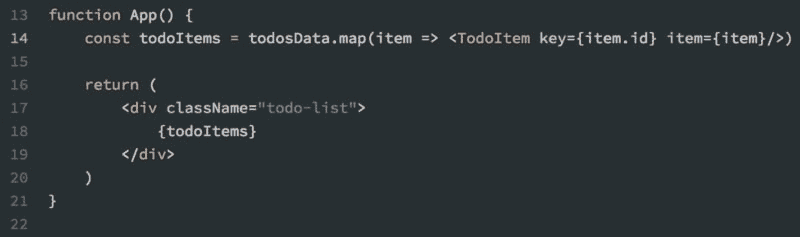](https://res.cloudinary.com/practicaldev/image/fetch/s--hJ3PNBFP--/c_limit%2Cf_auto%2Cfl_progressive%2Cq_auto%2Cw_880/https://cdn-images-1.medium.com/max/800/1%2AHX3eHJ9nBQgrGkp8qn4hoA.png)

还可以使用数据作为道具`<TodoItem />`并将其放置在组件本身中我们想要的位置。

[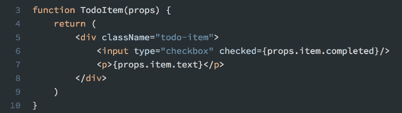](https://res.cloudinary.com/practicaldev/image/fetch/s--cItxS-zn--/c_limit%2Cf_auto%2Cfl_progressive%2Cq_auto%2Cw_880/https://cdn-images-1.medium.com/max/800/1%2A874VqCbV-r0L62uLDizjnQ.png)

如果此时您注意到下面的错误，`Warning: Failed prop type: You provided a `checked` prop to a form field...`，不要惊慌——我们做的一切都是正确的。Bob 将在本课程的第 31 部分向我们展示它的含义以及如何解决它。

### 第二十四部分。基于类的组件

在这一章中，Bob 向我们介绍了 React 中的类组件。有时我们目前使用的功能组件是不够的，它们的功能需要扩展。

稍后我们将了解更多关于潜在差异的内容，但是现在看看它们在语法上是如何不同的，并尝试将我们的`<App />`从函数转换成类组件。

```
class App extends React.Component {  
  render() {  
    return (  
      <div>  
        <h1>Code goes here</h1>  
      </div>  
    )  
  }  
} 
```

### 第二十五部分。基于类的组件实践

再练习一下。这次我们得到了一些为我们编写的代码，我们应该练习将功能组件转换为类组件。在本练习中，我们还有一个隐藏在代码中的小错误，让我们找到它。

[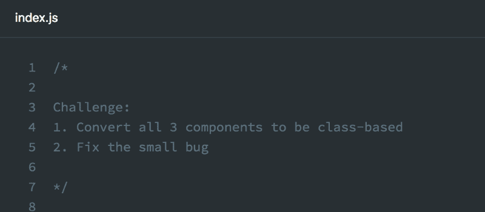](https://res.cloudinary.com/practicaldev/image/fetch/s--xnhJgPqg--/c_limit%2Cf_auto%2Cfl_progressive%2Cq_auto%2Cw_880/https://cdn-images-1.medium.com/max/800/1%2AMidvJPKv95YO1xWPlvjh2Q.png)

像往常一样，先试着自己完成这个练习，然后跟着 Bob 的演示。下一章见！

### 第二十六部分。状态

状态是 React 最重要的部分之一。它是组件本身维护的数据。`props`不能被接收道具的组件改变，但是`state`可以！因此，当组件本身需要更改某些数据时，我们可能需要使用状态。例如，当我们单击一个按钮时，组件中的一些文本会改变颜色。

一个组件需要是一个类组件才能有状态，我们需要一个构造器方法。

```
constructor() {  
  super()  
  this.state = {  
    answer: "Yes"  
  }  
} 
```

然后我们可以在我们的`return`中使用这些数据，并在 JSX 内部显示我们的数据。

[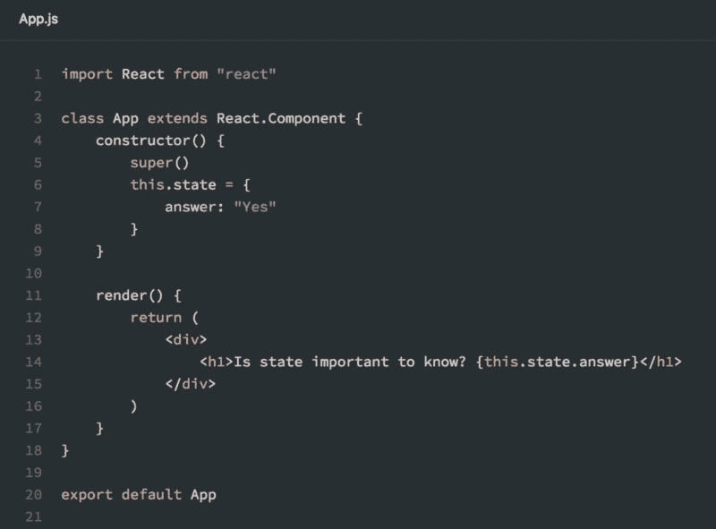](https://res.cloudinary.com/practicaldev/image/fetch/s--9lHiphwY--/c_limit%2Cf_auto%2Cfl_progressive%2Cq_auto%2Cw_880/https://cdn-images-1.medium.com/max/800/1%2AEiRinOLwWN5iufS7Nvvp9g.png)

### 第二十七部分。国家实践

在本次练习中，我们要做一些调试工作。

[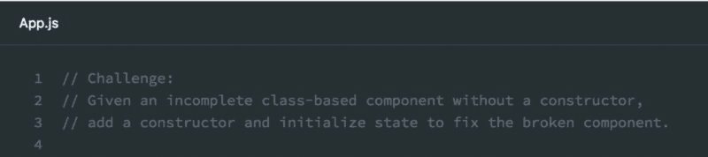](https://res.cloudinary.com/practicaldev/image/fetch/s--conP3by8--/c_limit%2Cf_auto%2Cfl_progressive%2Cq_auto%2Cw_880/https://cdn-images-1.medium.com/max/800/1%2ACSwTYIareIPUxqveYQAKMA.png)

我们经常需要修复代码中的一些问题，所以这是一项非常有用的技能。如果你被卡住了，在跟随鲍勃的解决方案之前[可以随意查看一些之前的章节。](https://scrimba.com/p/p7P5Hd/c2NmZsa?utm_source=dev.to&utm_medium=referral&utm_campaign=glearnreact_launch_article)

### 第二十八部分。国家实践 2

正如我们之前提到的，状态是一个非常重要的概念，所以 Bob 为我们提供了两节练习课。

[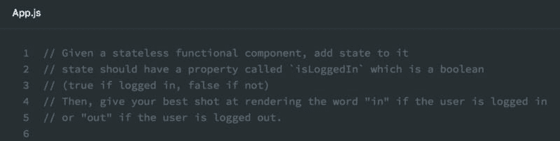](https://res.cloudinary.com/practicaldev/image/fetch/s--HD865RCn--/c_limit%2Cf_auto%2Cfl_progressive%2Cq_auto%2Cw_880/https://cdn-images-1.medium.com/max/800/1%2ADjUVqX9PLguNzmS4bG0lUQ.png)

这个可能很棘手，但是尽你最大的努力，然后看看鲍勃是怎么做的。

### 第 29 部分待办事宜—第 4 阶段

在这个短片中，Bob 向我们展示了如何在 Todo 应用程序中使用状态。

[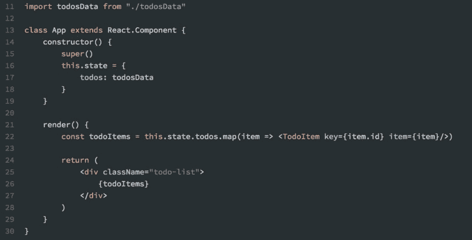](https://res.cloudinary.com/practicaldev/image/fetch/s--wa4Q0Gh1--/c_limit%2Cf_auto%2Cfl_progressive%2Cq_auto%2Cw_880/https://cdn-images-1.medium.com/max/800/1%2A67X5Jm2RKxY3H-diZCIFYw.png)

### 第三十部分。在 React 中处理事件

事件处理本质上是允许用户与您的网页进行交互，并在发生按钮点击或悬停时做一些特定的事情。

让我们看一个执行这个简单函数的简单例子。

```
function handleClick() {  
  console.log("I was clicked")  
} 
```

你可能已经熟悉了普通 HTML 是如何做到的:

```
<button onclick="handleClick()">Click me</button> 
```

React 很像。

```
<button onClick={handleClick}>Click me</button> 
```

区别在于事件名`onClick`是在 camelCase 中，而`handleClick`是在我们的 JSX 中传递的 JS，正如我们在第 14 课中提到的内联样式。

### 第三十一部分。待办事项应用程序—第 5 阶段

在这个剧组里，鲍勃给了我们一个挑战。还记得我们在控制台上得到的关于“检查”道具的警告吗？为了解决这个问题，我们需要提供`onChange`处理程序。在这一点上，只要让它`console.log`任何你喜欢的。

就像所有常见的挑战一样— [跳到演员表上看解决方案。](https://scrimba.com/p/p7P5Hd/c9yP6uM?utm_source=dev.to&utm_medium=referral&utm_campaign=glearnreact_launch_article)

### 第三十二部分。改变状态

我们可以使用 React 的`setState()`方法更新组件中的状态。

让我们看看如何在一个非常流行的例子中使用它——计数器。

[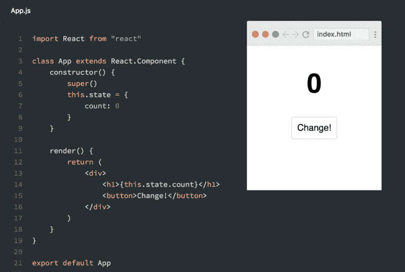](https://res.cloudinary.com/practicaldev/image/fetch/s--vU7EJ439--/c_limit%2Cf_auto%2Cfl_progressive%2Cq_auto%2Cw_880/https://cdn-images-1.medium.com/max/800/1%2AXqL8-0haXmMN9pmycC3NAw.png)

当你点击“改变”的那一刻巴顿，什么都不会发生。让我们实现我们的`handleClick()`方法。我们首先尝试显示一个不同的数字:

```
handleClick() {  
  this.setState({ count: 1 })  
} 
```

并传给我们的`<button>`。

```
<button onClick={this.handleClick}>Change!</button> 
```

如果我们运行这个，我们将得到`Uncaught TypeError: Cannot read property ‘setState’ of undefined`。这是一个非常常见的错误，让我们的处理程序工作的方法之一是绑定它。

```
constructor() {  
  super()  
  this.state = {  
    count: 0  
  }  
  this.handleClick = this.handleClick.bind(this)  
} 
```

现在我们希望我们的`handleClick()`方法是动态的，并且实际上给我们当前的状态加 1。幸运的是，React 为我们提供了`prevState`，因此我们可以比较状态。

```
handleClick() {  
  this.setState(prevState => {  
    return {  
      count: prevState.count + 1  
    }  
  })  
} 
```

### 第三十三部分。待办事项应用程序—第 6 阶段

在这一部分，我们将这样做，当我们单击复选框时，它将改变我们的状态，并在需要时勾选/取消勾选复选框。Bob 警告我们，这是应用程序的一个棘手部分，听起来似乎很简单。作为一项挑战，让我们先试着自己实现它，但如果有些东西不太管用，也不必担心——Bob 已经做了一次演练。

### 第三十四部分。生命周期方法第 1 部分

React 的一个优点是我们本质上是如何编写普通 JS 的，React 在幕后处理了很多事情。有许多这样的“幕后”事件发生在组件上。它更像是一个组件生命中的一组里程碑，所以它们被称为 ***生命周期方法*** 。Bob 将在这一章和接下来的章节中讲述最受欢迎和最重要的内容。

第一个你已经知道的是`render()`。它的工作是确定什么被渲染到屏幕上，并在像`state`或`props`这样的事情发生变化时对调用`render()`做出反应。

下一个是`componentDidMount()`，本质上类似于‘组件诞生’。当组件停留在屏幕上时，调用此方法。这是进行 API 调用的好时机。

第三个非常有趣的方法是`shouldComponentUpdate()`。有时，即使看起来没有什么变化，React 也会更新组件。在某些情况下，这可能会变得非常昂贵，这种方法给我们，开发者，一个优化我们的应用程序的机会。

本章的最后一个方法是`componentWillUnmount()`，它是在你的组件从用户屏幕上消失之前进行清理的地方。您可以删除事件侦听器或取消 API 调用。

### 第三十五部分。生命周期方法第 2 部分

在这一章[中，Bob 非常快速地讲述了](https://scrimba.com/p/p7P5Hd/cEkyPH2?utm_source=dev.to&utm_medium=referral&utm_campaign=glearnreact_launch_article)一些被否决的生命周期方法，你可能会在一些遗留的 React 应用程序中看到这些方法，他还讲述了一些非常罕见的方法，比如`getDerivedStateFromProps()`和`getSnapshotBeforeUpdate()`。但我们不会深入讨论它们，因为它们对本课程并不重要。

### 第三十六部。条件渲染

有时，您希望仅在特定条件下显示一些数据或渲染一些 JSX。这时我们使用条件渲染。

React 的优势之一是，通过使用 vanilla JS，我们可以保留它编写自己代码的灵活性。这样做的缺点是，当你学习反应时，可能会有太多不同的方法来做同样的事情。条件渲染就是其中之一。Bob 将向我们展示一些方法，但是请放心，React 开发人员有很多方法。

让我们创建一个`<Conditional />`组件，在页面加载时呈现“正在加载…”。我们可以用`render`的方法在我们的 app 中使用。

```
render() {  
  return (  
    <div>  
      <Conditional isLoading={this.state.isLoading}/>  
    </div>  
  )  
} 
```

我们可以通过使用 JS 中简单的 if-else 来实现我们的目标:

[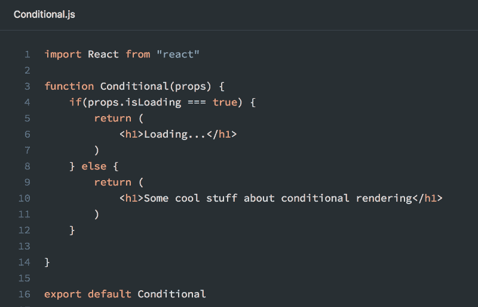](https://res.cloudinary.com/practicaldev/image/fetch/s--ff0gzOW3--/c_limit%2Cf_auto%2Cfl_progressive%2Cq_auto%2Cw_880/https://cdn-images-1.medium.com/max/800/1%2ALHBYGxAoFeVzq5jeqaD_uQ.png)

或者我们可以用最新的 ES6 三元算子来改进。

[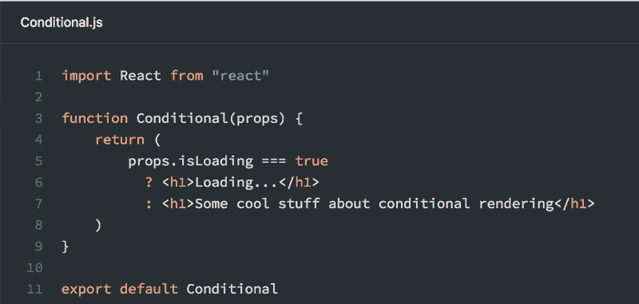](https://res.cloudinary.com/practicaldev/image/fetch/s--hskGXZLS--/c_limit%2Cf_auto%2Cfl_progressive%2Cq_auto%2Cw_880/https://cdn-images-1.medium.com/max/800/1%2AhyG6iF2dQyQhlS0PrSJ-rg.png)

### 第三十七部。条件渲染—练习

让我们现在练习。条件渲染是任何 React 开发人员工具包中的基本工具之一。

[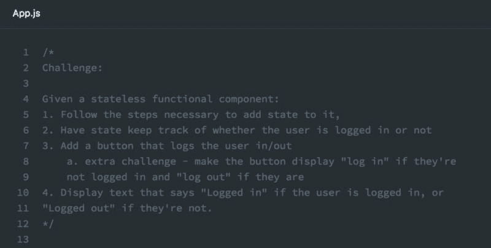](https://res.cloudinary.com/practicaldev/image/fetch/s--i6OCmVn5--/c_limit%2Cf_auto%2Cfl_progressive%2Cq_auto%2Cw_880/https://cdn-images-1.medium.com/max/800/1%2A2xr35TZVbIHPcCiiAKnQWw.png)

在和 Bob 一起研究解决方案之前，试着尽力而为。

### 第三十九部分。待办事项应用程序—第 7 阶段

所以我们已经到了 Todo 应用程序的最后一部分，我们只需要完成最后的样式部分，我们就完成了！这部分的挑战是让完成的`<TodoItem />`看起来不一样。例如，用灰色文本和/或背景，将文本变成斜体。作为解决方案之一，[鲍勃将向我们展示如何做](https://scrimba.com/p/p7P5Hd/cKe27SD?utm_source=dev.to&utm_medium=referral&utm_campaign=glearnreact_launch_article)，但最终还是要靠我们自己。

### 第四十部分。从 API 获取数据

在这种情况下，Bob 为我们提供了一个简单的组件来学习更多关于抓取的知识。

[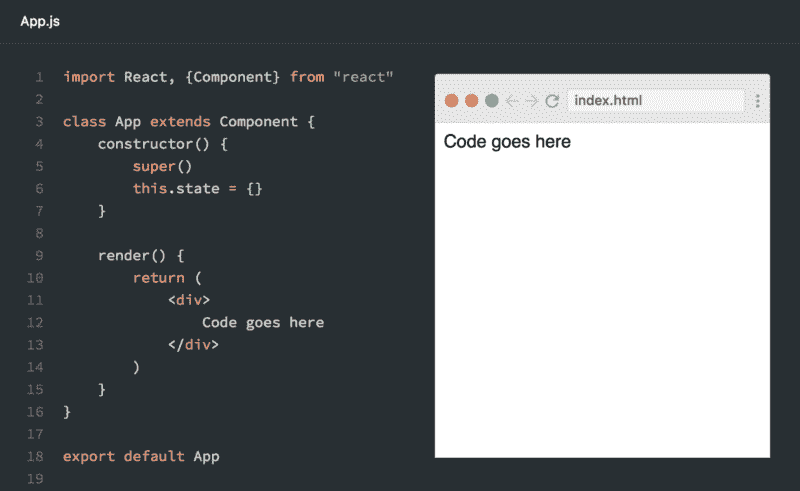](https://res.cloudinary.com/practicaldev/image/fetch/s--lcoQlw1F--/c_limit%2Cf_auto%2Cfl_progressive%2Cq_auto%2Cw_880/https://cdn-images-1.medium.com/max/800/1%2AIPpXkcNjTxy5QDJ80JyuIA.png)

在第 24 章中，我们了解到`componentDidMount()`生命周期方法的一个最常见的用例是从某个地方获取数据，这样我们的组件就可以做它应该做的任何任务。

在这个例子中，我们将使用一个免费的星球大战 API 来获取一些角色的名字。让我们编写我们的`componentDidMount()`方法，在这里我们将获取一些数据，然后`console.log`它。

```
componentDidMount() {  
  fetch("https://swapi.co/api/people/1")  
    .then(response => response.json())  
    .then(data => console.log(data))  
} 
```

[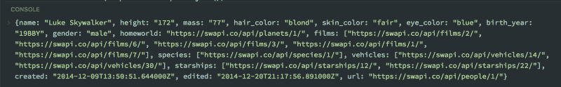](https://res.cloudinary.com/practicaldev/image/fetch/s--8OpyiQ3M--/c_limit%2Cf_auto%2Cfl_progressive%2Cq_auto%2Cw_880/https://cdn-images-1.medium.com/max/800/1%2AsTxncw1bXhUbysRRFMCTZA.png) 
我们从 API 调用中得到的数据

好吧！所以我们只需要从数据中获取`name`并存储在我们的状态中，然后显示在组件中。最后我们的`<App />`应该是:

[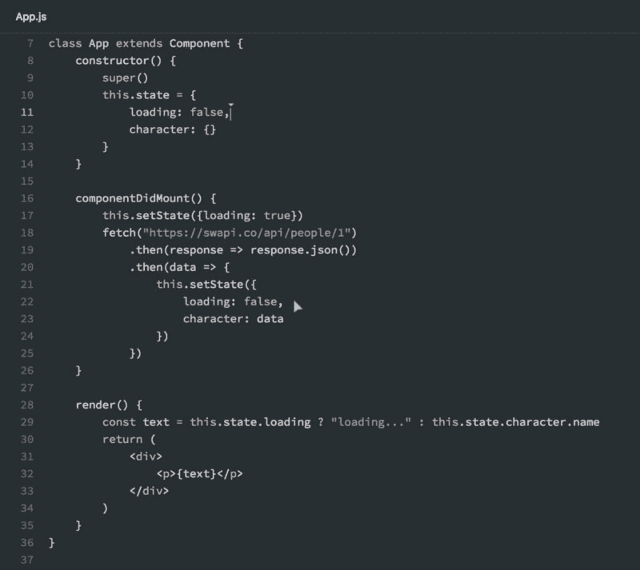](https://res.cloudinary.com/practicaldev/image/fetch/s--FZHsjHHL--/c_limit%2Cf_auto%2Cfl_progressive%2Cq_auto%2Cw_880/https://cdn-images-1.medium.com/max/800/1%2A_ITXJuvSNEcdyfXLVqVraw.png)

我们可以从鲍勃那里学到一些有趣的技巧。

创建一个`loading`布尔开状态很好。如果我们的请求需要很长时间，我们可以通知用户请求正在处理中，他们的数据很快就会送到。

我们在`render()`中创建了一个单独的变量`text`，在这里我们完成了所有的逻辑，我们有了一个非常清晰的`return()`，所以对于下一个维护我们代码的开发人员来说更容易理解。

### 第四十一部分。表单第 1 部分

在这次演员表中，我们将探索 React 中的表单是如何创建的。表单实际上是 React 中非常棘手的部分。首先，如果您尚未完成 React 中有关状态的部分的挑战，这将是赶上进度的最佳时机。作为表单的初级读本，Bob 建议阅读关于表单的官方 React 文档。

在普通 JS DOM API 中，您创建一个 HTML 表单。一旦用户决定提交，您就从表单中收集所有数据，几乎是在最后一秒，并在发送之前进行验证。

React 提倡您通过将表单数据保存在 state 中来跟踪表单数据。每次击键时，表单组件的状态中都会保存表单的最新版本。

React 中的表单有 3 个关键部分:

*   输入—当用户更新输入时，我们触发事件处理程序(第 20 行)
*   事件处理程序—用来自用户的数据更新状态(第 11–15 行)
*   状态—数据的存储(第 6–8 行)

[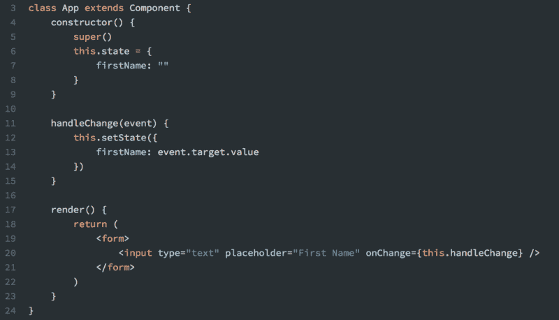](https://res.cloudinary.com/practicaldev/image/fetch/s--sb5A06Jk--/c_limit%2Cf_auto%2Cfl_progressive%2Cq_auto%2Cw_880/https://cdn-images-1.medium.com/max/800/1%2AXlTMXOibXDD5sYJqipFDiA.png)

对于一个更复杂的例子，Bob 展示了一些使表单非常可重用和代码非常可读的巧妙技巧，[跳到截屏。](https://scrimba.com/p/p7P5Hd/cW8Jdfy?utm_source=dev.to&utm_medium=referral&utm_campaign=glearnreact_launch_article)

### 第四十二部分。表单第 2 部分

在这一部分，Bob 进一步扩展了我们关于形式的知识。表单可以处理的不仅仅是`<input />`！但是事情可能会变得棘手。我们学习如何处理下拉菜单的`<textarea />`、`<select />`和`<option />`，并进一步扩展`<input />`以了解更多关于复选框和单选按钮的信息。

### 第四十三部分。表格练习

太好了，现在是练习的时候了。

鲍勃给我们提出了一个新的挑战，像往常一样，我们最好先自己解决这个问题。

[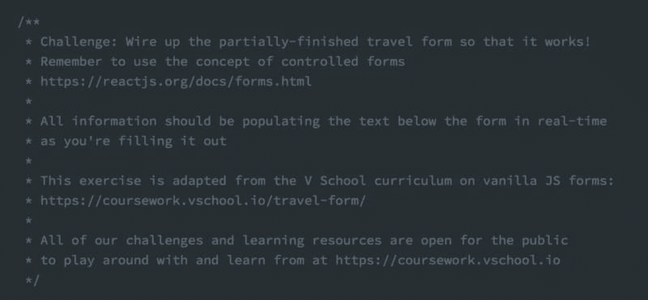](https://res.cloudinary.com/practicaldev/image/fetch/s--2tpG-Wdg--/c_limit%2Cf_auto%2Cfl_progressive%2Cq_auto%2Cw_880/https://cdn-images-1.medium.com/max/800/1%2AID_-WFwmHC9TwH5c8D3KwQ.png)

如果有什么事情不太顺利，鲍勃总是会帮我们做一个很好的预演。

### 第四十四部分。容器/组件架构

在这篇文章中，Bob 介绍了一个非常流行的 React 架构模式。

通常，当我们编写复杂的组件时，我们最终会在一个文件中有很多行代码。然后我们开始上下滚动来添加额外的功能和显示逻辑。这就是容器/组件分离变得有用的时候。在 React 中，我们将 UI 和业务关注点分离到不同的组件中。有很多不同的术语:智能/哑、容器/表示，所有这些都指的是将呈现的元素从数据流功能中分离出来的相同想法。

在我们的具体例子中，如果我们将 HTML 从`render()`方法提取到一个单独的功能组件`<FormComponent />`中，并且我们的`Form.tsx`变成了`FormContainer.tsx`，我们就可以实现容器/组件模式。

[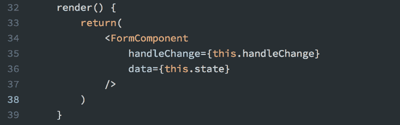](https://res.cloudinary.com/practicaldev/image/fetch/s--9inZCxrh--/c_limit%2Cf_auto%2Cfl_progressive%2Cq_auto%2Cw_880/https://cdn-images-1.medium.com/max/800/1%2AQxlEv99mqSx0OXnZqzpl5Q.png)

如你所见，我们仍然将我们的处理程序和数据作为道具传递到我们的函数`<FormComponent />`中，在组件内部，我们现在通过道具来调用处理程序和数据。

[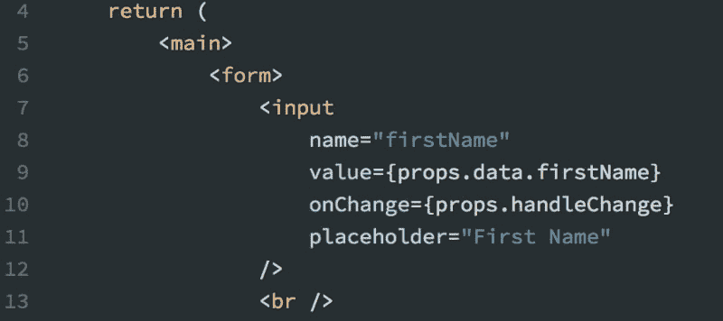](https://res.cloudinary.com/practicaldev/image/fetch/s--KYmOUxBS--/c_limit%2Cf_auto%2Cfl_progressive%2Cq_auto%2Cw_880/https://cdn-images-1.medium.com/max/800/1%2A-1kuN9m9FZJsoQem61w1Pw.png)

### 第四十五部分。迷因生成器顶点项目

你成功了！祝贺您完成顶点计划。在这部影片中，鲍勃提出了终极挑战。我们现在可以从头开始创建自己的应用程序。

[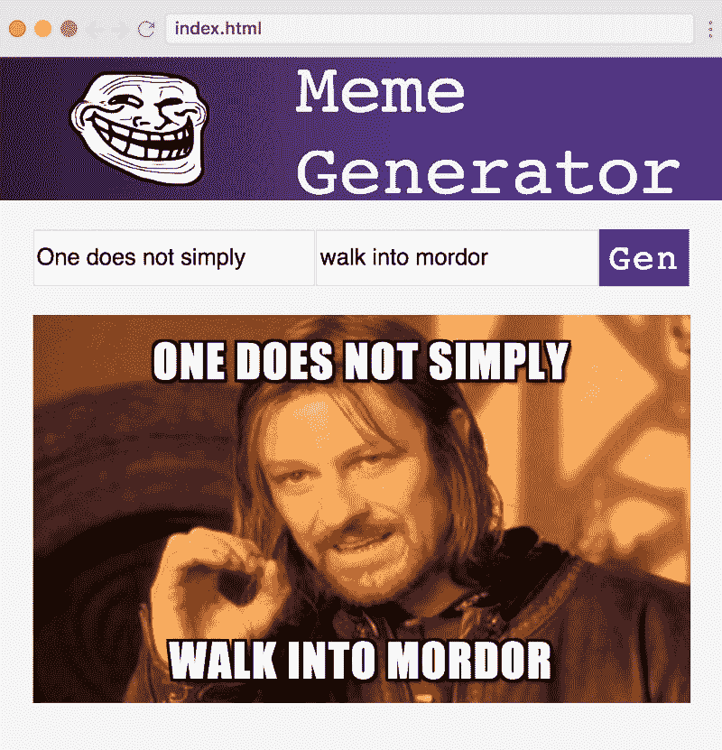](https://res.cloudinary.com/practicaldev/image/fetch/s--U_2CCmAb--/c_limit%2Cf_auto%2Cfl_progressive%2Cq_auto%2Cw_880/https://cdn-images-1.medium.com/max/800/1%2APftHO0wbwiscfO9nmp7VcQ.png)

如果一次完成整个项目让人感到害怕，Bob 会在截图中设置迷你穿越挑战[来指导我们完成。](https://scrimba.com/p/p7P5Hd/c6K77um?utm_source=dev.to&utm_medium=referral&utm_campaign=glearnreact_launch_article)

祝你好运，编码快乐！

### 第四十六部分。编写现代 React 应用程序

干得好！你的项目现在已经准备好了，你可以把它展示给你的朋友和家人了！这确实是一件值得骄傲的事情。干得好！

在这篇文章中，Bob 就如何跟上 React 生态系统中的所有变化给了我们一些建议，并就我们所学到的东西给了我们一些提示，以便 fa 可以稍微不同地完成，如使用 ES6 箭头函数或提取代码到新组件中以提高可读性。

### 第四十七部分。实践项目理念

在这一集里，Bob 讨论了从这里到哪里，课程在哪里结束。有一些想法和好文章可以阅读，关于如何实践我们所学的知识。

### 第四十八部分。结论

恭喜，我们成功了！在这次演员表中，我们快速总结了我们在本课程中所做的内容，并概述了我们未来可以学到的内容。

鲍勃，非常感谢你参加[课程](https://scrimba.com/g/glearnreact?utm_source=dev.to&utm_medium=referral&utm_campaign=glearnreact_launch_article)！