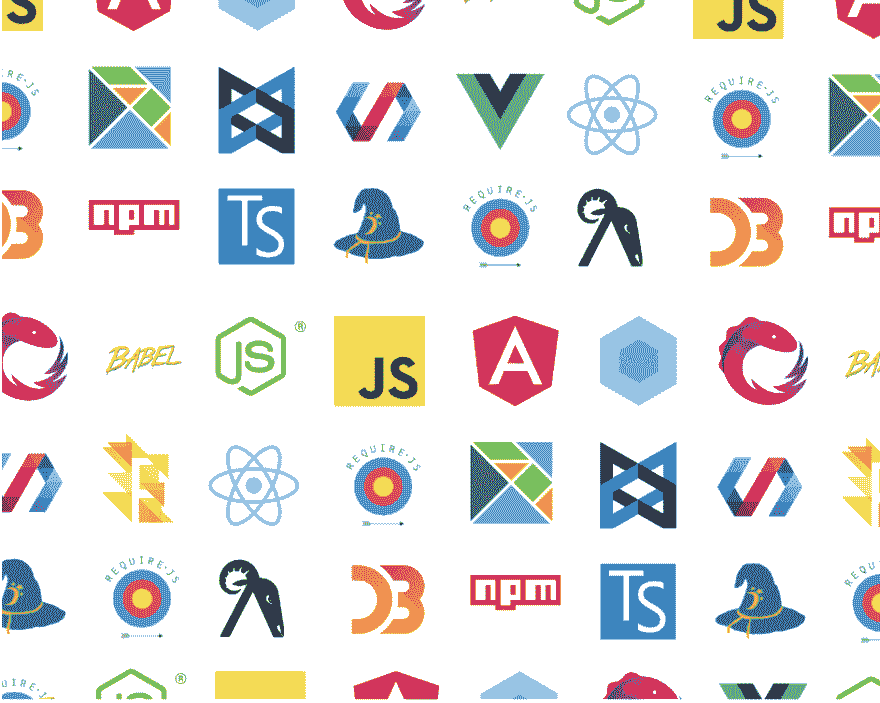
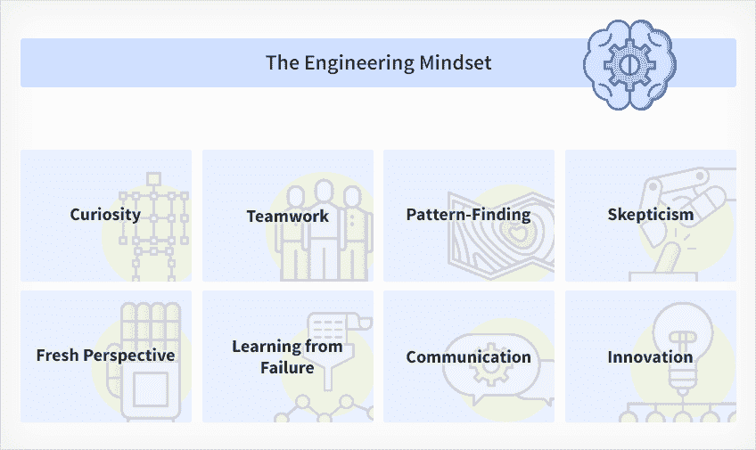

# 想免费学 JavaScript？从这里开始！

> 原文：<https://dev.to/bmz1/want-to-learn-javascript-for-free-start-here-be5>

这是“免费学习 JavaScript”系列文章的第一篇——在这几章中，你会发现学习 JS 的极好材料和路线图。由于 JavaScript 社区是最好的社区之一，本系列将完全依赖免费的 JavaScript 资源。

## 为什么现在要学 JavaScript？

JavaScript 几乎无处不在:在你的浏览器、网络应用、移动应用、云服务，甚至物联网设备中。它很容易上手，因为你只需要一个纯文本编辑器和一个浏览器。它是一种初学者友好的语言，周围有一个令人敬畏的社区。

您可以用 JavaScript 编写前端和后端代码，这使得它非常有用。

## 很难想出从哪里开始

要成为一名 JavaScript 工程师，你必须掌握各种技能。对于初学者来说，找到一条最优的学习路径并不明显，尤其是零背景的情况下。
[T3】](https://res.cloudinary.com/practicaldev/image/fetch/s--7x1yCC1U--/c_limit%2Cf_auto%2Cfl_progressive%2Cq_auto%2Cw_880/https://blog.risingstack.com/conteimg/2018/10/javascript-frameworks.png)

交易的深度似乎是无限的，所以问题是“从哪里开始？”新手饲养似乎是合法的。还有其他问题，比如

*   ‘学习 JavaScript 需要哪些技能？’,
*   如何找到一份工作？,
*   如何准备面试？。

在这个系列中，我将尝试回答这些问题。

有一点要提一下:这不是一个具体的 JavaScript 教程。你不会从这篇文章中学到如何编码。相反，它是你成为一名独立开发者的一个概览/路线图。

## 关于我的 JavaScript 路径

举个例子，我与开发的关系始于我十几岁的时候。我学 HTML 和 CSS 只是为了好玩和好奇。之后用 Wordpress 之类的内容管理系统建网站，就这样了。我没把它当回事:这只是个爱好，仅此而已。

毕业后，我去了法学院，为律师事务所工作，但 5-6 年后，我意识到这不是我为自己设想的职业。回想起来，这是一次有益的经历，但我不想再这样做了。我需要更有创意的东西。于是我开始学习 JavaScript。

参加编程学校不是一个选项:基础知识可以在互联网上免费获得，我不希望有人向我收费，因为我可以在教程中找到同样的东西。我知道这并不容易，但我可以说这对我来说很有趣。

我每天至少练习 6-7 个小时。

我用 React 做爱好项目，但是 3 个月后，我开始感觉到自学的局限性。没有人告诉我最佳的编码实践:

*   “我如何构建一个应用程序？”
*   “我应该使用哪些软件包？”
*   "什么是有意义的学习，什么仅仅是一些美化的糖衣？"

也许我可以自己想出办法，但是我意识到我需要和已经有多年经验的人一起工作，这样我就可以从他们那里吸取知识。和这样的人相处的最好方式就是被雇佣，所以我开始给公司投简历。很多都是。即使是一些职位，我也确信自己不会被录用。为什么不呢？如果你能通过面试，你就能从你不能回答的问题或你不能完成的编码挑战中学习。

经过几次尝试，我的努力得到了回报:我被 RisingStack 聘用为初级开发人员，这使我能够比花在自学上的时间更快地发展技能。在我的第一个月——像每个新员工一样——我必须完成内部训练营，为我参与客户项目做准备。

但是这个系列是关于在你被录用之前应该做些什么，这样你才能被录用。

## 获得工程思维

在这一节中，我将介绍开始学习 JavaScript 所必需的技能。

至少你应该对 web 技术、编程或 IT 本身有基本的兴趣。没有那个会很繁琐，而且不管怎样，为什么要开始学自己不感兴趣的东西呢？仅仅为了钱而学习如何写代码也不是一个好主意。

如果你正在读这篇文章，我假设你有我所说的好奇心。

基本的兴趣对于学习基础知识甚至获得工作来说已经足够了，但是如果你想取得进步，尤其是从初级水平开始，这需要额外的奉献和努力。这可能是最关键的一点。

试着为自己设定可达到的目标。每天学点新东西。

除了努力之外，成为一名成功的开发人员所需的心态也值得一提。

 
*来源:[https://www . 7 pace . com/blog/become-a-better-程序员-技能-发展](https://www.7pace.com/blog/become-a-better-programmer-skills-development)*

随着时间的推移，这些是你必须掌握的技能。

另一个最重要的必备技能是知道如何谷歌，也就是找到问题的解决方案。我见过很多人努力寻找一个障碍，这个障碍很明显，稍加检查就能解决。初学者将要面对的 99%的问题都有答案。

你只需要找到解决方案并应用它。就这么简单(刚开始)。如果你没有找到答案，很可能你没有用正确的方法搜索。因此，开始了解如何正确地谷歌，并与 StackOverflow 和 [MDN](https://developer.mozilla.org/en-US/) 建立“友谊”。

不要害怕犯错误。这是学习过程的一部分。

关于上面提到的问题，让我们继续讨论下一部分。

## JavaScript 基础知识

### 网络入门

在你开始学习 JavaScript 之前，强烈建议你先熟悉一下 [HTML、CSS 以及 web](https://developer.mozilla.org/en-US/docs/Learn/Getting_started_with_the_web) 的工作原理。

HTML 和 CSS 可以很快学会。建立一个简单的静态网站，尝试一下。一旦你熟悉了这些技术的概念，你就可以继续前进了..

### 编程基础知识介绍

由于 HTML 和 CSS 都不是编程语言，所以是时候获取一些关于编程的理论知识了。我推荐几本书:

*   [你不知道 JS: Up &要去](https://github.com/getify/You-Dont-Know-JS/tree/master/up%20%26%20going)。(作为开始)

这是对编程和 JavaScript 的很好介绍。YDKJS 是一系列深入 JavaScript 语言核心机制的书籍。

*   [说 JavaScript](http://speakingjs.com/es5/index.html)
*   [雄辩的 JavaScript](https://eloquentjavascript.net/)
*   [MDN JS 指南](https://developer.mozilla.org/en-US/docs/Web/JavaScript/Guide)

这些书和教程会让你对这门语言有一个基本的了解。

### 学习使用命令行

了解命令行是必要的。学习基本命令，如如何进入/离开目录，以及编辑/复制/移动/删除文件。你会经常用到它们，所以为什么不从一开始就学习它们来节省时间呢？

## 先从香草 JS 开始，后面学习框架和高级概念。

忘掉 React、Vue、Angular、Node.js、OOP、Webpack、函数式编程等这些很酷的词吧。以我的经验来看，在你不了解基础知识之前，用这些高级的概念和框架来迷惑你的头脑是绝对不希望的。耐心点，你很快就会到达那里。

先把[基础](https://www.w3schools.com/js/)做好，然后尽快用[香草 JS](https://stackoverflow.com/questions/20435653/what-is-vanillajs) 开始编码。

### Setup IDE

用合适的配置设置一个 IDE 将会使你的生活更容易。我个人最喜欢的是 VSCode，但也有其他令人惊叹的 IDE，如 Atom、WebStorm、Brackets 或 Sublime。

### 选择要构建的项目

你的项目可以是一个 todo 应用程序，一个计算器或基本上任何东西。不要选择很复杂的项目，一开始有成就感就好。当你开发项目时，你会有很多问题。用 MDN，StackOverflow，Google。正如我上面所说的，对于初学者将要面对的几乎所有问题，都有一个答案。如果你不知道要建立什么样的项目，我在下面提供了一些链接，可能有助于你做出决定。

*   [https://www . code mentor . io/npostolovski/40-side-project-ideas-for-software-engineers-g8xckyxef](https://www.codementor.io/npostolovski/40-side-project-ideas-for-software-engineers-g8xckyxef)
*   [https://skill crush . com/2018/06/18/projects-you-can-do-with-JavaScript/](https://skillcrush.com/2018/06/18/projects-you-can-do-with-javascript/)
*   [https://medium . com/@ Garrett Levine/5-projects-to-complete-when-started-to-learn-front-end-web-development-48e 8 a1 ce 3178](https://medium.com/@GarrettLevine/5-projects-to-complete-when-starting-to-learn-front-end-web-development-48e8a1ce3178)

### 从错误中吸取教训

从错误中学习也是这个过程的重要部分。不要害怕破解密码。一次失败是防止未来失败的机会，它让你好奇如何解决问题。

### 向前移动

我认为如果你每天做一些运动，你可以在 1-2 个月内熟悉我概述的这些东西。一旦你认为你对这些知识有信心，做了一些爱好项目，读了书，你就可以更上一层楼，选择一个框架并启动 Node.js。

同时，你应该探索更多关于 JavaScript 的东西，比如文章、时事通讯、播客、YouTube 频道和许多教程。

如果你完成了以上所有，你就可以开始了解 JavaScript 和 Node.js 的包管理器 [NPM](https://docs.npmjs.com/getting-started/what-is-npm)

## 总结和下一步

在下一章，我将继续概述 JavaScript 生态系统，以及前端开发的路线图(React、Vue.js 等。)，Node 的后端路线图，以及一些招聘技巧。

*最初发布于 2018 年 10 月 9 日[blog.risingstack.com](https://blog.risingstack.com/learn-javascript-for-free/)。*