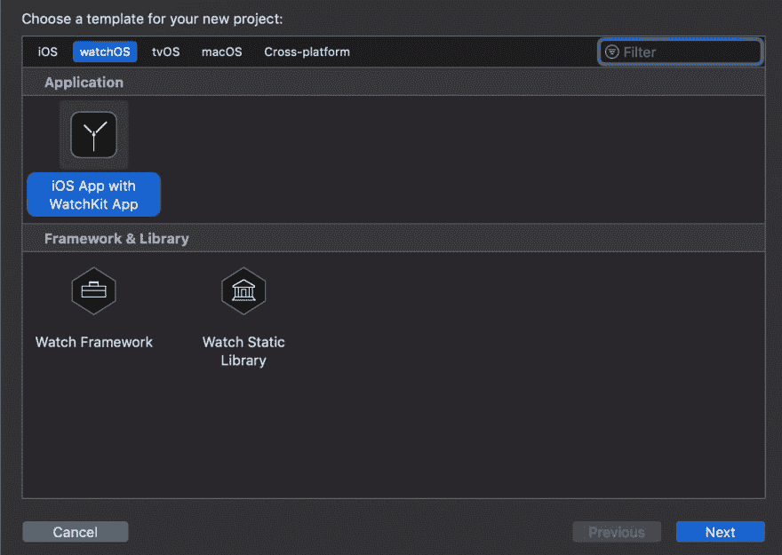
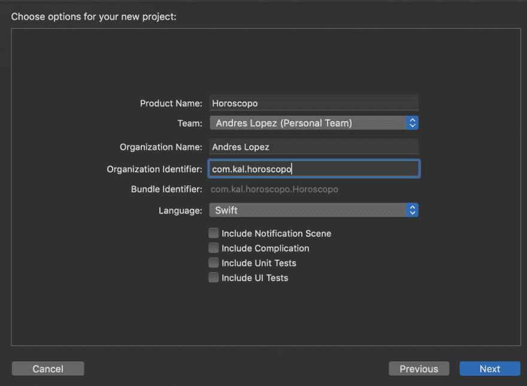
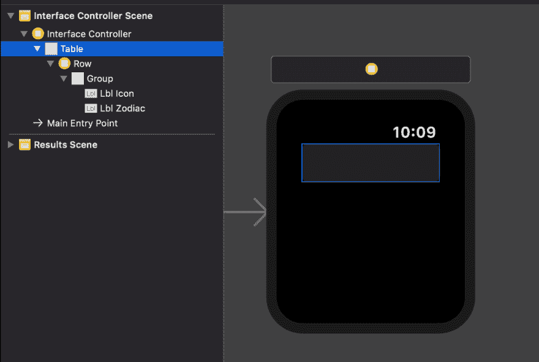
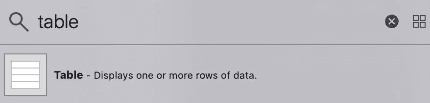
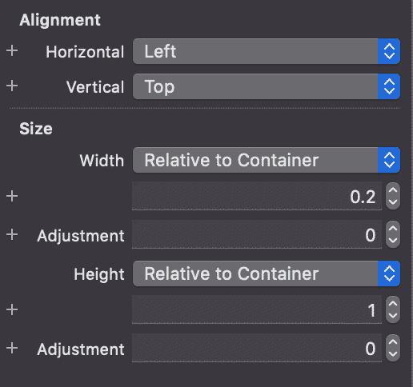
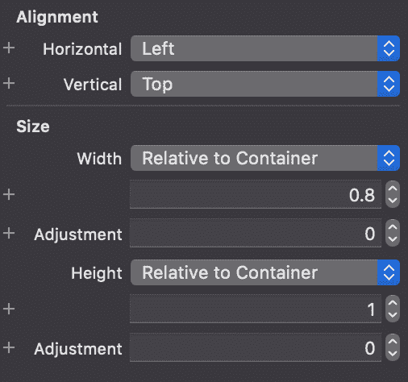
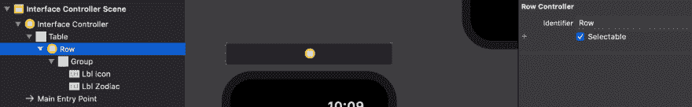
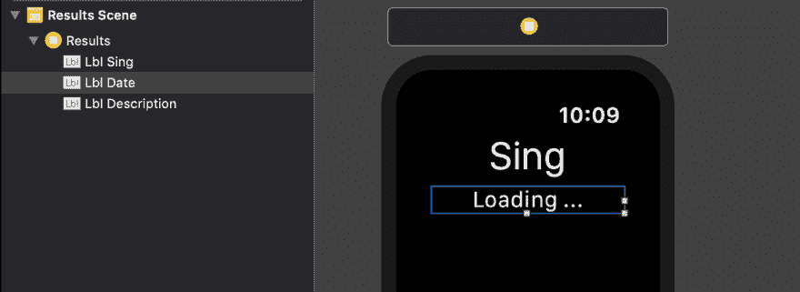
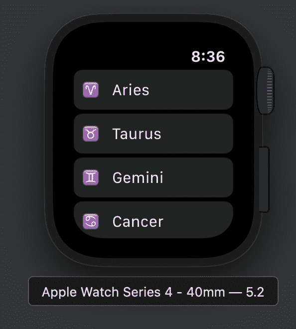
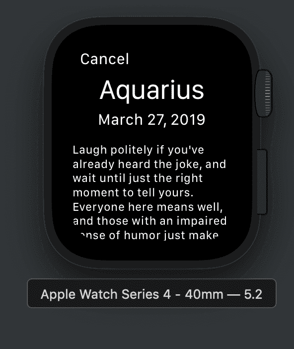

# WatchOS (Swift):星座应用

> 原文：<https://dev.to/andreslopezrm/watchos-swift-horoscope-application-4615>

在本教程中，WatchOS 的一个应用程序将基于参考星座的 REST API。

# 要求

*   Xcode 10.2 或更高版本
*   Mac OS Mojave 或更高版本
*   IPhone 模拟器
*   苹果手表模拟器

# 项目的创建

打开 XCode，创建一个新的 **WatchOS** 项目。

[](https://res.cloudinary.com/practicaldev/image/fetch/s--YK3OQp2C--/c_limit%2Cf_auto%2Cfl_progressive%2Cq_auto%2Cw_880/https://cdn-images-1.medium.com/max/1600/1%2A-GDIcQQtPquaF4D36UY-Ew.png)

未选中**包含通知场景**选项，选择保存项目的位置。

[](https://res.cloudinary.com/practicaldev/image/fetch/s--I91cxbNA--/c_limit%2Cf_auto%2Cfl_progressive%2Cq_auto%2Cw_880/https://cdn-images-1.medium.com/max/1600/1%2A0ylHOKqjM0pNJel-prS-ew.png)

# 第一屏

[](https://res.cloudinary.com/practicaldev/image/fetch/s--G21jV6ZX--/c_limit%2Cf_auto%2Cfl_progressive%2Cq_auto%2Cw_880/https://cdn-images-1.medium.com/max/1600/1%2AiTYINYeOQ0rex59CUZnd-w.png)

拖动一个**表格**元素。

[](https://res.cloudinary.com/practicaldev/image/fetch/s--s7t6EwbL--/c_limit%2Cf_auto%2Cfl_progressive%2Cq_auto%2Cw_880/https://cdn-images-1.medium.com/max/1600/1%2A8E5E1DnEyb9TOUbOb_8jGA.png)

在**表**中增加了两个标签:

*   **首先用以下对齐属性标记**。

[](https://res.cloudinary.com/practicaldev/image/fetch/s--8-_F__uy--/c_limit%2Cf_auto%2Cfl_progressive%2Cq_auto%2Cw_880/https://cdn-images-1.medium.com/max/1600/1%2AS6oi0gU_xKc961XyjNcPFw.png)

*   **第二个标签**具有以下对齐属性。

[](https://res.cloudinary.com/practicaldev/image/fetch/s--no4fqhoj--/c_limit%2Cf_auto%2Cfl_progressive%2Cq_auto%2Cw_880/https://cdn-images-1.medium.com/max/1600/1%2AzRjQOmbcIp9JoY7VSeeNRw.png)

表格的**行**元素被分配了具有相同名称行的标识符。

[](https://res.cloudinary.com/practicaldev/image/fetch/s--uvWz6bGa--/c_limit%2Cf_auto%2Cfl_progressive%2Cq_auto%2Cw_880/https://cdn-images-1.medium.com/max/1600/1%2ASyKBc1m6k5LarEKB_J8yPA.png)

一个继承自**n 对象**的**行**类被创建，我们链接相应的出口。

```
 import WatchKit

class Row: NSObject {
    @IBOutlet weak var lblIcon: WKInterfaceLabel!

    @IBOutlet weak var lblZodiac: WKInterfaceLabel!
} 
```

Enter fullscreen mode Exit fullscreen mode

***界面控制器*** 的代码如下:

```
 import WatchKit
import Foundation

class InterfaceController: WKInterfaceController {

    @IBOutlet weak var table: WKInterfaceTable!

    let zodiac = [
        ("♈", "Aries"),
        ("♉", "Taurus"),
        ("♊", "Gemini"),
        ("♋", "Cancer"),
        ("♌", "Leo"),
        ("♍", "Virgo"),
        ("♎", "Libra"),
        ("♏", "Scorpio"),
        ("♐", "Sagittarius"),
        ("♑", "Capricorn"),
        ("♒", "Aquarius"),
        ("♓", "Pisces")
    ]

    override func awake(withContext context: Any?) {
        super.awake(withContext: context)

        // Configure interface objects here.

        table.setNumberOfRows(zodiac.count, withRowType: "Row")

        for (index, sign) in zodiac.enumerated() {
            guard let row = table.rowController(at: index) as? Row else { return }
            row.lblIcon.setText(sign.0)
            row.lblZodiac.setText(sign.1)
        }
    }

    override func table(_ table: WKInterfaceTable, didSelectRowAt rowIndex: Int) {
        print(zodiac[rowIndex].1)

        let context = ["sing": zodiac[rowIndex].1]

        presentController(withName: "Results", context: context)
    }

    override func willActivate() {
        // This method is called when watch view controller is about to be visible to user
        super.willActivate()
    }

    override func didDeactivate() {
        // This method is called when watch view controller is no longer visible
        super.didDeactivate()
    }

} 
```

Enter fullscreen mode Exit fullscreen mode

# 型号

以下**结构**用于响应模型:

```
 import Foundation

struct Horoscope: Codable {
    var currentDate: String
    var description: String

    enum CodingKeys: String, CodingKey {
        case currentDate = "current_date", description
    }
} 
```

Enter fullscreen mode Exit fullscreen mode

# 第二屏

它负责消费 **API** ，它的界面非常简单，只用标签构建，工作方式非常类似于 iOS。

[](https://res.cloudinary.com/practicaldev/image/fetch/s--_WoXSjY2--/c_limit%2Cf_auto%2Cfl_progressive%2Cq_auto%2Cw_880/https://cdn-images-1.medium.com/max/1600/1%2AU4K4KlPnQp6Q93nLs_busA.png)

结果控制器代码如下:

```
 import WatchKit
import Foundation

class ResultsController: WKInterfaceController {

    @IBOutlet weak var lblSing: WKInterfaceLabel!
    var sing: String?

    @IBOutlet weak var lblDate: WKInterfaceLabel!

    @IBOutlet weak var lblDescription: WKInterfaceLabel!

    override func awake(withContext context: Any?) {
        super.awake(withContext: context)

        // Configure interface objects here.

        guard let context = context as? [String: String] else { return }
        guard let sing = context["sing"] else { return }

        lblSing.setText(sing)

        DispatchQueue.global(qos: .userInteractive).async {
            self.fetchData(sing: sing.lowercased())
        }
    }

    func fetchData(sing: String) {
        guard let url = URL(string: "https://aztro.sameerkumar.website/?sign=\(sing)&day=today") else { return }

        print("https://aztro.sameerkumar.website/?sign=\(sing)&day=today")
        var urlRequest = URLRequest(url: url)
        urlRequest.httpMethod = "POST"

        URLSession.shared.dataTask(with: urlRequest) { (data, response, error) in
            if let data = data {
                self.parse(data)
            } else {
                print("vacio")
            }
        }.resume()
    }

    func parse(_ contens: Data) {
        let decoder = JSONDecoder()

        guard let result = try? decoder.decode(Horoscope.self, from: contens) else { return }

        DispatchQueue.main.async {
            self.lblDate.setText(result.currentDate)
            self.lblDescription.setText(result.description)
        }
    }

    override func willActivate() {
        // This method is called when watch view controller is about to be visible to user
        super.willActivate()
    }

    override func didDeactivate() {
        // This method is called when watch view controller is no longer visible
        super.didDeactivate()
    }
} 
```

Enter fullscreen mode Exit fullscreen mode

# 应用程序运行

[](https://res.cloudinary.com/practicaldev/image/fetch/s--pLKbAjtU--/c_limit%2Cf_auto%2Cfl_progressive%2Cq_auto%2Cw_880/https://cdn-images-1.medium.com/max/1600/1%2A06Q8B_OQjQcbDQLuUcrAyQ.png)

[](https://res.cloudinary.com/practicaldev/image/fetch/s--7dNrTj1i--/c_limit%2Cf_auto%2Cfl_progressive%2Cq_auto%2Cw_880/https://cdn-images-1.medium.com/max/1600/1%2AMsqGNBazthY4vwGDxHl1iw.png)

# 结论

在 **WatchOS** 中使用 REST API 相对容易，与在 iOS 中的做法非常相似。您可以在下面的 [github](https://github.com/andreslopezrm/WatchOS_Swift_Horoscope) 资源库中找到项目代码。