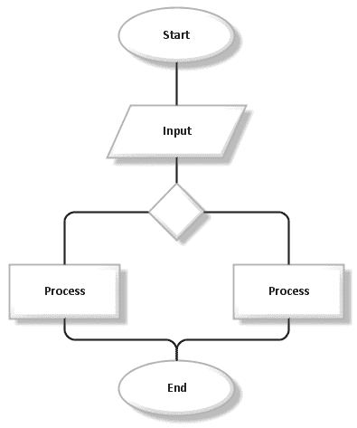
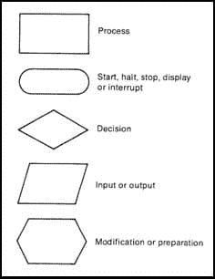

# 编写算法的方法

> 原文：<https://dev.to/yogeswaran79/ways-of-writing-an-algorithm-2io3>

编写算法有多种方式。今天，我将解释三种编写算法的方法。

### 1。类英语算法

算法可以用多种方式编写。它可以用简单的英语来写，但是这种方法也有一些缺点。自然语言可能是模糊的，因此缺乏确定性。一个算法的每一步都应该清晰，不应该有一个以上的含义。对于大多数任务来说，类似英语的算法并不被认为是好的。

### 2。流程图

流程图形象地描述了一个过程。它们很容易理解，通常用于简单的问题。

流程图约定

### 3。伪代码

伪代码具有容易转换成任何编程语言的优点。这种写算法的方式最容易被接受，应用也最广泛。为了编写伪代码，必须熟悉编写伪代码的惯例。

#### 1。单行注释以//开头

#### 2。多行注释出现在/*和*/之间

#### 3。块用括号表示。块可以用来表示复合语句或过程。

{
报表
}

#### 4。语句由分号分隔。

#### 5。赋值语句表明表达式求值的结果将存储在变量中。

< variable > = < expression >

#### 6。如果 x 大于 y，布尔表达式‘x>y’返回真，否则返回假。

#### 7。如果 x 小于 y，布尔表达式‘x<y’返回真，否则返回假。

#### 8。如果 x 小于或等于 y，布尔表达式‘x<= y’返回 true，否则返回 false。

#### 9。如果 x 大于或等于 y，布尔表达式‘x>= y’返回 true，否则返回 false。

#### 10。布尔表达式“x！如果 x 不等于 y，则= y '返回 true，否则返回 false。

#### 11。如果 x 等于 y，布尔表达式“x == y”返回 true，否则返回 false。

#### 12。如果两个条件都为真，布尔表达式“x 和 y”返回真，否则返回假。

#### 13。如果任一条件为真，布尔表达式“x 或 y”返回真，否则返回假。

#### 14。如果 x 的结果为 false，布尔表达式“NOT y”返回 true，否则返回 false。

#### 15。如果<条件>成立，则<声明>

#### 16。该条件是对上述“if”语句的增强。它还可以处理条件不满足的情况。

如果< condition >那么< statement1 >否则< statement2 >

#### 17。开关盒(C 或 C++)

案例{
: <条件 1 > : <语句 1 >
.....
.....
.....
: <条件 n > : <语句 n >
:默认:<语句 n+1 >
}

#### 18。while 循环

而< condition >则做{
语句

#### 19。do-while 循环

重复
语句
直到<条件>

#### 20。for 循环

for variable = value1 到 value2 {
语句

#### 21。输入指令

阅读

#### 22。输出指令

打印

#### 23。算法名为<名>，参数存储在<参数表>

算法< name > ( < parameter list >)

注意:6 号到 11 号使用关系运算符，12 号到 14 号使用逻辑运算符，15 号使用条件运算符。

加入[我的电报社区](https://t.me/theprogrammersclub)，这样你就不会错过任何文章。