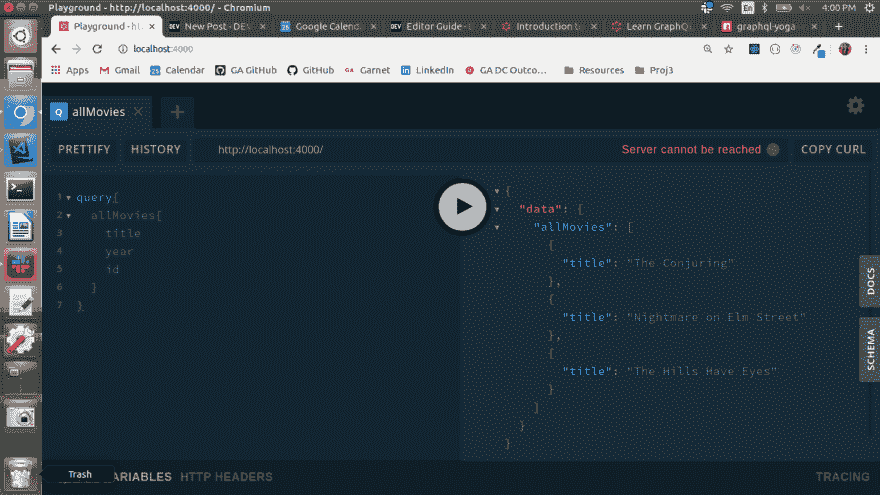
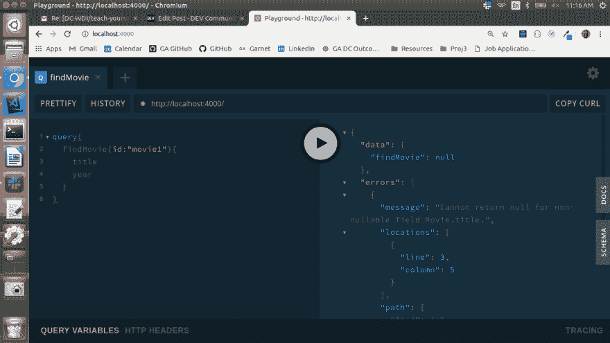
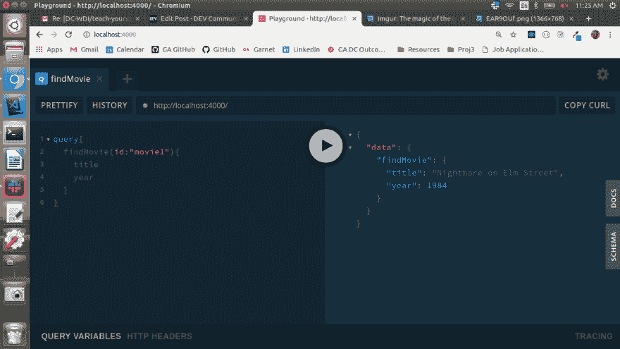
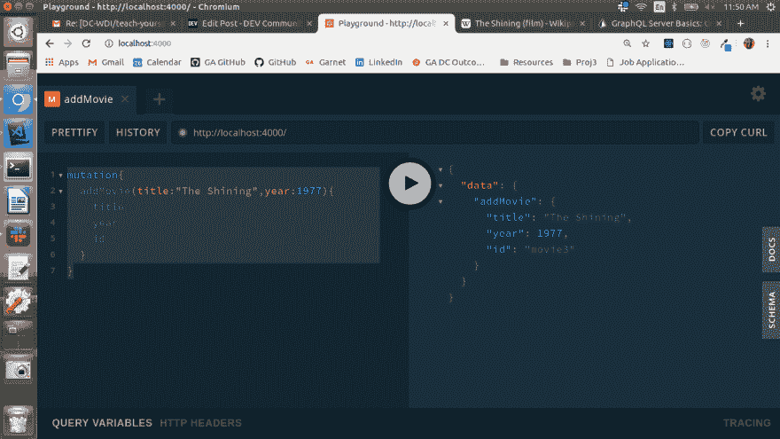
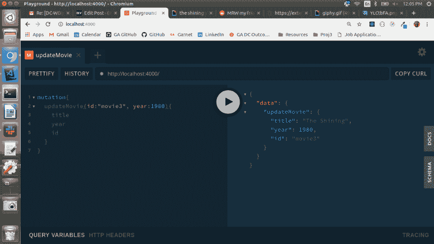
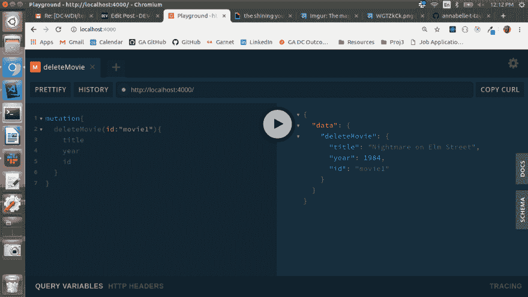

# 我们死后可以休息:GraphQL、Express 和 monster 电影

> 原文：<https://dev.to/annabellettaylor/we-can-rest-when-were-dead-graphql-express-and-monster-movies-3m11>

我喜欢不时地在我的开发流程中改变一些事情，以确保我不会太舒服(但愿冒名顶替综合征一次不要超过一周)。在弄清楚 React *状态*和*道具*之间的区别之后，我把我所知道的关于状态管理的一切都扔出了窗外，开始通过 Redux 工作。带 PHP 的 WordPress 很酷，但是 Gatsby 呢？

今天，这种强烈的欲望再次袭来，让我不禁思考，“RESTful APIs 在上一季太棒了；你好，GraphQL！”

## 项目设置

首先，创建一个新的目录和那个坏男孩。因为我们现在只对后端感兴趣，所以我们只需要安装一个依赖项: [GraphQL-Yoga](https://www.npmjs.com/package/graphql-yoga) 。这个漂亮的小软件包为您提供了开始进行 GraphQL 查询所需的一切，还增加了一个非常有用的 GraphQL Playground 的实例。用`yarn add graphql-yoga`安装这个(或者`npm install graphql-yoga`，如果那更适合你的速度)。

从项目文件夹的根目录，我们需要创建几个文件。运行以下命令:

```
mkdir src
touch src/index.js
touch src/schema.graphql 
```

并按如下方式设置它们:

```
/*INDEX.JS*/

//Import the tools to create a GraphQL server from GraphQL-Yoga
const { GraphQLServer } = require("graphql-yoga");

//Add some starting seed data
let movies = [
    {
        id: `movie0`,
        title: "The Conjuring",
        year: 2013
    },
    {
        id: `movie1`,
        title: "Nightmare on Elm Street",
        year: 1984
    },
    {
        id: `movie2`,
        title: "The Hills Have Eyes",
        year: 1977
    }
];

//This will com in handy when we want to add movies
let movieID = movies.length;

//All of the queries (asking for data) and mutations (think the Create, Update,
//and Delete of CRUD) from our schema will need to be resolved. That logic goes here.
const resolvers = {
    Query: {
        allMovies: () => movies
    }

const server = new GraphQLServer({
    typeDefs: "./src/schema.graphql",
    resolvers
});

//Spin up the server with the defined-in-file resolver functions and the 
//imported type definitions
server.start(() => console.log(`Server is running on http://localhost:4000`)); 
```

```
/*SCHEMA.GRAPHQL*/

//What does our model look like? Exclamation points mean "this data is required!"
type Movie{
    id: ID!,
    title: String!,
    year: Int!
}

//What sort of data are we going to ask for?
type Query{
    //Notice the exclamation point at the end; this can be read as "definitely
    //return an array so that the return value is never null. Fill that array with
    //Movie instances, if at all possible" 
    allMovies: [Movie]!
} 
```

### 读取所有项目

我有点喜欢看恐怖电影，因此有了我的种子数据的灵感。如您所见，我已经添加了第一个查询/解析组合来显示所有的恐怖电影。尝试在 GraphQL Playground(在 localhost:4000 上)中运行以下查询，并查看结果:

```
query{
  allMovies{
    title
    year
    id
  }
} 
```

您应该得到这样的结果:

[](https://res.cloudinary.com/practicaldev/image/fetch/s--q9ocyGLK--/c_limit%2Cf_auto%2Cfl_progressive%2Cq_auto%2Cw_880/https://i.imgur.com/7oJP3Nw.png)

GraphQL 真正奇妙的地方在于，编写良好的查询将准确返回您所要求的数据:不多也不少。不用抓取每个电影对象的所有信息(如上所示)，只需稍微调整一下就可以返回标题:

```
query{
  allMovies{
    title
  }
} 
```

### 读一项

如果我们只是想通过查询一部电影的 ID 来返回它的信息，会怎么样呢？尝试以下方法是合理的:

```
/*SCEHMA.GRAPHQL*/
type Query{
    allMovies: [Movie]!,
    findMovie(id:ID!): Movie
}

/*INDEX.JS*/
Query: {
    allMovies: () => movies,
    findMovie: (parent, args) => movies.filter(film => film["id"] == args.id)
}, 
```

但是，当您查询它时，您会得到一个错误，声称您“不能为不可空的字段 Movie.title 返回 null”，显然**是一部 ID 为“movie1”的电影，所以显然应该有一个标题。到底发生了什么事？！**

[](https://res.cloudinary.com/practicaldev/image/fetch/s--gdPC6c45--/c_limit%2Cf_auto%2Cfl_progressive%2Cq_auto%2Cw_880/https://i.imgur.com/EAR9OUf.png)

虽然这看起来像是某种来自遥远地方的恶作剧，但它实际上是嵌套对象的问题(或者更具体地说，是在对象内部的数组中嵌套对象)。在查询解析器中使用这些`console.log`语句再次运行命令，并考虑它们的输出:

```
//Print the entire movie array
console.log(movies) =
[ { id: 'movie1', title: 'The Conjuring', year: 2013 },
{ id: 'movie2', title: 'Nightmare on Elm Street', year: 1984 },
{ id: 'movie3', title: 'The Hills Have Eyes', year: 1977 } ]

//Print an array containing the film whose ID matches the one from the arguments
film = movies.filter(film => film["id"] == args.id)
console.log(film) =
[ { id: 'movie2', title: 'Nightmare on Elm Street', year: 1984 } ]

//Print the first element from the above array
console.log(film[0]) = 
{ id: 'movie2', title: 'Nightmare on Elm Street', year: 1984 } 
```

你注意到第二个和第三个结果之间的细微差别了吗？我们无法单独返回变量`film`，因为它不属于 Movie 类型。更确切地说，它是一个数组，其中的*包含了*一个单独的电影实例。要解决这个问题，请编辑您的查询解析器，使它返回数组中的第一个元素:

```
/*INDEX.JS*/
Query: {
    allMovies: () => movies,
    findMovie: (parent, args) => movies.filter(film => film["id"] == args.id)[0]
} 
```

重新启动服务器并再次运行查询。巴赞加！

[](https://res.cloudinary.com/practicaldev/image/fetch/s--RNUvuv1x--/c_limit%2Cf_auto%2Cfl_progressive%2Cq_auto%2Cw_880/https://i.imgur.com/IvuFBsP.png)

### 创建一个对象

这很好，但新的恐怖电影一直在制作，所以我们需要一些方法来增加电影。这引入了一种新的操作类型:名副其实的“突变”

[](https://res.cloudinary.com/practicaldev/image/fetch/s--INH5cUyg--/c_limit%2Cf_auto%2Cfl_progressive%2Cq_66%2Cw_880/https://media0.giphy.com/media/YEL7FJP6ed008/giphy.gif%3Fcid%3D3640f6095c9a45b06e684f31457e6528)

考虑为了制作一个新的电影对象，需要交易哪些数据。根据我们的模型，每部电影都有一个`title`、一个`year`和一个唯一的`ID`。因为我们还没有使用任何外部 API，所以我们需要自己包含标题和年份。然而，手工输入 ID 可能会很危险；如果我们忘记添加了多少电影呢？如果我们忘记了大写约定会怎么样？为了远离这种令人毛骨悚然的可能性，最好让程序自己来处理 ID。这就是`movieID`变量发挥作用的地方！

```
/*SCHEMA.GRAPHQL*/
type Mutation{
    //Take in a title of type String and a year of type Int, then return a Movie
    addMovie(title:String!,year:Int!):Movie!,
}

/*INDEX.JS*/
let movieID = movies.length;
const resolvers = {
    //Our Queries will stay the same
    Query: {
        allMovies: () => movies,
        findMovie: (parent, args) => movies.filter(film => film["id"] == args.id[0]
    },
    Mutation: {
    addMovie: (parent, args) => {
            const newMovie = { 
                //Take the arguments and set them as the title and year, then
                //set the ID equal to the string "movie" plus whatever index the
                //film is getting added into
                id: `movie${movieID++}`,
                title: args.title,
                year: args.year
            };
            //Add the new object to our existing array
            movies.push(newMovie);
            //Return the new movie object to satisfy the return type set in our schema
            return newMovie;
        }
    }
} 
```

不可否认，我仍在努力弄清楚那个`parent`论点到底是怎么回事，但是没有它，突变就不起作用。语言规格:不能和他们一起生活，不能没有他们。

无论如何，刷新服务器并尝试添加电影。您应该会得到这样的结果:

[](https://res.cloudinary.com/practicaldev/image/fetch/s--QwKk6d3J--/c_limit%2Cf_auto%2Cfl_progressive%2Cq_auto%2Cw_880/https://i.imgur.com/YLCtbFA.png)

### 更新/编辑电影对象

哦！我们当中眼尖的人会注意到，当我添加了 *The Shining，*时，我不小心把发行年份定在了 1977 年。那时斯蒂芬·金的原著小说问世了，但斯坦利·库布里克的解释直到三年后的 1980 年才被搬上大银幕。我们必须做出补偿！

[](https://res.cloudinary.com/practicaldev/image/fetch/s--5DCKQWvN--/c_limit%2Cf_auto%2Cfl_progressive%2Cq_66%2Cw_880/https://media3.giphy.com/media/hNNIEcRzZanWU/giphy.gif%3Fcid%3D3640f6095c9a4b404543596163e85885)

因为这是编辑数据而不是简单地读取数据，所以更新 film 对象将是与根查询相反的另一种变化。就如何塑造突变而言，再次考虑什么信息需要去哪里。按 ID 查询通常是个好主意，特别是考虑到我们可能需要在任何给定的请求中更新年份或标题。然而，如本例所示，并不是每个请求都必须更新这两个属性。我们希望以这样一种方式编写它，即最多接受两个参数，但不是必需的。最后，有人可能会用 ID“redrum”查询一部电影，考虑到我们是如何构造 ID 的，搜索结果应该是空的。所以我们不能*要求*这个函数输出一部电影:

```
/*SCHEMA.GRAPHQL*/
//inside of type Mutation
updateMovie(id:ID!,title:String,year:Int):Movie

/*INDEX.JS*/
//inside of your Mutation resolver object, underneath addMovie
updateMovie: (parent, args) => {
    const selectedMovie = movies.filter(film => film["id"] == args.id)[0];
    if (args.title) selectedMovie.title = args.title;
    if (args.year) selectedMovie.year = args.year;
    return selectedMovie;
} 
```

这些条件确保只更新输入数据字段。回到服务器和泡沫，冲洗，重复:

[](https://res.cloudinary.com/practicaldev/image/fetch/s--chp1cl4g--/c_limit%2Cf_auto%2Cfl_progressive%2Cq_auto%2Cw_880/https://i.imgur.com/WGTZkCk.png)

很高兴我们解决了这个问题！

### 删除电影对象

使用 GraphQL 从数组中删除对象结合了前面三个函数的概念:

*   像 READ 一样，通过 ID 查询一部特定电影
*   像创建一样，您正在编辑数组的序列
*   像 UPDATE 一样，你要找的电影可能在数组中的任何地方(或者，在输入 ID 错误的情况下，可能不在任何地方)

鉴于这些相似之处，我将把最后一个函数作为练习(不过如果您需要提示或想要检查您的工作，可以访问我的 [GitHub repo](https://github.com/annabelle-t-taylor/monster-models) )。您最终应该得到一个类似于下面这样的最终请求:

[](https://res.cloudinary.com/practicaldev/image/fetch/s--KF3CnrhK--/c_limit%2Cf_auto%2Cfl_progressive%2Cq_auto%2Cw_880/https://i.imgur.com/Pbh7wfT.png)

## 往前走

显然，本演练仅仅触及了 GraphQL 的皮毛。如果您有兴趣进一步探索，我建议查看以下资源:

*   [How To graph QL 简介视频系列](https://www.howtographql.com/):这个 45 分钟的概述对于任何想要开始学习或需要快速复习的人来说都是无价的
*   Maira Bello 的 GraphQL/NodeJS 教程:我在构建自己的演练时最依赖的教程。她已经超出了我在这里讨论的范围，所以如果你想从我离开的地方继续，我建议从第四部分开始，[添加 Prisma 数据库](https://www.howtographql.com/graphql-js/4-adding-a-database/)

查询愉快！

[](https://res.cloudinary.com/practicaldev/image/fetch/s--J9uTSyN6--/c_limit%2Cf_auto%2Cfl_progressive%2Cq_66%2Cw_880/https://media1.giphy.com/media/pHXNEtSYQ1vwZtW6O0/giphy.gif%3Fcid%3D3640f6095c9a50754e75574c55030183)