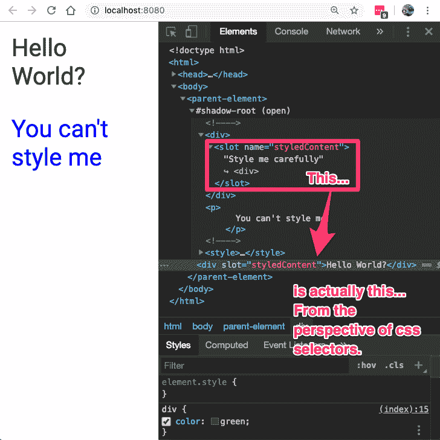

# Web 组件风格封装在 5 分钟内完成

> 原文：<https://dev.to/jmckenney/web-component-style-encapsulation-in-5-minutes-1ihj>

## 问题

自从数据网络出现以来(嗯，在出现不久之后)，每一个 ui 元素都完全由一个支配性的风格级联控制。当你想小心地保护你的 UI 区域不被 css 覆盖时会发生什么？

## 解

暗影 DOM。Shadow DOM 涉及了 web 组件下的许多主题，并且还提供了 JS 封装。今天我们将专注于样式封装的几个关键方面。

自定义元素本身只对传统的样式方法做了很小的改变。在下面的示例中，您将会看到，由于自定义元素在名称上是唯一的，因此样式作者可以利用自定义元素的引用/取消引用名称空间来为自定义样式提供一定程度的特异性，从而为 css 覆盖提供最低限度的保护。

[https://stackblitz.com/edit/web-component-style-encapsulation-1?embed=1&](https://stackblitz.com/edit/web-component-style-encapsulation-1?embed=1&)

如你所见，`p`样式被`parent-element p`样式覆盖了。请注意，lit-element 默认启用阴影 DOM，上面的例子通过`createRenderRoot()`覆盖禁用了阴影 DOM。这使我们能够利用 lit-element，同时仍然显示一个没有启用阴影 DOM 的自定义元素。

## 大揭秘

现在我们得到了样式封装的例子。

[https://stackblitz.com/edit/web-component-style-encapsulation-2?embed=1&](https://stackblitz.com/edit/web-component-style-encapsulation-2?embed=1&)

看完这个例子后，我可能会想到几个问题:

*   为什么说的是`Hello World`而不是模板的字符串`Style me carefully`？

答案是由于`slot` s 的魔力。注意浏览器如何对待这个区域有点像 linux 文件系统中的符号链接。虽然节点位于影子根中，但是内容和样式引用了 light DOM 中的链接。

*   为什么我们能够从外部样式化分槽内容，但是我们不能样式化不引用分槽内容的影子 DOM 中存在的内容？

阴影 DOM 保护，插槽允许造型。这开始变得有趣了。

## 样式化 API

现在我们有了这个干净漂亮的规范，它允许我们在封装样式的同时继续组合 html 元素。我不得不把它交给浏览器的规范创建者。这需要很多的远见和创造力。

如果封装区域的作者希望允许从外部引入品牌和一些样式，规范有如下所示的选项。

[https://stackblitz.com/edit/web-component-style-encapsulation-3?embed=1&](https://stackblitz.com/edit/web-component-style-encapsulation-3?embed=1&)

在下一篇文章中，我将讨论 web 组件如何提供封装 JavaScript 的方法。请留意这篇文章的视频演示。

## 信用到期时的信用

[https://gist . github . com/praveenpuglia/0832 da 687 ed 5a 5d 7 a 0907046 c9ef 1813](https://gist.github.com/praveenpuglia/0832da687ed5a5d7a0907046c9ef1813)