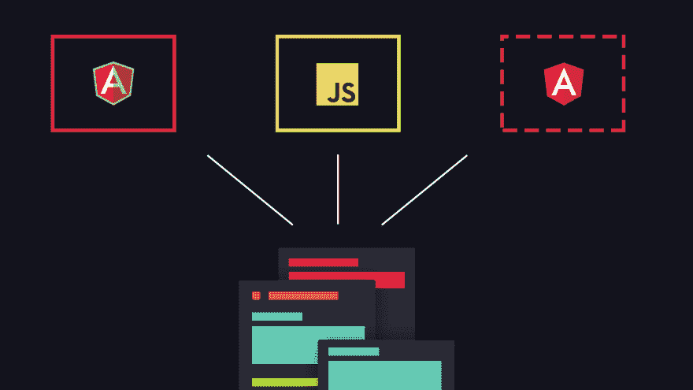
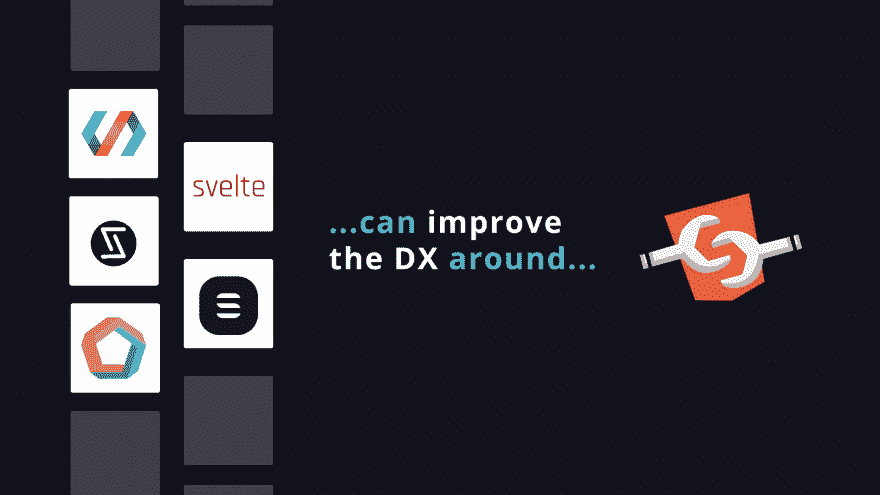
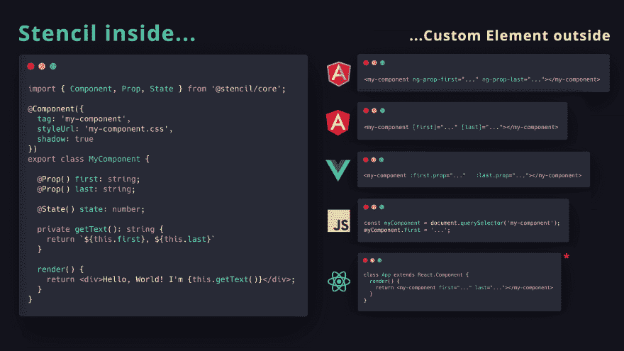

# Web 组件问答

> 原文：<https://dev.to/psmyrdek/web-components-q-a-5ejg>

最近，我参与了关于 Web 组件的多次讨论，我注意到有些问题仍然会给前端开发人员带来很多困惑。通过写这篇文章，我试图总结我对现代网络这个非常重要的话题的观点。

问:我真的需要它们吗？

老实说，如果你对 Web 组件感兴趣仅仅是因为你刚刚读过的文章，或者你刚刚看过的演讲，那么答案可能是——不，不是马上。没有必要抛弃你所熟悉的框架，而只是在你正在构建的东西中引入另一个 API。如果您使用的代码库相当一致，或者如果没有必要提取与框架无关的组件，并且您创建的项目可能有相对较短的到期日，我建议坚持使用您最有经验的解决方案。另一方面，如果你在不同的环境中工作，不同的应用程序基于不同的框架，你可以到处找到一些遗留代码，当真正需要重构基于组件的架构时——是的，在这种情况下，我会考虑 Web 组件。在 SmartRecruiters，我们决定走这条路，统一完全相同功能的多个实现，这导致了一个封装的组件，可以同时在有角度和无角度的应用程序中使用(我们是一家有角度的公司)。它帮助我们减少了与我们工作的领域相关的组件的技术债务和整体复杂性，而不需要到处强制支持 Angular runtime。我们仍然处于 Web 组件冒险的最开始——更多的课程还在后面。

问:我看到了使用 Web 组件的好处，但是为什么他们的 API 如此原始，以至于很难卖给我的团队？

Web 组件的 API 之所以看起来像你想象的那样原始，是因为它们在你的技术堆栈中扮演着非常底层的角色。如果有一种自以为是的方式来处理数据绑定、模板化、状态管理或 Web 组件规范中的任何类似内容，那么它将关闭任何基于它的第三方解决方案的大门。当你将它们与你每天使用的框架进行比较时，也可能会产生困惑，但在我看来，你在考虑 Web 组件时应该使用的框架应该更像是“div 和 span 的替代品”，而不是“React 或 Angular 的替代品”。为了帮助你理解这个观点，我建议你做下面的练习——花一些时间来构建这种原始的“Web 组件”,并随着时间的推移对它的不同部分进行改进。对于呈现机制，从将字符串绑定到 innerHTML 属性开始，然后移动到模板标记，然后使用 lit-html 引入动态模板。对于数据绑定，从观察属性和特性开始，然后在属性设置器中手动重新呈现所有内容，然后将可观察属性的公共逻辑提取给装饰器。通过做所有这些，你可能会注意到你有多少种方法来实现同样的东西(但更好)，让你觉得你在与框架的内部工作，而不是框架本身。当谈到更容易向你的团队销售的 API 时，我建议检查像 stencil 或 lit-element 这样的解决方案。

问:原始 Web 组件和诸如 Stencil 或 lit-element 之类的工具有什么区别？

原始 Web 组件和各种“Web 组件工厂”之间最重要的区别是关于名为“开发人员体验”的花哨名称——您在使用和分发 Web 组件时所面临的感觉的总和；)例如，在 Stencil 中，您可以使用 TypeScript 编写组件。您已经准备好通过所谓的“集合”以 npm 包的形式分发组件。你准备把你的元件放在 IE11 前面，因为 polyfills 管理模版给了你。您可以延迟加载您的组件，并将最终的包分成块，并且可以使用 JSX 来构建组件的模板。此外，您可以通过使用 Stencil 的装饰器(如@Component、@Prop 或@State)来消除与您试图解决的业务案例不完全相关的重复逻辑，从而节省一些时间(我所说的逻辑是指在注册表中注册您的自定义元素，对属性和属性的更改做出反应，以及在状态更新时重新呈现所有内容)。然而，关于 Stencil(或类似 Stencil 的解决方案)最重要的部分是能够产生能够与你能想到的大多数框架互操作的本地定制元素。

问:我知道像 Stencil 或 lit-element 这样的工具可以提高 Web 组件的 DX，但是这和使用另一个框架不是一样的吗？这两种方法有什么区别吗？

让我们考虑供应商(模板、反应、角度等)的情况。)你前段时间构建的组件开始看起来像一个遗留组件。人们转移到不同的工具或对它的支持已暂停。考虑两种可能的情况。首先——当有一个组件只在特定的运行时内工作时(大多数框架都有自己特定的运行时),就互操作性而言，基本上就是这样。“下一件大事”愿意与使用 Angular、React 或 Vue 构建的组件对话的可能性非常小。它们可能会引入自己的运行时，这些运行时可能与您的组件不兼容，因此向它们传递数据变得不可能。现在考虑这样一个场景，你的代码库不是生成特定于框架的组件，而是充满了满足这两个要求的定制元素——你可以将数据绑定到它们的属性，就像你对常规 DOM 元素所做的那样，它们*对绑定数据的变化做出*反应，你也可以通过本地“addEventListener”方法订阅它们发出的事件。第一种情况是当你使用框架时，它们经常是互不兼容的。第二个场景是当您使用 Web 组件时，这可以确保您生产的组件有一个更长的有效期。回答最初的问题——是的，就 API 而言，这确实取决于您的偏好，然而，就您的工作成果而言，这种差异确实有意义。

问:我决定在项目的某些部分使用无框架，但是我如何在我的定制元素中处理应用程序范围的状态管理呢？

当你仔细观察时，你会发现在像 redux 或 mobX 这样的库里面，既没有 React 也没有 Angular。你应该把它们看作是普通的 JavaScript 模块，可以与你的应用程序包含的各种组件(是的，还有 Web 组件)相结合，而不是为任何特定框架定制的工具。只要您的组件能够订阅给定存储或状态容器内的更改，一切都应该正常工作。为了更好地理解它，您可以创建自己的商店或任何 pub/sub 容器作为一个普通的 JS 模块，全局公开它，并从您正在构建的定制元素内部调用它的方法。然后，用您最喜欢的状态管理库替换它就一步之遥了，实际上没有什么变化。在更广泛的背景下，这仍然是对其他问题的有效回答，如“我如何才能…使用 Web 组件”-只要客户端代码库的不同部分之间的关系设置正确，并且不需要框架提供任何特定的运行时，事情就会正常工作。

* * *

要看我最近关于 Web 组件演讲的幻灯片[请点击这里](https://docs.google.com/presentation/d/e/2PACX-1vTzGwaHXRwJTjY4-OiZ66RxxRgC2DOcP_Rd3f2NdfgXLzD3TtugNWOYPG9BhYOia5-xHfKAR5nZHm2p/pub?start=false&loop=false&delayms=15000)——非常欢迎您的反馈！

看看我上面提到的工具:

模版-[https://stenciljs.com/](https://stenciljs.com/)

https://lit-element.polymer-project.org/