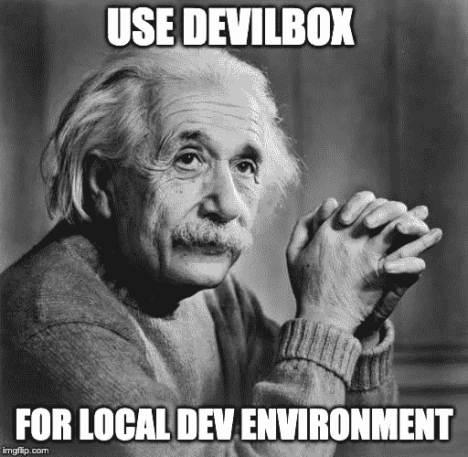
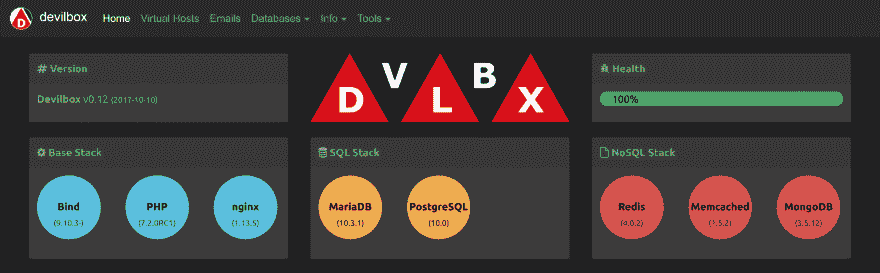
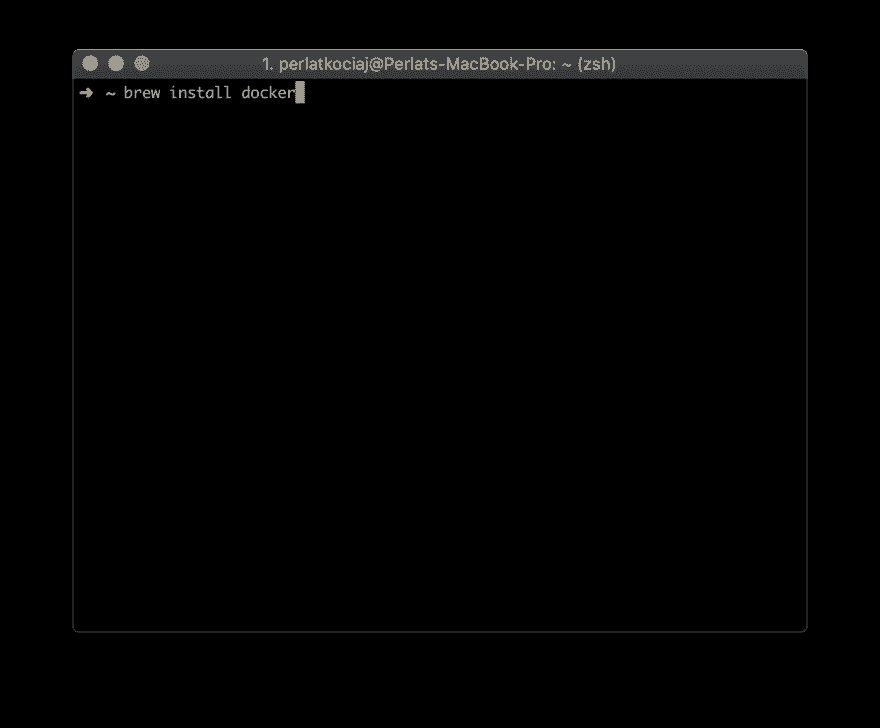
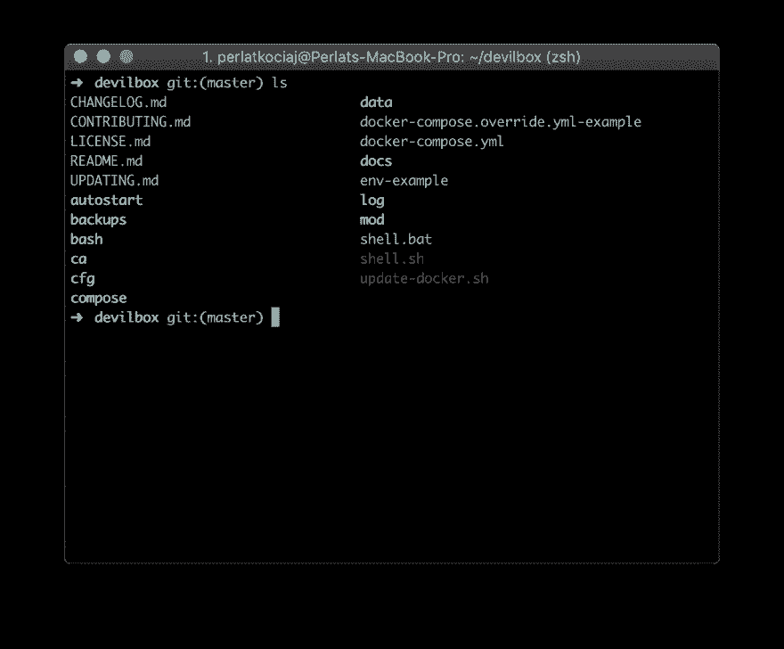
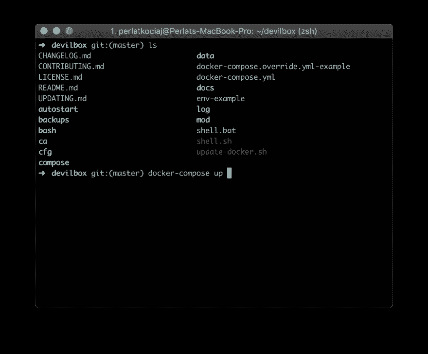
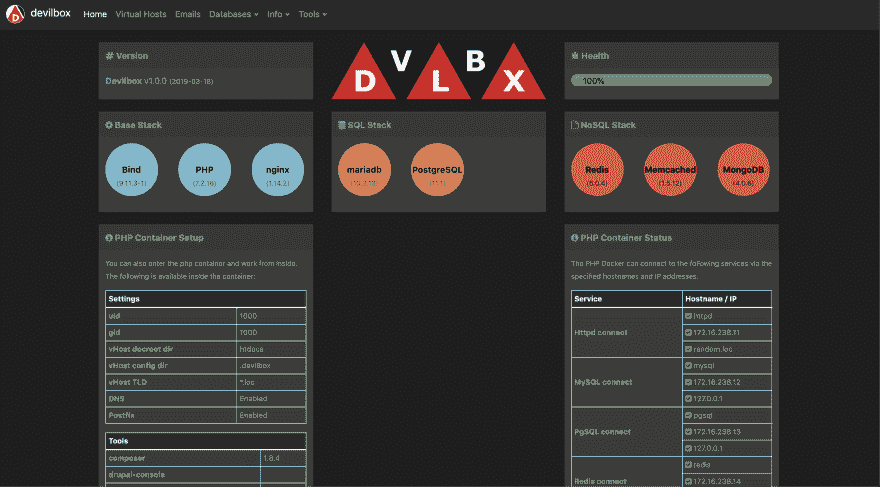
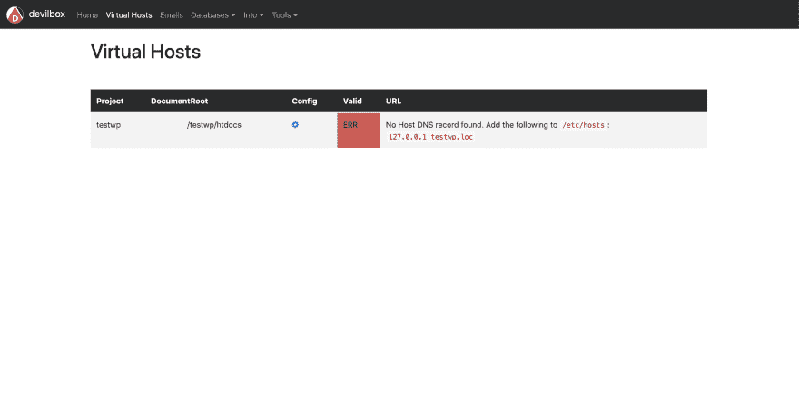
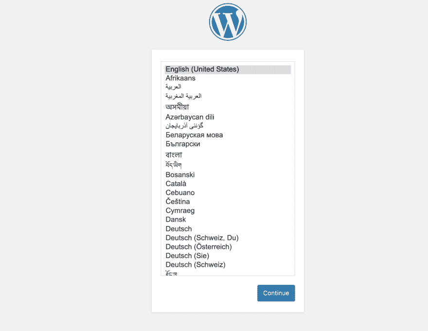
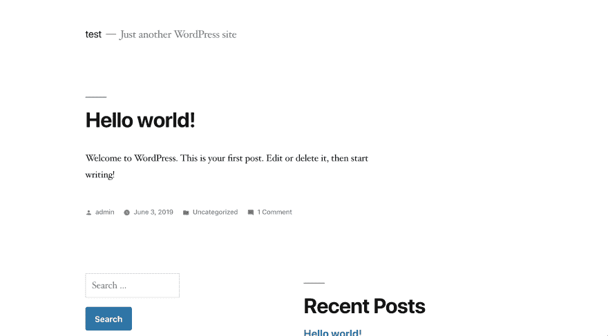

# 使用 Devilbox 的 Web 开发环境

> 原文：<https://dev.to/perlatsp/web-development-environment-using-devilbox-3k9k>

[](https://res.cloudinary.com/practicaldev/image/fetch/s--UV0gHaBm--/c_limit%2Cf_auto%2Cfl_progressive%2Cq_auto%2Cw_880/https://kociaj.com/content/uploads/2019/06/einstein.jpg)

当我使用 Windows 操作系统的时候，我一直使用 WAMP 作为我的本地开发环境，然后我切换到 Mac OS 并使用 MAMP 一段时间。在我的一个同事推荐`devilbox`之前就是这样。我尝试了一下，从那以后，我一直把它作为我的本地开发环境。

# 目录

*   [什么是魔盒](#What%20is%20the%20Devilbox)
*   [要求](#Requirements)
*   [配置](//#Configuring%20Devilbox%20.ENV%20FIle)
*   [项目目录](#Project%20Directory)
*   [WordPress 安装](#WordPress%20Installation)
*   [结论](#Conclusion)

### 什么是魔盒

不，这和魔鬼没有任何关系。正如作者在官方[网站](http://devilbox.org/)中描述的那样

> Devilbox 是一个现代的、高度可定制的 PHP 堆栈，支持所有的 T2 灯和 T4 灯，并运行在所有主流平台上。主要目标是方便地切换和组合本地开发所需的任何版本。

你不必担心你的操作系统是否支持它。Devilbox 支持 **Linux** 、 **Mac** 和 **Windows** OS！

[](https://res.cloudinary.com/practicaldev/image/fetch/s--S4XDaBvj--/c_limit%2Cf_auto%2Cfl_progressive%2Cq_auto%2Cw_880/http://devilbox.org/assets/img/devilbox-dash.png)

### 要求

*   规格不错的电脑
*   互联网连接
*   [码头工人](https://www.docker.com/)安装完毕
*   Git 已安装

我相信我不需要通过前两个要求😄

要使用 Devilbox，您需要在计算机上安装 Docker。为了这篇文章，也因为我使用的是 Mac OS，我将向你展示如何下载和安装 Docker for Mac。

#### 安装 Docker

有很多方法可以安装 Docker for Mac

一种方法是前往[https://docs . docker . com/v 17.12/docker-for-MAC/install/# download-docker-for-MAC](https://docs.docker.com/v17.12/docker-for-mac/install/#download-docker-for-mac)，点击`Get Docker for Mac`(首选版本总是稳定的)。下载完成后，打开刚刚下载的`Docker.dmg`文件，按照说明完成安装。

第二种是通过`homebrew`MAC OS 软件包管理器安装。要安装它，请打开您的终端并键入以下命令

```
~ brew install docker 
```

[](https://res.cloudinary.com/practicaldev/image/fetch/s--uNP_VfHv--/c_limit%2Cf_auto%2Cfl_progressive%2Cq_auto%2Cw_880/https://kociaj.com/content/uploads/2019/06/dockerinstall.png)

下一步是运行 docker，最简单的方法是按下`CMD` + `SPACE`键，输入 docker，然后输入`ENTER`。当 docker 运行时，您应该会收到通知。

#### 安装 Devilbox

Devilbox 没有附带任何安装包，要*安装*它，你必须`clone`把这个库安装到你的本地机器上。为了实现这一点，我们使用命令`git clone REPOSTIORY_URL.git`项目的回购托管在 [GitHub](https://github.com/cytopia/devilbox) 上。让我们继续安装 devilbox。
打开终端窗口，键入`git clone https://github.com/cytopia/devilbox`，等待克隆过程完成。

[](https://res.cloudinary.com/practicaldev/image/fetch/s--sSYubjEq--/c_limit%2Cf_auto%2Cfl_progressive%2Cq_auto%2Cw_880/https://kociaj.com/content/uploads/2019/06/devilboxinstall.png)

当克隆完成并需要通过键入`cd devilbox`进入 devilbox 目录时，您应该看到以下内容。

[](https://res.cloudinary.com/practicaldev/image/fetch/s--9nMQue40--/c_limit%2Cf_auto%2Cfl_progressive%2Cq_auto%2Cw_880/https://kociaj.com/content/uploads/2019/06/devilboxinstalled.png)

#### [T1。环境文件](#env-file)

因为 Devilbox 可以通过一个`.env`文件进行配置，我们的下一步是将`env-example`文件复制到`.env`中，这样我们就可以运行下面的命令:

```
cp env-example .env 
```

### 启动魔盒

推出魔盒的时候到了！

要启动 devilbox，您需要在终端上运行以下命令，而不是在 devilbox 目录下。现在它将拉出所有需要的容器！第一次运行它可能需要一段时间，这取决于您的互联网连接。但是一旦您有了所有的图像，您应该能够在几秒钟内(大约 4-5 秒)启动所有的容器。

[](https://res.cloudinary.com/practicaldev/image/fetch/s--3rRlyGKe--/c_limit%2Cf_auto%2Cfl_progressive%2Cq_auto%2Cw_880/https://kociaj.com/content/uploads/2019/06/dockercomposeup.png)

> 小费！运行`docker-compose up -d`在后台运行与当前终端窗口分离的容器。

当所有的图像都拉，你应该能够访问 devilbox 本地主机的网址。默认情况下，Devilbox 监听端口`80`，这意味着你可以通过访问 [http://localhost](http://localhost) 来访问它

[](https://res.cloudinary.com/practicaldev/image/fetch/s--Tg6AFhlf--/c_limit%2Cf_auto%2Cfl_progressive%2Cq_auto%2Cw_880/https://kociaj.com/content/uploads/2019/06/devilboxdash.png)

> 通过`docker-compose`启动和停止集装箱。如果你以前从未使用过它，看看它们的文档，了解一下[概述](https://docs.docker.com/compose/reference/overview/) 、[上升](https://docs.docker.com/compose/reference/up/) 、[停止](https://docs.docker.com/compose/reference/stop/) 、[杀死](https://docs.docker.com/compose/reference/kill/) 、 [rm ](https://docs.docker.com/compose/reference/rm/) 、[日志](https://docs.docker.com/compose/reference/logs/) 和[拉](https://docs.docker.com/compose/reference/pull/) 命令。

更多关于启动魔盒的信息[点击这里](https://devilbox.readthedocs.io/en/latest/getting-started/start-the-devilbox.html)

### 配置 Devilbox。环境文件

Devilbox 是可配置的，你可以很容易地在开发环境之间切换，比如(PHP，APACHE，MySQL)或者(PHP，NGINX，MariaDB)。
用你最喜欢的编辑器打开`.env`文件，根据你的喜好配置**环境**。我正在使用 [Visual Studio 代码](https://code.visualstudio.com/)

[](https://res.cloudinary.com/practicaldev/image/fetch/s--g5b2uYiJ--/c_limit%2Cf_auto%2Cfl_progressive%2Cq_auto%2Cw_880/https://kociaj.com/content/uploads/2019/06/envfile.png)

每种配置都是不言自明的，最常见的配置是下面的配置，其中您更改了`PHP_SERVER`版本、`HTTPD_SERVER`和`MYSQL_SERVER`。如你所见，我正在运行`PHP 7.2` `NGINX stable`和`MariaDB 10.3`穿越。env 文件来发现其他设置。

点击阅读更多关于配置环境文件[的信息](https://devilbox.readthedocs.io/en/latest/configuration-files/env-file.html)

### 项目目录

devilbox 的项目目录位于 devilbox 目录`./devilbox/data/www`中，默认情况下应该是空的。这里是您所有项目的所在地。

对于每个项目，您需要创建一个文件夹。

在这里阅读更多

### 文档根目录

文档根目录是每个项目目录中的一个目录，web 服务器将从该目录中提供文件。

默认情况下，该目录必须命名为`htdocs`。这也可以更改，但超出了本教程的范围。

### 本地域后缀

默认的域名后缀(`.env`文件中的`TLD_SUFFIX`变量)是`loc`。这意味着您的所有项目都可以在下面的地址下获得:`http://<project-directory>.loc`。这也可以在`.env`文件中更改。`TLD_SUFFIX`！

### WordPress 安装

让我们举一个 WordPress 安装的例子。

打开终端并运行以下命令:

*   `cd devilbox/data/www`

*   `mkdir testwp`创建名为 **testwp** 的目录

*   `cd testwp`输入我们刚刚创建的目录

*   下载 WordPress `wget http://wordpress.org/latest.tar.gz`

*   运行`tar -zxvf latest.tar.gz`解压归档文件

*   运行`mv wordpress htdocs`(还记得 docroot 目录吗？)

*   打开[http://testwp.loc/](http://testwp.loc/)，你应该会看到以下错误。

-

`**testwp.loc**’s server IP address could not be found.
testwp.loc’s server IP address could not be found.
DNS_PROBE_FINISHED_NXDOMAIN` 

```
This happens because we have not added the local host DNS record. 
```

如果您导航到[http://localhost/vhosts . PHP](http://localhost/vhosts.php)，您应该会看到类似这样的内容。

[](https://res.cloudinary.com/practicaldev/image/fetch/s--pOGpZgo3--/c_limit%2Cf_auto%2Cfl_progressive%2Cq_auto%2Cw_880/https://kociaj.com/content/uploads/2019/06/hosterror.png)

下一步是在 hosts 文件中添加记录。为此，运行`sudo nano /etc/hosts`用 nano 编辑器编辑它，并添加下面一行

```
`127.0.0.1 testwp.loc` 
```

点击保存。再次导航到[http://testwp.loc/](http://testwp.loc/)，现在你应该会看到 WordPress 安装页面。

[](https://res.cloudinary.com/practicaldev/image/fetch/s--hfy5umlV--/c_limit%2Cf_auto%2Cfl_progressive%2Cq_auto%2Cw_880/https://kociaj.com/content/uploads/2019/06/wpinstall.png)

下一步是为 WordPress 创建一个数据库。我们可以通过使用终端或者使用 devilbox 自带的`phpmyadmin`来实现。要访问 phpMyAdmin，首先导航到[http://localhost/index . PHP](http://localhost/index.php)>工具> phpMyAdmin，如果它要求凭证，请输入`root`作为用户，并将密码字段留空。

不，从侧边栏创建一个新的数据库，我将其命名为`wp_testdb`。

一旦完成，返回 WordPress 安装页面，继续添加新创建的数据库。

> 注意！对于数据库主机，您需要输入`mysql`而不是`localhost`，因为这是运行在 devilbox 环境中的 MySQL 服务器(容器)的名称！

一切都应该运行顺利，你应该看到新的 WordPress 站点在 [http://testwp.loc](http://testwp.loc) 上启动并运行

[](https://res.cloudinary.com/practicaldev/image/fetch/s--QvudzFT8--/c_limit%2Cf_auto%2Cfl_progressive%2Cq_auto%2Cw_880/https://kociaj.com/content/uploads/2019/06/wplive.png)

### 结论

Devilbox 是一个免费的开源项目，非常非常容易设置和运行 PHP、Nginx 和 MySQL 开发环境，按照本教程阅读 WordPress 安装应该需要大约 10 分钟！我已经使用 Devilbx 大约 1 年了，我对它非常满意，当我用 PHP 7 进行项目时，我发现它非常方便，我必须切换到 PHP 5.6 上运行的项目，它只花了我不到 15 秒的时间！⌛

你以前用过魔盒吗？你愿意试一试吗？