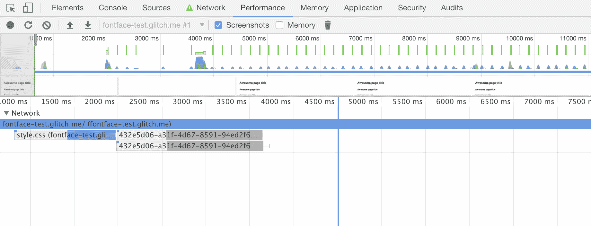
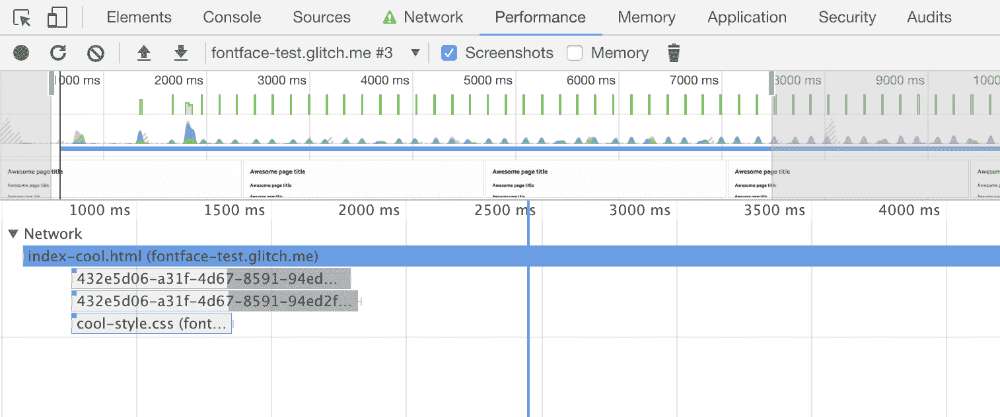

# 2018 年如何加载网页字体

> 原文：<https://dev.to/equinusocio/web-fonts-in-2018-321e>

世界各地都在使用定制的 web 字体，但是许多(许多许多)站点没有正确地加载它们，导致页面加载过程中出现许多问题，比如性能问题、加载时间过长、导航过程中渲染受阻和字体交换。

我看到许多开发人员忽略了这个论点，或者他们可能一次又一次地犯同样的错误，只是因为“他们总是这样做”，也许他们不知道他们正在一个不断变化的环境中工作。

我只是认为我们应该打破这个循环，在 2018 年开始做正确的事情，因为加载自定义 web 字体时只需考虑四个步骤:

*   使用正确的字体格式
*   预加载字体
*   正确的字体声明
*   字体加载过程中避免不可见文本

让我们开始分解这些要点，一次面对一个。

## 使用正确的字体格式

web 上可以使用的字体格式有很多，但如果不是必须支持 IE 8 或更低版本( [wtf？！](https://inception.davepedu.com/) ): **[woff](https://caniuse.com/#search=woff)** 和**[woff 2](https://caniuse.com/#search=woff2)T9】。这是你应该使用的仅有的两种文件类型，因为它们在默认情况下是 gziped 格式的(所以它们非常小),并且针对网络进行了优化，正如你所看到的，它们完全受 IE 9+和所有其他绿色浏览器的支持。**

## 预加载字体

当使用自定义字体时，你应该告诉浏览器使用合适的标签和`rel`属性:
来预加载它们

```
 <link rel="preload" as="font" href="fonts/cicle_fina-webfont.woff2" type="font/woff2" crossorigin="anonymous">
  <link rel="preload" as="font" href="fonts/zantroke-webfont.woff2" type="font/woff2" crossorigin="anonymous"> 
```

Enter fullscreen mode Exit fullscreen mode

> 注意这里 crossorigin 的用法是`important`；如果没有此属性，浏览器将忽略预加载的字体，并进行新的提取。这是因为浏览器会匿名提取字体，只有使用 This 属性才能匿名请求预加载。

在上面的例子中，`rel="preload" as="font"`属性将要求浏览器尽快开始下载*所需的*资源。它们还告诉浏览器这是一种字体，因此它可以在其资源队列中适当地对其进行优先级排序。使用[预加载提示](https://developers.google.com/web/fundamentals/performance/resource-prioritization?hl=en#preload)将对网页字体性能和初始页面加载产生巨大影响。支持预加载和预取提示的浏览器会在看到 HTML 文件中的提示后立即开始下载 web 字体，而不再需要等待 CSS。

相反，您可以使用`rel="prefetch"`属性告诉浏览器准备下载最近在页面加载或用户操作期间可能需要的资源，这样它将为资源分配一个低优先级。

**注意:**
如果你使用的是像谷歌字体这样的 CDN，确保你预加载的字体文件与 CSS 中的相匹配。字体也可以定期更新，如果你在使用 CSS 下载新版本的同时预加载旧版本，你可能会下载相同字体的两个版本，浪费用户的带宽。考虑使用 [`<link rel="preconnect">`👨🏼‍🔬](https://developers.google.com/web/fundamentals/performance/resource-prioritization?hl=en#preconnect)取而代之的是更容易维护。

## 正确的字体-字体声明

声明一个字体系列是非常简单的，但是当我们这样做的时候，我们必须关心一些事情。下面是一个声明自定义字体系列的正确例子:

```
@font-face {
  font-family: 'Custom Font';
  font-weight: 400;
  font-style: normal;
  font-display: swap; /* Read next point */
  unicode-range: U+000-5FF; /* Download only latin glyphs */
  src: local('Custom Font'),
       url('/fonts/custom-font.woff2') format('woff2'), 
       url('/fonts/custom-font.woff') format('woff');
} 
```

Enter fullscreen mode Exit fullscreen mode

> Unicode 范围从[谷歌网络基础](https://developers.google.com/web/fundamentals/performance/optimizing-content-efficiency/webfont-optimization?hl=en#unicode-range_subsetting)

如你所见，我们只使用优化的字体( **woff** 和 **woff2** )，我们告诉浏览器只下载所需的字形范围(从`U+000`到`U+5FF`)。还有两件事需要注意，T2 函数和字体顺序。第一个允许用户使用他们的本地字体副本(例如，想想 android 上预装的 Roboto 字体)，而不是下载它。字体的声明顺序也很重要，因为浏览器将按照声明顺序开始获取资源。如果它支持 woff2 格式，它将下载字体，相反，如果它不能识别资源格式，它将继续下一个，等等。*如果你真的想使用`eot`和`ttf`字体，请确保将它们添加到`src`声明的末尾。*

### 资源

*   [字形范围生成器](https://codepen.io/elifitch/pen/Ljqway)由 Eli Fitch 提供
*   [T2`unicode-range`](https://developer.mozilla.org/en-US/docs/Web/CSS/@font-face/unicode-range)
*   [现代字体生成器](https://transfonter.org)

## 字体加载时避免不可见文本

字体通常是大文件，即使是 gziped 也需要一段时间来加载。为了解决这个问题，一些浏览器在字体加载之前隐藏文本(“隐藏文本的闪光”)。您可以避免“闪烁”,使用系统字体立即向用户显示内容，然后替换它。

在前面的`@font-face`示例中，您可以注意到 [`font-display`](https://developer.mozilla.org/en-US/docs/Web/CSS/@font-face/font-display) 声明。`swap`值告诉浏览器使用该字体的文本应该立即用系统字体显示。一旦自定义字体准备就绪，系统字体就会被换出。

如果[浏览器不支持](https://caniuse.com/#search=font-display) `font-display`，它会继续遵循默认的加载字体行为。

| 浏览器 | 字体未准备好时的默认行为… |
| --- | --- |
|  | 使用系统字体，直到字体就绪。换出字体。 |
|  | 将隐藏文字长达 3 秒钟。如果文本仍未准备好，则使用系统字体，直到字体准备好。换出字体。 |
|  | 将隐藏文字长达 3 秒钟。如果文本仍未准备好，则使用系统字体，直到字体准备好。换出字体。 |
|  | 在字体准备好之前隐藏文本。 |

## 测试

这里是测试“标准版”和优化版的链接:

*   [标准](https://fontface-test.glitch.me)
*   [优化](https://fontface-test.glitch.me/index-cool.html)

### 结果

**默认**
[](//images.ctfassets.net/gz0sygvqczyz/Jj9itpvLMI6WC2m0gGEy0/2aeaef6adc66f7f769e3e4e23cb68970/standard.png)

**优化**
[](//images.ctfassets.net/gz0sygvqczyz/12OTKvbLRyoEsYSq8KqcKe/96ded21bde16f3f2d94d32a76e3c9e7a/opt.png)

[](https://res.cloudinary.com/practicaldev/image/fetch/s--xq6TC9Xb--/c_limit%2Cf_auto%2Cfl_progressive%2Cq_auto%2Cw_880/https://thepracticaldev.s3.amazonaws.com/i/opqw69peq0v7bve3jp1r.png)