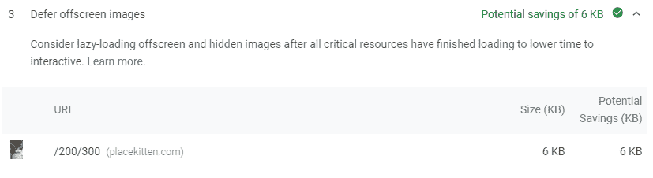
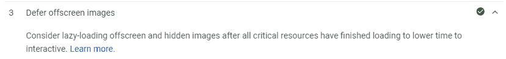

# Web 性能:防止浪费的隐藏图像请求

> 原文：<https://dev.to/swimburger/web-performance-prevent-wasteful-hidden-image-requests-3oif>

几天前，我用 PageSpeed Insights 测试了 swimburger.net 的速度，发现移动设备上的隐藏图像仍在被加载。

[谷歌对此的建议](https://developers.google.com/web/tools/lighthouse/audits/offscreen-images)是延迟加载图片，仅在必要时使用 JavaScript 加载。这在图像由于“在折叠线之下”而不可见的情况下是有意义的，也就是说你需要向下滚动才能看到它们。

PageSpeed 洞察推荐:

[](https://res.cloudinary.com/practicaldev/image/fetch/s--XzsfABTz--/c_limit%2Cf_auto%2Cfl_progressive%2Cq_auto%2Cw_880/https://swimburger.net/media/1097/page-speed-insights-defer-offscreen-images-recommendation.png)

但是在我的例子中，这些图片只是被 CSS 媒体查询永久隐藏了，所以这完全是浪费性能和宝贵的移动互联网数据。对于这个简单的场景来说，延迟加载似乎有点大材小用，所以我没有添加 JavaScript 并使网站更难被索引，而是使用了 **HTML5** 的**图片**和**来源**标签来解决这个问题。

## 为什么浏览器会加载隐藏的图片？

你可能以前写过类似下面的东西，天真地认为浏览器不会在移动设备上加载图片，因为它被 CSS 媒体查询隐藏了。

```
<!DOCTYPE html>
<html>
<head>
  <meta charset="utf-8">
  <meta name="viewport" content="width=device-width">
  <style>
    @media screen and (max-width: 768px){
      img{
        display: none;
      }
    }
  </style>
  Hidden images on mobile optimization
</head>
<body>
  
</body>
</html> 
```

Enter fullscreen mode Exit fullscreen mode

在 [jsbin](https://jsbin.com/lukowas/edit?html,output) 上查看它的运行情况。

即使图像隐藏在手机屏幕宽度上，图像仍然被加载。你可以使用 Chrome 的“网络”标签下的 devtools 来验证这一点。那么为什么浏览器会加载隐藏的图片呢？简单解释:

**浏览器首先解析 HTML，当它遇到外部资源时，就会开始请求它们。在这一点上，CSS 甚至没有被应用。**

当你有隐藏的图片时，顺便说一句，你正在减慢你的页面速度，浪费访问者的移动数据。性能最好的 HTTP 请求是根本不发送的请求。

## 使用普通 HTML5 解决无用的图片请求

HTML5 规范引入了许多新元素，包括**图片**和**源**标签。有了这些标签，你可以提供不同版本的 img。浏览器将根据各种因素决定显示哪个版本，例如:

*   支持图像格式(fe: webp 图像)
*   屏幕分辨率(fe:高分辨率手机和 retina 显示屏将下载更高的分辨率)
*   媒体查询(部分媒体查询支持)

你可以在 Mozilla 的文档中了解更多关于图片元素的信息。

[浏览器支持](https://caniuse.com/#feat=picture):图片元素被除 IE 之外的所有主流浏览器支持。如果不被支持，浏览器简单地退回到使用 img 标签。

利用这些知识，我们可以将图片元素、媒体查询和最小的 base64 数据图像的能力结合起来。

```
<!DOCTYPE html>
<html>
<head>
  <meta charset="utf-8">
  <meta name="viewport" content="width=device-width">
  <style>
    @media screen and (max-width: 768px){
      img{
        display: none;
      }
    }
  </style>
  Hidden images on mobile optimization
</head>
<body>
  <picture>
    <source srcset="data:image/gif;base64,R0lGODlhAQABAAD/ACwAAAAAAQABAAACADs=" media="(max-width: 768px)"> 
    
  </picture>
</body>
</html> 
```

Enter fullscreen mode Exit fullscreen mode

如果视窗宽度小于 768 像素:

*   浏览器将使用替代源，而不是 img src
*   替代源是最小的 base64 数据映像包

前:[https://jsbin.com/lukowas/edit?html,output](https://jsbin.com/lukowas/edit?html,output)
T3】后:[https://jsbin.com/zazoren/edit?html,output](https://jsbin.com/zazoren/edit?html,output)

因此，当浏览器解析 DOM 时，它只加载数据图像，而不是发出另一个 HTTP 请求。

现在 PageSpeed Insights 不再在屏幕外图像上报告:

[](https://res.cloudinary.com/practicaldev/image/fetch/s--aANFXMKv--/c_limit%2Cf_auto%2Cfl_progressive%2Cq_auto%2Cw_880/https://swimburger.net/media/1098/page-speed-insights-defer-offscreen-images-recommendation-after.png)

替代解决方案:

*   使用 CSS 背景图片(不支持搜索引擎优化)
*   使用从您的服务器提供的实际的 1x1 img，这可以产生更小的 HTML(对于非常大量的图像更有性能，[参见 SO 答案](https://stackoverflow.com/a/31534131/2919731)
*   延迟加载(SEO 不太友好，因为它需要 JavaScript)

性能工具:

*   [页面速度洞察](https://developers.google.com/speed/pagespeed/insights/)
*   [灯塔](https://developers.google.com/web/tools/lighthouse/)

如果你知道任何其他优化或如何改进这个解决方案，让我们在评论中讨论:)