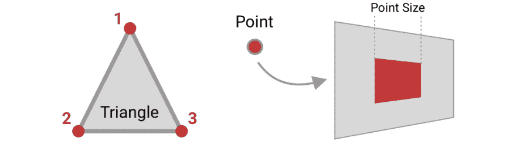

# WebGL 点精灵，教程

> 原文：<https://dev.to/samthor/webgl-point-sprites-a-tutorial-4m6p>

在过去的几天里，我一直在尝试使用 WebGL，这是来自您的浏览器的 OpenGL。就我个人而言，我想建造一些能让我快速显示大量精灵的东西——所以我把基础变成了教程！👨‍🏫

*首先，我要说的是，对于大多数人来说，你想要学习像 [Three 这样的包装器。JS](https://threejs.org/) 或 [PixiJS](http://pixijs.com) 。构建自己的渲染器很有趣，但不是为了完成项目！*😂

如果这没有吓到你，那么继续读下去。👇

# 技巧

如果你想到 OpenGL，你可能会说——嗯，所有东西都是用三角形画的。那个立方体是三角形，那个房子是三角形，那个正方形是三角形。但实际上，我们可以用一个稍微简单一点的方法。😕

OpenGL 允许我们画点，这些点可以被“张贴”到屏幕上。这些点被渲染成面向摄像机的正方形🎥基于固定的“点大小”，如下所示。

[](https://res.cloudinary.com/practicaldev/image/fetch/s--Gw3K49ge--/c_limit%2Cf_auto%2Cfl_progressive%2Cq_auto%2Cw_880/https://thepracticaldev.s3.amazonaws.com/i/jmzvzpoxee5mhfxbpqbp.png)

所以记住方法，让我们开始吧！🌈

# 教程

## 第 0 步:获取渲染上下文

第零步！创建画布并获取其上下文:

```
// create Canvas element, or you could grab it from DOM
const canvas = document.createElement('canvas');
document.body.appendChild(canvas);

// optional: set width/height, default is 300/150
canvas.width = 640;
canvas.height = 480;

// retrieve WebGLRenderingContext
const gl = canvas.getContext('webgl') || canvas.getContext('experimental-webgl'); 
```

这是类型`WebGLRenderingContext`，你可以[在 MDN](https://developer.mozilla.org/en-US/docs/Web/API/WebGLRenderingContext) 上查找。IE 和 Edge 我们需要退而求其次`experimental-webgl`。

## 第一步:创建着色器程序

### 暂且不提

OpenGL 中的一切都是由一个着色器程序绘制的，该程序由一个顶点和片段着色器组成。着色器是在图形卡上编译和运行的类似 C 的小程序。

顶点着色器让我们告诉 OpenGL 要画什么，以及在哪里画(输出是 3D 空间中的“点”)。片段着色器对实际放在屏幕上的每个像素运行一次，并允许您指定颜色。

众所周知，着色器很难调试。有几个工具，但是我真诚地建议只做一些小的改变，这样当你破坏它们的时候你就可以看到了。💥

### 顶点着色器

让我们创建一个包含顶点着色器源代码的变量，它将东西放在我们正在渲染的“屏幕”上。💻

```
const vertexShaderSource = `
attribute vec2 spritePosition;  // position of sprite
uniform vec2 screenSize;        // width/height of screen

void main() {
  vec4 screenTransform = 
      vec4(2.0 / screenSize.x, -2.0 / screenSize.y, -1.0, 1.0);
  gl_Position =
      vec4(spritePosition * screenTransform.xy + screenTransform.zw, 0.0, 1.0);
  gl_PointSize = 64.0;
}
`; 
```

这是在做什么？🤔

1.  我们正在描述`spritePosition`，它是一个**属性**——这意味着，每次我们运行这个程序时，它都是唯一的。这是绘制每个精灵的位置。

2.  还有`screenSize`，这是一套**制服**——这是整个节目中独一无二的。

3.  为了设置`gl_Position`，我们创建了一个`screenTransform`值。这是因为在 OpenGL 中，屏幕的默认“尺寸”是 2.0 宽和 2.0 高。这基本上是说，如果我们给定一个位置(200，100)，那么这实际上是在屏幕上的一个分数位置。我们把这个写到`gl_Position`，它有四个值(不要问)，但是前三个是 X、Y 和 Z:因为我们在画精灵，所以把 Z 留为零。

4.  最后，我们将`gl_PointSize`设置为 64。这是我们点的绘图大小，我在这篇文章的开头提到过。🔳

⚠️无论何时看到`gl_`，这都是 WebGL 内部的一部分。这些通常是顶点着色器的输出，片段着色器的输入。

### 片段着色器

片段着色器将在稍后应用纹理，因为它为每个绘制的像素运行。现在，让我们把它画成纯色，这样我们就知道它在工作。🔴

```
const fragmentShaderSource = `
void main() {
  gl_FragColor = vec4(1.0, 0.0, 0.0, 1.0);
}
`; 
```

⚠️在 OpenGL 中，我们将颜色指定为四个浮点数的向量。这与您从 CSS/HTML 中了解到的相匹配:红色、绿色、蓝色和 alpha 有一个值。

## 第二步:编译着色器程序

现在我们有了源代码，有几个步骤来编译它。这两种类型的着色器编译方式相同，因此添加一个辅助器来编译它们:🗜️

```
function loadShader(gl, type, source) {
  const shader = gl.createShader(type);
  gl.shaderSource(shader, source);
  gl.compileShader(shader);

  const status = gl.getShaderParameter(shader, gl.COMPILE_STATUS);
  if (!status) {
    throw new TypeError(`couldn't compile shader:\n${gl.getShaderInfoLog(shader)}`);
  }
  return shader;
} 
```

现在，使用它来实例化顶点和片段着色器:

```
const vertexShader = loadShader(gl, gl.VERTEX_SHADER, vertexShaderSource);
const fragmentShader = loadShader(gl, gl.FRAGMENT_SHADER, fragmentShaderSource); 
```

最后，构建整个程序:⚒️

```
const shaderProgram = gl.createProgram();
gl.attachShader(shaderProgram, vertexShader);
gl.attachShader(shaderProgram, fragmentShader);
gl.linkProgram(shaderProgram);

const status = gl.getProgramParameter(shaderProgram, gl.LINK_STATUS);
if (!status) {
  throw new TypeError(`couldn't link shader program:\n${gl.getProgramInfoLog(shaderProgram)}`);
} 
```

您现在应该重新加载页面以确保没有任何错误，但是您还看不到任何输出。🙅

## 第三步:上传变量

我们现在有了一个准备在`shaderProgram`变量中运行的程序。但是，我们需要告诉它画什么。🤔💭

首先，让我们做简单的部分——上传之前的屏幕尺寸。我们需要查找 OpenGL 分配给变量的位置，并在那里写入宽度和高度:

```
gl.useProgram(shaderProgram);
gl.uniform2f(gl.getUniformLocation(shaderProgram, 'screenSize'), canvas.width, canvas.height); 
```

困难的部分是告诉 OpenGL 绘制大量的精灵。现在，我们只画一个。我们创建一个*本地* `Float32Array`(一个[类型化数组](https://developer.mozilla.org/en-US/docs/Web/JavaScript/Reference/Global_Objects/TypedArray)，并上传到 OpenGL:

```
const array = new Float32Array(1000);  // allow for 500 sprites
array[0] = 128;  // x-value
array[1] = 128;  // y-value

const glBuffer = gl.createBuffer();
gl.bindBuffer(gl.ARRAY_BUFFER, glBuffer);
gl.bufferData(gl.ARRAY_BUFFER, array, gl.DYNAMIC_DRAW);  // upload data 
```

⚠️:如果你改变了缓冲区，你需要重新上传。

我们已经创建并上传了一个缓冲区，但是没有告诉我们的程序在哪里可以找到它。这就像在上面写我们的`screenSize`,但是因为它是一个完整的数组，所以有点棘手:

```
const loc = gl.getAttribLocation(shaderProgram, 'spritePosition');
gl.enableVertexAttribArray(loc);
gl.vertexAttribPointer(loc,
    2,  // because it was a vec2
    gl.FLOAT,  // vec2 contains floats
    false,  // ignored
    0,   // each value is next to each other
    0);  // starts at start of array 
```

太好了！我们快到了。

## 第四步:画！

这是最激动人心的一步！现在我们可以跑着画点东西了。🏃💨

让我们添加一个绘制方法(因为您以后可能希望在每一帧都调用它):

```
function draw() {
  gl.clear(gl.COLOR_BUFFER_BIT);   // clear screen
  gl.useProgram(shaderProgram);    // activate our program
  gl.drawArrays(gl.POINTS, 0, 1);  // run our program by drawing points (one for now)
}
draw(); 
```

您应该会看到类似这样的内容:🎉

[https://codepen.io/samthor/embed/VgMzbr?height=600&default-tab=result&embed-version=2](https://codepen.io/samthor/embed/VgMzbr?height=600&default-tab=result&embed-version=2)

这很棒，但只是一个红色方块。让我们添加一些纹理。👩‍🎨

## 第五步:查看纹理

首先，让我们给页面的 HTML 添加一个``标签。这是一种引入将被 OpenGL 使用的图像的懒惰方式——它甚至更懒惰，因为图像只是以 base64 编码的:

```
 
```

现在，我们需要对 JavaScript 进行一些修改。首先，让我们替换之前的片段着色器。请记住，这是为每个像素运行的代码，因此我们可以告诉它为每个位置绘制正确的颜色:🎯

```
const fragmentShaderSource = `
uniform sampler2D spriteTexture;  // texture we are drawing

void main() {
  gl_FragColor = texture2D(spriteTexture, gl_PointCoord);
}
`; 
```

`gl_PointCoord`是为我们提供的一个变量，它指定了我们要渲染的 64 像素正方形的位置。我们用它来索引纹理以确定颜色。📇

最后，在调用`draw()`之前，添加以下代码，将图像上传到 OpenGL:

```
const icon = document.getElementById('icon');  // get the  tag

const glTexture = gl.createTexture();
gl.activeTexture(gl.TEXTURE0);  // this is the 0th texture
gl.bindTexture(gl.TEXTURE_2D, glTexture);

// actually upload bytes
gl.texImage2D(gl.TEXTURE_2D, 0, gl.RGBA, gl.RGBA, gl.UNSIGNED_BYTE, icon);

// generates a version for different resolutions, needed to draw
gl.generateMipmap(gl.TEXTURE_2D); 
```

现在刷新和检查你的惊人的形象！👏

[https://codepen.io/samthor/embed/Noaaep?height=600&default-tab=result&embed-version=2](https://codepen.io/samthor/embed/Noaaep?height=600&default-tab=result&embed-version=2)

实际上，我们在这里有点作弊😊。因为这是我们创建的第一个纹理，我们不需要设置`spriteTexture`制服——它只是有一个合理的默认值 0，与之前上传的 0️⃣th 纹理相匹配。如果你想写这个值，它应该是这样的:

```
gl.uniform2f(gl.getUniformLocation(shaderProgram, 'spriteTexture'), 0); 
```

## 第六步:临时演员

上面的演示有两个额外的部分:

1.  如果你点击画布，我们将添加一个额外的精灵，并重新绘制场景。看一看找到代码！🔍

2.  我们设置了一个混合模式，这样纹理的透明部分就不会呈现为纯白的⬜.我们只是在`draw()`调用之前设置这个:

```
gl.enable(gl.BLEND);
gl.blendFunc(gl.SRC_ALPHA, gl.ONE_MINUS_SRC_ALPHA); 
```

您可能会注意到，在其他精灵的顶部创建精灵会导致边缘发生冲突。不幸的是，用 OpenGL 解决这个问题并不简单，而且肯定超出了本教程的范围。😢

# 搞定

我们完了！或者你浏览到最后。两个都好👌

这是一个非常具体的关于用 OpenGL 绘制精灵的教程。如果你像我一样，你现在非常兴奋😆关于编写助手——比如移动精灵、制作动画、渲染多种纹理的工具。🏗️

不管怎样，我希望你喜欢这篇文章，如果你想知道更多，请告诉我！仅仅基于这个简单的方法，精灵还有很多工作要做——旋转、移动、动画。

〈希莫丝〉