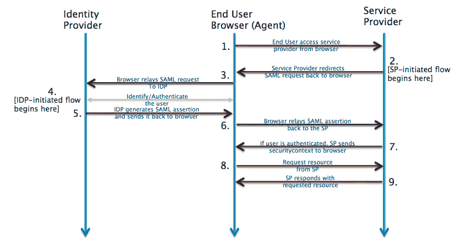
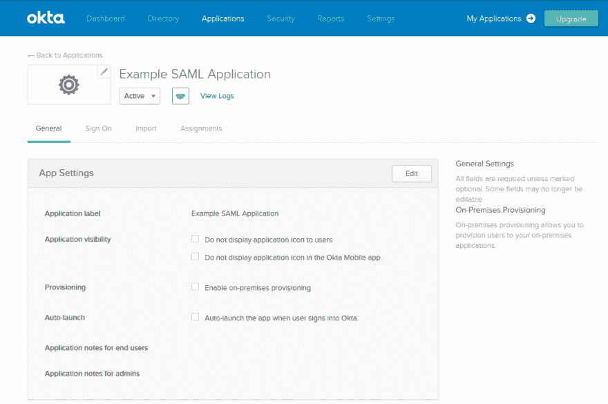
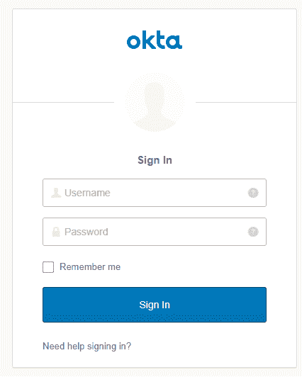

# webMethods 第三方身份提供者的单点登录

> 原文：<https://dev.to/tpetrov9/webmethods-single-sign-on-with-a-third-party-identity-provider-3d2i>

# 以秋田为例

越来越多的公司依赖第三方提供商进行身份管理和认证。好处包括更好地防止数据泄露，以及在应用程序之间切换时的无缝用户体验。我的 webMethods 服务器(MWS)还提供了对集成第三方身份提供者的支持。

## **为什么要单点登录(SSO)？**

SSO 让我们可以方便地登录一次，访问来自不同供应商、托管在不同环境中的多个应用程序。随着企业的应用程序环境变得越来越复杂，这种便利性成为一个必备的特性。

## **使用第三方身份提供商**

第三方身份提供商(IDP)提供用户身份和登录功能来验证用户。一旦验证了登录，用户就被转发到所请求的应用程序，也称为服务提供商(SP)。身份和服务提供者之间的通信通过安全断言标记语言(SAML)协议进行。

## **IDP 发起的与 SP 发起的登录**

您可以通过浏览以下网址登录到单一登录服务:

*   应用程序-这称为服务提供商发起的(SP 发起的)登录
*   身份提供商–这称为身份提供商发起的(IDP 发起的)登录

从版本 10.3 开始，我的 webMethods 服务器只支持 IDP 启动的登录(参见第 4 点)。

## **设置 MWS**

使用第三方 IDP 为 SSO 设置 MWS 可以分三步完成。

1.  确保为 HTTPS 通信设置了 MWS，因为身份验证使用 SSL 证书
2.  通过修改 websso.properties 文件，向 MWS 提供 IDP 的地址
3.  将 IDP 的证书导入 MWS 信任库

重新启动 MWS 服务器后，该设置将变为活动状态。您可以通过 OKTA 创建一个演示 IDP 帐户来测试配置。

## **创建 OKTA 开发者账号**

OKTA 提供了一个免费的开发者账号，可以设置为 SSO 到 MWS。创建一个 SAML web 应用程序并提供 MWS 连接的详细信息。创建应用程序后，记下嵌入链接的 URL。

## **试用一下**

要测试 IDP 启动的 MWS 登录，只需打开浏览器窗口，输入 OKTA 应用程序中的嵌入 URL 链接。

成功登录后，OKTA 会将您重定向到 MWS 起始页，因为您已经登录。

## **总之**

这些简单的步骤使得将 MWS 纳入您的单点登录环境变得非常容易。该过程也可用于实施其他第三方 IDP，如微软 ADFS 公司。技术实现细节可以在 Software AG 文档网站上的“管理我的 webMethods 服务器”中找到。

**资源**

为 SAML SSO 配置 MWS-10-3 _ administrating _ My _ web methods _ server . pdf:Page 297-配置使用第三方身份提供者的单点登录
[http://tech community . software ag . com/ecosystem/documentation/web methods/myweb methods _ server/MWS 10-3/10-3 _ administrating _ My _ web methods _ server . pdf](http://techcommunity.softwareag.com/ecosystem/documentation/webmethods/mywebmethods_server/mws10-3/10-3_Administering_My_Webmethods_Server.pdf)

使用第三方身份提供者实现 webMethods 单点登录-OKTA-[http://tech community . software ag . com/pwiki/-/wiki/Main/Implementing+web methods+Single+Sign+On+with+a+第三方+身份+提供者+-+OKTA](http://techcommunity.softwareag.com/pwiki/-/wiki/Main/Implementing+webMethods+Single+Sign+On+with+a+Third-party+Identity+Provider+-+OKTA)

在 OKTA-[https://developer . OKTA . com/standards/SAML/setting _ up _ a _ SAML _ application _ in _ OKTA](https://developer.okta.com/standards/SAML/setting_up_a_saml_application_in_okta)中设置示例应用程序

关于 SAML-[https://www.okta.com/integrate/documentation/saml/](https://www.okta.com/integrate/documentation/saml/)的信息