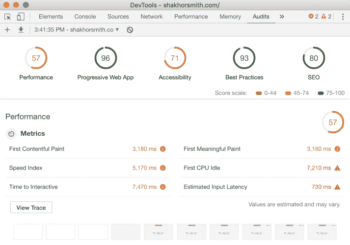

# V2 网站重新设计

> 原文：<https://dev.to/smithmanny/website-redesign-v2-3ah9>

随着 2018 年即将结束，我能够在感恩节假期发布我网站的 V2。巧合的是，这也是我作为开发人员的第二年，所以我将能够让这些版本与我多年的经验保持同步。有什么新鲜事？一切！V2 被彻底重新设计，并从塔尼亚·拉西亚那里获得了一点设计灵感。我从使用 create-react-app 切换到了 Gatsby。这种转变的原因是通过 Markdown 文件将我的博客保存在 Github 上，同时利用盖茨比超快的 SSR 速度。正如你从下面的结果中看到的，我能够在灯塔测试中增加每个区域。

[T6】](https://res.cloudinary.com/practicaldev/image/fetch/s--ke-8gO2Y--/c_limit%2Cf_auto%2Cfl_progressive%2Cq_auto%2Cw_880/https://res.cloudinary.com/smithmanny/image/upload/c_scale%2Cf_auto%2Ch_500%2Cq_auto:best/v1542907305/new-site-performance_d2ixpo.png)

随着我的网站的这个版本的发布，我想通过将博客帖子放在前面和中心，将重点从更多地了解我转移到更多地了解编程。有了这个改变，人们会立即关注我的新博客文章，并且能够在访问我的网站的最初几秒钟内学到一些新东西。

我做的另一个小改动是配色方案。我仍然不完全满意我的配色方案，但我想去迈阿密海豚的主题。我原本计划在发布这个网站时选择亮暗主题，但由于 styled-components 和 Gatsby 的一个 bug，我推迟了这个功能，直到另行通知。好奇我还用什么建立了这个网站？让我们看看:

*   盖茨比（姓）
*   托管和 DNS: Netlify
*   CSS:样式化组件
*   分析:谷歌分析(寻找免费的替代品🤔)
*   博客:Github 上托管的降价文件
*   图标:字体真棒