# 网站一直在加载，加载，加载…

> 原文：<https://dev.to/dougsillars/websites-that-keep-loading-and-loading-and-loading-4a2p>

你有没有想过把手机上的浏览器最小化会发生什么？网站停止加载了吗？如果网站有一个周期性的 ping，用于分析、广告或其他过程，会发生什么？在移动电话上，这可能会导致数据使用过量——这在计量连接上可能是昂贵的。

在使用蜂窝网络的移动设备上，由于无线电资源控制状态机，无线电不会立即关闭(阅读[维基百科文章](https://en.wikipedia.org/wiki/Radio_Resource_Control)或观看几年前我在& T 时制作的[视频](https://www.youtube.com/watch?v=4baYdgBBgFs))。如果网站一直 ping 服务器，无线电就无法关闭，这可能会导致电池过度消耗。

那么，当我测试网站时，我看到了什么？我将我的诺基亚 2018 (Android 9.0)连接到我的电脑上，并使用 Mac 上的 Chrome inspector 观看了页面加载过程。我录下了 Mac 电脑的屏幕，以便稍后跟进。大约 15-30 秒后，页面被加载，我按下了设备上的“home”按钮，根据 devTools 的说法，使页面“不活动”。内容继续被请求并传送到设备。

由于我没有与手机互动，手机屏幕会在一分钟后关闭。内容仍然继续被传送到设备。

从浏览器变为非活动状态起五分钟后，下载将停止。我不确定这是 Chrome、Android 操作系统中的定时器，还是诺基亚的配置。但是，我可以为四个不同的网站重现这个时间，每个网站都有不同的重复 ping/下载:

### 例 1:网站查询谷歌表单

这个网站加载，然后每秒查询一个谷歌电子表格的信息:

一分钟内，已经有 213 个请求(浏览器已经最小化 30 秒)

在时间= 5 分钟时，又发出了 247 个请求(700KB ):

[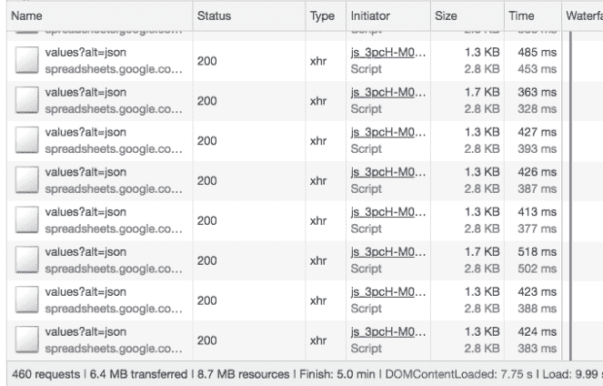](https://res.cloudinary.com/practicaldev/image/fetch/s--_XKH3CAA--/c_limit%2Cf_auto%2Cfl_progressive%2Cq_auto%2Cw_880/https://cdn-images-1.medium.com/max/663/0%2AnPxelV6QLEXgeVnc)

### 例 2:推车“我们到了吗”

该应用程序为其购物车使用了第三方插件。它通过每秒左右查询一次来跟踪购物车中的内容。

[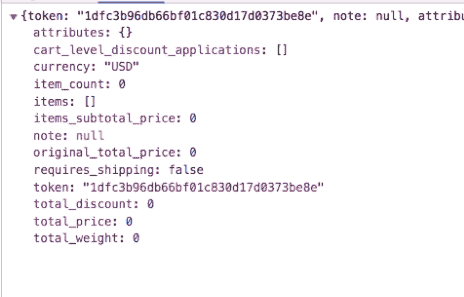](https://res.cloudinary.com/practicaldev/image/fetch/s--iO_gMHnS--/c_limit%2Cf_auto%2Cfl_progressive%2Cq_auto%2Cw_880/https://cdn-images-1.medium.com/max/464/0%2A3N1t-CUbdNjpm41C)

当浏览器在 t = 30s 秒最小化时，购物车已经在 ping:

[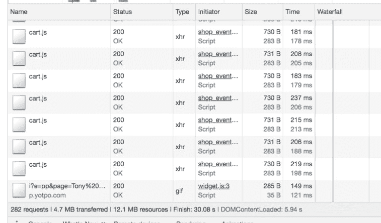](https://res.cloudinary.com/practicaldev/image/fetch/s--k2QyK_SO--/c_limit%2Cf_auto%2Cfl_progressive%2Cq_auto%2Cw_880/https://cdn-images-1.medium.com/max/757/0%2A2PbnMPK-jnTKdIgc)

并且在时间=6 分钟时(444 个请求和 900 KB 之后):

[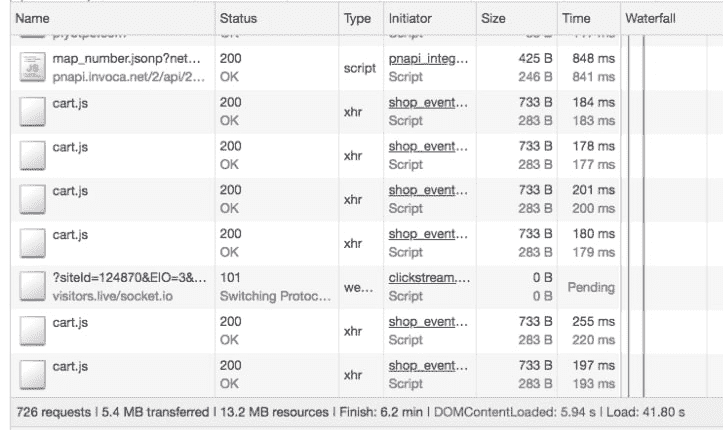](https://res.cloudinary.com/practicaldev/image/fetch/s--BapPMNVU--/c_limit%2Cf_auto%2Cfl_progressive%2Cq_auto%2Cw_880/https://cdn-images-1.medium.com/max/723/0%2AVIaC9DWJz1WtnbD1)

5 分钟内，同样的购物车信息被一遍又一遍地传送。

### 例 3:没有，还是找不到:

这个例子有点疯狂，但是构建这个页面的框架确实想要一个不存在的文件。在 5 分钟内，浏览器持续请求一个并不存在的文件:

[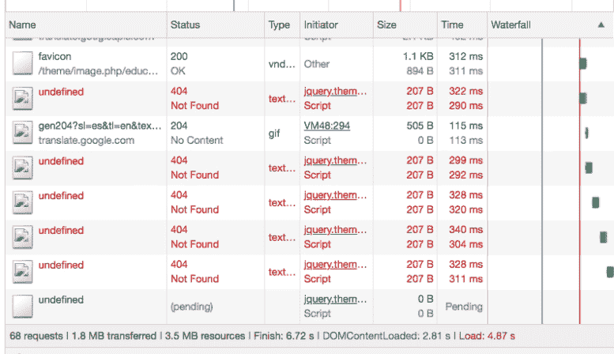](https://res.cloudinary.com/practicaldev/image/fetch/s--3vptQxRI--/c_limit%2Cf_auto%2Cfl_progressive%2Cq_auto%2Cw_880/https://cdn-images-1.medium.com/max/777/0%2ALlrkmFiy26MPFVWN)

[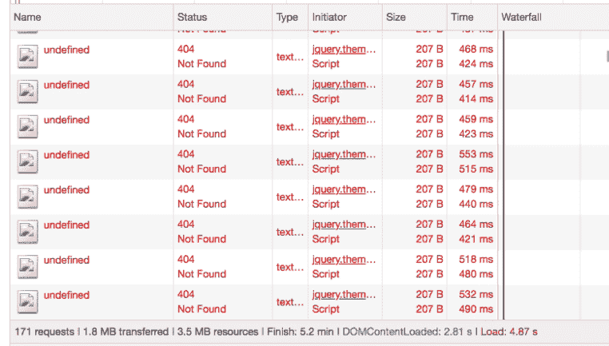](https://res.cloudinary.com/practicaldev/image/fetch/s--9Y6Mm60Q--/c_limit%2Cf_auto%2Cfl_progressive%2Cq_auto%2Cw_880/https://cdn-images-1.medium.com/max/762/0%2APIaUO4DODbykECQt)

在这种情况下，有 103 404 个请求(框架似乎为每个失败的请求添加了一个回退延迟)。虽然数据使用量微不足道，但电池使用量将与其他示例相同。

### 例 4:聊天机器人

这是我最讨厌的事情之一。我不太喜欢网络聊天机器人。但是，它们似乎真的很受欢迎:

这些是做什么的？正如你所想象的，这个聊天机器人定期向服务器发送 pings 命令，让服务器知道是否有代理可用，以及聊天是否已经开始。第二次 ping 会给出 ping 之间的时间间隔(并为下一次 ping 设置延迟):

[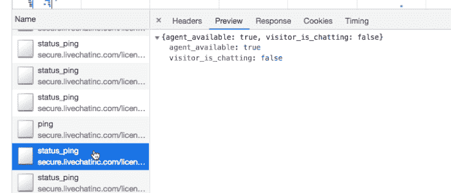](https://res.cloudinary.com/practicaldev/image/fetch/s--lZ4ORbYo--/c_limit%2Cf_auto%2Cfl_progressive%2Cq_auto%2Cw_880/https://cdn-images-1.medium.com/max/736/0%2A7Un5ToU2VlSZS1qV)

[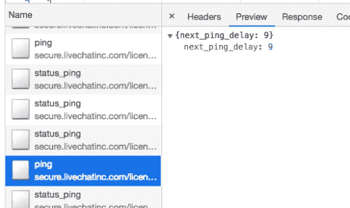](https://res.cloudinary.com/practicaldev/image/fetch/s--CQYipcni--/c_limit%2Cf_auto%2Cfl_progressive%2Cq_auto%2Cw_880/https://cdn-images-1.medium.com/max/503/0%2AGmZ0374OCa7GncnY)

据我所知，这种 ping 延迟并没有实现 ping 实际上并没有变慢。如果没有代理可用，pings 的数量也没有任何不同。

[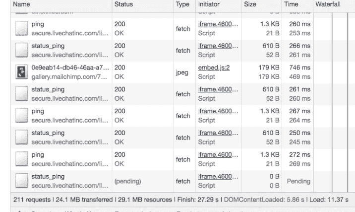](https://res.cloudinary.com/practicaldev/image/fetch/s--2xBj_dYQ--/c_limit%2Cf_auto%2Cfl_progressive%2Cq_auto%2Cw_880/https://cdn-images-1.medium.com/max/716/0%2ATt1doV5RdIU25eOV)

[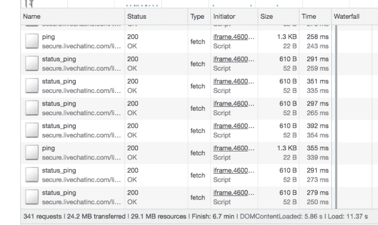](https://res.cloudinary.com/practicaldev/image/fetch/s--AU2iUXEp--/c_limit%2Cf_auto%2Cfl_progressive%2Cq_auto%2Cw_880/https://cdn-images-1.medium.com/max/742/0%2AJZOUn3eQBgLfgIqh)

在 5 分钟内，仅使用 100 KB 的数据就发出了 130 个请求。平均每 2.3 秒连接一次，蜂窝无线电不太可能关闭。

### 数据包捕获:

Twitter 上的一条评论证实了一个怀疑:如果 devtools 连接以某种方式干扰并允许浏览器继续通信会怎么样？

我用手机上的本地 pcap 捕获应用程序进行了测试，在最小化浏览器后，我仍然看到数据包传输了 5 分钟。这是 404 网站，在我最小化浏览器大约 4 分钟后:

[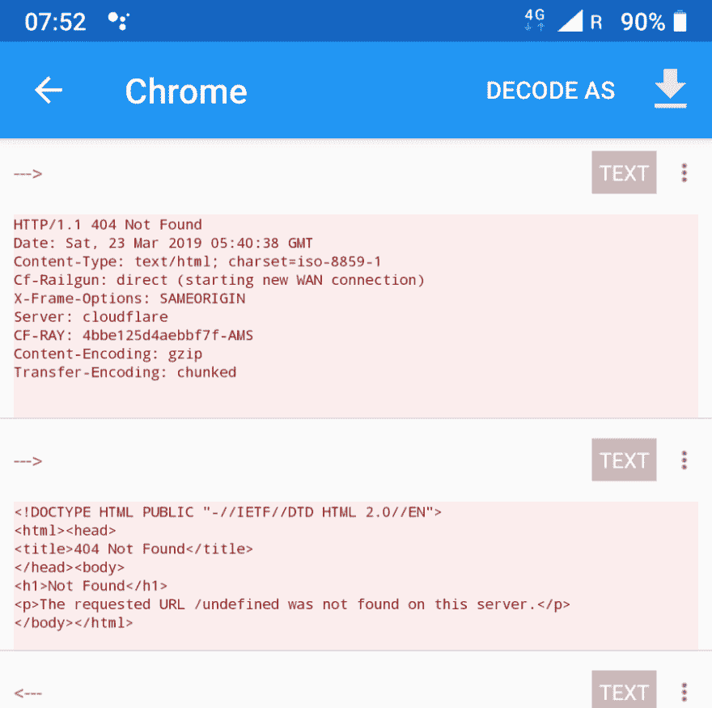](https://res.cloudinary.com/practicaldev/image/fetch/s--UnbII02A--/c_limit%2Cf_auto%2Cfl_progressive%2Cq_auto%2Cw_880/https://cdn-images-1.medium.com/max/900/0%2AVVstPly4pA66HLWk)

### 电池历史学家:

在另一次尝试中，我想知道为什么收音机会多开 5 分钟，我相信电池历史学家提供了最好的解释。在这项研究中，我在 Chrome 中加载了聊天网站，一旦 Chrome 被后台化，屏幕就允许睡着。浏览器关闭大约 5 分钟后，Android Doze 框架(黄线)开始运行:

[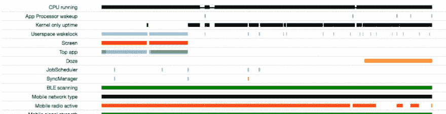](https://res.cloudinary.com/practicaldev/image/fetch/s--fKJsaV7a--/c_limit%2Cf_auto%2Cfl_progressive%2Cq_auto%2Cw_880/https://cdn-images-1.medium.com/max/900/0%2AqSxcfU_L8RrTJTTf)

在图表的底部，移动无线电活动线路几乎保持不变，直到 Doze 框架启动，也可以看到 devTools 和 Packet Capture。

为了比较移动网络的其他使用方式，这里有一个后台电池历史记录跟踪(屏幕关闭):

[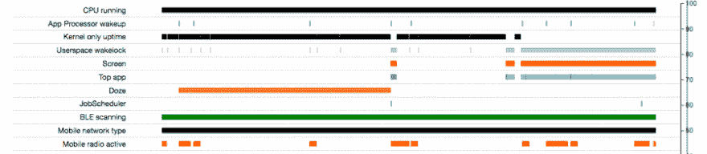](https://res.cloudinary.com/practicaldev/image/fetch/s--K0FHSW3_--/c_limit%2Cf_auto%2Cfl_progressive%2Cq_auto%2Cw_880/https://cdn-images-1.medium.com/max/900/0%2AHy3zUZTfsjF7aqtz)

有一些移动无线电的使用，但远不如浏览器关闭后。

### 禁用瞌睡:

可以为单个应用禁用 Doze 框架(警告电池消耗可能会增加)。我禁用了 Chrome 的 Doze，并在访问 chatbot 页面后重新运行了电池历史记录，无线电仍然保持打开 5 分钟，尽管 Doze 没有启动。收音机不会停留超过 5 分钟——这表明 Chrome 中可能也有类似 Doze 的计时器。

[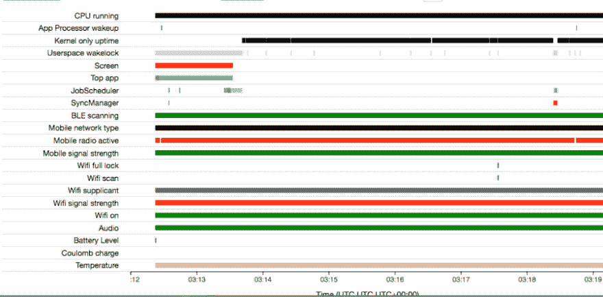](https://res.cloudinary.com/practicaldev/image/fetch/s--L8gkogp4--/c_limit%2Cf_auto%2Cfl_progressive%2Cq_auto%2Cw_880/https://cdn-images-1.medium.com/max/900/0%2Ady9P8mQcrVt4WCcW)

### 结论:

不断 pings 服务器的网站(或第三方内容)将不允许蜂窝无线电关闭，并可能导致电池耗尽。在这篇文章中，我展示了 4 种不同的场景，在手机上最小化页面后，我的 Android 设备继续下载内容 5 分钟。根据电池历史数据，5 分钟计时器不是 Android 中的 Doze 框架(因为它在启用或不启用 Doze 的情况下发生)。

这使得看起来好像浏览器有一个 5 分钟的数据传输计时器，即使在页面最小化之后。对于移动设备来说，这似乎是一段很长的时间——即使在页面加载完成后，也会消耗大量的电池和数据。

*原载于 2019 年 3 月 22 日*[*【dougsillars.com】*](https://dougsillars.com/2019/03/22/websites-that-keep-loading-and-loading-and-loading/)*。*

* * *