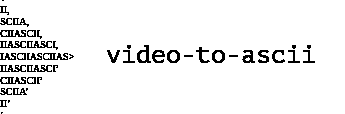
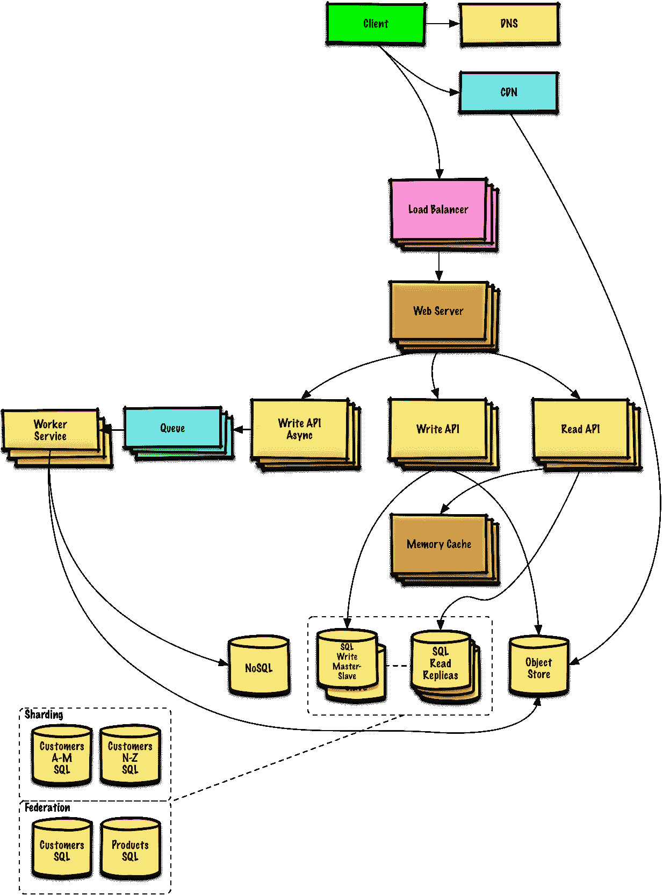
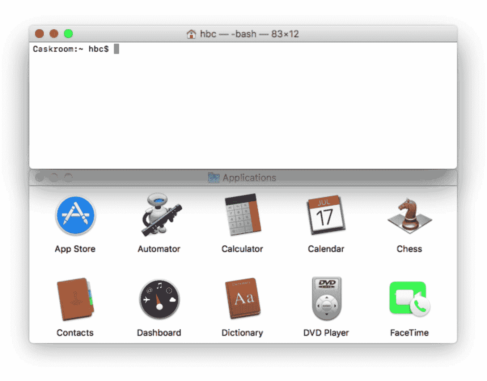

# GitHub 上的每周趋势库(2002 年 12 月~ 2008 年 12 月)

> 原文：<https://dev.to/issuehunt/weekly-trending-repositories-on-github-dec02--dec08-448>

*   计算机编程语言
*   迅速发生的
*   服务器端编程语言（Professional Hypertext Preprocessor 的缩写）
*   红宝石
*   Java 语言(一种计算机语言，尤用于创建网站)
*   java 描述语言

* * *

# 巨蟒

### [【satwikkasal/wtfpython】](https://github.com/satwikkansal/wtfpython)

一系列令人惊讶的 Python 片段和鲜为人知的特性。

### [谷歌/ jax](https://github.com/google/jax)

GPU 和 TPU 支持的 NumPy，具有差异性和 JIT 编译。

### [openined/PySyft](https://github.com/OpenMined/PySyft)

一个用于加密、保护隐私的深度学习的库

### [t1](#delgan-loguru)[子节点/日志](https://github.com/Delgan/loguru)

Python 日志使(愚蠢的)简单

### [张量流/模型](https://github.com/tensorflow/models)

用 TensorFlow 构建的模型和示例

### [joelibaceta /视频转 ascii](https://github.com/joelibaceta/video-to-ascii)

这是一个简单的 python 包，使用字符作为像素在终端中播放视频

### [谷歌研究/伯特](https://github.com/google-research/bert)

用于 BERT 的 TensorFlow 代码和预训练模型

### [张量流/排名](https://github.com/tensorflow/ranking)

学习在 TensorFlow 中排名

### [toddmotto/public-API](https://github.com/toddmotto/public-apis)

用于软件和 web 开发的免费 API 集合列表。

### [唐纳马丁/系统-设计-初级读本](https://github.com/donnemartin/system-design-primer)

学习如何设计大型系统。准备系统设计面试。包括 Anki 抽认卡。

# 雨燕

### [point freeco/swift-snapshot-testing](https://github.com/pointfreeco/swift-snapshot-testing)

📸令人愉快的快速快照测试。

### [伊万沃罗贝/ SPStorkController](https://github.com/IvanVorobei/SPStorkController)

邮件或 Apple music 应用程序中的模式控制器

### [里努苏/提线木偶](https://github.com/LinusU/Marionette)

Swift 库，提供高级 API 来控制 WKWebView

### [【LHC 70000/IIA】](https://github.com/lhc70000/iina)

macOS 的现代视频播放器。

### [ramo tion/swift-ui-animation-components-and-libraries](https://github.com/Ramotion/swift-ui-animation-components-and-libraries)

@ ramo tion-[https://dev.ramotion.com/gthbr](https://dev.ramotion.com/gthbr)的 Swift UI 库、组件和动画

### [MobileTipsters/Swift-Daily-Tips](https://github.com/MobileTipsters/Swift-Daily-Tips)

来自 Swift World 的每日提示

### [t1](#cuberto-flashytabbar)[古巴人/闪卡](https://github.com/Cuberto/flashy-tabbar)

另一个漂亮的动画 tabbar

### [【vsouza/awesome-IOs】](https://github.com/vsouza/awesome-ios)

令人敬畏的 iOS 生态系统的精选列表，包括 Objective-C 和 Swift 项目

### [【kboy-silvergym/snapliquillectionview】](https://github.com/kboy-silvergym/SnapLikeCollectionView)

collectionView 库，可以像 Snapchat 和 Instagram 一样舒适地缩放、滚动和停止。

### [约翰科茨/天线](https://github.com/JohnCoates/Aerial)

苹果电视空中屏幕保护程序

# PHP

### [beyond code/laravel-web sockets](https://github.com/beyondcode/laravel-websockets)

Laravel 的 Websockets。做得好。

### [easy Chen/Tumblr-like-exporter](https://github.com/easychen/tumblr-like-exporter)

下载你喜欢的或者别人喜欢的 tumblr 照片。甚至是你博客中的图片。它现在支持视频，请参阅自述文件来启用它

### [拉勒维尔/拉勒维尔](https://github.com/laravel/laravel)

一个面向网络工匠的 PHP 框架

### [丹尼尔·米斯勒/塞克利斯](https://github.com/danielmiessler/SecLists)

SecLists 是安全测试人员的伴侣。它是安全评估期间使用的多种类型列表的集合，集中在一个位置。列表类型包括用户名、密码、URL、敏感数据模式、模糊负载、web 外壳等等。

### [laravel /框架](https://github.com/laravel/framework)

### [walker/shadow socks-PHP](https://github.com/walkor/shadowsocks-php)

基于 workerman 的 shadowsocks 移植。一个用 PHP 写的 socks5 代理。

### [合同/合同](https://github.com/symfony/contracts)

从 Symfony 组件中提取的一组抽象

### [作曲家/作曲](https://github.com/composer/composer)

PHP 依赖管理器

### [【Ralph/getallheaders】](https://github.com/ralouphie/getallheaders)

PHP getallheaders polyfill

### [fzaninotto / Faker](https://github.com/fzaninotto/Faker)

Faker 是一个 PHP 库，为你生成假数据

# 红宝石

### [家酿/酿造](https://github.com/Homebrew/brew)

🍺macOS 缺失的软件包管理器

### [rapid 7/metasploit-framework](https://github.com/rapid7/metasploit-framework)

Metasploit 框架

### [杰基尔/杰基尔](https://github.com/jekyll/jekyll)

🌐Jekyll 是 Ruby 中一个支持博客的静态站点生成器

### [tootsuite /乳齿象](https://github.com/tootsuite/mastodon)

你的自我托管，全球互联的微博社区

### [铁轨/铁轨](https://github.com/rails/rails)

Ruby on Rails

### [话语/话语](https://github.com/discourse/discourse)

社区讨论的平台。免费，开放，简单。

### [快车道/快车道](https://github.com/fastlane/fastlane)

🚀自动化构建和发布 iOS 和 Android 应用的最简单方法

### [家酿/家酿桶](https://github.com/Homebrew/homebrew-cask)

🍻用于管理作为二进制文件分发的 macOS 应用程序的 CLI 工作流

### [github /探索](https://github.com/github/explore)

GitHub 上由社区策划的主题页面

### 

程序员在这里分享想法，互相帮助成长

# Java

### [弹簧项目/弹簧启动](https://github.com/spring-projects/spring-boot)

Spring Boot

### [iluwatar/Java-design-patterns](https://github.com/iluwatar/java-design-patterns)

用 Java 实现的设计模式

### [eugenp /教程](https://github.com/eugenp/tutorials)

“春天休息”课程:

### [阿帕奇/孵化器-杜博](https://github.com/apache/incubator-dubbo)

Apache Dubbo(孵化)是一个高性能、基于 java 的开源 RPC 框架。

### [交叉杰/ JCSprout](https://github.com/crossoverJie/JCSprout)

👨‍🎓Java 核心萌芽:基本、并发、算法

### [spring-项目/spring-框架](https://github.com/spring-projects/spring-framework)

弹簧框架

### [弹力/弹力搜索](https://github.com/elastic/elasticsearch)

开源、分布式、RESTful 搜索引擎

### [算法/ Java](https://github.com/TheAlgorithms/Java)

所有算法都用 Java 实现

### [春云孵化器/春云阿里巴巴](https://github.com/spring-cloud-incubator/spring-cloud-alibaba)

春云阿里巴巴为阿里巴巴中间件的分布式解决方案提供应用开发一站式解决方案。

### [谷歌/番石榴](https://github.com/google/guava)

Google Java 核心库

# Javascript

### [盖亚龙/反应过度. io](https://github.com/gaearon/overreacted.io)

丹·阿布拉莫夫的个人博客。

### [弗拉多卡/截图员](https://github.com/vladocar/screenshoteer)

从命令行制作网站截图和移动仿真。

### [【mrrio/jspdf】](https://github.com/MrRio/jsPDF)

面向所有人的客户端 JavaScript PDF 生成。

### [pim-book /程序员-数学入门](https://github.com/pim-book/programmers-introduction-to-mathematics)

程序员数学入门代码

### [【vuej/vista】](https://github.com/vuejs/vue)

🖖是一个渐进的、可增量采用的 JavaScript 框架，用于在 web 上构建 UI。

### [谷歌色素/木偶师](https://github.com/GoogleChrome/puppeteer)

无头 Chrome 节点 API

### [facebook / react](https://github.com/facebook/react)

一个用于构建用户界面的声明式、高效且灵活的 JavaScript 库。

### [zeit / ncc](https://github.com/zeit/ncc)

Node.js 编译器集合

### [oussamahamdaoui/forgJs](https://github.com/oussamahamdaoui/forgJs)

ForgJs 是一个 javascript 轻量级对象验证器。去查看快速入门部分，用爱开始编码

### [pcottle/learnGitBranching](https://github.com/pcottle/learnGitBranching)

一个交互式 git 可视化来挑战和教育！

* * *

这篇文章由 IssueHunt 策划，issue hunt 是一个开源项目的众筹和采购平台。

任何人都可以资助 GitHub 上的任何问题，收集到的钱将分发给维护者和贡献者。

[发布话题——宣传你的话题，提升你的幸福感](https://issuehunt.io/)

