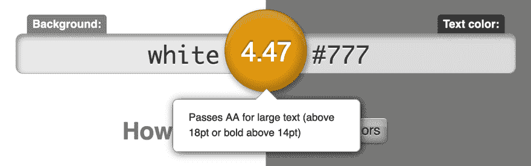
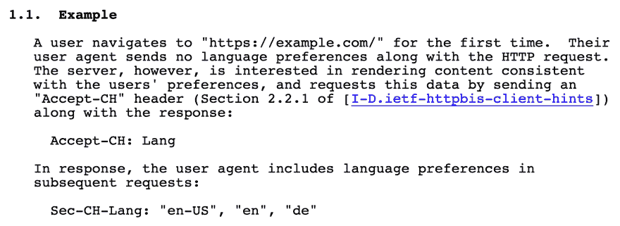
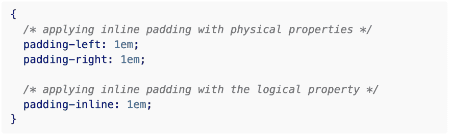

# 每周网络平台新闻#2

> 原文：<https://dev.to/simevidas/weekly-web-platform-news-2-3109>

*这是 2 月 13 日至 2 月 25 日期间在 [https://webplatform.news](https://webplatform.news) 上发布的新闻精选。*

* * *

*   [曼迪迈克尔](https://mobile.twitter.com/A11YProject/status/1095419773482078211):用[contrast-ratio.com](https://contrast-ratio.com/)检查你的文字是否有**足够的对比度** ( [成功准则 1.4.3](https://www.w3.org/TR/WCAG21/#contrast-minimum) )。介于 3 和 4.5 之间的值(橙色结果)仅适用于大文本(至少是`24px`或`18.67px`粗体)。

    

* * *

*   [格拉汉姆·阿姆菲尔德](https://mobile.twitter.com/HassellInc/status/1095987303611355141):**标准日期选择器**控件`<input type="date">`，作为可访问网站的一部分使用仍然不安全(浏览器验证错误消息在一些屏幕阅读器中没有公布)。

* * *

*   [菲尔·沃顿](https://mobile.twitter.com/philwalton/status/1095781882136977408):笔画细的字体(例如 **`font-weight: 300`** )在`1dppx`屏幕上很难阅读。你可以使用`min-resolution`媒体查询来限制高像素密度屏幕上的细字体。

* * *

*   [迈克·韦斯特](https://mobile.twitter.com/mikewest/status/1095945797382877185):HTTP`Sec-CH-Lang`头在 Chrome Canary 中得到实验性支持。我们的目标是**用一个选择加入的模型替换`Accept-Language`** ，“以减少我们通过 HTTP 请求暴露的被动指纹识别面。”

    

* * *

*   [Rachel Andrew](https://www.rachelandrew.co.uk/archives/2019/02/19/more-logical-properties/):**CSS 逻辑属性**模块引入了新的快捷键，可以同时设置两个块或两个行内值。

    

    `margin-block`、`margin-inline`、`padding-block`和`padding-inline`属性可以通过 [PostCSS 预设环境插件](https://preset-env.cssdb.org/)使用。

* * *

*访问 [https://webplatform.news](https://webplatform.news) 获取最新的 web 开发新闻。*