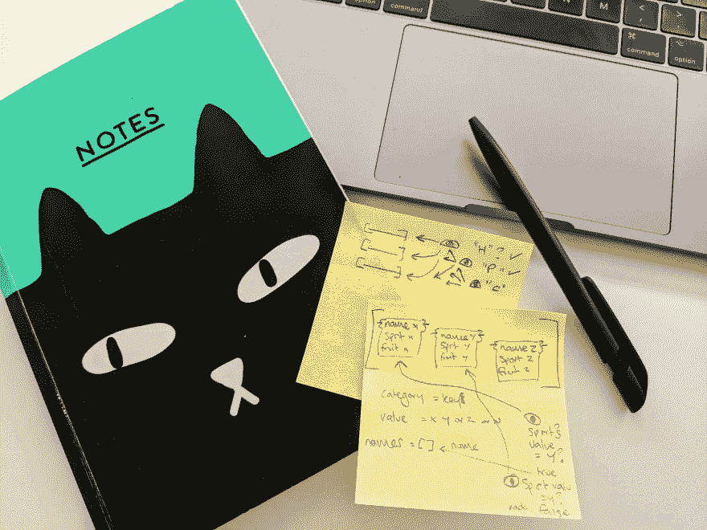

# 每周笔记- 02 制造商预课

> 原文：<https://dev.to/ruthmoog/weeknotes-02-makers-precourse-6e6>

## 四周之二

本周优点:解决问题，应对有趣的挑战，赶上我的同伴！但是，也有一些缺点:被斗鸡眼卡住，健康不佳，感觉落后。

我画了草图来帮助我更好地计划如何处理这周的一些工作，这对于可视化我需要如何转换我的数据非常有帮助。

<figure>

<figcaption>in reality my desk looked like it could have been featured in Memento1.</figcaption>

</figure>

### 红宝石精通

这一周都是关于逻辑、循环和嘶嘶声。我*非常*为自己制作了一个整洁的小程序在命令行中呈现文本图形而感到高兴(以至于我哼了一声)。
数组的散列和数组的散列、子数组、&子子数组的复杂性令人困惑，所以本周我靠着毅力和思考时间解决了这些挑战。为了让这些神经路径完全伪造，我阅读了数组和块散列&，花了一些时间在虚拟代码栏 3 中深入了解它们。

### 声音接通...

通过 webex 与我的一些同事交谈，让我感觉与团队中的其他人联系更加紧密。听到他们的经历和他们现在/以前的工作让我安心，不仅是为了稳定我的步伐，也是因为知道我在球场上有一些好的同伴！

## 杂项。

*   对同意做我创客导师的艾丽莎大声喊出来🤝
*   我在运行 rspec 之前推送了一些代码，这太尴尬了...
*   来自不同分支的拉请求非常令人困惑&这是宝贵的经验
*   电台特辑，《男孩的工作》4为有趣的聆听而制作

# Weeknotes 便笺

1.  **纪念物** (2000) | [imdb](https://www.imdb.com/title/tt0209144/)
2.  **FizzBuzz** | [维基](https://en.wikipedia.org/wiki/Fizz_buzz)
3.  **codebar**|[codebar . io](https://codebar.io/)
4.  BBC 广播 4 台 | *男孩的工作* [听](https://www.bbc.co.uk/programmes/m0003t9y)
5.  **阿伊莱莎·阿莫亚** | [博客](https://medium.com/@ayelisha.amoah)

编辑:这篇文章被编辑成包括 Ayelisha Amoahs 的博客-2019 年 5 月