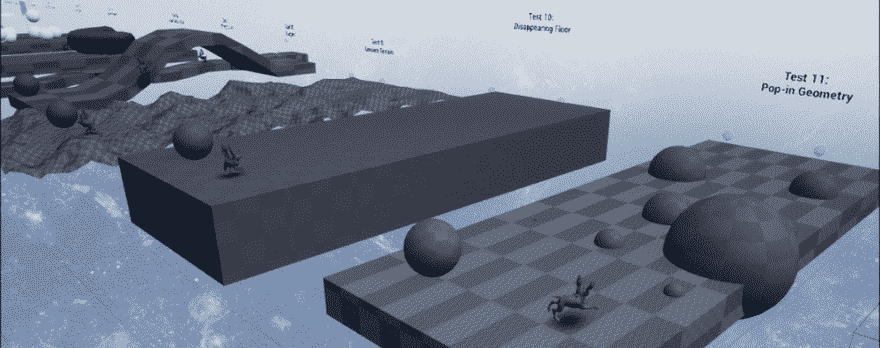
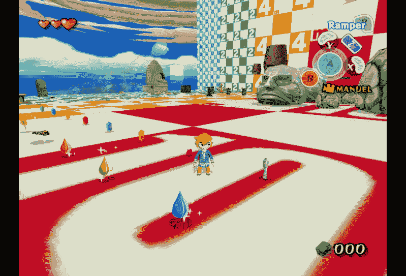
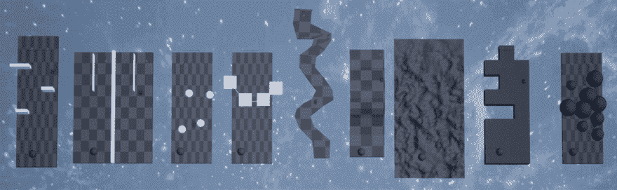
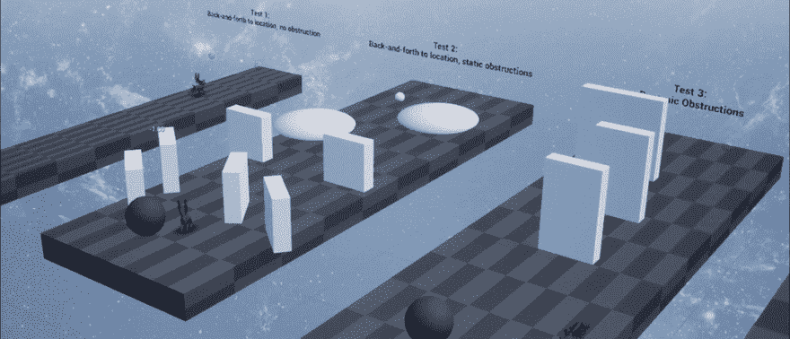
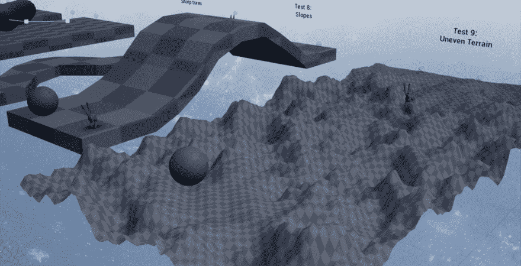
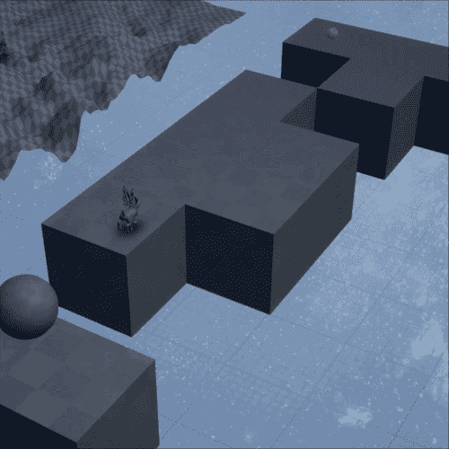
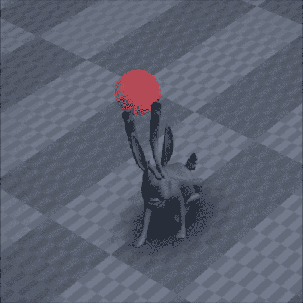
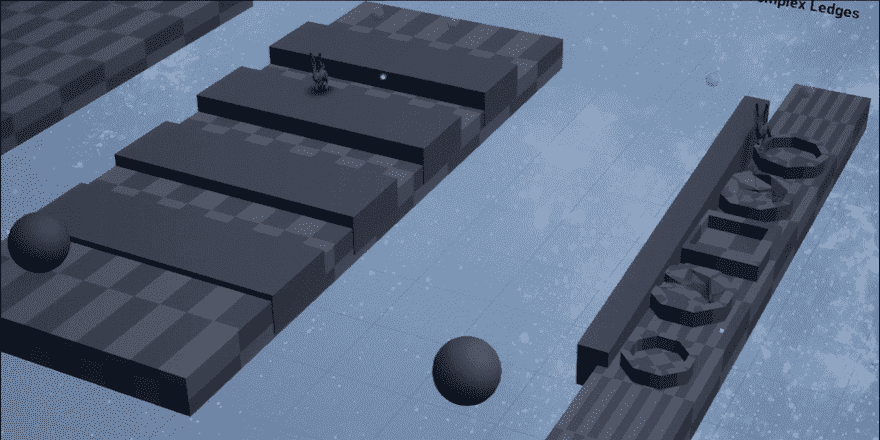
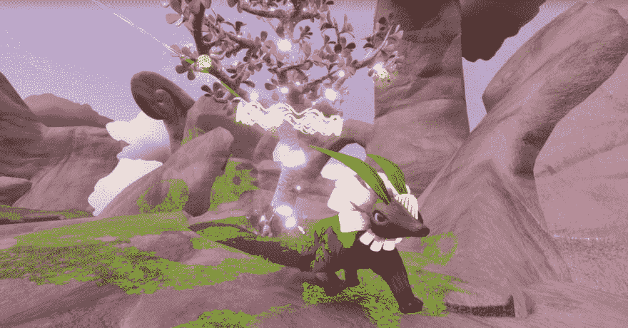

# 欢迎来到兔子地狱！具有 TDD 的可靠人工智能移动

> 原文：<https://dev.to/brendanlobuglio/welcome-to-rabbit-hell-reliable-ai-locomotion-with-tdd-97e>

测试驱动开发(TDD)是一种软件工作流程，其中代码与小的“单元测试”程序一起编写，这些程序量化每个组件是否工作。虽然由于随机性、3D 交互和不可预测的玩家输入，自动化单元测试很难应用于游戏开发，但我们能够利用 TDD 工作流为 *ElemenTerra 编写稳定且防回归的生物移动。*

[](https://res.cloudinary.com/practicaldev/image/fetch/s--CihPbLuo--/c_limit%2Cf_auto%2Cfl_progressive%2Cq_66%2Cw_880/https://i.imgur.com/5r4UjhJ.gif)

# 测试驱动开发的基础知识

有 TDD 经验的可以跳过这一节；对于其他人来说，这是一个基本的入门。

假设我们正在编写一个自定义函数，将两个数字相加。在传统的工作流程中，我们只是按照我们认为它应该工作的方式来编写，然后继续前进。但是要使用 TDD，让我们通过创建一个占位符函数和一些单元测试来开始这个过程:

```
int add(int a, int b){
 return -1;
}
// Our unit tests that throw errors unless “add” produces correct results:
void runTests(){
 if (add(1, 1) is not equal to 2)
   throw error;
 if (add(2, 2) is not equal to 4)
   throw error;
} 
```

最初，我们的单元测试会失败，因为我们的占位符函数为每个输入返回`-1`。但是现在我们可以继续正确地实现`add`，并让它返回`a + b`；我们所有的测试都会成功！这似乎是一种迂回的方式，但有几个优点:

*   如果我们没有得到足够的睡眠，将`add`写成`a - b`，我们的测试仍然会失败，我们会立即知道修复这个函数。如果没有测试，我们可能无法发现我们的错误，并经历奇怪的行为，稍后需要时间来调试。

*   我们可以保留我们的测试，并在每次构建代码时运行它们。这意味着如果将来另一个程序员不小心修改了`add`，他们会立即知道他们需要修复它，因为测试会再次失败。

对于这个简单的例子来说，这一切都是不必要的，但是具有像可预测的状态机行为这样的复杂特性(在吃了 100 个食物之后，`isFull`是真的吗？)TDD 节省了时间，提高了程序的稳定性。

# 游戏开发中的 TDD 应用

TDD 在游戏开发中有两个问题。首先，许多游戏功能都有无法衡量的主观目标。第二，很难编写覆盖充满复杂交互对象的世界的整个可能性空间的测试。希望他们的角色运动“感觉良好”或他们的物理模拟“看起来不紧张”的开发人员将很难将这些指标表达为确定性的通过/失败条件。

然而，我相信基于 TDD 原则的更松散的工作流仍然可以应用于复杂和主观的功能，如角色移动，在我们的游戏 *ElemenTerra* 中我们就是这样做的。

# 单元测试与调试级别

在我开始我的 TDD 实践之前，我想区分自动化单元测试和传统的“调试级别”gamedev 中的一个常见做法是创建带有人造环境的隐藏场景，允许程序员和 QA 专业人员见证特定事件。

<figure>

[](https://res.cloudinary.com/practicaldev/image/fetch/s--XCOMHSi7--/c_limit%2Cf_auto%2Cfl_progressive%2Cq_auto%2Cw_880/https://thepracticaldev.s3.amazonaws.com/i/j78ohyvo42jhz4qec28q.png)

<figcaption>A secret debug level full of different objects in The Legend of Zelda: The Wind Waker. [Image Source](https://tcrf.net/File:TLoZTWW_K_Testc_1.png)</figcaption>

</figure>

《塞尔达传说:风之觉醒》中充满不同对象的秘密调试关卡。图像源

我们在 *ElemenTerra* 中有很多这样的关卡:充满了玩家角色的几何图形问题的关卡，带有触发特定游戏状态的特殊用户界面的关卡，等等。像单元测试一样，这些调试级别可以用于重现和诊断错误，但是有几个方面将两者分开:

1.  单元测试将系统划分为原子部分，并对每个部分进行单独评估，而调试级别在更全面的层面上测试功能。在观察到调试级别的错误后，开发人员可能仍然需要手动搜索故障点。
2.  单元测试是自动化的，每次都应该产生确定性的结果，而许多调试级别是由玩家“引导”的。这造成了会话之间的差异。

这并不是说单元测试绝对优于调试级别；在许多情况下，后者是更实用的工具。但是我也相信单元测试在游戏开发中没有被充分利用，应该在传统上没有应用单元测试的系统中进一步探索。

# 欢迎来到兔子地狱！

在 *ElemenTerra 中，*玩家使用神秘的自然力量拯救被宇宙风暴伤害的生物。其中一种能力是能够在地下开辟道路，引导生物寻找食物和庇护所。因为这些路径是动态的玩家创建的网格，生物移动需要处理奇怪的几何边缘情况和任意复杂的地形。

角色运动是那些“一切都影响其他一切”的讨厌系统之一；如果你曾经实现过这样的系统，你会知道在编写新代码时破坏现有的功能是非常容易的。需要兔子爬小壁架吗？很好，但是现在他们在斜坡上上下下的抖动！试图让你的蜥蜴避开彼此的路径？看起来这很有效，但是现在他们的正常转向被打乱了。

作为负责人工智能系统和大部分游戏代码的人，我知道我没有太多的时间对错误感到惊讶。我想在回归出现时立即捕捉到它们，因此测试驱动的开发看起来很有吸引力。下一步是建立一个系统，我可以很容易地将每个生物运动用例定义为模拟的通过/失败测试:

[](https://res.cloudinary.com/practicaldev/image/fetch/s--IVMD1hMM--/c_limit%2Cf_auto%2Cfl_progressive%2Cq_66%2Cw_880/https://i.imgur.com/YA4Gc7x.gif)

这个“兔子地狱”场景由 18 个孤立的走廊组成，每个走廊都有一个生物身体和一条路线，只有在特定的移动功能工作时才能通过。如果兔子能够无限期地继续而不被卡住，则认为测试成功，否则认为失败。请注意，我们只测试生物的*身体*(虚幻术语中的“棋子”)，而不是它们的 AI。在*元素城*中，生物可以吃饭、睡觉，并对世界做出反应，但在兔子地狱中，它们唯一的指令是在两个路点之间奔跑。

以下是这些测试的几个例子:

<figure>

[](https://res.cloudinary.com/practicaldev/image/fetch/s--VBIkI40v--/c_limit%2Cf_auto%2Cfl_progressive%2Cq_66%2Cw_880/https://i.imgur.com/reiIDMF.gif)

<figcaption>1, 2, 3: Unobstructed Movement, Static Obstacles, and Dynamic Obstacles</figcaption>

</figure>

<figure>

[](https://res.cloudinary.com/practicaldev/image/fetch/s--cr2alFkN--/c_limit%2Cf_auto%2Cfl_progressive%2Cq_66%2Cw_880/https://i.imgur.com/zjMDu3W.gif)

<figcaption>8 & 9: Even slopes, and Uneven Terrain</figcaption>

</figure>

<figure>

[](https://res.cloudinary.com/practicaldev/image/fetch/s--mvdISASr--/c_limit%2Cf_auto%2Cfl_progressive%2Cq_66%2Cw_880/https://i.imgur.com/6W1xe9z.gif)

<figcaption>10: "Navmesh Magnet" failsafe for floating creatures</figcaption>

</figure>

<figure>

[](https://res.cloudinary.com/practicaldev/image/fetch/s--HPadTn_g--/c_limit%2Cf_auto%2Cfl_progressive%2Cq_66%2Cw_880/https://i.imgur.com/145AMEz.gif)

<figcaption>13: Reproduction for a bug where creatures would infinitely circle around nearby targets</figcaption>

</figure>

<figure>

[](https://res.cloudinary.com/practicaldev/image/fetch/s--BtNumqxi--/c_limit%2Cf_auto%2Cfl_progressive%2Cq_66%2Cw_880/https://i.imgur.com/WULLMCI.gif)

<figcaption>14 & 15: Step-Up ability on flat and complex ledges</figcaption>

</figure>

让我们来谈谈这个实现和“纯”TDD 的异同。

我的系统类似于 TDD，因为:

*   我通过进行失败的测试来创建特性，然后编写通过测试所需的代码。
*   当我添加新的特性时，我一直运行旧的测试，防止我将回归推到源代码控制。
*   每个测试只测量系统中的一个特性，这让我可以快速地确定问题。
*   测试是自动化的，不需要玩家输入。

与严格的 TDD 不同:

*   评估这些测试时有主观因素；虽然真正的路径“故障”(不是从 A 到 B)可以通过编程检测，但像位置弹出、动画同步问题、运动抖动以及转向是否“看起来平滑”等问题需要人工评估。
*   这些测试大部分是决定性的，但不完全是决定性的。像帧率变化这样的随机因素导致了小的偏差，一些课程有随机时间的动态元素。总的来说，生物通常仍然遵循相同的路径，在两次对话之间有相同的成功/失败

# 局限性

使用 TDD 来编写 *ElemenTerra* 生物运动对我们的计划来说是一个巨大的帮助，但是我的方法确实有一些限制:

*   单元测试孤立地评估了每个运动特性，因此不包含多个特性组合的错误；不幸的是我没有时间做 18 道菜！因此，我的单元测试有时不得不由传统的调试级别来补充。
*   ElemenTerra 有四个生物物种，但是测试只有兔子。这是我们生产计划的一个产物；其他三个物种是在发育后期才加入的。幸运的是，四架都有相同的移动能力，但是我们的*莫斯莫克*更大的身体引起了一些问题。如果我必须再做一次，我会让测试动态地产生一个选择的物种，而不是使用预先放置的兔子身体。

<figure>

[](https://res.cloudinary.com/practicaldev/image/fetch/s--WDlm3m-L--/c_limit%2Cf_auto%2Cfl_progressive%2Cq_auto%2Cw_880/https://thepracticaldev.s3.amazonaws.com/i/z6w1nvgt3yn1d7m51566.png)

<figcaption>This galloping Mossmork requires a little more room to turn than a rabbit</figcaption>

</figure>

# 评价:测试驱动开发适合你吗？

作为开发人员，在测试玩家永远不会欣赏的场景时投入*一点点过多的工作*是很诱人的；我不否认建造兔子地狱给了我很多乐趣。像这样的内部特性可能是对工作的巨大浪费，并且危及里程碑，所以我们需要在&的时候仔细看看一个给定的特性是否保证一个单元测试设备。下面我确定了一些标准，在我看来，这些标准证明了*元素*的生物移动的 TDD 是合理的。

## 1。手动生成测试用例是否很耗时？

在花时间进行自动化测试之前，我们需要检查我们是否可以用常规的游戏控件来评估一个特性。如果你想确保你的钥匙打开门，产生一个钥匙，用它打开一扇门！为这个特性创建单元测试是不负责任的时间浪费，因为手动测试只需要几秒钟。

## 2。你的测试用例很难手工生成吗？

当存在已知的、难以产生的边缘案例时，自动化单元测试就变得合理了。兔子地狱课程#7 测试生物从壁架上走下来，这是他们的人工智能很难避免的情况。课程#12 模拟地板几何中的 navmesh 去同步，这仅发生在极端滞后期间。这种情况可能很难或不可能用游戏控件来设计，而我们的测试可以毫不费力地产生它们。

## 3。你知道预期的结果不会改变吗？

游戏设计都是关于迭代的，当你的游戏被重新设计时，个别特性的目标可能会改变。即使是意图上的小变化也会使您用来评估特性的度量标准失效，从而使任何单元测试都失效。虽然生物的进食、睡眠和玩家互动行为经历了几次重新设计，但我们总是需要它们从 A 点到 b 点。因此，运动代码及其单元测试在整个开发过程中仍然有效。

## 4。回归有可能被忽视吗？

也许你遇到过这种情况:你正在完成一个游戏发布前的最后一项任务，突然你发现你几年前完成的一个功能中有一个破坏游戏的错误。游戏是巨大的互联系统，所以增加新功能 B 可能会打破旧功能 a 是很自然的。

当破碎的特征无处不在时，这并不坏，比如玩家的跳跃能力。如果你的核心机制出了问题，你肯定会立即注意到。但是，如果损坏的功能不经常被观察到，就像当玩家走进一个狭窄的裂缝时发生的情况一样，错误可能会在雷达下溜走。在后期开发中发现的错误会危及你的进度，并且在发布后会损害你的玩家体验。因此，单元测试可能是维护边缘情况行为的很好的工具，但是对于已经进行了大量附带测试的功能来说，通常是多余的。

## 5。做测试的最坏成本是多少，不做测试的最坏成本是多少？

建立测试设备是风险管理的一种形式。让我们想象一下，你正在决定是否为一辆车买保险。你需要回答的三个问题是:

1.  每月保险费是多少？
2.  车辆被损坏的可能性有多大？
3.  如果你没有保险，最坏的情况会有多贵？

对于 TDD，我们可以将每月保险费想象为维护我们的单元测试的生产成本，将车辆损坏的可能性想象为我们的特性破坏的可能性，将完全替换车辆的成本想象为回归 bug 的最坏情况。

如果一个特性的测试花了很多时间来创建，这个特性并不复杂，不太可能被改变，或者如果它在后期开发中被破坏了，那么单元测试可能会比它们的价值更麻烦。如果测试放在一起很简单，特性是易变的和相互关联的，或者它的错误会花费大量的生产时间，那么测试可以帮助我们按计划进行。

## 自动化的极限

单元测试可以是捕捉和减少 bug 的一个很好的补充，但我想强调的是，它们并不能取代大型游戏上对专业质量保证的需求。适当的质量保证是一门艺术，需要创造力、主观判断和出色的技术交流，这意味着你需要熟练的和精心照顾的人！

# 试水

虽然测试驱动开发并不是每种情况下的正确选择，但它是一种强大的工具，可以而且应该应用于更多的游戏开发环境。让我们扩大测试内容和测试方式的范围！

如果你对本文的观点有意见，或者有在你自己的游戏中使用 TDD 的故事，请发邮件给我们。如果你喜欢你读到的东西，并且正在寻找一个有技能的开发团队来构建、改进或帮助完成你的游戏，[你可以在这里联系自由实验室](http://www.freeformlabs.xyz/contact)。下次见！

* * *

***Freeform Labs，Inc.** 是一个游戏和软件开发团队，致力于提供最高质量的数字工艺，并以通过尖端的体验设计激发学习和创造力为使命。该团队位于洛杉矶市中心，在全球范围内维护着一个值得信赖的合作伙伴网络。凭借在 VR、AR、游戏 AI 等领域的专业经验，Freeform Labs 提供了一系列服务，包括咨询、雇佣工作软件开发和现场“发货”协助。该公司的作品包括微软、迪士尼和 Starbreeze 的作品，以及屡获殊荣的原创内容。*

* * *