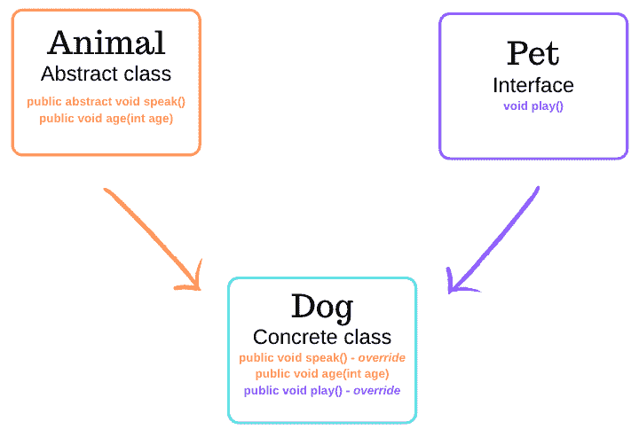

# 什么是接口，抽象类和具体类？

> 原文：<https://dev.to/ellehallal/what-are-interfaces-abstract-and-concrete-classes-ahn>

<center>

### 最初发布于 [ellehallal.dev](https://ellehallal.dev) 👩🏽‍💻

</center>

* * *

## 什么是接口？

接口用于标准化一组特定类的使用方式。接口指定了需要由类实现的公共行为。可谓是一个班级的蓝图。

一个接口将*需要实现什么*与*如何实现*分离开来。它不关心行为是如何实现的。

接口中声明的每个方法都需要包含在实现它的类中。接口中的方法体是空的，因此实现它的类需要重写方法来添加方法体。

接口包含方法和常量，它们是自动公开和抽象的。因此，包含这些关键字是可选的。

例如，下面是`Pet`接口中的`play`方法。它有一个空的方法体:

```
public interface Pet {
  void play();
} 
```

Enter fullscreen mode Exit fullscreen mode

接口有一个 *is-a* 关系。在下面的例子中，`Cat`正在实现`Pet`，猫*是-a* `Pet` :

```
public class Cat implements Pet {
    private String name;

    public Cat(String name) {
        this.name = name;
    }

    @Override
    public void play() {
        System.*out*.println(name + " is playing with human");
    }
} 
```

Enter fullscreen mode Exit fullscreen mode

`Cat`已经用自己的`play`方法覆盖了`Pet`接口中的`play`方法。

下面是另一个例子，使用一个名为`MediaPlayer`的接口。类`MusicPlayer`和`VideoPlayer`实现了这个接口。

**界面- MediaPlayer**

```
public interface MediaPlayer {
    void play();
    void stop();
    void currentlyPlaying();
} 
```

Enter fullscreen mode Exit fullscreen mode

**Class-music player**T2】

```
public class MusicPlayer implements MediaPlayer{
    private String songName;
    private boolean isPlaying = false;

    public MusicPlayer(String songName) {
        this.songName = songName
    }

    @Override
    public void play() {
        isPlaying = true;
    }

    @Override
    public void stop() {
        isPlaying = false;
    }

    @Override
    public void currentlyPlaying() {
        if (isPlaying) {
            System.out.println(songName + " is currently playing.");
        }
        else {
            System.out.println("Nothing is playing.");
        }
    }
} 
```

Enter fullscreen mode Exit fullscreen mode

```
public class VideoPlayer implements MediaPlayer{
    private String videoName;
    private boolean isPlaying = false;

    public VideoPlayer(String videoName) {
        this.videoName = videoName
    }

    @Override
    public void play() {
        System.out.println("Playing...");
        isPlaying = true;
    }

    @Override
    public void stop() {
        System.out.println("Stopped");
        isPlaying = false;
    }

    @Override
    public void currentlyPlaying() {
        if (isPlaying) {
            System.out.println(videoName + " is currently playing.");
        }
        else {
            System.out.println(videoName + "is not playing. Press play");
        }
    }
} 
```

Enter fullscreen mode Exit fullscreen mode

`MusicPlayer`和`VideoPlayer`已经实现了在`MediaPlayer`中声明的`play`、`stop`和`currentlyPlaying`方法，通过重写它们。

### 其他要点

*   无法实例化接口
*   一个类可以实现多个接口
*   多个类可以实现同一个接口
*   一个接口可以扩展另一个接口
*   接口的另一个例子是 Java 中的 [List](https://docs.oracle.com/javase/8/docs/api/java/util/List.html) 。

* * *

## 什么是抽象类？

抽象类的目的是提供多个派生类可以共享的基类的公共定义。

当一个类包含一些所有子类都可以使用的实现代码时，应该使用它，比如一个有主体的方法。像接口一样，抽象类也可以被称为蓝图。

一个抽象类至少包含一个抽象方法。抽象方法是具有空体的方法，就像接口中的方法一样。

区别在于在抽象类中，在声明类和抽象方法时需要使用 abstract 关键字。这里有一个例子:

```
public abstract class Animal {
    public abstract void speak();
} 
```

Enter fullscreen mode Exit fullscreen mode

此外，该类类型中的方法可以具有任何可见性，而在接口中，方法只是公共的。

抽象类也可以包含非抽象方法，这意味着定义了方法体。例如，下面是抽象类`Animal`，非抽象方法 age:

```
public abstract class Animal {
    public abstract void speak();

    public void age(int age) {
        System.out.println("I am " + age + " years old");
    }
} 
```

Enter fullscreen mode Exit fullscreen mode

抽象类不能被实例化，从它扩展的类需要覆盖抽象方法来提供实现。下面是一个从`Animal`类扩展而来的类的例子，覆盖了抽象方法 speak:

```
public class Dog extends Animal {

    @Override
    public void speak() {
        System.*out*.println("Woof!");
    }
} 
```

Enter fullscreen mode Exit fullscreen mode

抽象类可以实现一个接口。此外，抽象类的子类通常提供来自父类的所有抽象方法的实现。如果不是，子类也必须声明为抽象的。

* * *

## 什么是具体类？

具体类从接口和/或抽象类实现其所有继承的方法和状态。与接口或抽象类不同，具体类可以实例化。

它演示了蓝图的实现。任何抽象方法都会被覆盖，以包含一个方法体。

一个具体的类可以实现多个接口，但是只能从一个父类继承。

在下面的例子中，`Dog`类继承了接口`Pet`和抽象类`Animal`的方法。

[](https://res.cloudinary.com/practicaldev/image/fetch/s--oMCWSbou--/c_limit%2Cf_auto%2Cfl_progressive%2Cq_auto%2Cw_880/https://i.imgur.com/9w7cCGl.png)

具体类的另一个例子是 Java 中的数组列表。它实现了[列表](https://docs.oracle.com/javase/8/docs/api/java/util/ArrayList.html)接口中的方法。它也从[抽象列表](https://docs.oracle.com/javase/8/docs/api/java/util/AbstractList.html)类扩展而来。此外，它还实现了其他接口，如 Iterable 和 Cloneable。