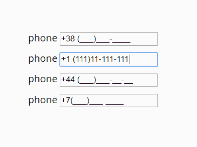

# 对于输入屏蔽，您的首选库是什么？

> 原文：<https://dev.to/geoff/what-are-your-go-to-libraries-for-input-masking-ij8>

我对输入屏蔽的定义是:

> 将提供的`<input>`元素中的用户输入格式化成预设的形状/结构

例如，下面是一组设置了掩码的电话输入:

这个 CSS-Tricks 链接展示了一些例子和一些库，但是我对开发社区现在使用的东西很感兴趣(这个帖子已经发布了 2 年了)。

如果该库是框架不可知的，即不使用 jQuery、Angular、React、Vue 等，则加分。