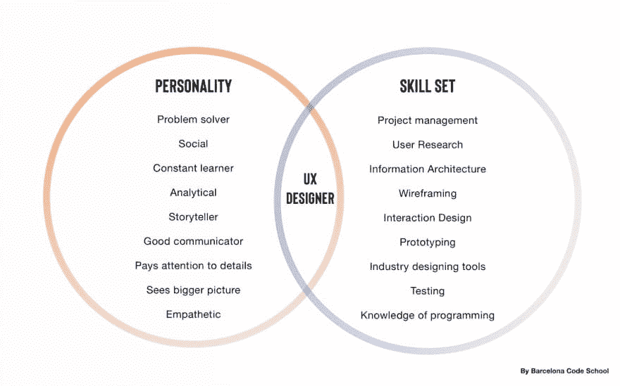

# 成为一名 UX 设计师需要什么样的背景和技能？

> 原文：<https://dev.to/bcncodeschool/what-background-and-skills-do-i-need-to-become-a-ux-designer-4k3h>

用户体验设计是为用户创造有意义和愉快体验的产品的过程。它由研究、测试、开发、内容创建、原型制作和测试任务组成，这些任务会在设计过程中带来高质量的结果。各种各样的活动让你很难理解你在这个职位上到底需要什么样的学习或技能。你需要某种设计背景吗？或者至少是一个模糊相关的管理资格？

实际上，任何人都可以成为用户体验设计师——不管以前的经验还是现在的职业。事实上，似乎很少有 UX 设计师有同样的背景；尼尔森诺曼集团的研究调查了 1015 名 UX 设计师的反馈，证实了这一事实。

在这项研究中，我们可以看到，*“90%的受访者获得了大学学位”*但没有任何特别的人可以定义 UX 领域:人们来自**设计、心理学、通信、计算机科学、历史，甚至化学背景**。

在同一项研究中，我们可以看到，所有 UX 设计师的职称都非常多样化。“没有单一的**职称**来瞄准:我们的受访者有 **210 个不同的职称**。”

### 因为不是所有的 UX 工作都是一样的。

根据国家、公司规模及其文化，或者仅仅是你老板的个人想法，职位和任务可能会有所不同。UX 设计师的工作通常是:

*   UX/UI 设计师，
*   UX 研究员，
*   UX 作家，
*   UX 和前端开发人员，
*   项目经理，
*   产品所有者，
*   UX 战略家，
*   交互设计师，
*   还有很多其他的！

这些职位主要取决于你的 UX 档案建立的背景。当用户体验被用于各种类型的项目时，这种情况就会发生:电子商务、消费应用、电器、智能产品、服务，甚至艺术和博物馆体验。

要了解你所在地区流行的 UX 项目的类型，对就业市场进行调查是很重要的。寻找工作入口，看看什么样的角色是需要的，以及他们需要的技能和素质。

是什么让所有成功的 UX 专业人士团结在一起？回答就是心态。

没有同理心和耐心，你不可能成为一名好医生；没有专注和情绪弹性，你不可能成为一名扑克玩家。同样的事情也发生在用户体验设计师身上，他们有几个必备的品质:

*   问题解决者，
*   社交，
*   不断学习，
*   分析，
*   说书人，
*   优秀的沟通者，
*   注意细节，但要看到全局，
*   移情作用的

感觉被认同？现在该怎么办？

个人特质非常重要，但要获得一份 UX 设计师的工作，你需要了解你的专业优势，并学习特定的技能和技术来运作成功的项目。

UX 设计师的技能包括:

*   基于之前的研究，创建用户故事、人物角色、网站地图、线框、原型和故事板；
*   计划并开展研究和正式评估；
*   基于测试数据和定性反馈迭代设计；
*   应用交互设计原则和信息架构；
*   知道如何使用行业工具:Sketch、InVision、Adobe InDesign、Photoshop、Zeplin、漫威，并学习市场上每天出现的许多其他工具；
*   理解编程的基础

正如你所看到的，在 UX 设计界，有太多的东西需要学习和吸收，单靠自己从一个完全的新手变成专业人士的想法似乎是不可能的。在巴塞罗纳代码学校，我们准备了密集的 UX/UI 训练营，在那里你可以通过实践学习上面提到的所有技能和工具。这门课程是为那些有或没有工作经验，希望进入 UX 设计行业的人准备的。有了动力和合适的导师，一切皆有可能！