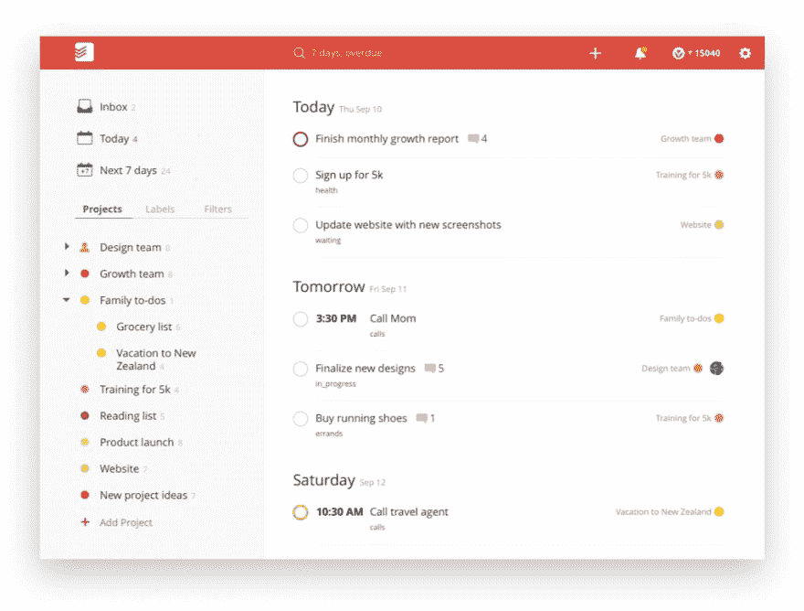

# 商务人士需要了解的技术:单页应用

> 原文：<https://dev.to/joecannatti/what-biz-people-need-to-know-about-tech-single-page-apps-28ek>

这是商业人士需要了解的技术系列的一部分。它的目的是帮助非技术业务人员更好地与工程师沟通，并就他们希望工程师提供的价值提供更好的反馈。

## 在 90 年代，称它们为“页面”是再合适不过了。

以前一切都很简单。以下是过去网页的工作方式:

1.  在 web 浏览器中键入 URL。

2.  浏览器连接到服务器。

3.  服务器发送给你一页特殊格式的文本，称为 HTML。HTML 包含内容和一个非常基本的外观定义。

4.  您的浏览器会呈现该页面。

5.  当你点击页面中的链接时，转到#2(重复直到你爸爸让你退出 AOL，以便他可以使用电话)。

## 现代 web 中的“页面”是什么？

从本质上来说，网络仍然是这样运作的。然而，我们已经极大地限制了第 4 步和第 5 步之间发生的事情。到目前为止，我们已经推动了这个过程的这一部分，它已经开始改变整个过程的思维模式。

基本上，人们希望网页在浏览器呈现页面和用户点击另一个链接之间进行交互。起初，这是非常简单的事情，比如当你将鼠标悬停在某个东西上时，它会变成粗体。或者，让您隐藏/显示部分页面。

## 那就是 JavaScript 的起源！

JavaScript 正在接管世界。对于一定年龄的技术人员来说，这是一件奇怪的事情。这是因为 JavaScript 原本是网景浏览器中添加的一个[快速黑客工具，用于增强网页的功能和微小的交互性。](https://auth0.com/blog/a-brief-history-of-javascript/)

它从来就不是一种编程语言，整个职业生涯、产品和帝国都是建立在这种语言之上的。它最初只是一种在网页中嵌入一点点逻辑的方法。

## 单页应用有点像在浏览器中运行的桌面应用程序

单页应用程序本质上是一个网页，它构建了完整的用户体验，而无需向服务器请求新的页面。基本上，第一页加载一个用 Javascript 编写的应用程序。该应用程序加载新内容，将数据发送到服务器进行保存，并执行我们在现代 web 应用程序中看到的所有其他操作。

另一种说法是，我们现在用这个小工具来构建整个应用程序，当鼠标悬停在它上面时，它会让你做出一些大胆的事情。

曾经有一段时间，这是非常激进和困难的。然而这些天来，它变得完全正常和标准。

用 JavaScript 编写高度复杂的应用程序，如照片编辑器和动画工具，并在网络浏览器中运行它们，已经变得非常实际。这些类型的产品过去需要构建桌面应用程序，这些应用程序必须在最终用户的机器上安装并获得许可。

## 商业价值在哪里？

实现商业价值的最直接途径是提高交互性。这里有一个很好的问题问你自己，“我的产品和交互式应用程序是一系列动态生成的页面吗？”。

举例来说，一个对我来说似乎是构建单页应用程序的明显选择的产品是 Todoist。

用户整天都在界面中管理他们的待办事项列表。有许多复杂的交互，如标记、计划、评论、排序等。你从用户体验中减少的每一毫秒都会对他们的工作效率产生影响。

Todoist 是作为一个单页应用程序实现的。它还有一个桌面包装器，可以将单页应用作为独立实例运行。对于这种类型的产品来说，这一切都很有意义。

## 什么时候不想要单页 app？

如果你的产品完全符合基本链接->页面->重复模型，那么你可能会更好地以这种方式构建它。这种模式比单页面应用程序模式更简单，更便宜，也更容易维护。

如果你不能从高度交互的体验中获得任何好处，那么你应该尽量避免将产品构建成单页面应用程序的额外开销。

## 混合方法

可以混合链接->页面->链接->页面方法和 SPA 方法。例如，您可以有一个基本的页面模型，但是包括一个用户仪表板，它在其他页面的上下文中被实现为 SPA。

在实践中，这种方法有一些微妙的缺点，使您失去了 SPA 的一些好处，但在某些情况下可能是一个很大的妥协。

## 总结起来

我希望这能给你一个很好的概述，在构建产品时使用单页应用程序意味着什么。有了这些知识，您应该能够与您的技术团队讨论这种模式是否适合您的公司。

我希望你看看下一期商业人士需要了解的技术！