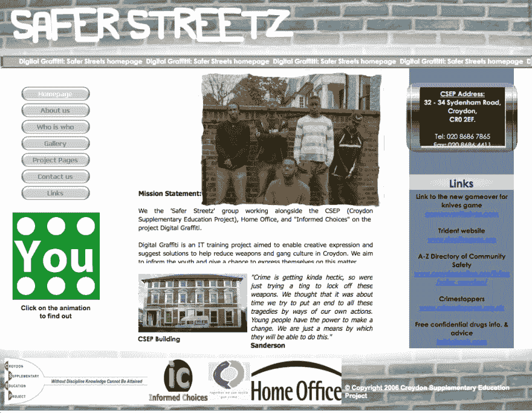

# 你的第一个网站设计是什么样的？

> 原文：<https://dev.to/graphicbeacon/what-did-your-first-website-design-look-like-1oj9>

朋友们好。随着我们接近 2018 年的衰落，我沿着记忆的小路回到了我的第一个网站设计，并想与大家分享一下。

虽然这感觉有点尴尬😳我也很想知道你第一次尝试的结果。

## 有些前后关系

这件作品是在 2006 年夏天完成的，当时几个朋友请求我帮忙做一个网站，作为克罗伊登辅助教育项目的一部分。我当时不懂 HTML 和 CSS，就用 web 软件把这个屏幕拼起来代替了。

这次经历的挫折让我选择了 [**Sams 在 24 小时内自学 HTML 4**](https://amzn.to/2Q79iIt)。剩下的几乎都是历史了。

请分享你的经历**以及一些截图(如果有的话)**。*这个页面可能需要更长的时间来加载更多的图片，但这是值得的！*😜