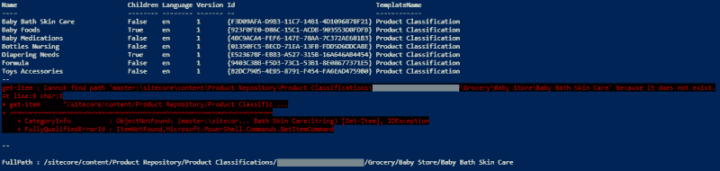
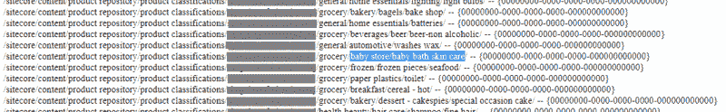
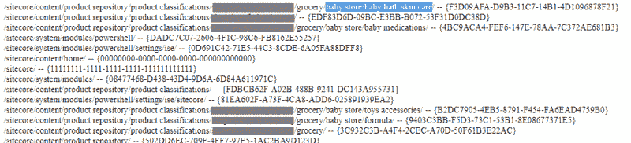

# 你说你不能通过它的路径获取那个项目是什么意思？

> 原文：<https://dev.to/jermdavis/what-do-you-mean-you-can-t-fetch-that-item-by-its-path-2646>

Sitecore 中有一些你认为理所当然会起作用的东西。装载物品就是一个很好的例子。我承认用户错误可能会妨碍您，但是通常如果您可以在内容树中看到一个项目，您可以编写代码加载它而不会出现问题。所以我承认，当我最近遇到这种情况时，我感到非常困惑。如果有其他人参加这个挑战，事情是这样的:

## 问题

我有一个客户，他正在利用 [Commerce Connect](https://doc.sitecore.net/sitecore_commerce/commerce_connect_components/introducing_commerce_connect) 模块为一个销售网站获取关于产品类别的数据。后端商务系统是他们自己的，但他们对 Commerce Connect 进行了一些定制，允许他们的数据每天晚上从后端系统转移到 Sitecore。他们注意到，有时，当导入过程添加新的内容树时，一些数据会过来，但其他数据不会。这就是我参与其中的原因——想看看导入过程中可能会出现什么问题。

在 Visual Studio 调试器中完成了他们的集成代码的自定义部分后，我发现了一个可能发生这种行为的地方。当它试图导入一个新的“产品类别”数据条目时，它希望加载正确的父条目。(这样就可以在它下面创建新的子项)看起来好像当父项不存在时，它将无法处理该项目的新子项。但奇怪的是，在某些情况下，我可以单步调试代码，看到父项在 Sitecore 内容树中是可见的，但加载它的请求仍然失败。

这让我很困惑。因此，当代码让我困惑时，我做了我通常会做的事情:我试图用最简单的事情来重现这种情况。试了几次之后，我想到了下面的方法:

如果我从 Sitecore 中删除所有产品类别数据，我可以运行 Commerce Connect 同步过程，它将正常完成。但是这样做之后，我可以运行一些简单的 PowerShell 来显示问题:

```
get-childitem  "/sitecore/content/Product Repository/Product Classifications/storeName/Grocery/Baby Store"  Write-host  "--"  get-item  "/sitecore/content/Product Repository/Product Classifications/storeName/Grocery/Baby Store/Baby Bath Skin Care"  Write-host  "--"  get-item  -path  master:  -ID  "{F3D09AFA-D9B3-11C7-14B1-4D1096878F21}"  |  select  -ExpandProperty  Paths  |  select  FullPath 
```

其给出了以下结果:

[](https://jermdavis.files.wordpress.com/2018/11/image_2018-11-14_04-43-03_pm.png)

尝试加载父项并显示其子项工作正常，它将显示“婴儿沐浴护肤”是父项的子项。但是试图通过它的路径显式加载该项失败，并显示“item not found error”。然而，通过 ID 询问“婴儿沐浴皮肤护理”项目效果很好。

当一个项目清楚地出现在内容树中时，为什么通过路径加载它会失败呢？

## 进一步挖掘

我们一直在关注的这个客户端的其他一些问题集中在发布服务和 Sitecore 数据库中的后代表上。这让我意识到控制面板中的“清理数据库”选项可以修复我的问题:如果我点击它，然后重新运行我的测试脚本，它会成功…显然这不是一个快速查询问题-那么是怎么回事呢？

我的同事马丁(Martin)给出了一个很好的暗示，他认为数据库清理将会清除缓存和其他操作。所以我尝试使用 cache.aspx 来清除缓存，而不是数据库清理，这也修复了我运行测试脚本时的问题——所以 Martin 肯定是对的。

但是开箱后你无法查看 Sitecore 的缓存的任何细节，所以我退回到[这篇关于查看单个缓存的优秀文章](https://briancaos.wordpress.com/2017/05/01/sitecore-caching-clear-caches-individually/)。(谢谢[布莱恩](https://twitter.com/briancaos)！)您需要对其进行一些调整，以使其与 Sitecore 的最新版本兼容，我利用这个机会快速侵入了一些代码，以显示特定缓存中的内容，从而帮助我进行调试。[ [代码在这里，如果你认为它可能有助于你的工作](https://gist.github.com/jermdavis/fc4c8004ba1bd21540c8d2561ae4b279)

所以我重复了几次测试，清空了一个缓存，直到我能够确定是“master[paths]”缓存导致了我的问题。仅清除该选项将允许脚本正常完成。

在清除此缓存之前，它包含一个无法加载的条目:

[](https://jermdavis.files.wordpress.com/2018/11/badcache.png)

但是在清除它并重新运行脚本后，内容将如下所示:

[](https://jermdavis.files.wordpress.com/2018/11/goodcache.png)

这似乎是问题的原因——最初，路径缓存包含空的 GUIDs，这意味着试图通过路径加载一个项目将会失败，直到缓存被清空并用正确的 id 重新填充。

## 分辨率…

我已经向 Sitecore Support 提出了这个问题，他们已经确认了一个缓存行为与 Commerce Connect 一起工作的 bug，这个 bug 将在未来的版本中得到修复。同时，如果您发现自己遇到了类似的问题，可以在与支持人员交谈时参考错误 157425。

但是，如果您需要解决这个问题，只需在运行 Commerce Connect 导入后清除“master[paths]”缓存就可以了。