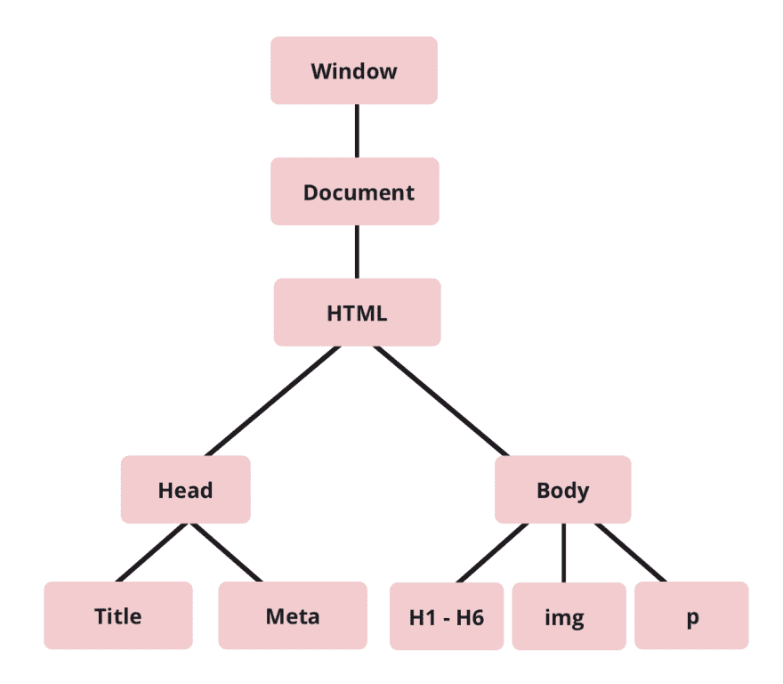

# DOM 到底是什么？！

> 原文：<https://dev.to/karaluton/what-exactly-is-the-dom-jhg>

大教堂。当我第一次在训练营学习编程时，我总是听到这个词，但我从来不知道它到底是什么意思。是我写的 HTML 吗？当我打算检查元素时，是不是偶然点击了“查看源代码”?我一直不明白。老实说，我花了一段时间才弄清楚这到底是什么。

根据 [W3C](https://www.w3.org/TR/DOM-Level-2-Core/introduction.html) 的说法，文档对象模型(DOM)是有效 HTML 和格式良好的 XML 文档的*应用编程接口。它定义了文档的逻辑结构以及访问和操作文档的方式”。*

怎么了？简单地说，DOM 是浏览器对 HTML 的一种表示，允许您操作页面。

那么为什么它经常被称为树呢？这是因为 DOM 从一个父项开始，这个父项又分支为子项。这些子项目也可以像你在上面的照片中看到的那样，分支到它们自己更小的树上。

我在一些网站上读到过，你在 DevTools 中看到的是 DOM 的可视化表示，虽然它非常接近，但并不完全正确。DevTools 将包含一些额外的信息(比如伪类),这些信息在技术上不属于 DOM。如果你像我一样是一个视觉型的人，这是我们在浏览器中能看到的最接近 DOM 的写照。

但是等一下——这难道不意味着 DOM 和我们正在编写的 HTML 是一回事吗？没有。

你有没有不小心遗漏了一个必需的元素，让浏览器帮你修复？您将在 DOM 中看到该元素，即使您已经将其从 HTML 中删除。如果您通过 JavaScript 操作 DOM，那么 DOM 也将不同于 HTML。

使用 JavaScript，你可以编辑页面的 CSS，添加事件监听器，改变节点属性等等。这些都改变了您最初在 HTML 中编写的 DOM。

总而言之，虽然 DOM 听起来非常可怕，但它实际上是浏览器如何决定页面上呈现的内容，以及通过 JavaScript，我们如何操纵呈现的元素。

* * *

非常感谢您阅读我关于 DOM 的文章！一定要在 Twitter 上关注我的许多关于科技的推文，如果我是诚实的，也有许多关于狗的推文。欢迎在下面发表评论或发微博给我，告诉我你的任何问题。