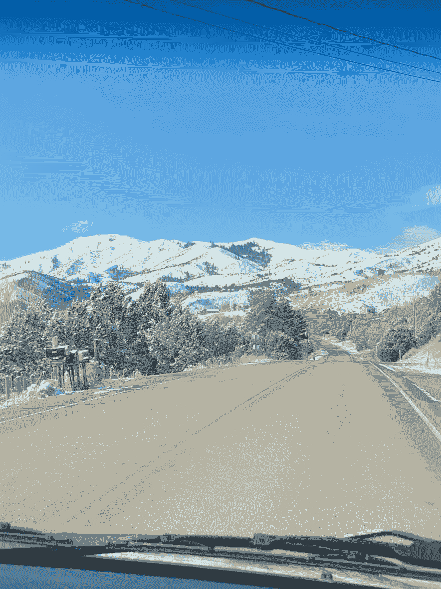
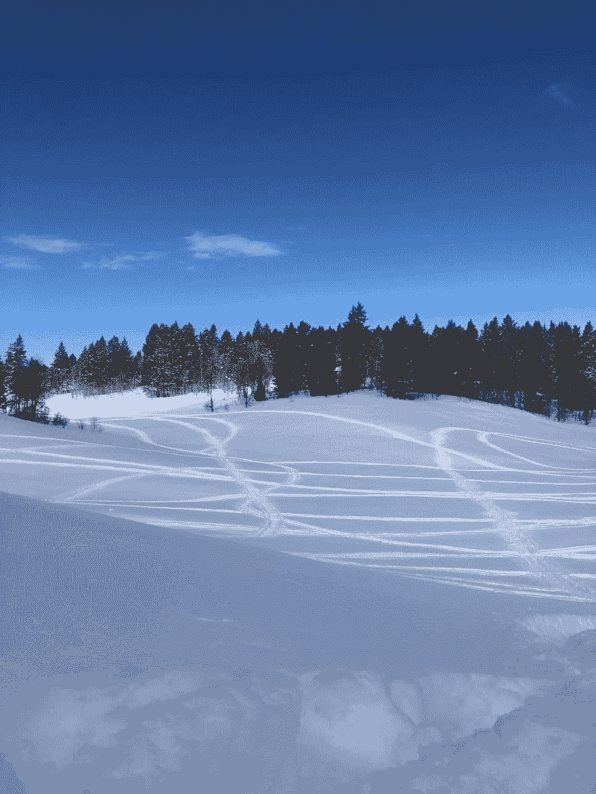
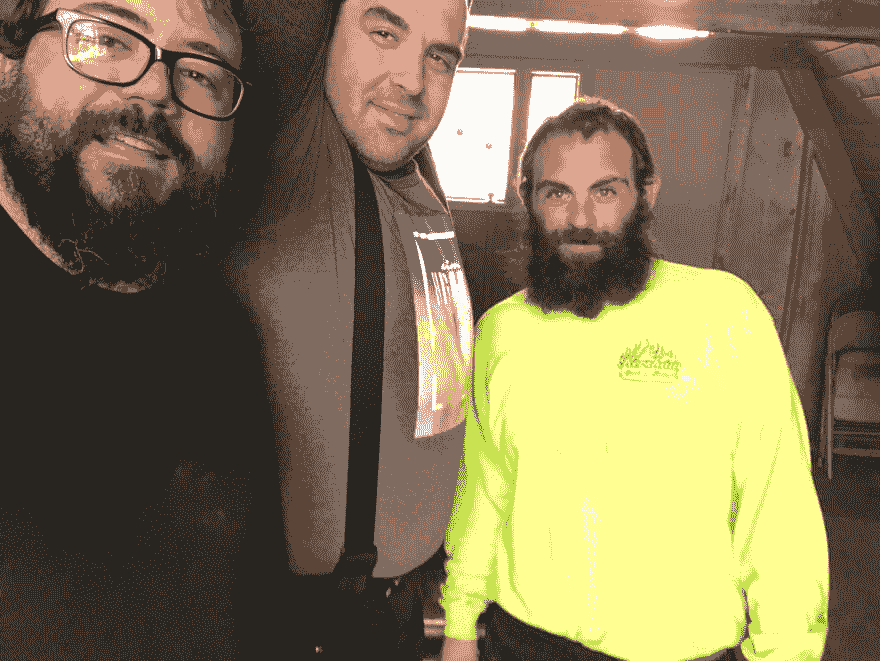
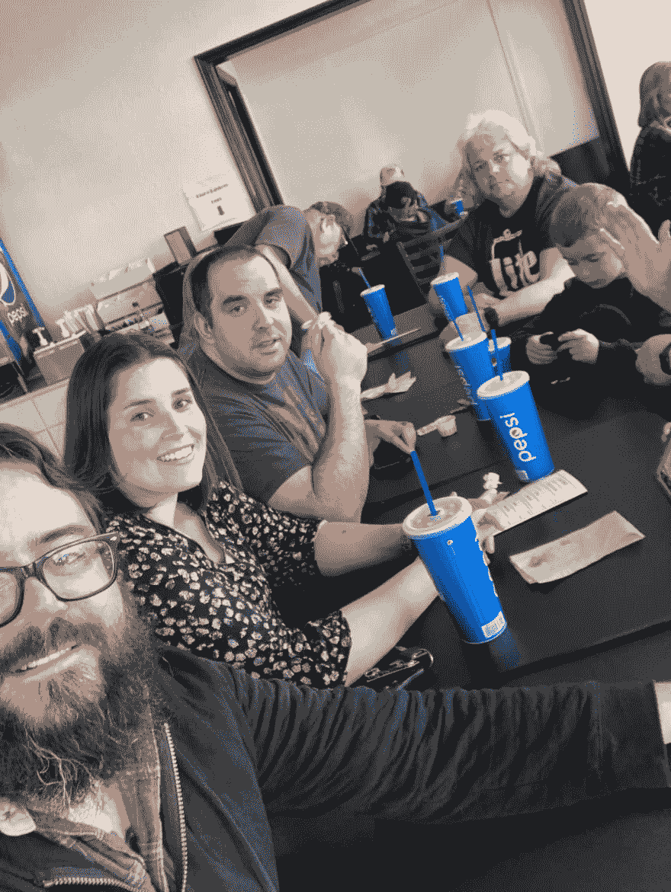

# 当我离开技术世界 7 天的时候发生了什么

> 原文：<https://dev.to/dechamp/what-happened-when-i-took-a-7-day-break-from-the-tech-world-48p3>

所以我回到了我的家乡爱达荷州。我带着我的电脑，我下定决心要在我的时间里不受干扰地完成我的项目，因为我知道我会有几天没有任何计划。

我到了那里，我一个人写代码的日子开始了。我没有编码。我不想编码。好奇怪。在过去的 10 年里(可能更长)，我认为我没有超过 3 天不写代码，这并不夸张。

我到那里的第一天，已经很晚了，所以我们赶上了，这些人我认为是家人。我认识了一辈子的朋友，但已经超过 12 年没见过面了。就好像我从来没有离开过，而且距离我们最后一次约会只有几个星期。

第二天我们去玩雪地摩托。我很快意识到我变得多么不健康。骑在机器上真是疯狂的锻炼。但是太有趣了！更不用说与自然和现实世界的重新连接了。我已经忘了现实世界有多美好！

[T6】](https://res.cloudinary.com/practicaldev/image/fetch/s--E8Yq79zr--/c_limit%2Cf_auto%2Cfl_progressive%2Cq_auto%2Cw_880/https://thepracticaldev.s3.amazonaws.com/i/624khx3ez4ose05fntsk.JPG)

我在那里的时候，我的朋友不得不工作几天，我有足够的休息时间。我利用这段时间睡觉和放松。我自己有一整个带家具的地下室。除了厨房什么都没有。我没有打开大电视。我没有在笔记本电脑上工作。他们甚至没有网络！！😲🤯😳

我喝了☕️咖啡，吃了一些油炸圈饼🍩，静静地坐着。太安静了。我用其他时间和我的朋友聊天。了解他们真实世界的生活，我只是通过 facebook 浏览了一下。

很奇怪，我错过了他们的整个生活，因为我只通过社交平台保持联系。由于距离和身体互动的脱节，我已经失去了多年。

和一个人面对面交谈有一些特别的地方。与他们共度时光，不是通过网络，而是面对面。听他们说话、欢笑，并与他们实时互动。由于网络的奢华，我们已经失去了这种重要互动的很大一部分。

前几天我在某个地方听说，现在脱离科技世界被认为是一种奢侈，因为穷人只能通过数字方式与自然互动。

我在谷歌上快速搜索了一下，找到了一篇关于它的文章，虽然不是我听说的那篇，但提到了这个想法。https://www . traveland leisure . com/travel-news/who-gets-to-plug。

多疯狂啊，以前上网是一种奢侈，而现在断网是一种奢侈！

但是假期过后，我完全明白了。我花了一段时间存钱，但我完全脱离了，这甚至不是故意的，但好处将影响我的余生。

自我记事以来，我回家时第一次真正休息好了。我不想回去工作，即使我自称是个工作狂。我不想在自己的笔记本电脑上工作，光是这个想法听起来就很可怕。

我只想去野营、徒步旅行或任何户外活动。我把吊床挂在车道上，在上面躺了几个小时。

呼吸新鲜空气。看书。甚至没有一本科技书籍！而是一本虚构的书！我赤脚走在岩石上。

我和女儿在外面呆了一段时间。很快意识到她是一个 1 岁大的小恶魔。

现在已经过去 27 天了，除了工作，我没有再编码。

我感觉更放松了。我对工作不那么认真了，因为我意识到这只是赚钱养家的一种手段，而不是生活中真正重要的东西。我的家庭更重要。我仍然努力工作，但是在一天结束的时候，我离开了，就是这样。

我发现我不那么爱发牢骚了。我对我的家人和我交往的人更有耐心...工作之外那是哈哈。

我觉得更有活力了。我每天都越来越渴望大自然和外面的世界。

一个巨大的好处是，我开始把事情做好了！过去，我总是对自己设定目标却从未实现感到愤怒，但现在我完成的项目比我很长时间以来完成的都多。

这就像《中间的马尔科姆》中的一集，当他的父母没有性生活，有很多空闲时间，他们实际上完成了事情！你看到他们的垃圾房从一片狼藉变得干净整洁。lol。

我现在有了更多的时间，可以做需要做的事情了！

我修好了我们的门。我修理、打磨并粉刷了一组玉米洞。我清理了车道和储藏室。我翻遍了整个衣柜，扔掉了不需要的衣服，这让我意识到有些衬衫我已经不在了，因为我觉得我太胖了...实际上很合适。😂我又开始雕刻木头。我做了一些降落伞手镯，练习了一些露营技巧。等等等等。

我还活着！我感觉更健康，我更快乐！最棒的是，我和妻子比以往任何时候都更好地沟通。也许是时机问题，但很难相信我的改变没有帮助。

与家人在一起会让你更容易理解他们，并向他们表达你的关心。即使你认为你在这方面做得很好，当你不困在笔记本电脑里，或者对完成工作感到压力时，你总是可以做得更好。

生活是美好的，因为我真实地生活着。我呼吸着新鲜的空气，在人类的层面上与人交流。

[T6】](https://res.cloudinary.com/practicaldev/image/fetch/s--5t3ReINt--/c_limit%2Cf_auto%2Cfl_progressive%2Cq_auto%2Cw_880/https://thepracticaldev.s3.amazonaws.com/i/dkwxvrmd1jouclwumt1k.JPG)

我不打算取消代码，这不是问题所在。但是我现在知道休息是多么重要，不仅仅是几个小时，而是真正的休息，可能会持续几天或几周。其中一部分就是脱离你的常规。

因此，我要求你们休息一下。打电话给你的朋友，去见见他们。去远足/野营。去度一个你一直“很忙”的假期。

即使你做不到，站起来出去走走。向你过去可能没有交谈过的人问好，看看你是否能搭讪。

过真实的生活，而不只是在电脑后面。

-说吧