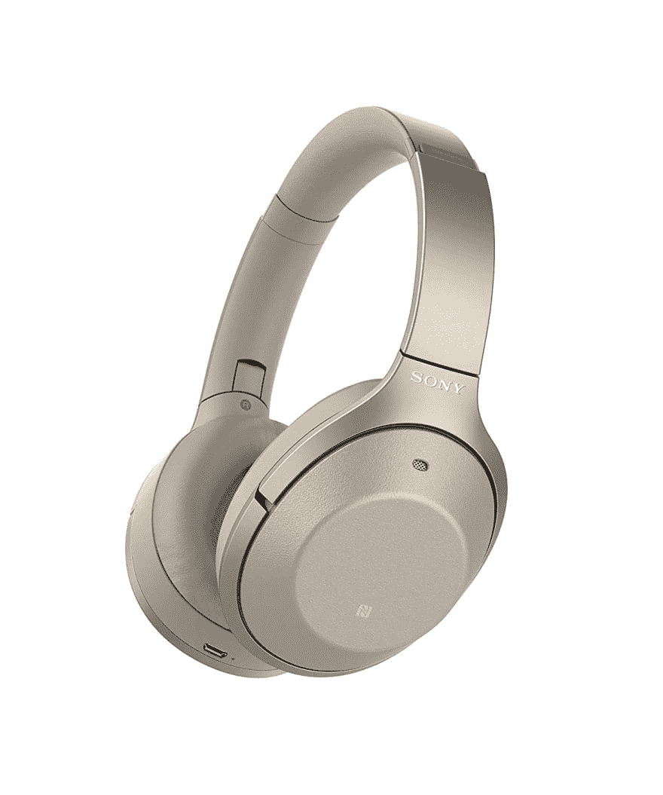
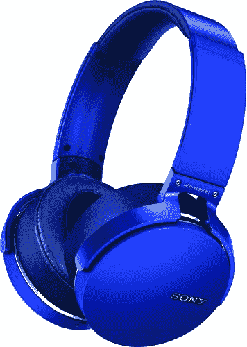
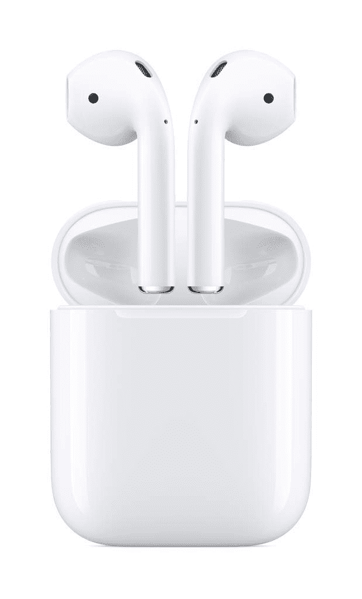
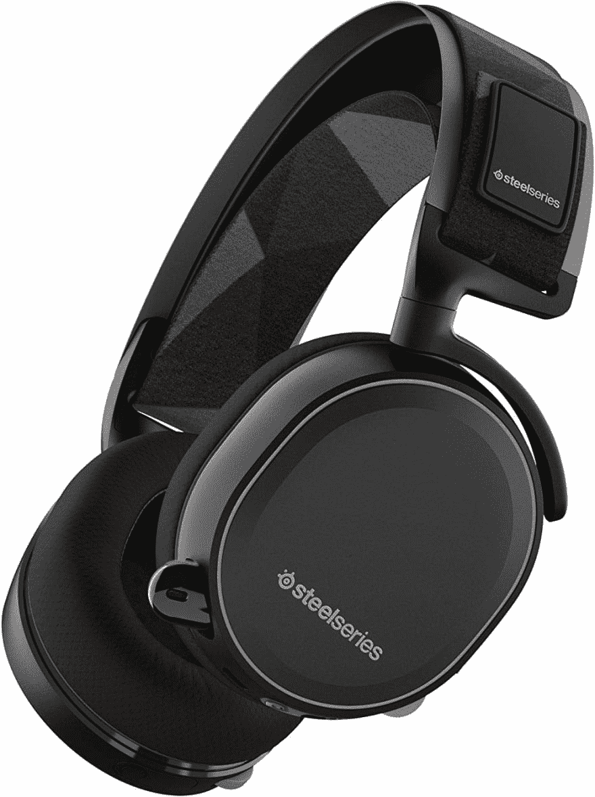
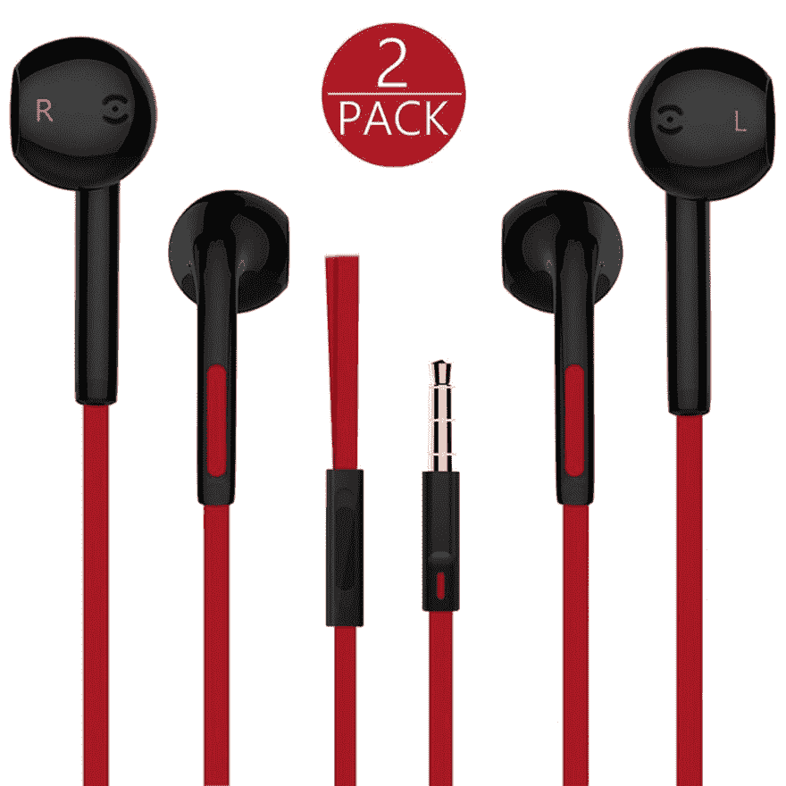

# 编码时，您使用什么耳机？

> 原文：<https://dev.to/ballen2713/what-headphone-s-do-you-use-when-coding-2nmd>

我是各种耳机的狂热用户！有些人可能会说我是一个耳机迷，其他人可能会说我喜欢有选择。尽管如此，我还是想知道一般来说，当涉及到编码或听音乐时，每个人在某些情况下都使用什么。

# 以下是我目前拥有的耳机/耳塞列表:

*   索尼 WH1000XM2 蓝牙无线数控耳机
    *   编码/编程工作
    *   漫长的学习时间
    *   深度聚焦工作
    *   阅读书籍

*   索尼 XB950B1 超低音无线耳机
    *   编码/编程工作
    *   Web 开发
    *   激烈的音乐会议
    *   Dubstep & Chillstep
    *   有电子音乐吗

*   苹果 Air Pods
    *   主要是当我在学校、工作或当地图书馆时使用
    *   也用于播客和有声读物

*   钢系列北极 7 号
    *   用于玩 PS4 的游戏耳机
    *   有时也用于 XBOX 360

*   有线耳机
    *   当我忘记给蓝牙耳机充电时
    *   当我的另一个耳机没电时，备份耳机

让我知道你们日常使用还是在特殊场合使用哪副耳机！此外，我接近购买 Bose QC 35 如此糟糕>。