# 我从印刷定制礼品中学到了什么

> 原文：<https://dev.to/cheeaun/what-i-learned-from-printing-custom-swags-19l4>

显然，我被称为新加坡的😅，主要是因为我在过去几年里自愿印刷贴纸和 t 恤之类的赠品。我的贡献对新加坡，或许还有其他国家的所有 meetup 爱好者和与会者的生活产生了重大影响。

在我开始之前，有一些免责声明:

1.  我不按字面意思印刷赠品。我只是从定制印刷店和供应商那里订购。
2.  与那些从事这项工作多年的人相比，我不是定制印花的专家，还有很多东西要学。
3.  我这样做纯粹是出于好奇。也许作为一种爱好，但是它是一种相当昂贵的爱好💸。
4.  我学到的东西可能不适用于其他情况、地方或国家。随着时间的推移，事情可能会发生变化。在相信这里所写的一切之前，最好还是自我实验一下。

## 开端

我参加了很多聚会和会议。有时这些活动，通常是会议，会提供免费赠品，我总是很高兴得到它们。它们已经成为我参加的一个理由，而且赠品对破冰者认识新的志同道合的人总是有好处的。

在获得免费赠品*年*后，我开始问自己，我能创造自己的赠品吗？与其索取，也许是给予的时候了？🎅

我不知道这些赃物是如何运作的，老实说，我认为它们是理所当然的。我曾经非常傲慢，不断向组织者索要免费赠品，却没有意识到制作这些赠品有多么困难。

一切都是从衬衫开始的。

在 2014 年之前，我在马来西亚和新加坡参加的会议中，大多数 t 恤赠品都不是…超级棒。我对衬衫不挑剔，但会议衬衫的质量不是很高，而且我通常不会抱怨太多，因为它们是免费的。可能由于这个事实，我没有太注意他们，包括所有其他像贴纸一样的赃物。我喜欢它们只是因为…它们是免费的，而不是因为它们很棒。材料和设计都不怎么样，没有给我留下太多印象。

2014 年，我去了旧金山，参加了一些聚会和会议，发现了一个非常重要的不同:赠品要好得多。不知何故，在那个时候，他们感觉好多了，我真的不知道为什么。我不知道是什么让它变得更好，也不知道它如何变得更好。我以为所有的贴纸和衬衫都是一样的，对吧？

对不对…？

我决定找出原因，并做了几个实验。

## 衬衫👕

我印了不止一件，而是三件印有我自己的“CA”标志的 t 恤衫。他们完全是实验性的，在那个时候，我不知道我在做什么。

2014 年 3 月 31 日，我[向](https://twitter.com/cheeaun/status/454732849271152640)订购了一件 t 恤。

[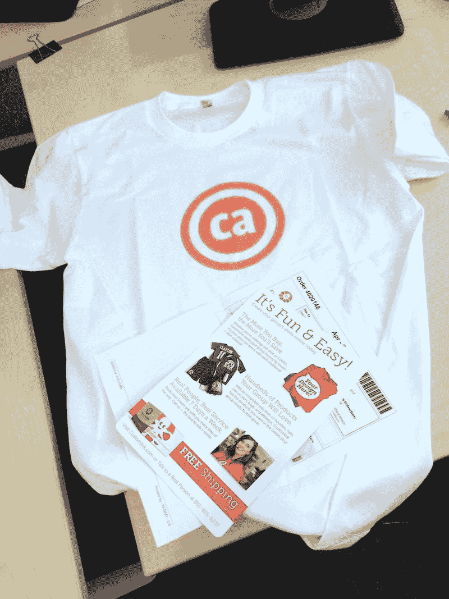](https://res.cloudinary.com/practicaldev/image/fetch/s--EoE46NrA--/c_limit%2Cf_auto%2Cfl_progressive%2Cq_auto%2Cw_880/https://cheeaun.com/blimg/photos/objects/cheeaun-t-shirt-v1.jpg)

这是我第一件印有自己商标的 t 恤。是的，我只从[海关](https://www.customink.com/)订购了*一件* t 恤衫，价格为 24.75 美元。这是[美国服装运动衫](https://www.customink.com/products/styles/american-apparel-usa-made-jersey-t-shirt/15000)，100%精梳环锭纺棉，S 号，白色。

2014 年 4 月 13 日，我[从 CustomInk 向](https://twitter.com/cheeaun/status/460886871837376513)订购了第二件 t 恤。

[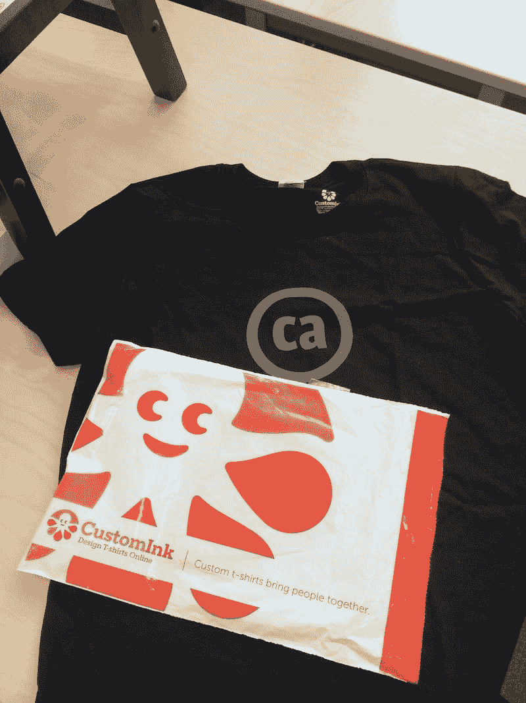](https://res.cloudinary.com/practicaldev/image/fetch/s--0Z789eme--/c_limit%2Cf_auto%2Cfl_progressive%2Cq_auto%2Cw_880/https://cheeaun.com/blimg/photos/objects/cheeaun-t-shirt-v2.jpg)

这一次，它是黑色背景上的灰色标志。 [Gildan Softstyle 针织面料](https://www.customink.com/products/styles/gildan-softstyle-jersey-t-shirt/176100)，100%预收缩环锭纺棉，S 号，售价 25.75 美元。

很巧的是，CustomInk 只允许我订购*一件*衬衫，因为大多数供应商都有最低订购量。这让我可以试验一下，看看这件衬衫是什么样子的。

我个人不太喜欢白衬衫作为打底，因为看起来更*皱巴巴的*。橙色标志太大了，因为我试图用英寸来测量它，这是一个我不熟悉的测量单位(包括世界上的其他地方😏).

它确实与我的个人品牌相匹配，橙色和白色，但我意识到，当涉及到衬衫时，我必须改变它，因为它是我会穿的东西，不像网站或杂志。

黑色(包括其他深色)总是最安全的选择，因为:

1.  很难决定适合每个人口味的底色。
2.  黑色百搭，可以搭配任何东西来搭配你的衣橱。
3.  黑色总是神秘时尚。

在我的第二次尝试中，我用黑色作为我的标志的灰色版本的基色。我还把标志做得更小了，因为我试图匹配钢铁侠的电弧反应堆的尺寸😎。

很好…但是衬衫的材料和印花不是很好。材料是 100%棉，摸起来*厚*。商标印刷感觉像是*贴在衬衫上面*，而不是衬衫的*部分*。我将它与一些会议 t 恤赠品进行了比较，质量水平完全不同。

[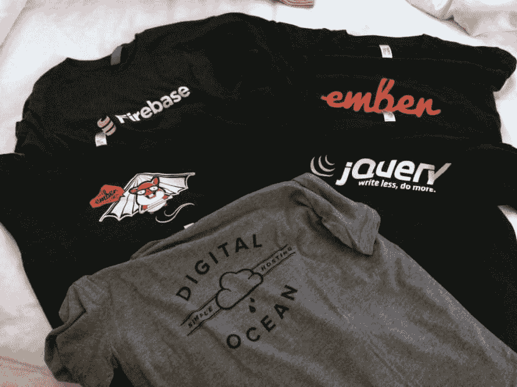](https://res.cloudinary.com/practicaldev/image/fetch/s--lVBKEN-N--/c_limit%2Cf_auto%2Cfl_progressive%2Cq_auto%2Cw_880/https://cheeaun.com/blimg/photos/objects/conference-t-shirts-firebase-ember-jquery-digital-ocean.jpg)

我做了一些研究，发现了一种叫做 **Tri-blend** 的有趣材料。谷歌一下会发现一些资源，比如:

*   三融合是什么意思？
*   [Triblend 衬衫——魅力指南](https://libertymaniacs.com/pages/triblend)

Tri-blend 是三种纤维的组合:

*   棉花——透气，不吸热。
*   聚酯纤维——抗皱。
*   人造丝——合身、耐用、柔软无比。

听起来很神奇，对吧？确实是！自从我试过之后，这些年来我一直在慢慢更新我的衣柜，把我所有的纯棉衬衫都换成这件。

我想在这种材料上印上我的标志，但发现印一件衬衫的价格太贵了，所以我放弃了，直到…

2014 年 12 月 8 日，我用我的 Kopi 订购了 [3 件 t 恤。JS 标志](https://twitter.com/cheeaun/status/545073311265206272)。

[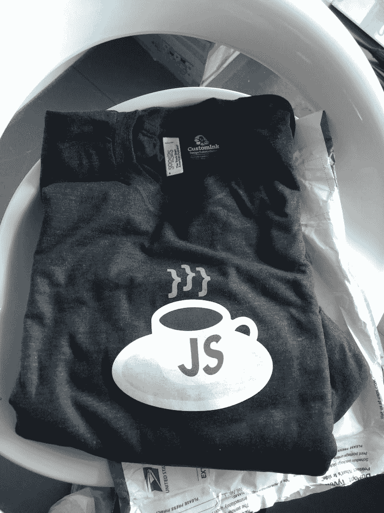](https://res.cloudinary.com/practicaldev/image/fetch/s--3vLlVHsn--/c_limit%2Cf_auto%2Cfl_progressive%2Cq_auto%2Cw_880/https://cheeaun.com/blimg/photos/objects/kopijs-t-shirts.jpg)

这是美国服装三种尺码的混纺产品，有 S、M 和 L 三种尺码，花了我 105.30 美元(是的，还是很贵😂).

[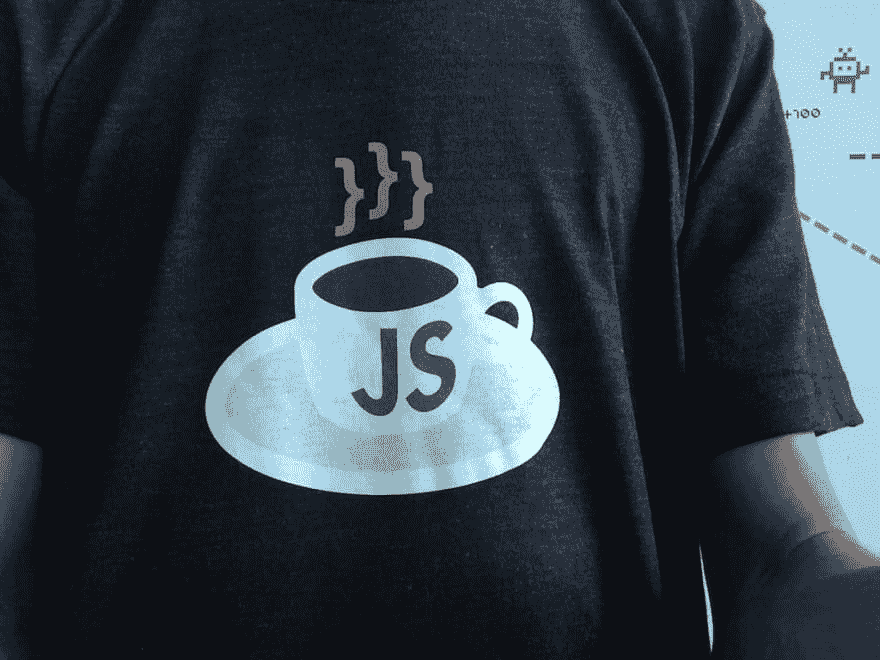](https://res.cloudinary.com/practicaldev/image/fetch/s--d_j9I_7s--/c_limit%2Cf_auto%2Cfl_progressive%2Cq_auto%2Cw_880/https://cheeaun.com/blimg/photos/objects/kopijs-t-shirt.jpg)

我给自己买了 S 号[的](https://twitter.com/cheeaun/status/545400552901718016)，其余的给了我的另一只 [Kopi。JS](https://kopijs.org/) 联合创始人☕️.

2015 年 11 月 28 日，我(又)订了一个。

[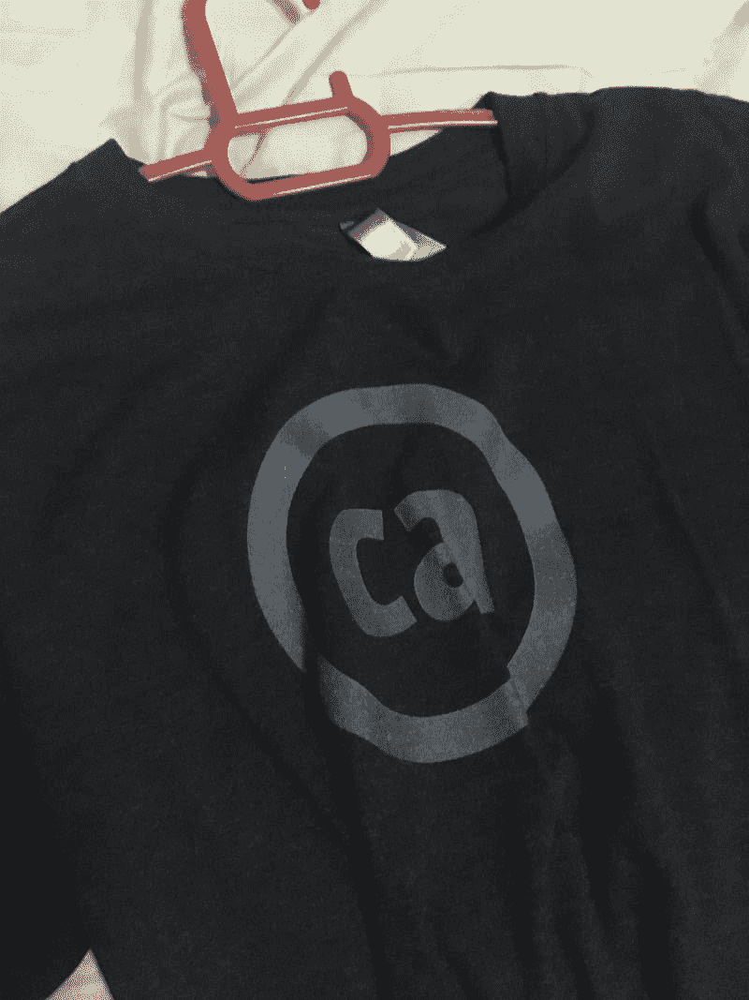](https://res.cloudinary.com/practicaldev/image/fetch/s--EwOvSD8Z--/c_limit%2Cf_auto%2Cfl_progressive%2Cq_auto%2Cw_880/https://cheeaun.com/blimg/photos/objects/cheeaun-t-shirt-v3.jpg)

这是第三件，也可能是最后一件印有我标志的 t 恤。我从 [ooShirts](http://www.ooshirts.com) 订购的。这是[下一级三混纺](http://www.ooshirts.com/t-shirts/short-sleeve-shirts/next-level-triblend)，DTG 印刷，S 码，售价 31.77 美元(我知道越来越贵了💸).

我印了这张，因为我喜欢三色混合，我想在上面印上我的商标😂。我也想试试*其他*生产这种材质的品牌，看看有没有什么不同。

原来不是品牌的问题，而是布料本身的问题！我不知道美国服装，但这件下一级衬衫含有 50%聚酯纤维，25%棉和 25%人造丝。[我的](https://www.printful.com/blog/guide-to-cotton-polyester-and-blended-fabrics/) [研究](https://www.rushordertees.com/blog/cotton-polyester-5050-blend-which-better-you/)发现还有 50/50 混纺(50%棉，50%聚酯)和 65/35 (65%棉，35%聚酯)的，也叫**涤棉**。是的，除了 50/25/25 之外，三元混合物还有其他百分比。

简而言之，这就是我天真地看待他们的方式:

*   棉布是日常穿着最受欢迎的面料。最适合鲜艳的印刷，也是最便宜的选择。
*   聚酯大多用于运动服。更轻更光滑。
*   人造丝非常柔软，非常适合做女装、裙子、床单等。

起初，我不太喜欢人造丝，因为棉和聚酯纤维对我来说已经很柔软了。所以我看了看我的衣柜，发现我已经有几件 polycotton 衬衫了(直到我做了调查才意识到这一点😅).

其中一件是我迄今为止最喜欢的，带贴纸的 t 恤衫🤩).

[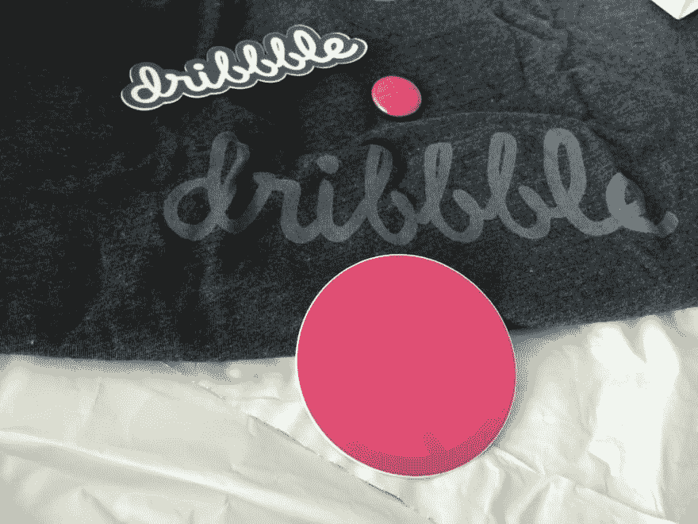](https://res.cloudinary.com/practicaldev/image/fetch/s--33afkrJe--/c_limit%2Cf_auto%2Cfl_progressive%2Cq_auto%2Cw_880/https://cheeaun.com/blimg/photos/objects/dribbble-t-shirt.jpg)

这是一辆 50/50 的黑石楠车。

相当柔软。但没有三种混合的那么软。感觉也稍微重了点。我不知道该如何恰当地解释它，但它就是让*有那种感觉🤷‍♂️.也许我只是喜欢“三元混合”这个词，因为它听起来很酷😂。*

因此，这里的问题是，大多数，如果不是全部，新加坡当地的打印机没有三种混纺 t 恤。100%棉到处都像*，替代品通常是 dri-fit (100%聚酯纤维)。*

 *经过**个月**的研究和谷歌搜索，我终于在新加坡找到了一家名为 [Cottony](https://www.cottony.sg/) 的本地定制 t 恤打印机，它提供三种混纺面料！

所以，是的，我全力以赴。

2016 年 8 月 16 日，我订购了 35 件带有像素化 Kopi 图案的 t 恤(12 码、13 码、8 码、2 码)。JS logo。他们是[下一级](https://www.nextlevelapparel.com/)三色混合船员，复古黑色，DTG 印花，售价 770 新加坡元(免运费，每件衬衫 22 新加坡元)。

[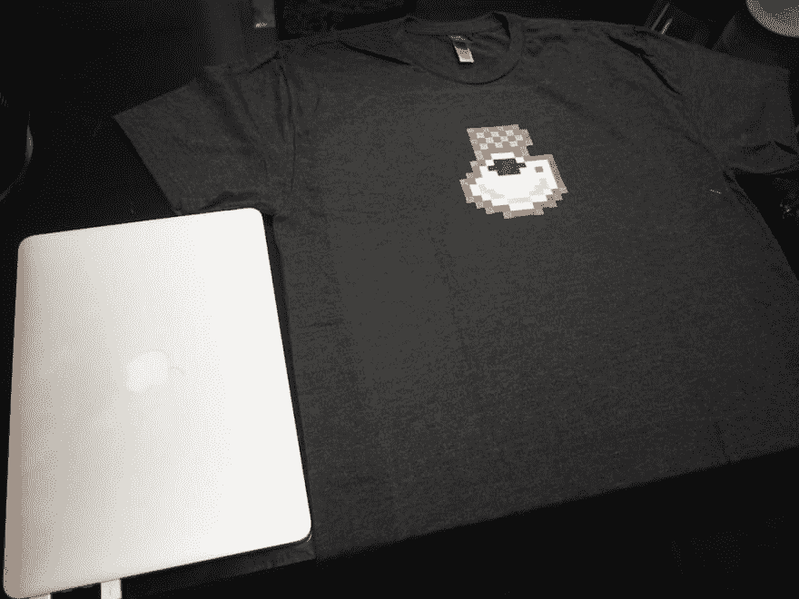](https://res.cloudinary.com/practicaldev/image/fetch/s--M-CHKGu---/c_limit%2Cf_auto%2Cfl_progressive%2Cq_auto%2Cw_880/https://cheeaun.com/blimg/photos/objects/pixelated-kopijs-t-shirt.jpg)

我免费赠送它们，主要是给那些我的 [Kopi 的常客。JS](https://kopijs.org/) meetups。这也是我第一次订购这么多衬衫，都装在一个巨大的塑料袋里。

[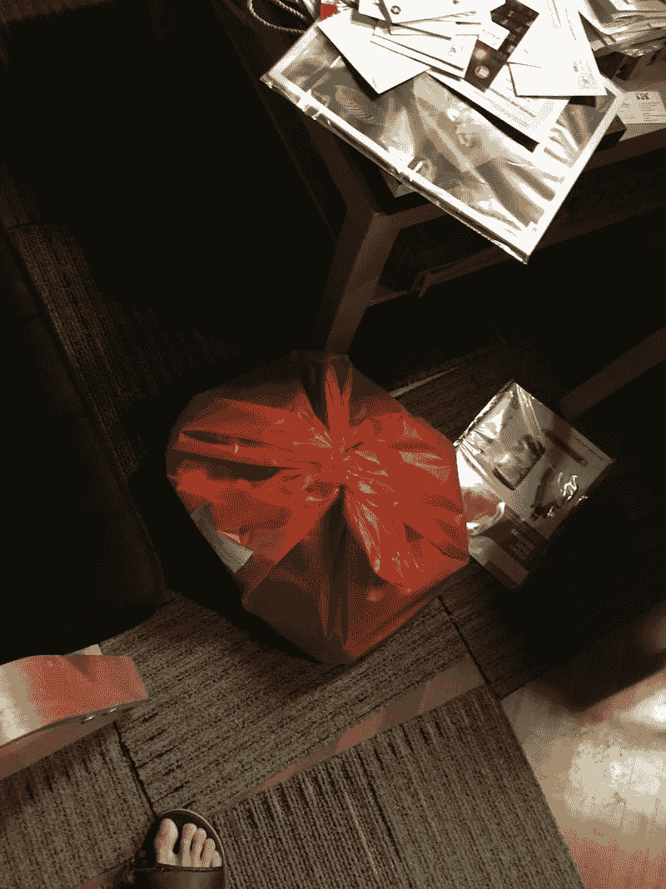](https://res.cloudinary.com/practicaldev/image/fetch/s--ewHFdGDu--/c_limit%2Cf_auto%2Cfl_progressive%2Cq_auto%2Cw_880/https://cheeaun.com/blimg/photos/objects/plastic-bag-pixelated-kopijs-t-shirt.jpg)

收到这些衬衫的人们似乎很喜欢这些衬衫，这让我感到很高兴。🤗

2016 年 9 月 19 日，我从 Cottony 订购了*另一批*、 **30 件**印有[米罗恐龙标志的 t 恤](https://dribbble.com/shots/2630937-Milo-Dinosaur-2nd-attempt-pixel-art-edition)。这是同样的下一级三混纺船员，价格 606.60 新加坡元(免费送货，每件衬衫 20.22 新加坡元)，但用丝网印刷代替。

[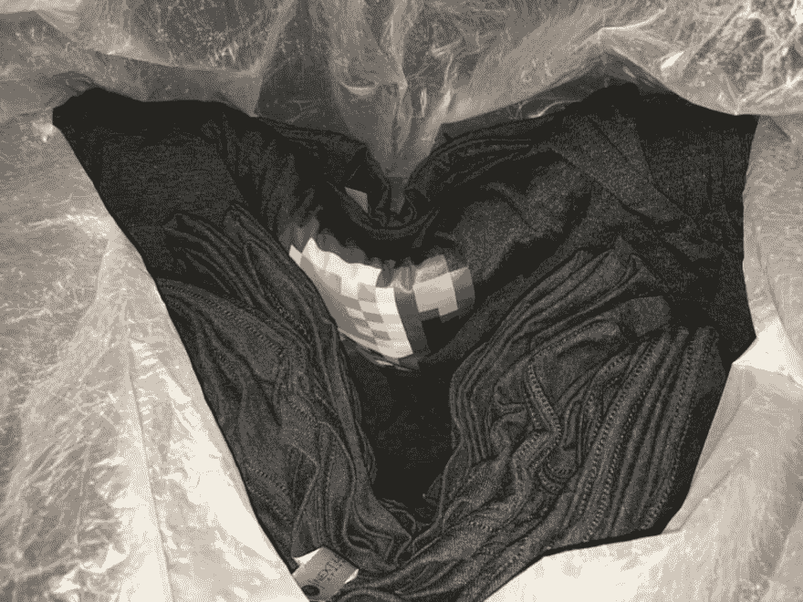](https://res.cloudinary.com/practicaldev/image/fetch/s--UGijiLx5--/c_limit%2Cf_auto%2Cfl_progressive%2Cq_auto%2Cw_880/https://cheeaun.com/blimg/photos/objects/plastic-bag-milo-dinosaur-t-shirt.jpg)

好了，现在，我提到了 DTG(直接到服装)和丝网印刷。有什么[区别](https://www.printful.com/blog/dtg-vs-screen-printing/)？

*   DTG
    *   理想的小批量，因此影响最小订单😏。
    *   适合细节设计和照片，有很多颜色。
    *   对于大批量来说变得更加昂贵。
*   丝网印刷
    *   非常适合颜色有限的简单设计(我必须指定颜色的数量😅)
    *   对于大批量(例如 30 件以上)具有成本效益。

这就有点困难了。如果我有一个复杂的设计，我会选择 DTG，但它会更贵。如果我有预算意识，我会调整作品以包含较少的颜色，这样它就可以改为丝网印刷。

[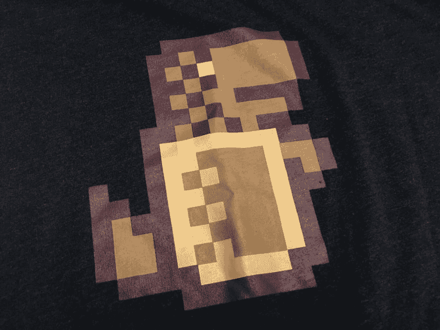](https://res.cloudinary.com/practicaldev/image/fetch/s--b7g_1s0i--/c_limit%2Cf_auto%2Cfl_progressive%2Cq_auto%2Cw_880/https://cheeaun.com/blimg/photos/objects/milo-dinosaur-t-shirt.jpg)

丝网印刷的艺术品确实看起来更[有活力](https://twitter.com/choonkeat/status/809671249202810880)，但感觉也更*有粘性*(我个人的描述，有人形容为*更厚*)。DTG 印刷的艺术品摸起来有点粗糙，但不粘手。

在与棉絮般的人们交谈后，我订购的第一批是 DTG 印刷的水性油墨，而第二批是丝网印刷的“橡胶染色的水性油墨”，我想他们称之为塑料溶胶(？).

根据我的[研究](https://welogoit.com/blog/2018/05/types-of-ink-used-in-screen-printing)，可以用于丝网印刷的油墨**有三种**；塑料溶胶油墨、水性油墨和拔染油墨。🤯天啊，我不仅需要了解各种印刷方法，还需要了解每种印刷方法所用的墨水？！？更不用说这些墨水和印刷方法还取决于衬衫所用的面料！😱

2017 年 11 月，我和我的联合组织者为[超级愚蠢黑客马拉松](https://supersillyhackathon.sg/)印制了 **35** tri-blend t 恤。有 **26** [贝拉+帆布](https://www.bellacanvas.com/)男女通用的三色混纺 t 恤(10 码、5 码、4 码、1 码 XXL)和 **9** [Tultex](https://tultex.com/) 女式剪裁 polycotton t 恤(5 码、2 码、2 码)。没有 BELLA+CANVAS 女式剪裁的库存，所以我们退而使用 Tultex。

[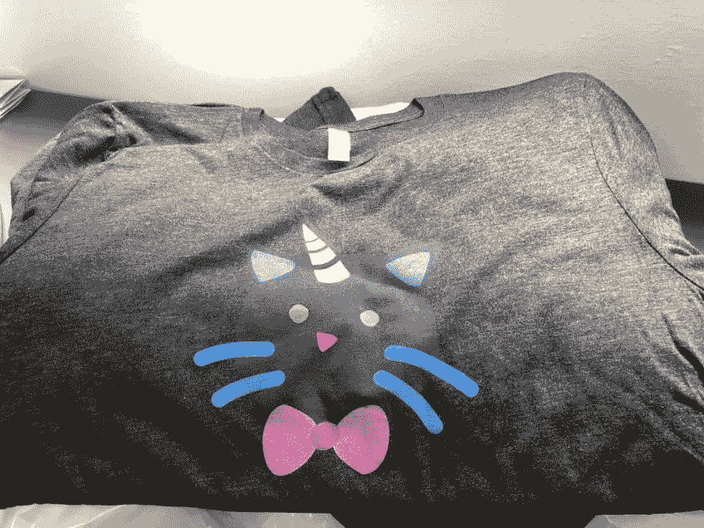](https://res.cloudinary.com/practicaldev/image/fetch/s--x8uJA-lq--/c_limit%2Cf_auto%2Cfl_progressive%2Cq_auto%2Cw_880/https://cheeaun.com/blimg/photos/objects/super-silly-hackathon-unicat-tshirt.jpg)

有趣的是，有人担心这个艺术品，因为我们被告知，DTG 印刷方法无法实现设计的霓虹灯类型的颜色，将使他们不那么充满活力。人们建议用热转印来代替，这也比 DTG 便宜🤔。

当时，我决定不那么活跃也没关系，所以我们选择了 DTG。

这让我想到，什么是热传递？随着我的研究，我还发现了染料升华，这也是一种传热形式！它们有点相同，但又不同😵。[有什么区别？](https://www.coastalbusiness.com/blog/heat-transfer-paper-vs-sublimation.html)

*   传热
    *   适用于浅色和深色棉、聚酯纤维和涤棉混纺。
    *   在服装上添加一个层。
    *   更实惠，没有那么耐用。
*   染料升华
    *   仅适用于聚酯织物，不含 100%棉。
    *   据说只对白色或浅色织物有效。
    *   墨水成为织物的一部分。
    *   更耐用，更贵。

除此之外，我还发现不同品牌的衬衫剪裁和尺寸也不一样，即使它们都是男女通用的。我认为这是意料之中的，因为所有这些提供商都没有遵循标准。🤷‍♂️

以下是我学到的一些东西:

*   **面料** —棉、涤纶&人造丝。
*   **印刷方式** — DTG、丝网印刷、热转印&染料升华。
*   **油墨** —塑料溶胶，水性&放电。
*   **尺码&裁剪** —男女通用&女式裁剪，因品牌而异。

所有上述因素都会影响这些要求，或者会受到这些要求的影响:

*   **衬衫件数**(最小订单或大批量订单)
*   **费用**
*   **颜色数量**
*   **衬衫上的印刷质量**(粘性、粗糙、光滑等)
*   **衬衫质量**(耐用性、透气性、柔软度、洗涤次数等)
*   **生产提前**时间和**交货**时间

这就像一个平衡的行为。如果我想让印花充满活力，可以印在布料上，摸起来有粘性或 T2 粗糙感。如果我的订单数量很少，那只能限于 DTG，因为那里更便宜。如果我想要一件混纺面料的高品质衬衫，一些印花方法可能行不通。如果设计很复杂，制作可能需要更长的时间，我可能无法及时拿到衬衫。

根据我的观察和直觉，除了之外，也没有办法衡量衬衫的投资回报率。如果我试图节约成本，为一个会议生产低质量的衬衫，人们可能会穿一次就再也不会穿了。如果衬衫尺寸不匹配，特别是对于需要女式剪裁的女性来说，他们可能最终会变成睡衣或者被做成[KonMari](https://konmari.com/)ed。

大多数公司或组织都希望他们的标识能突出 T1，让它们变得 T2 大 T3，充满活力，甚至出现在 T4 衬衫的两面 T5。我个人觉得他们*太多*。引人注目的标志确实吸引了人们的注意力，这达到了目的，但当人们走在街上或进行对话时，总是看到我的衬衫而不是我的脸，这很奇怪。对于女人来说，这是一个典型的“我的眼睛在上面”的场景，这种情况在作为男人的我身上并不常见😅。如果我穿谷歌 t 恤，人们会以为我在那里工作，而我不得不一遍又一遍地解释我不是😅。

在过去的几年里，我收集 t 恤，穿上它们，印上它们，我为**最好的** t 恤赠品*制定了**终极**配料*:

1.  **三混纺**面料，只因为。如果预算有限的话。
2.  用**排墨**进行丝网印刷。或者任何让墨水成为织物一部分的印刷方法。DTG 是最后可靠的退路。
3.  黑色衬衫或深色衬衫上的单色**灰色标志**。艺术品上没有吸引人的颜色。由于采用了墨水，让它自然融入衬衫。
4.  多做一点,[提供**合身剪裁的**衬衫](https://geekfeminism.wikia.org/wiki/T-shirts)。

就我个人而言，我还没有成功实现这些目标，但是在不久的将来我会尝试更多。

## 贴纸👾

贴纸比衬衫更容易打印。作为一种随身携带的选择，它占用更少的空间和重量。大多数人，如果不是所有人，一般都喜欢贴纸，不论性别或背景。

我从会议和聚会上收集贴纸。有时候，如果 [款式](https://twitter.com/cheeaun/status/1077768107458887680) [超好看](https://twitter.com/cheeaun/status/1084031032406401025)或者[有](https://twitter.com/cheeaun/status/804229555472842754) [折扣](https://twitter.com/cheeaun/status/1003665983276441600)，我[甚至](https://twitter.com/cheeaun/status/494040132157054977) [买](https://twitter.com/cheeaun/status/678133207234031616) [他们](https://twitter.com/cheeaun/status/749984711011819520) [。我不会把它们贴在我的笔记本电脑上，也不会保存它们。我只是定期在像“极客早午餐 SG”这样的活动中免费赠送它们。](https://twitter.com/cheeaun/status/1030378312701378560)

[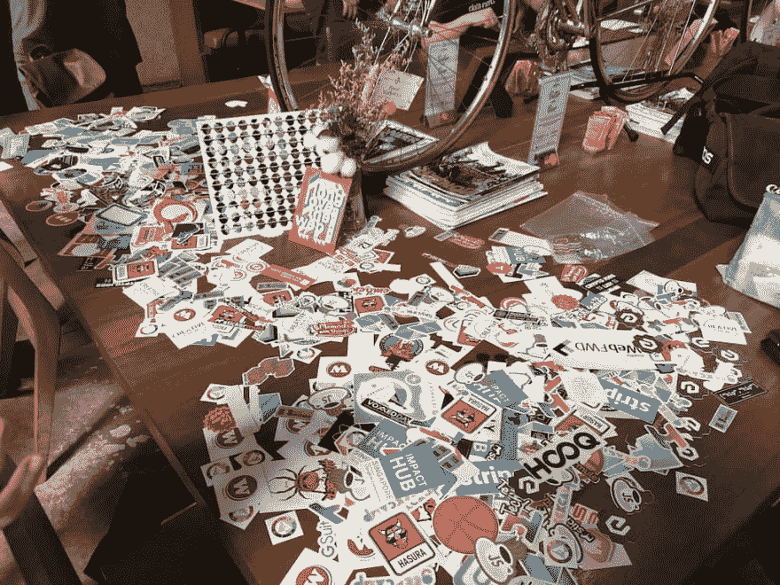](https://twitter.com/khorkexin/status/995182811718926336)

我在 2014 年开始我的贴纸印刷实验。我于 4 月 10 日在[从](https://twitter.com/kamal/status/453977995305181185)[贴纸骡](https://www.stickermule.com/)订购了[我自己的‘CA’标志贴纸](https://twitter.com/cheeaun/status/453946946340679680)。 **50 张**模切贴纸，51×51 毫米，售价 53 美元(免运费，每张贴纸 1.06 美元)。

[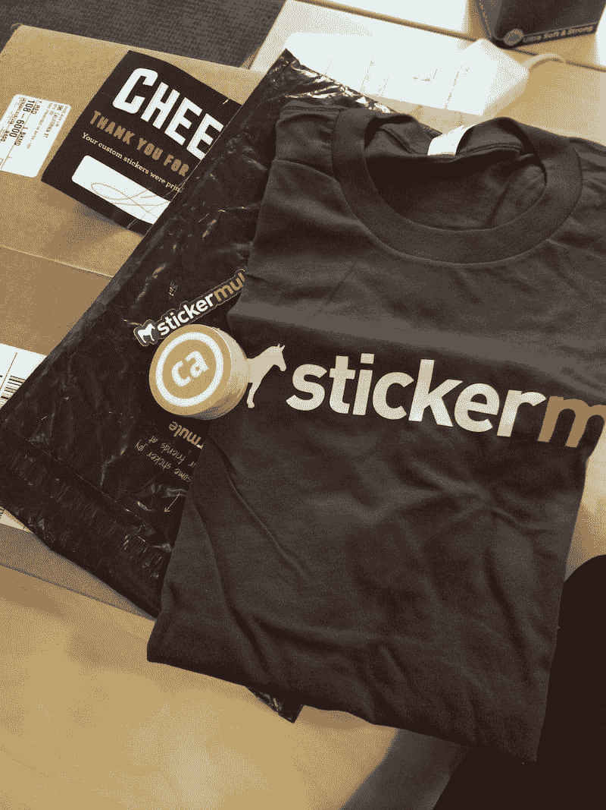](https://res.cloudinary.com/practicaldev/image/fetch/s--rBtl2qTY--/c_limit%2Cf_auto%2Cfl_progressive%2Cq_auto%2Cw_880/https://cheeaun.com/blimg/photos/objects/ca-logo-stickers-stickermule-t-shirt.jpg)

它非常整洁，包装精美。免费 t 恤是当时促销活动的一部分。我认为它是 100%棉的😏。

2014 年 5 月 29 日，我向另一家名为 [MOO](https://www.moo.com/) 的供应商订购了第二批。 **52** kiss-cut 贴纸，售价 12.74 美元(运费 1.75 美元，含 10 美元促销代码折扣，每张贴纸 0.25 美元)。

这显然与第一批不同😅。贴纸是由一个 4×4 的格子组合在一起的，而不是分开的。在上面的照片中不太明显，但这一批实际上比第一批*更有光泽*。当时真的一点都没想到会有这种差异。

2014 年 11 月 12 日，我打印了来自新加坡当地一家名为 [Touch & Print](https://www.touch-print.com.sg/) 的供应商的 KopiJS 贴纸。 **70 张**，5×5cm，售价 21.40 新加坡元(自行收藏，每张 0.31 新加坡元)。2014 年 11 月 19 日，我[再次尝试从另一家名为](https://twitter.com/cheeaun/status/535731502789558272) [Onedayprint](https://www.onedayprint.com.sg/) 的当地供应商处打印 KopiJS 贴纸。 **50 张**5×5cm，售价 32.35 新加坡元(自提，12 新加坡元*加工*费，每张 0.65 新加坡元)。

[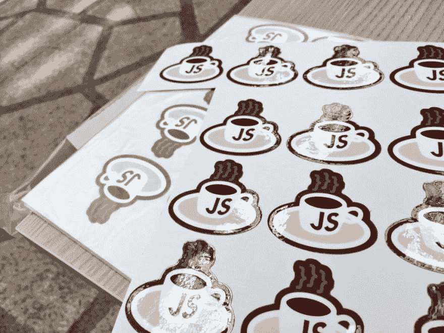](https://res.cloudinary.com/practicaldev/image/fetch/s--Iy7WHZLn--/c_limit%2Cf_auto%2Cfl_progressive%2Cq_auto%2Cw_880/https://cheeaun.com/blimg/photos/objects/kopijs-stickers-onedayprint.jpg)

它是巨大的。不是艺术品，而是整个贴纸本身！此外，很明显，在这张照片上，他们看起来*非常*光滑。

带着这些床单很麻烦。在[KopiJS # 7](https://github.com/KopiJS/kopi.js/issues/15)meetup 期间，我试图鼓励人们拿起这些贴纸，并让他们用剪刀剪下每一张贴纸😅。相比我的第一批(贴纸骡子的 CA logo)，贴纸分发流程和贴纸*获取*体验……还不够好😓。

为了再次确认我的判断，我[于 2014 年 11 月 27 日从 Sticker Mule 订购了另一批](https://twitter.com/cheeaun/status/545045379738116096)KopiJS 贴纸。

[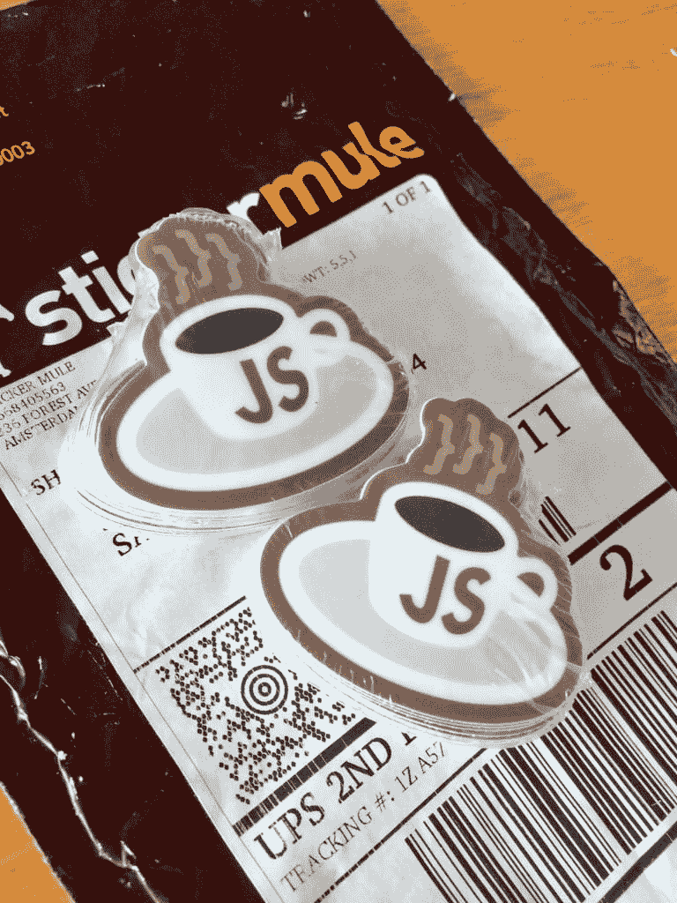](https://res.cloudinary.com/practicaldev/image/fetch/s--UKICcWYK--/c_limit%2Cf_auto%2Cfl_progressive%2Cq_auto%2Cw_880/https://cheeaun.com/blimg/photos/objects/kopijs-stickers-sticker-mule.jpg)

**100 张**模切贴纸，51×49 毫米，售价 68 美元(每张贴纸 0.68 美元)。它们没有光泽，不反光，略厚*，被切成单个的片而不是片，然后再次收缩包装。太好了！*

 *好吧，让我们退后一点，在这里做一点研究。

贴纸切割有两个术语:

*   模切-切穿乙烯基和纸衬。
*   吻切—切穿乙烯基，但不切纸背。

我个人认为模切看起来更酷，因为边缘是沿着艺术品或标志的形状切割的。模切没有意义的唯一例外是方形或矩形的艺术品。

模切也使*预览*不干胶标签在任何表面上的外观变得容易。

从我的观察来看，kiss-cut 只有在一次要打印多个艺术品的情况下才有用。所以大概可以 [5 到 6 件艺术品印在一张](https://www.stickermule.com/products/sticker-sheets)上。

这里有一个来自 RedDotRubyConf 的不错的吻痕贴纸的例子:

[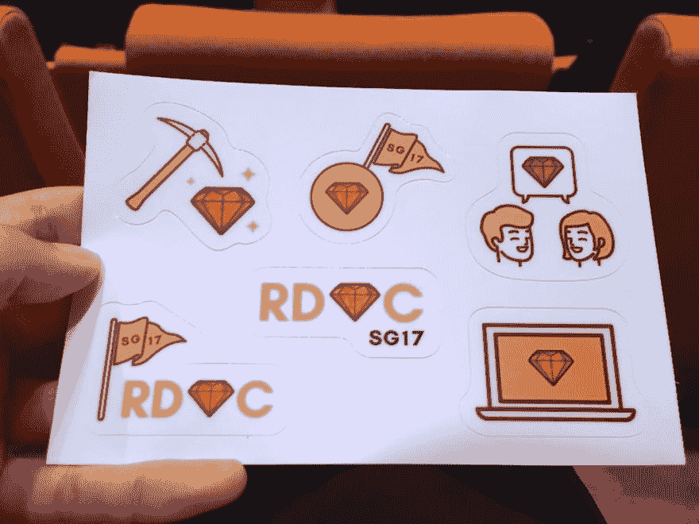](https://res.cloudinary.com/practicaldev/image/fetch/s--kQmYanc4--/c_limit%2Cf_auto%2Cfl_progressive%2Cq_auto%2Cw_880/https://cheeaun.com/blimg/photos/objects/reddotrubyconf-kiss-cut-stickers.jpg)

不幸的是，在新加坡，有相当多的本地印刷店既不模切，甚至不知道这意味着什么。为了加快生产速度和降低成本，在一大张纸上以网格形式印刷艺术品，然后用切纸机切割出来，会更容易、更有效。而且…那是*如果*打印店首先提供切割服务😅。

除了切割，还有一件事就是[的*类型*层压](http://www.joshcornett.me/what-is-sticker-lamination/):

*   光泽层压——反光、闪亮、更鲜艳的颜色。
*   哑光纹理——良好的质感，略显柔和的调色板和较低的对比度。

任何一种都可以，虽然我个人更喜欢哑光层压，只是因为它的手感和纹理😊。

2016 年 1 月，当我*拼命*寻找贴纸骡子(美国)的更便宜又好的替代品时，我发现了一个新的供应商，叫做 [StickerHD](https://stickerhd.com/en/) ，总部设在台湾。当时它看起来很新，我找不到他们是否能运到新加坡的任何信息，所以我给他们发了电子邮件。

[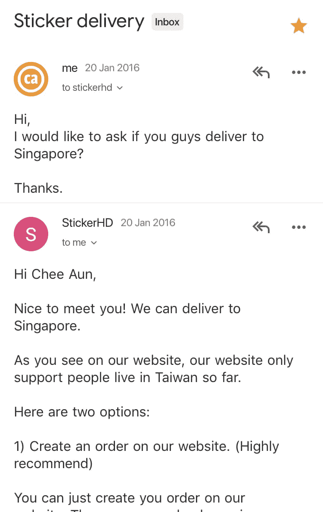](https://res.cloudinary.com/practicaldev/image/fetch/s--0IoAYzwy--/c_limit%2Cf_auto%2Cfl_progressive%2Cq_auto%2Cw_880/https://cheeaun.com/blimg/screenshots/software/sticker-delivery-stickerhd-email%402x.jpg)

原来我可能是新加坡或台湾以外第一个向他们订购的人😆。

我从 StickerHD 得到的第一个[订单](https://twitter.com/cheeaun/status/695599738708594690)是我的[像素化 KopiJS](https://dribbble.com/shots/2454364-KopiJS-logo-pixel-art-edition) 作品的 **50** 模切 5×5cm 贴纸。售价新台币 620 元(运费新台币 70 元，每张贴纸新台币 11 元；每张贴纸约 0.47 新加坡元或 0.33 美元)。

[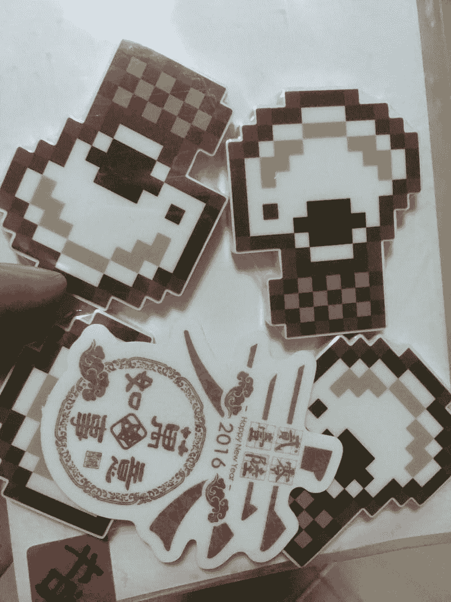](https://res.cloudinary.com/practicaldev/image/fetch/s--2q0aUVmH--/c_limit%2Cf_auto%2Cfl_progressive%2Cq_auto%2Cw_880/https://cheeaun.com/blimg/photos/objects/pixelated-kopijs-stickers-stickerhd.jpg)

不仅是收缩包装，它还被装在一个密封的袋子里！这比贴纸骡子更方便，因为每当我打开收缩包装找一副贴纸时，它们可能会掉出来，所以我总是需要另一个存储空间来保存它们。

质量也与标签骡子不相上下，价格便宜得多。从台湾到新加坡的船运最多需要两个星期。

我也很喜欢在开始打印之前的这个详细的预览确认步骤*:*

[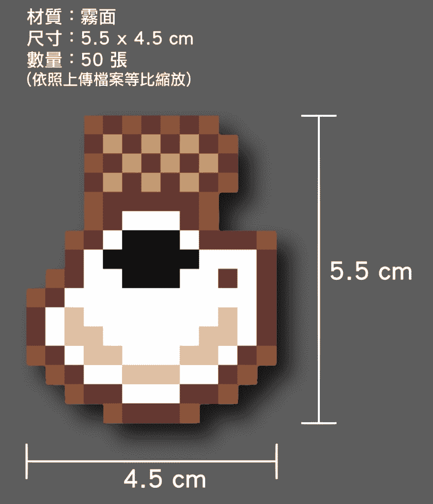](https://res.cloudinary.com/practicaldev/image/fetch/s--mV9onRea--/c_limit%2Cf_auto%2Cfl_progressive%2Cq_auto%2Cw_880/https://cheeaun.com/blimg/figures/diagram/pixelated-kopijs-preview-confirmation-stickerhd%402x.png)

它显示了你的贴纸的样子，有精确的尺寸！由于尺寸会影响定价，并且基于艺术品的实际尺寸，供应商必须重新调整宽度和高度的比例，而不是严格限制它们的最大长度。如果我选择在 5×5 厘米的贴纸上打印一个非矩形的作品，它应该相应地重新调整，例如 4.5×5.5 厘米，而不是 4×5 厘米。

从那以后，我从 StickerHD 打印了一大堆贴纸🤩。

【2016 年 3 月 3 日 — **100 张**模切[新加坡 CSS](https://singaporecss.github.io/) 贴纸和 **100 张**长方形[新加坡 JS](https://github.com/SingaporeJS) 贴纸，费用新台币 2200 元(运费新台币 200 元，每张贴纸新台币 10 元；每张贴纸约 0.42 新加坡元或 0.30 美元)。

[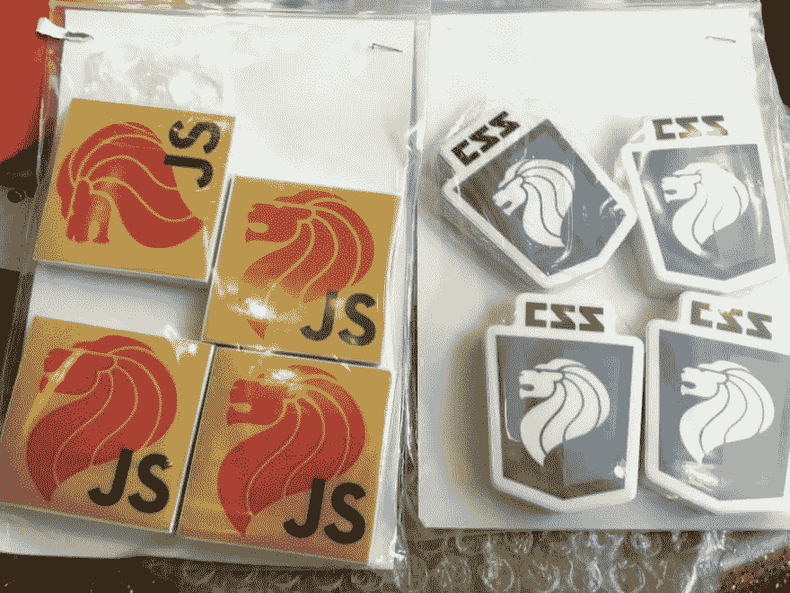](https://res.cloudinary.com/practicaldev/image/fetch/s--gj9QCip7--/c_limit%2Cf_auto%2Cfl_progressive%2Cq_auto%2Cw_880/https://cheeaun.com/blimg/photos/objects/singaporecss-singaporejs-stickers-stickerhd.jpg)

【2016 年 4 月 10 日 — **100 张** KopiJS、 **100 张**像素化 KopiJS 和 **100 张** Milo 恐龙贴纸，NTD 售价 3200 美元(运费 200 元，每张贴纸 10 元)。

[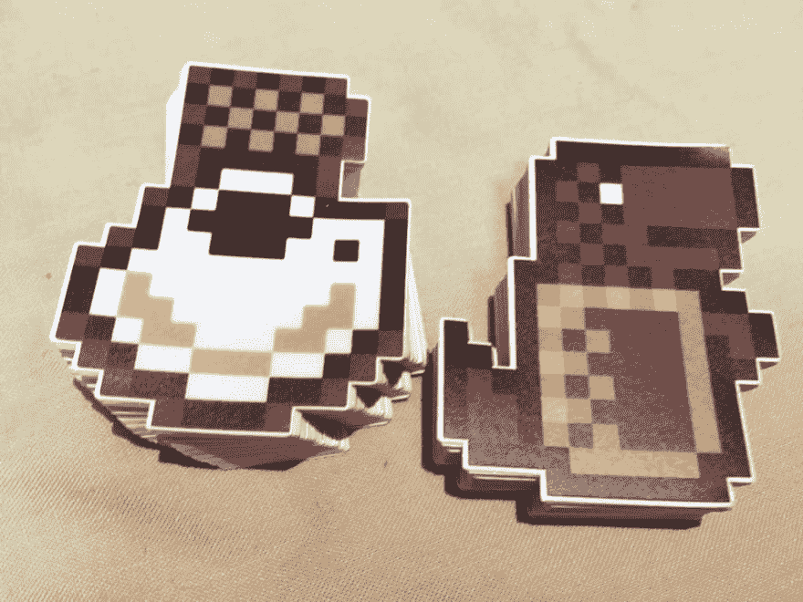](https://res.cloudinary.com/practicaldev/image/fetch/s--8BhBLEF---/c_limit%2Cf_auto%2Cfl_progressive%2Cq_auto%2Cw_880/https://cheeaun.com/blimg/photos/objects/pixelated-kopijs-milo-dinosaur-stickers-stickerhd.jpg)

还有**方式，方式更多……**💸💸💸

*   2016 年 5 月 18 日— **100 张**贴纸，新台币 1240 元。
*   2016 年 7 月 28 日— **150 张**贴纸，新台币 1760 元。
*   2016 年 8 月 6 日— **400 张**贴纸，新台币 3880 元。
*   2016 年 9 月 8 日— **200 张**贴纸，新台币 2020 元。
*   2016 年 10 月 3 日— **120 张**贴纸，新台币 1580 元。
*   2016 年 10 月 27 日— **600 张**贴纸，新台币 5540 元。
*   2017 年 3 月 1 日— **350 张**贴纸，新台币 3870 元。
*   2017 年 6 月 9 日— **700 张**贴纸，新台币 6580 元。
*   2017 年 10 月 27 日— **450 张**贴纸(300 张透明)，新台币 4700 元。
*   2017 年 11 月 18 日— **450 张**贴纸(200 张透明)，新台币 5370 元。
*   2017 年 12 月 17 日— **600 张**贴纸(400 张透明)，新台币 6310 元。
*   2018 年 2 月 4 日— **100 张**透明贴，新台币 1460 元。

注意[透明贴纸](https://stickerhd.com/en/catalogs/transparent-die-cut)是模切的，但边缘是透明的，而不是白色的。它们稍微贵一点，但是看起来更好。

[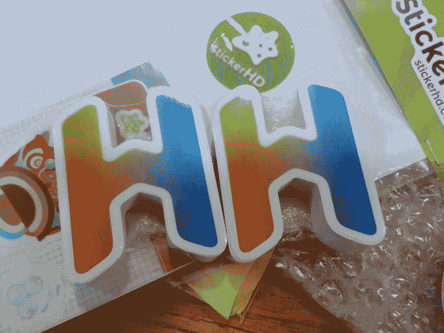](https://res.cloudinary.com/practicaldev/image/fetch/s--rNhPVKfS--/c_limit%2Cf_auto%2Cfl_progressive%2Cq_auto%2Cw_880/https://cheeaun.com/blimg/photos/objects/hackerweb-stickers-stickerhd.jpg)

[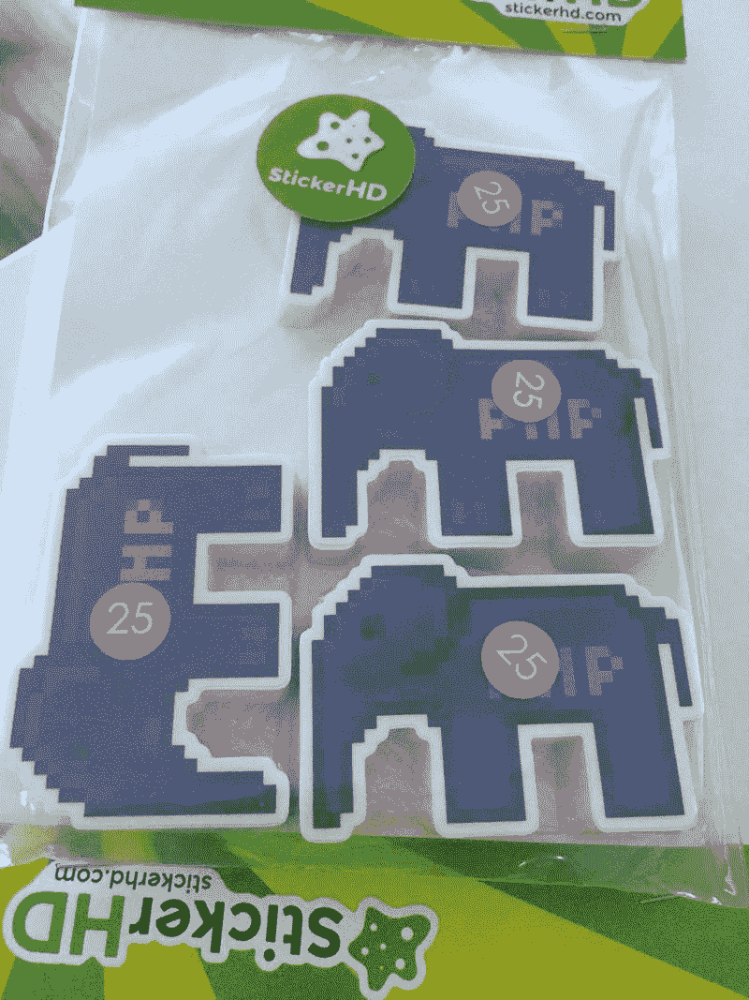](https://res.cloudinary.com/practicaldev/image/fetch/s--7HTwa6Nq--/c_limit%2Cf_auto%2Cfl_progressive%2Cq_auto%2Cw_880/https://cheeaun.com/blimg/photos/objects/phpconfasia-stickers-stickerhd.jpg)

[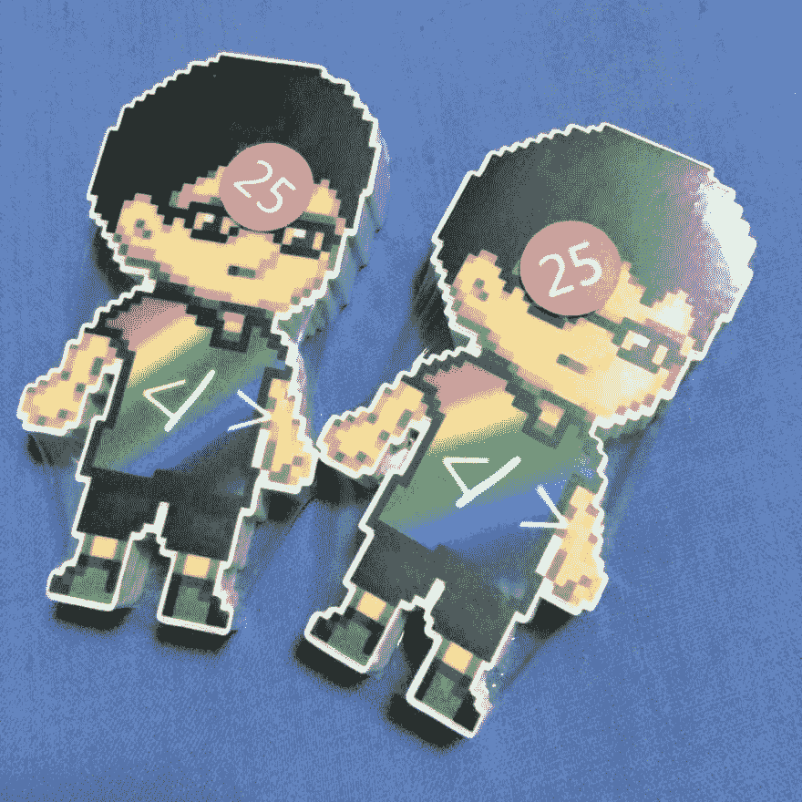](https://res.cloudinary.com/practicaldev/image/fetch/s--m-Hf8_WR--/c_limit%2Cf_auto%2Cfl_progressive%2Cq_auto%2Cw_880/https://cheeaun.com/blimg/photos/objects/huijing-stickers-stickerhd.jpg)

[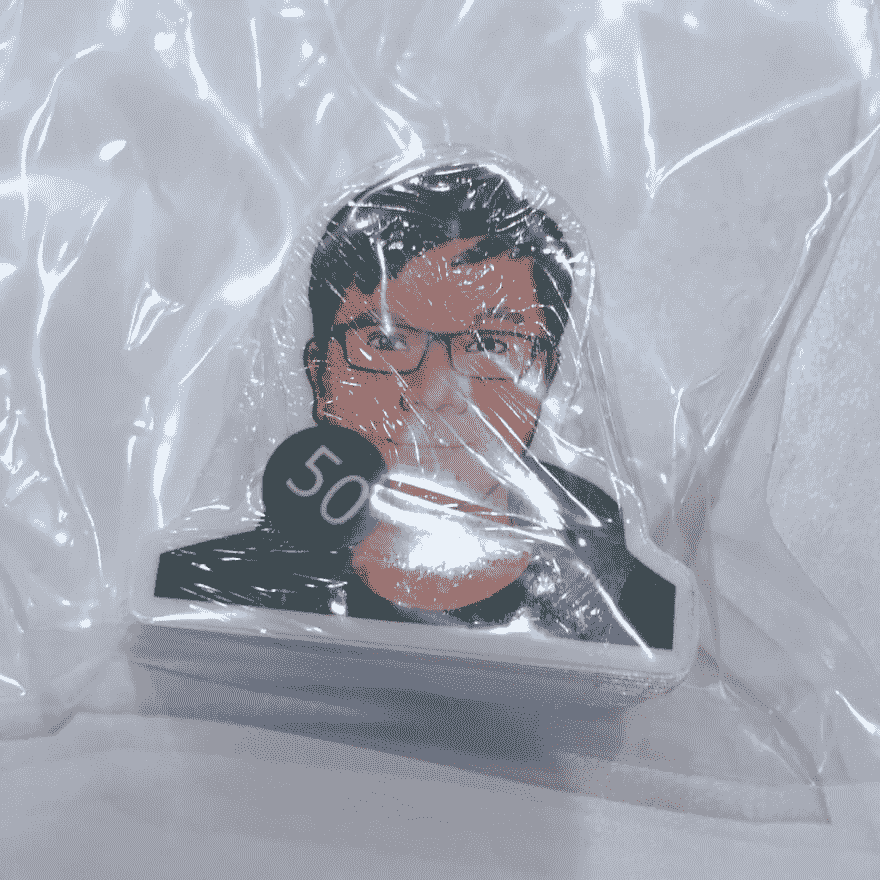](https://res.cloudinary.com/practicaldev/image/fetch/s--GZuIfVVw--/c_limit%2Cf_auto%2Cfl_progressive%2Cq_auto%2Cw_880/https://cheeaun.com/blimg/photos/objects/sausheong-stickers-stickerhd.jpg)

[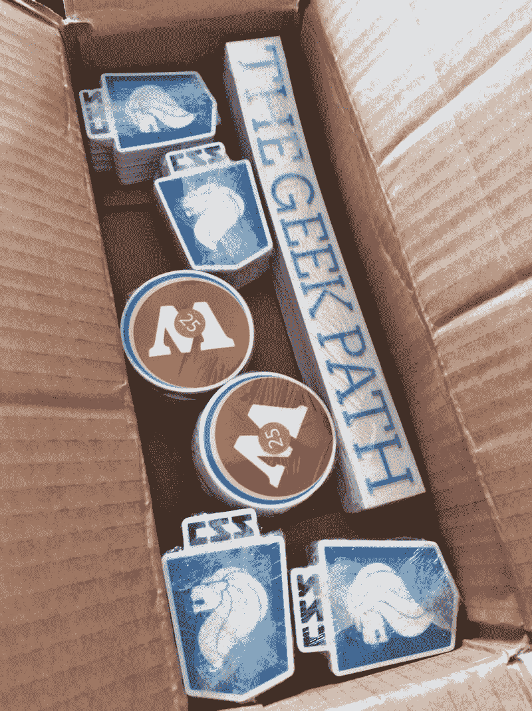](https://res.cloudinary.com/practicaldev/image/fetch/s--f1eEOycn--/c_limit%2Cf_auto%2Cfl_progressive%2Cq_auto%2Cw_880/https://cheeaun.com/blimg/photos/objects/the-geek-path-webuildsg-singaporecss-stickers-stickerhd.jpg)

[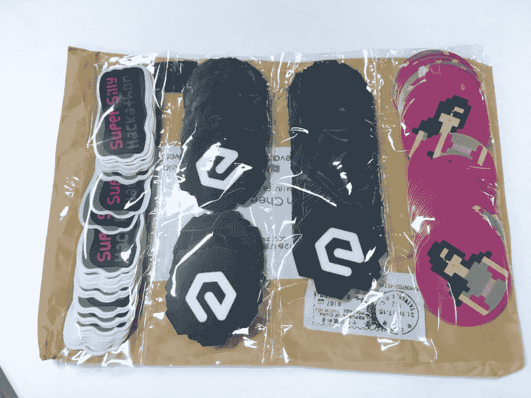](https://res.cloudinary.com/practicaldev/image/fetch/s--BSYAKR0z--/c_limit%2Cf_auto%2Cfl_progressive%2Cq_auto%2Cw_880/https://cheeaun.com/blimg/photos/objects/super-silly-hackathon-engineers-sg-renaysha-stickers-stickerhd.jpg)

[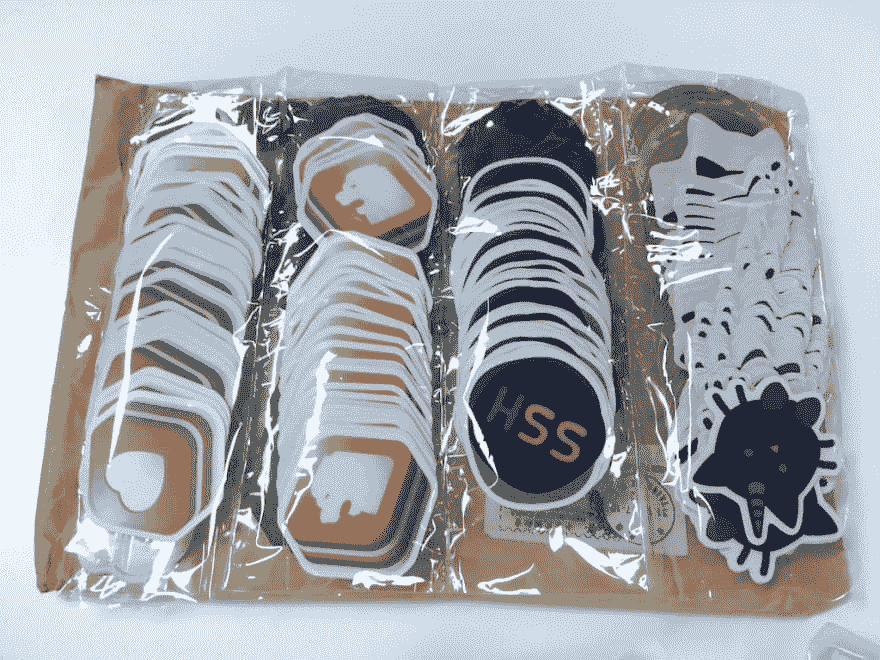](https://res.cloudinary.com/practicaldev/image/fetch/s--2vtRWRI8--/c_limit%2Cf_auto%2Cfl_progressive%2Cq_auto%2Cw_880/https://cheeaun.com/blimg/photos/objects/iosconf-sg-ssh-unicat-stickers-stickerhd.jpg)

[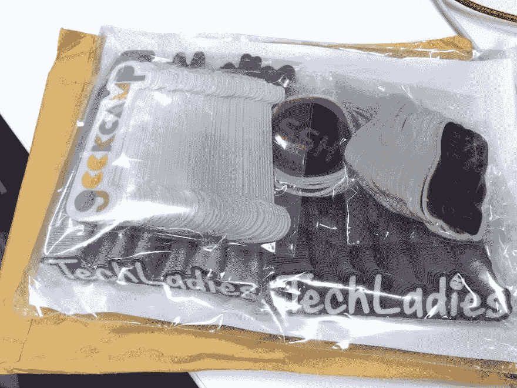](https://res.cloudinary.com/practicaldev/image/fetch/s--6h-p2Jxi--/c_limit%2Cf_auto%2Cfl_progressive%2Cq_auto%2Cw_880/https://cheeaun.com/blimg/photos/objects/geekcamp-sg-techladies-ssh-stickers-stickerhd.jpg)

[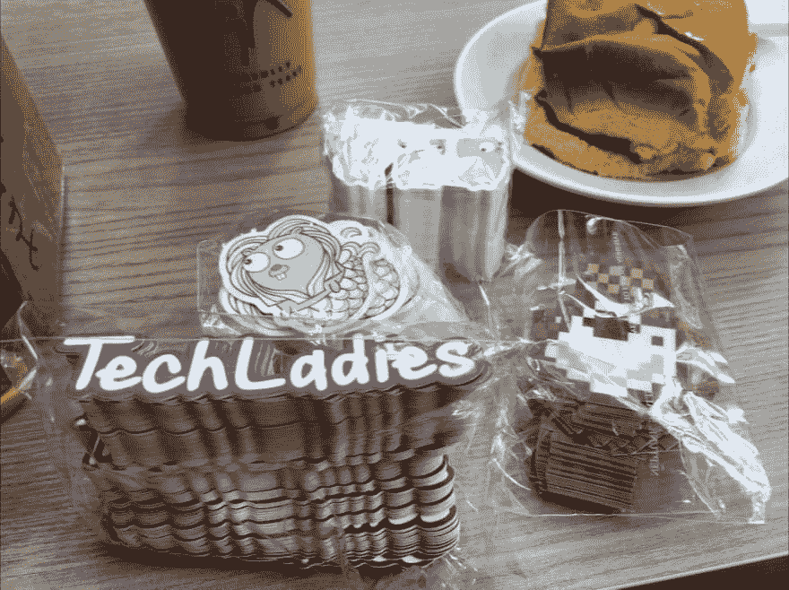](https://res.cloudinary.com/practicaldev/image/fetch/s--AKnkv_FV--/c_limit%2Cf_auto%2Cfl_progressive%2Cq_auto%2Cw_880/https://cheeaun.com/blimg/photos/objects/gophercon-sg-techladies-pixelated-kopijs-stickers-stickerhd.jpg)

[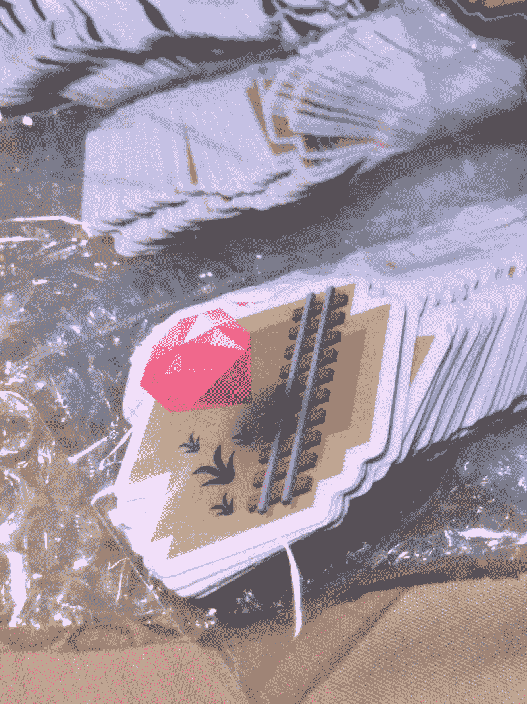](https://res.cloudinary.com/practicaldev/image/fetch/s--zL_DPnCl--/c_limit%2Cf_auto%2Cfl_progressive%2Cq_auto%2Cw_880/https://cheeaun.com/blimg/photos/objects/ruby-on-rails-stickers-stickerhd.jpg)

[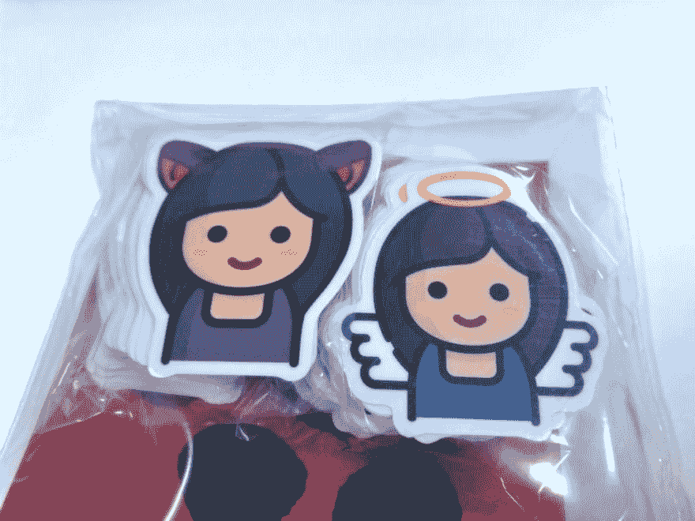](https://res.cloudinary.com/practicaldev/image/fetch/s--0dxeMP0j--/c_limit%2Cf_auto%2Cfl_progressive%2Cq_auto%2Cw_880/https://cheeaun.com/blimg/photos/objects/elisha-stickers-stickerhd.jpg)

这已经很多了。还有…还有更多😆。

尽管我一直忠实地使用 StickerHD，但我也一直在寻找其他供应商。我的意思是，检查一下竞争对手，看看谁能做得更好总是好的，对吗？

2017 年 2 月 18 日，我在印度找到了一家名为[Just sticks](https://juststickers.in/)的新供应商。我[订购了](https://twitter.com/cheeaun/status/838608228527190016) **200 张** 2.4×2.4" [*可重复使用*贴纸](https://juststickers.in/introducing-juststickers-reusable-stickers/)，价格为 101.80 美元(8.50 美元运费，含 15%折扣，每张贴纸 0.51 美元)。

[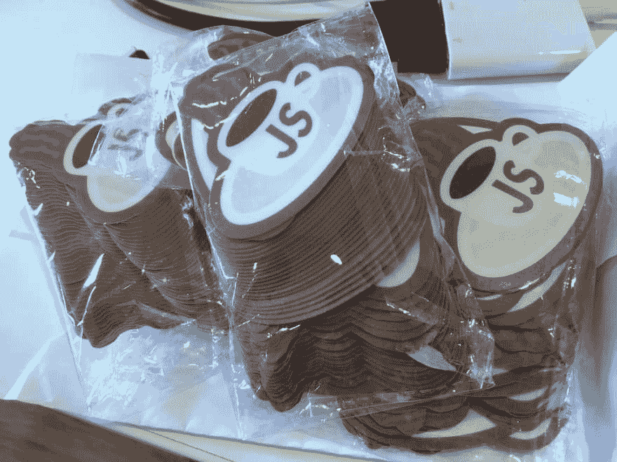](https://res.cloudinary.com/practicaldev/image/fetch/s--GvxuLBs7--/c_limit%2Cf_auto%2Cfl_progressive%2Cq_auto%2Cw_880/https://cheeaun.com/blimg/photos/objects/kopijs-stickers-just-stickers.jpg)

这就是所谓的*可重复使用的*贴纸，可以多次取下重新贴上，最多*差不多* 99 次！我从未真正尝试过对它们进行压力测试，但我认为这对贴纸来说是一个非常好的功能🙂。尽管如此，与我从其他供应商那里买的其他 KopiJS 贴纸相比，这些贴纸有点*薄*，颜色也有点褪色🤷‍♂️.

2017 年 4 月 21 日，我从[韦斯·博斯](https://twitter.com/wesbos/status/839474532322795521)的一条推文中发现*另一家*总部在中国的新供应商，名为 [Zigpac on Alibaba](https://wz-zigpac.en.alibaba.com/) 。我不得不在阿里巴巴网站上订购贴纸，这是我第一次试用。该网站可能会变得非常强大，感觉就像是工厂和供应商的在线市场。我花了一段时间去理解一些像信息中心之类的东西。阿里巴巴上的一些供应商不仅能生产贴纸，还能生产各种各样的东西！

一开始订的是 **200** 5×5cm KopiJS 贴纸。它们是哑光层压、模切的，包括运费在内的价格为 80 美元(每个标签 0.40 美元)。之后在 2017 年 5 月 8 日，他们发邮件给我说他们的工人误印了**1500 张**贴纸(？！)并问我是否想以 200 美元的价格购买其余的，总共 280 美元(每张 0.19 美元！这么便宜？！？😱).

我知道，这听起来可疑，但我还是接受了交易😂。有生以来第一次，[收到了](https://www.facebook.com/cheeaun/posts/10155456991151294)**1500 张**贴纸💥💥💥。

[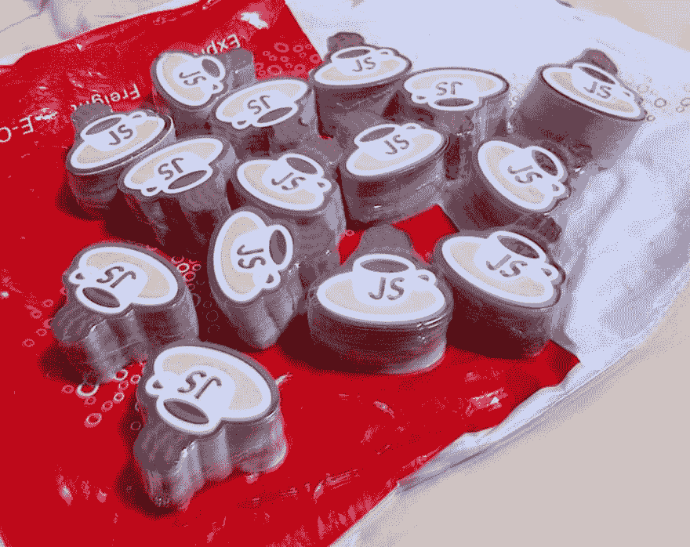](https://res.cloudinary.com/practicaldev/image/fetch/s--XqN4qD3Q--/c_limit%2Cf_auto%2Cfl_progressive%2Cq_auto%2Cw_880/https://cheeaun.com/blimg/photos/objects/kopijs-stickers-zigpac-alibaba.jpg)

令人惊讶的是，贴纸的质量相当不错😅(我原以为会很糟糕)。贴纸是热缩包装的，价格很便宜。很难说它是否比其他供应商便宜，因为对于大多数供应商来说，随着数量的增加，它会变得更便宜。

从中国或印度订购在地理上仍然离新加坡太远。我想要一个更近的供应商来减少运输时间和成本。附近可能有一些当地的供应商*可能*能够生产高质量的贴纸(模切、哑光层压)，但很难找到他们。

2018 年 7 月，我终于找到了另一家供应商，位于印度尼西亚(和新加坡？)，名为 [GoodieSwag](https://www.goodieswag.com/) 。我发了一封快速的电子邮件询问价格和质量。几经周折后，这位联合创始人似乎认识我，也看过我的贴纸😱。

于是我[订购了](https://twitter.com/cheeaun/status/1017336422322204672) **200 张**模切哑光层压 4.5×5.5cm 哑光乙烯基像素化 KopiJS 贴纸，售价 72 新元(运费 20 新元，每张贴纸 0.36 新元)。

[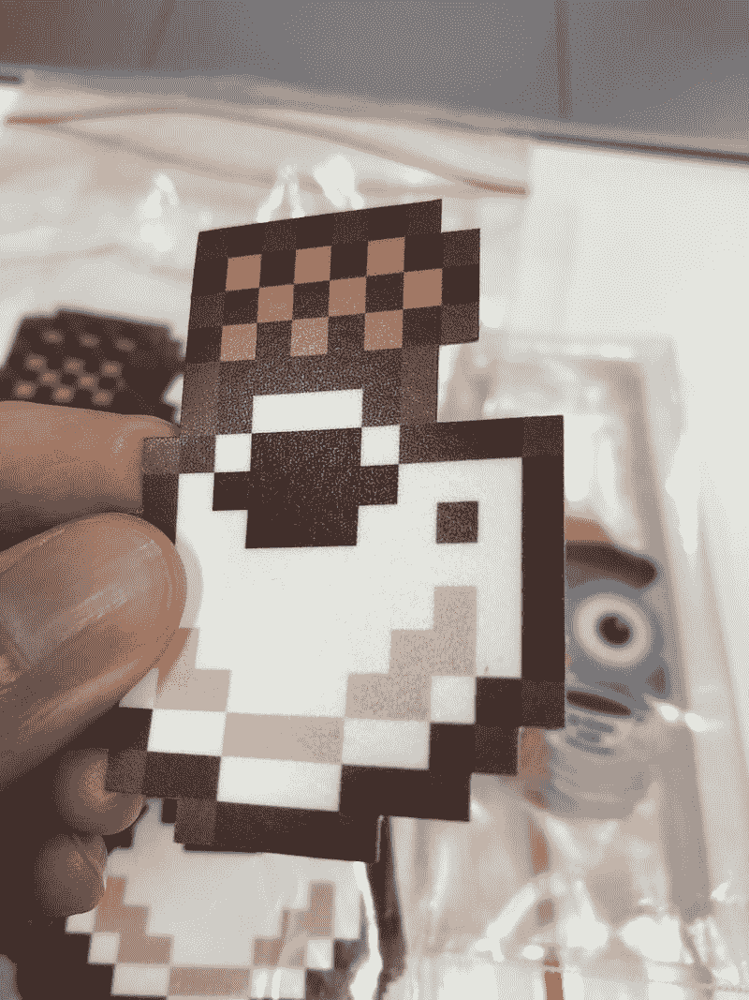](https://res.cloudinary.com/practicaldev/image/fetch/s--_VYgJCBI--/c_limit%2Cf_auto%2Cfl_progressive%2Cq_auto%2Cw_880/https://cheeaun.com/blimg/photos/objects/pixelated-kopijs-stickers-goodieswag.jpg)

2018 年 10 月 9 日，我再次从 GoodieSwag 订购贴纸。 **300 件**Unicat 艺术品，同样质量，95 新加坡元(运费 20 新加坡元，每张 0.32 新加坡元)。

[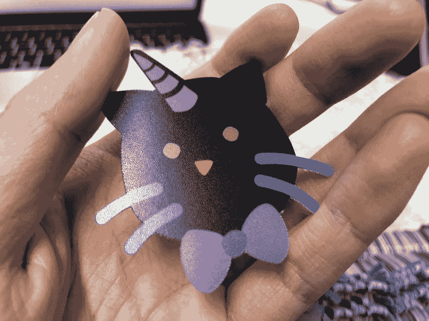](https://res.cloudinary.com/practicaldev/image/fetch/s--7E458gty--/c_limit%2Cf_auto%2Cfl_progressive%2Cq_auto%2Cw_880/https://cheeaun.com/blimg/photos/objects/unicat-stickers-goodieswag.jpg)

显然，我越来越擅长拍摄贴纸的特写照片😉。

这是一个全出血，印刷延伸到标签的边缘。另一种选择是边缘周围的白色边框。有些贴纸有白色边框，有些没有(全出血)。这是为什么呢？

有一些关于如何设置全出血打印的资源:

*   [贴纸骡子:如何设置全出血打印](https://www.stickermule.com/support/full-bleed)
*   [贴纸机器人:放气&安全区域](https://stickerobot.com/setup/bleed-and-safety-area/)
*   [99 设计:如何设计模切贴纸](https://99designs.com.sg/blog/design-tutorials/how-to-design-a-die-cut-sticker/)

大多数时候，客户(包括我自己)并不真的为艺术品“出血”做这些额外的工作。一些供应商会主动询问贴纸是否需要白色边框。如果没有，那么他们将做出血工作，并在开始打印前发送预览。根据设计，全出血可能不会使它看起来更好，有时甚至不可能。这有点像用匹配的背景“扩展”或“外推”艺术品的边缘，看起来像这样:

[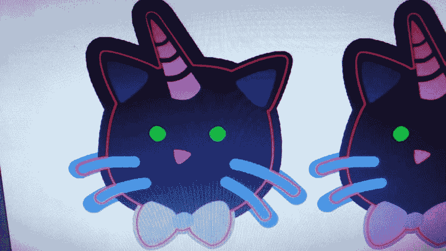](https://res.cloudinary.com/practicaldev/image/fetch/s--I-8ACRNj--/c_limit%2Cf_auto%2Cfl_progressive%2Cq_auto%2Cw_880/https://cheeaun.com/blimg/photos/objects/unicat-sticker-full-bleed-design-preview.jpg)

红线是他们将剪去贴纸边缘的地方。

在定制印刷了超过 7200 张贴纸 5 年后，我开始觉得自己像一个“贴纸之神”😂。

以下是打印贴纸时需要考虑的事项:

*   模切或吻切——我更喜欢前者，因为它看起来更好。
*   哑光或光泽层压——我都试过，通常更喜欢哑光，但有时，光泽看起来很酷。
*   全出血或白色边框——同样，取决于设计。
*   可重用性——在我看来，这很好，但不是必需的。
*   供应商的基本位置—尽一切努力减少运输时间和成本。
*   打印流程—通过网站或电子邮件订购、打印前预览确认以及客户支持。

最后一个最容易被忽视的因素是设计本身。在形状、大小和颜色方面没有限制。从字面上看*任何东西*都可以被打印成贴纸，甚至包括[一只猫的脸](https://twitter.com/cheeaun/status/482528758541209600)(照片而不是电脑生成的艺术)。但是作为一个赠品，这并不意味着它们会起作用，人们会想要它们。即使人们拿到了贴纸，也不意味着他们会去贴。如果没人贴，那就没有必要一开始就印贴纸💥。

因此，以下是我个人认为最好的贴纸设计公式:

1.  **可爱的动物、吉祥物或标志**。无聊的公司或项目标志是好的，但非常局限于那些是他们的粉丝。
2.  **没话说**。除非它朗朗上口或者*在某些方面非常*有意义。
3.  **绚丽夺目**。因为谁愿意贴一个长相平平的贴纸对吗？

例如，GitHub 在这方面做得非常好:

[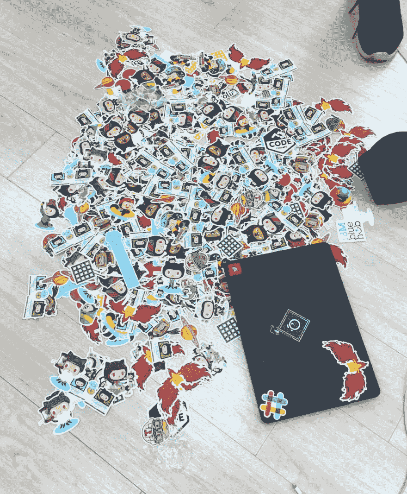](https://res.cloudinary.com/practicaldev/image/fetch/s--bzYbGFyA--/c_limit%2Cf_auto%2Cfl_progressive%2Cq_auto%2Cw_880/https://cheeaun.com/blimg/photos/objects/github-others-stickers-floor-devrelcon-tokyo-2017.jpg)

## 磁铁🧲

我曾经相信磁铁将是我实验的下一个逻辑步骤。我的意思是，贴纸和磁铁都粘在一个表面上，所以它们没有太大的区别，对吗？

反正…太诱人了，我都忍不住去尝试了。2014 年 4 月 14 日，我[从](https://twitter.com/cheeaun/status/457360252577406976) [Zazzle](https://www.zazzle.com/) 订购了我的‘CA’标识的 **10** [2.25”圆磁铁](https://www.zazzle.com/pd/spp/pt-zazzle_magnet?size=2.25&style=round_magnet)。售价 35.06 美元(6.89 美元运费，2.27 美元税，8.60 美元折扣，每个磁铁 3.51 美元)。

[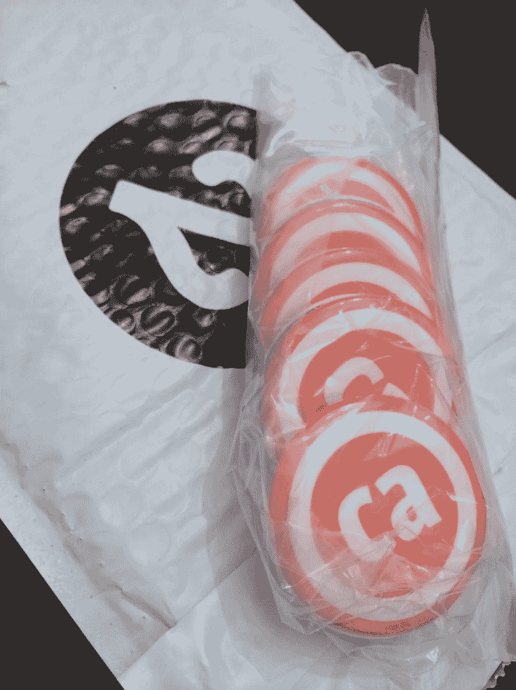](https://res.cloudinary.com/practicaldev/image/fetch/s--gGIdWCnw--/c_limit%2Cf_auto%2Cfl_progressive%2Cq_auto%2Cw_880/https://cheeaun.com/blimg/photos/objects/ca-logo-magnets-zazzle.jpg)

这些又大又厚！磁铁也很强，真的能粘在冰箱上(是的，我对此表示怀疑)。显然，它们比贴纸贵多了💸。

2016 年 9 月 7 日，我[从](https://twitter.com/cheeaun/status/777531446302871553)[贴纸骡](https://www.stickermule.com/products/custom-magnets)订购了 **30** 51×49mm KopiJS 磁铁，价格为 51 美元(免运费，每个磁铁 1.70 美元)。

[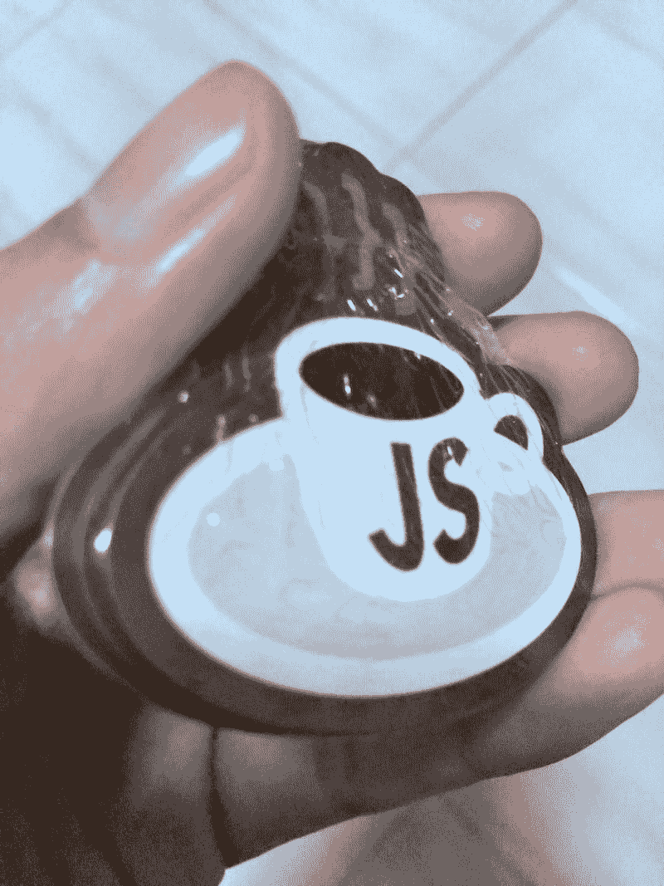](https://res.cloudinary.com/practicaldev/image/fetch/s--ZmyX66pU--/c_limit%2Cf_auto%2Cfl_progressive%2Cq_auto%2Cw_880/https://cheeaun.com/blimg/photos/objects/kopijs-magnets-sticker-mule.jpg)

这些比第一个薄得多。感觉就像一张贴纸被粘在了后面的一块薄磁铁上。它仍然比普通的贴纸厚，但是感觉出人意料地可弯曲。我以为磁铁应该是纯固体，但这些被称为 [*柔性*磁铁](https://www.stickermule.com/support/are-your-magnets-flexible)，可以作为[片或带](https://www.wonkeedonkeetools.co.uk/magnets-flexible/what-is-a-flexible-magnet/)购买。🤔

“CA”磁铁相当受欢迎。这些 KopiJS 磁铁…不像大多数人那样困惑它们是贴纸还是磁铁。即使这样，也很难找到地方让*粘上*它们，除了……冰箱😅。

一开始很酷，但是新鲜感很快就消失了😐。

## 绣花贴纸🧶

印了这么多贴纸，我还想要更多。磁铁没能成功。我必须回到基础，并从那里扩展我的想法。

我不记得我是如何产生刺绣贴纸的想法的，但有几次:

*   我在一些潮人店里随机看到了刺绣的烫金贴片。
*   我在一些会议上看到了真正的刺绣贴纸。
*   我意识到，这些可爱的动物贴纸需要有一些纹理或其他东西来变得更可爱。

我的第一个行动是找到一个可以打印刺绣贴纸的当地供应商。我最初遇到的是总部设在新加坡的皮尤皮尤补丁公司。我给他们发了邮件询问价格，最低订购量为 100 张时，每张贴纸大约 4 新加坡元。我不确定它们是否是标准的市场价格，但我决定我不能花这么多钱在这些还没有被*证明*或*主流*的实验品上，比如衬衫和普通的贴纸。

由于我有了在阿里巴巴印刷贴纸的处女经验，我决定再次尝试刺绣贴纸。见鬼，我花了很长时间浏览所有的供应商，比较他们，阅读评论，检查价格，从他们以前的作品中判断质量，并对供应商进行背景调查。

与此同时，我还学习了许多新术语:

*   类型—刺绣或编织。
*   面料——斜纹、方格布、缎子、毛毡、帆布或亚麻。
*   边界—缝合/拼接、热切割或激光切割/模切。
*   背衬——无、熨烫、织物、钩环、别针或不干胶(我想要的那种)。

我一本正经地在谷歌上搜索了所有的条款，并记下了利弊。

最初我不明白刺绣和编织的区别。我不知道为什么我会选择刺绣，但知道有一种替代方式真的很酷🤔。让我们进入[细节](https://www.gs-jj.com/blog/woven-patches-vs-embroidered-patches/):

*   刺绣

    *   更粗更乱。看起来*经典*或者*复古*。
    *   比较贵。
*   编织的

    *   更细的线，更精细的细节，更光滑的表面，更明亮的颜色，看起来*更平*。
    *   更便宜。

天真地说，编织就像是一种进化而来的、*现代*版本的刺绣。它更好，但看起来很漂亮*无聊*因为我看不出反对*实际*印刷贴纸的利弊。刺绣更厚重，不那么精致，给人一种老派的感觉。既然比较厚，摸上去感觉质感也更好。它的不完美就是它的魅力。

在做了大量的调查后，我最终归结为两个潜在的供应商。

2018 年 3 月 18 日，我[从](https://twitter.com/cheeaun/status/988651730425397248)[深圳市鑫宝源织造有限公司](https://xbylabel.en.alibaba.com/)订购了 [Gophercon SG 吉祥物](https://gophercon.sg/)的 **100 张**绣花贴纸。100%刺绣，5×5cm，斜纹面料，热切割边缘，背胶，成本 101 美元(26 美元 DHL 运费，每张贴纸 1.01 美元)。

[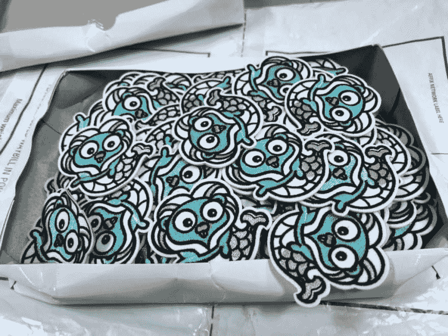](https://res.cloudinary.com/practicaldev/image/fetch/s--Gs3_s6o5--/c_limit%2Cf_auto%2Cfl_progressive%2Cq_auto%2Cw_880/https://cheeaun.com/blimg/photos/objects/gophercon-sg-embroidered-stickers-shenzen-xinbaoyuan-weaving.jpg)

[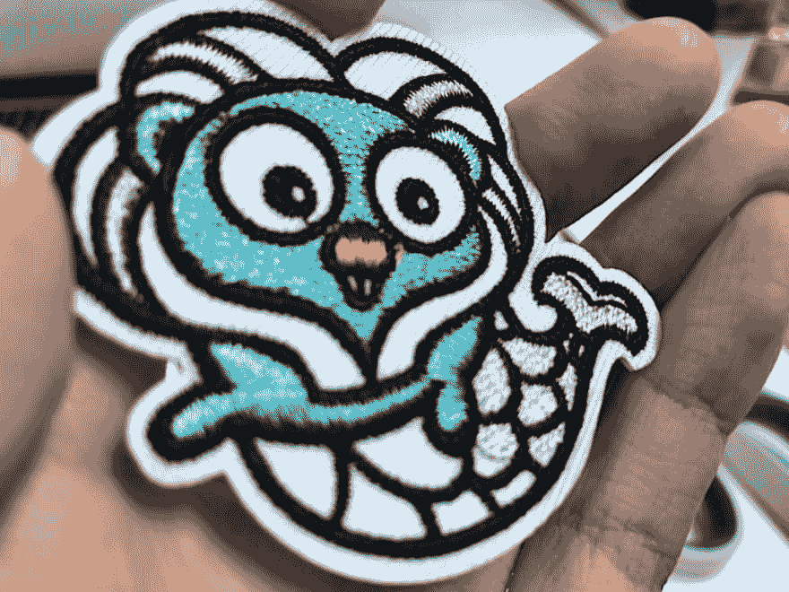](https://res.cloudinary.com/practicaldev/image/fetch/s--A4fiHv7v--/c_limit%2Cf_auto%2Cfl_progressive%2Cq_auto%2Cw_880/https://cheeaun.com/blimg/photos/objects/gophercon-sg-embroidered-stickers-close-up-shenzen-xinbaoyuan-weaving.jpg)

我有一种感觉，这实际上是编织的，也许…部分是刺绣的？🤷‍♂️

2018 年 3 月 21 日，我[向](https://twitter.com/cheeaun/status/983689034894462978)订购了[深圳欧尔斯礼品有限公司](https://awellsgift.en.alibaba.com/)的 **100** 刺绣贴纸。100%刺绣，5×5cm，热切割边缘，背胶，售价 69.44 美元(运费 26.94 美元，每张贴纸 0.69 美元)。

[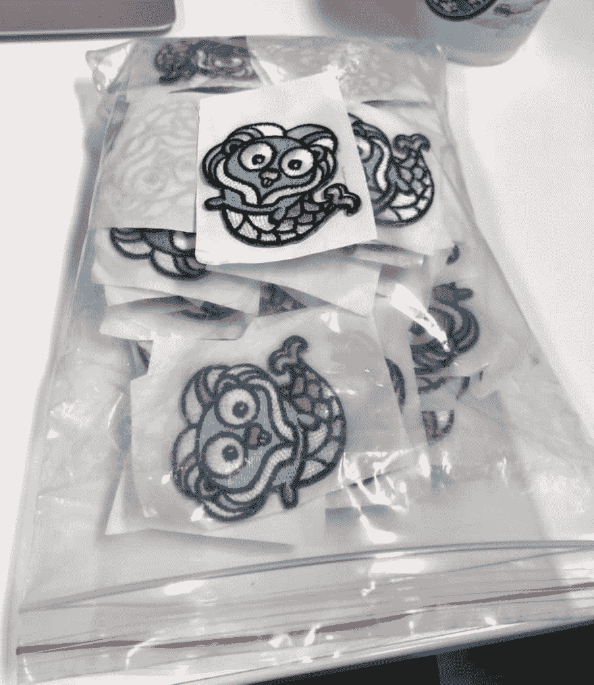](https://res.cloudinary.com/practicaldev/image/fetch/s--byNgyor4--/c_limit%2Cf_auto%2Cfl_progressive%2Cq_auto%2Cw_880/https://cheeaun.com/blimg/photos/objects/gophercon-sg-embroidered-stickers-shenzen-awells-gift.jpg)

[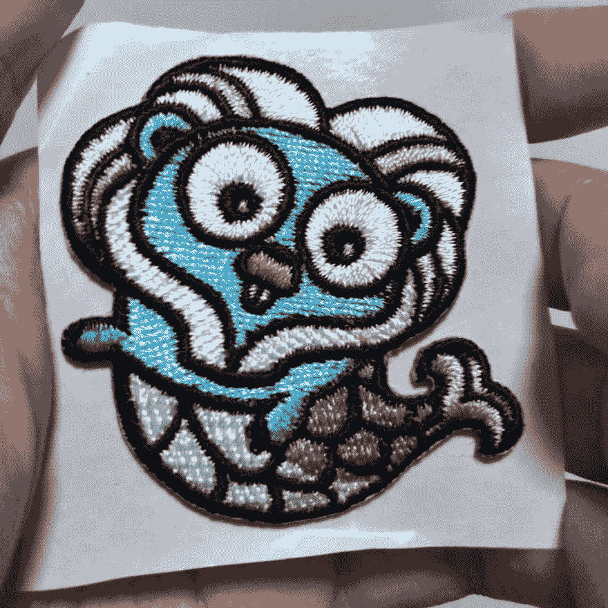](https://res.cloudinary.com/practicaldev/image/fetch/s--66aWZA4G--/c_limit%2Cf_auto%2Cfl_progressive%2Cq_auto%2Cw_880/https://cheeaun.com/blimg/photos/objects/gophercon-sg-embroidered-stickers-close-up-shenzen-awells-gift.jpg)

看起来更好，虽然不是 100%模切，背面有胶纸。

这是一张对比照片:

[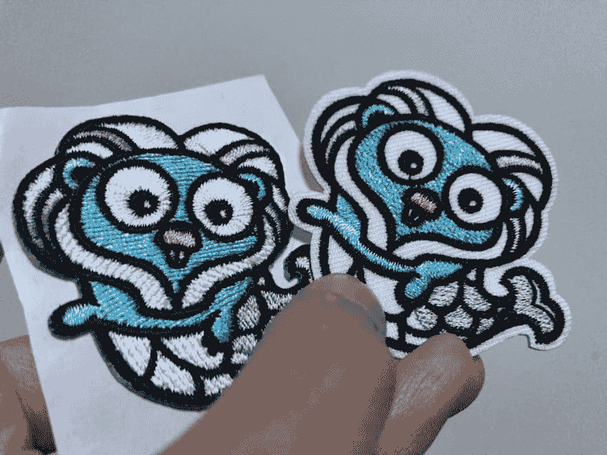](https://res.cloudinary.com/practicaldev/image/fetch/s--fsvcCjeW--/c_limit%2Cf_auto%2Cfl_progressive%2Cq_auto%2Cw_880/https://cheeaun.com/blimg/photos/objects/gophercon-sg-embroidered-stickers-two-vendors-comparison.jpg)

很整洁，是吧？

我不知道我这样做对不对，但我真的很喜欢贴纸的感觉。我认为这对可爱的吉祥物或动物来说是很棒的，因为它给了它们柔软的拥抱感😊。

## 袜子🧦

我不太喜欢穿袜子。当我尝试印刷多种类型的赠品时，我想要一个新的挑战。

袜子作为[会议赠品](https://www.instagram.com/p/9mP5o7S98g/)其实并不新鲜。[松松袜](https://twitter.com/SlackHQ/status/467457718270189568)挺甜的。多亏了加拿大总理贾斯廷·特鲁多，袜子正在成为 T4 的一种时尚宣言。

莎拉·梅也发了一条推文:

> 请愿将所有会议 t 恤衫换成袜子。

React Rally 也有这个关于袜子和凉鞋结合的[非常聪明的想法](https://twitter.com/ReactRally/status/978320677131505664):

> 常规大脑:分发袜子作为会议赠品
> 
> 银河大脑:分发袜子和凉鞋作为会议赠品，这样每个人都能看到袜子

然而，在新加坡很少会看到分发袜子的会议。可能现在还不时髦？我不知道。为什么不试试呢？

我开始我的研究是通过发现宽松的袜子是如何制成的。它们是由位于美国德克萨斯州奥斯汀的定制袜子销售商 [Sock Club](https://custom.sockclub.com/why) 生产的。我了解到[有很多种袜子](https://custom.sockclub.com/custom_sock_options)，有[各种面料](https://sockdrawer.com/pages/fiber-content)，有[各种尺码](https://custom.sockclub.com/sock_sizing)。这又是一个反复出现的主题，我花了几天时间学习所有这些东西，并试图找出其中最好的🕵️‍♂️.

然而，首先引起我注意的是袜子的尺码。我不记得当我从会议上拿袜子时必须选择我的尺寸。会议注册通常会询问 t 恤尺寸，但不会询问袜子尺寸。根据[袜子俱乐部](https://custom.sockclub.com/sock_sizing)的说法，袜子的尺码是根据鞋子的尺码来定的，这就导致了男女老少不同的尺码。它还强调了“一刀切”的做法，这让它更加令人困惑😵。

我翻遍了常见问题集，发现了这个:

> 我们的大多数客户订购我们的一个尺寸最适合，大小成人中等。这个尺寸适合我们 90%的顾客。

它没有提到它是男人还是女人的成人尺寸🤷‍♂️.此外，他们还强制规定了每种设计的最小订购量(120)和每种尺寸的最小订购量(T0)。所以我不能订购像 10 S，20 M 和 5 L，而是我必须订购 120 S，120 M 和 120 L，为了一个单一的设计！？！😱这基本上使人们别无选择，只能用一种尺码来解决，对吗？我不明白为什么要这样做，但我怀疑可能是一些生产或制造方面的挑战，这些挑战似乎比 t 恤更受 T2 的限制🤔。

无论如何，引起我注意的第二件事是，有些袜子有某些“不可打印”的区域。我从 Eversox 找到了一些指导方针。

[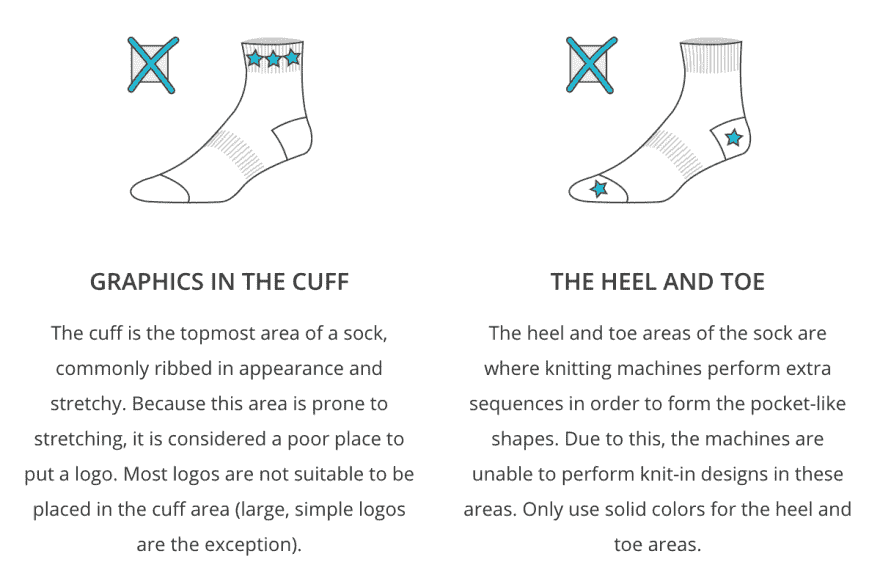](https://res.cloudinary.com/practicaldev/image/fetch/s--feyGpquY--/c_limit%2Cf_auto%2Cfl_progressive%2Cq_auto%2Cw_880/https://cheeaun.com/blimg/screenshots/web/sock-design-guideline-graphics-cuff-heel-toe-eversox%402x.png)

简而言之，袖口，脚跟和脚趾区域是“禁止的”，因为它们容易拉伸或有编织困难。这也是为什么 Sock Club 的设计模型是这样的:

[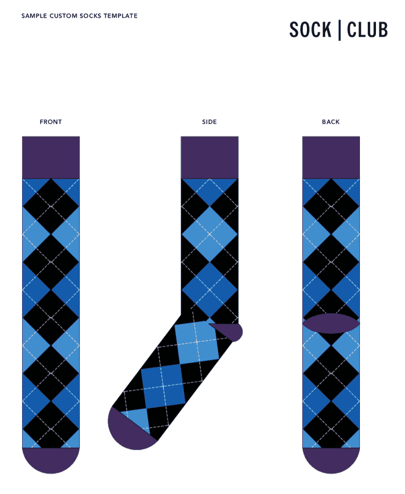](https://res.cloudinary.com/practicaldev/image/fetch/s--fCU8DSUK--/c_limit%2Cf_auto%2Cfl_progressive%2Cq_auto%2Cw_880/https://cheeaun.com/blimg/screenshots/software/sock-club-mockup-sample-custom-socks-template%402x.png)

那些紫色区域是“禁止”的。

2018 年 6 月 26 日，我向 [Charis](https://twitter.com/charis) 询问了她[在](https://paper.dropbox.com/doc/Conference-Supplies-fjnsdJQKMOdnyMCyZrD4P) [Webconf.asia](https://webconf.asia/) 会议上使用的供应商，我[参加了两次](https://cheeaun.com/blog/2017/12/2017-in-review/)。是[福州火鸟体育用品有限公司](https://firebirdsocks.en.alibaba.com/)。两天后，我给他们发信息询问报价，并给了他们这个设计；可重复的图像及其在袜子上的潜在外观:

[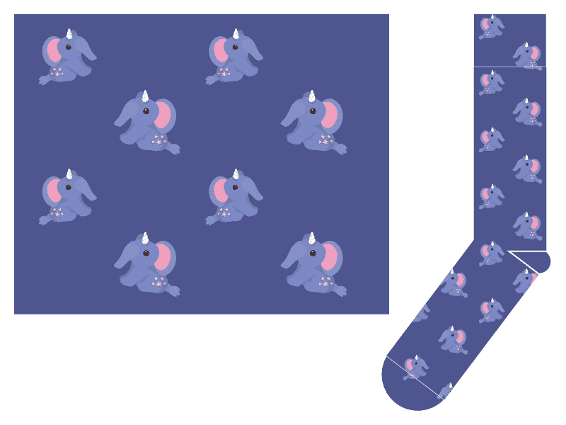](https://res.cloudinary.com/practicaldev/image/fetch/s--RXJFAmdx--/c_limit%2Cf_auto%2Cfl_progressive%2Cq_auto%2Cw_880/https://cheeaun.com/blimg/figures/diagram/elephant-socks-mockup-phpconfasia-2018%402x.png)

这是[林·李敏](https://www.linkedin.com/in/mllim/)为 [PHPConf 设计的吉祥物“大象”。亚洲 2018](https://2018.phpconf.asia/) 。我觉得重复随机旋转的大象会很酷。由于这是我第一次尝试，我想让设计尽可能简单，以防止意外的结果。

我希望得到一个样品，以降低风险，供应商告诉我，这将需要 38 美元的设计加上 28 美元的运费😅💸。于是我决定硬着头皮，和他们一起做了*几十*的设计修改和颜色修正，[最终订购了](https://twitter.com/cheeaun/status/1027832919069323264) **200** 23×23cm 6 色(一只为底座，5 只为吉祥物)袜子(外加一只样品)，装在**巨大的**箱子里发货。

[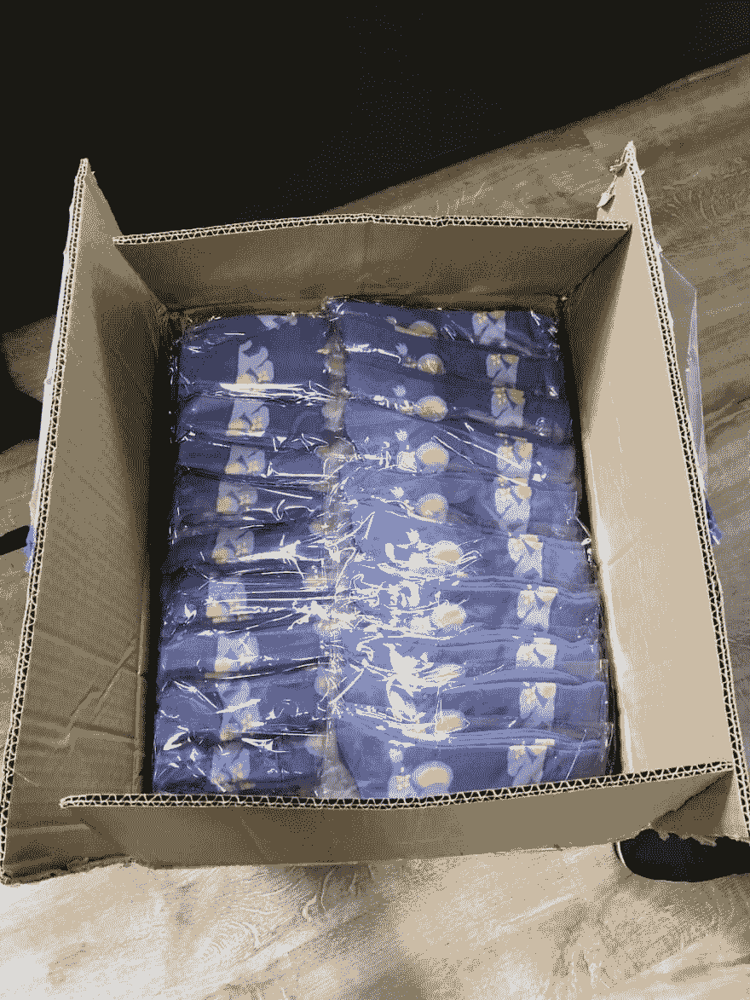](https://res.cloudinary.com/practicaldev/image/fetch/s--xK8DEmAP--/c_limit%2Cf_auto%2Cfl_progressive%2Cq_auto%2Cw_880/https://cheeaun.com/blimg/photos/objects/elephant-socks-box-fuzhou-firebird-sporting-goods.jpg)

是的，我完全算错了 200 双袜子所需的空间😅。成本为 573 美元(运费 139 美元，贝宝费用 24 美元，每双 2.05 美元)*和*由于*一种*面料颜色的延迟变更而产生的额外 30 美元材料费。

[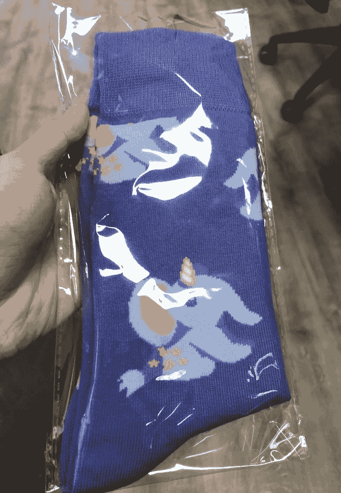](https://res.cloudinary.com/practicaldev/image/fetch/s--WRP558d0--/c_limit%2Cf_auto%2Cfl_progressive%2Cq_auto%2Cw_880/https://cheeaun.com/blimg/photos/objects/elephant-socks-packet-fuzhou-firebird-sporting-goods.jpg)

袜子被包装在这些整洁的塑料袋里。

[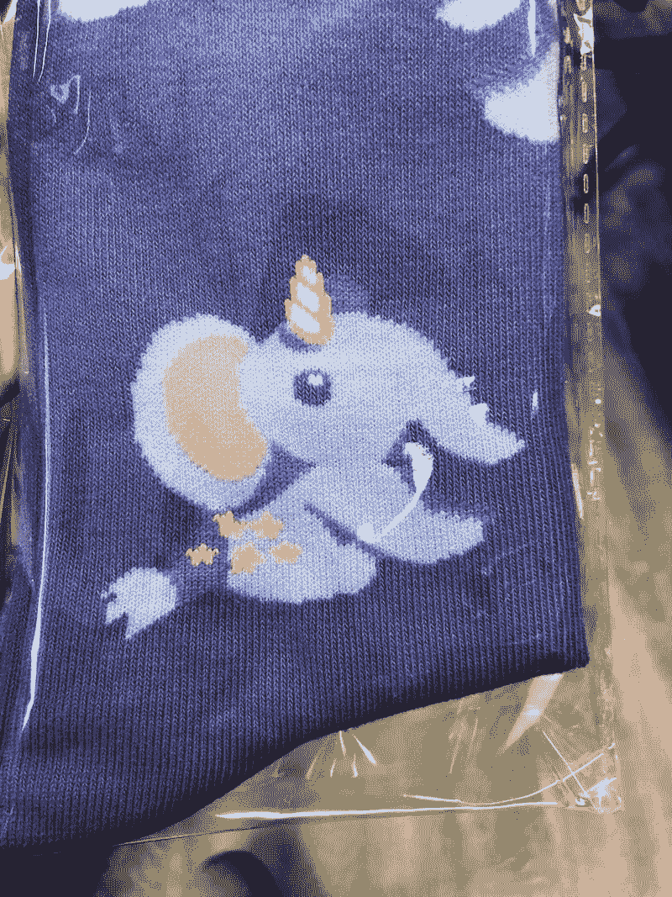](https://res.cloudinary.com/practicaldev/image/fetch/s--FsgbuDNK--/c_limit%2Cf_auto%2Cfl_progressive%2Cq_auto%2Cw_880/https://cheeaun.com/blimg/photos/objects/elephant-socks-close-up-fuzhou-firebird-sporting-goods.jpg)

[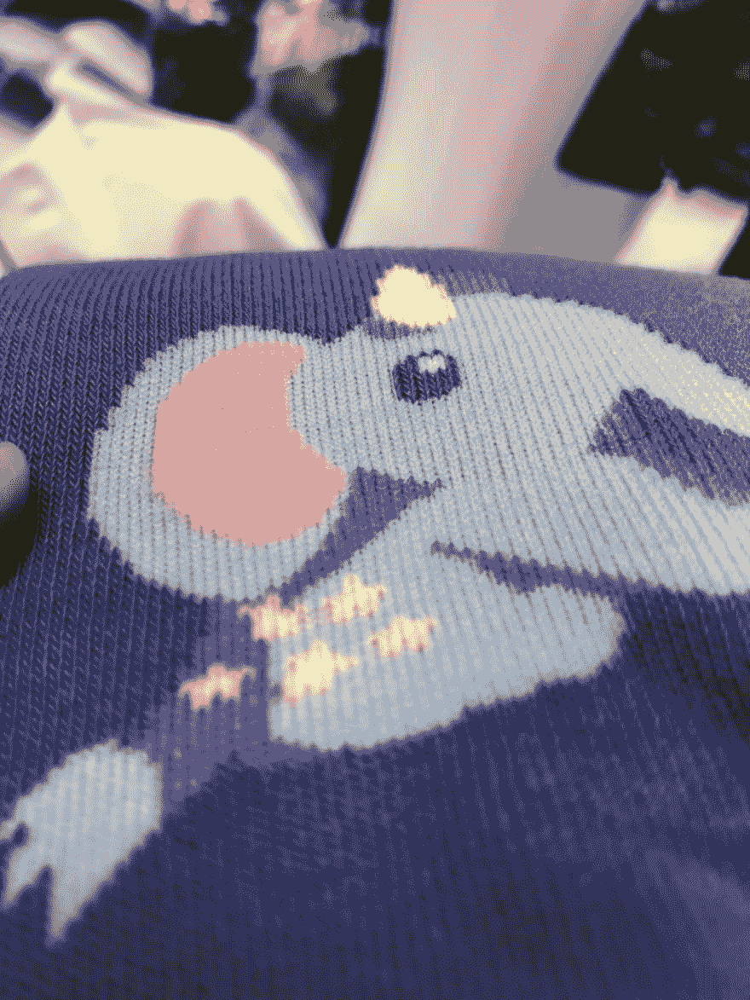](https://res.cloudinary.com/practicaldev/image/fetch/s--8hIUUf6J--/c_limit%2Cf_auto%2Cfl_progressive%2Cq_auto%2Cw_880/https://cheeaun.com/blimg/photos/objects/elephant-socks-mascot-close-up-fuzhou-firebird-sporting-goods.jpg)

我不是超级挑剔这一点，但老实说非常满意的袜子！颜色仍然有点不一致，但是说真的，在现实世界中，颜色通常是非常复杂的😣。

这一次，我没有打印第二批，主要是因为时间和交付的限制。把这个大箱子带到会场可不是件容易的事😅。我确实得到一些反馈，人们喜欢它，但很难知道是否有人穿它们🤷‍♂️.不像 t 恤甚至贴纸，更难发现穿你定制袜子的人。

然而，这对我来说真的很有趣😊。

## 旅途

在我打印定制礼品的整个实验过程中，很明显，每当我开始探索新的领域时，我都改变并改进了我的程序。一开始，我认为这个任务很简单，低估了我用来盲目抓取的所有免费赠品背后的复杂性。我没有做适当的研究，只是简单地命令没有太多的考虑。

在旅途中，我慢慢地学习每一种面料、每一种材料、每一种制造技术和每一个细节。我试图对我得到的一些赃物进行逆向工程，并试图找出它们是如何制造的，在哪里制造的。我花了无数个小时研究，并且总是在[快、好、便宜](https://fastgood.cheap/)(以及更多参数)之间玩平衡游戏。之后，我检查产品的*价值*，因为我的目标是**用赠品取悦**人，并确保他们*真的*使用或佩戴它们。

我和一群人谈过，他们误解了我几次，为什么我这么一丝不苟，而他们只关心最小化成本，而不是最大化 T2 的财富体验。

设计很重要，因为我发现有些设计师在设计材料的时候一开始就没有理解这些材料。这就像平面设计师为网络*设计，却没有对媒介的任何理解。这就像艺术家在不了解画布、画笔和所用颜料的情况下描绘艺术品一样。我个人认为**理解**媒介非常重要，因为设计在现实世界中总会有一定的挑战和限制。如果我能现实地把握整个想法，我就能创作出令我自豪的更好的作品。*

在这一点上，我的实验还没有真正完成。我总觉得还有*更多*的改进要做，有更多的选择要尝试。正如我提到的，这是一个相当昂贵的“爱好”。然而，从这些实验中，我从*中学到了很多*，获得了很多乐趣，并彻底帮助其他人为他们自己的聚会、会议甚至公司创造了他们自己的礼品。

我真的希望我的学习可以帮助更多的人，并希望鼓励每个人进一步深入到这个令人敬畏的世界😎。**