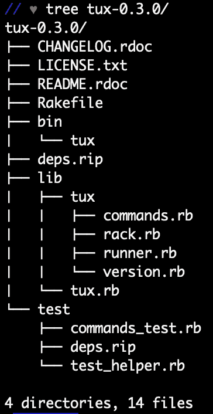
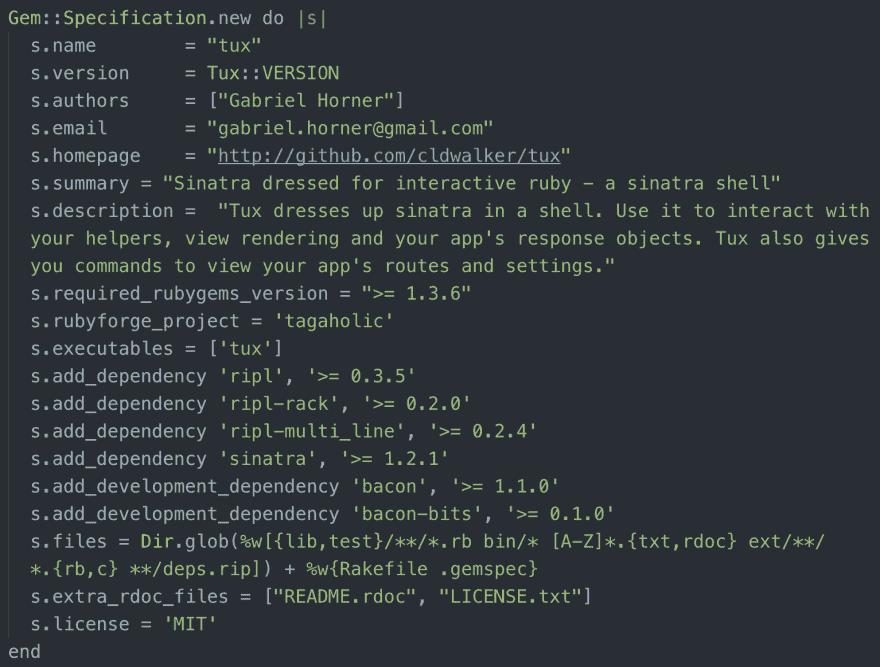

# 什么是宝石？第二部分

> 原文：<https://dev.to/clairemuller/what-is-a-gem-part-2-leo>

欢迎回到我的红宝石系列！上次我回到了基础，了解到 gem 是 Ruby 版本的包，它只是文件的集合。gem 经常用于为 Ruby 应用程序或 CLI 添加功能。 [RubyGems](https://rubygems.org/) 是 Ruby 的包管理器——目前有 10023 种宝石可供选择！

# 宝石结构

宝石的结构应该看起来相当熟悉；大多数附带了 lib、test/spec 和 bin 目录，以及 README、Rakefile 和 gemspec。这是宝石礼服的树形图:

### lib

lib 目录包含组成程序的所有代码。标准的做法是在 lib 目录中创建一个与 gem 同名的文件。这个文件被认为是“根”文件，包含程序的主模块。这是当你“需要”宝石时加载的文件。

因为这个根文件很容易变得拥挤，所以通常在 lib 中创建一个目录，也与 gem 同名。该文件夹将存储与模块相关的所有其他文件，并且需要位于根文件的顶部。

### 测试/规格&箱

测试或规范目录非常简单，它存储了所有的测试文件！一个好的宝石的标志是包含这些文件；如果你的代码有可靠的测试，其他开发人员会更信任你的代码。为此，我们需要一个 Rakefile，它允许我们运行“rake test”或简单地“rake”来运行测试套件。bin 目录包含加载到用户路径中的可执行文件；标准是给这个文件取和 gem 一样的名字。

### Gemspec

的。gemspec 文件包含关于 gem 的所有信息，包括它的名称、版本、文件、作者和简短摘要。虽然这些字段是必需的，但是 gem 创建者可以选择添加额外的信息，比如联系电子邮件、许可证、必需的 ruby 版本和其他元数据。

# 有用的命令

以下是我在学习中发现的一些有用的命令:

`gem install <gem name>`

按锡上说的做，安装宝石！`i`可以作为`install`的别名。

`gem list`

显示本地安装的每个 gem 及其版本。

`gem update`

也挺直白的！如果您运行这个命令时没有指定 gem 名称，它会将您的所有 gem 更新到最新版本。

`gem cleanup`

如果你像我一样有点强迫症，这个很棒。它会删除除最新版本之外的所有 gem，除非其他地方需要该版本来满足依赖性。您也可以在特定的 gem 上运行这个命令。

`gem environment`

这个命令为您提供了一些有用的信息，比如您的 RubyGems 和 ruby 版本，以及 Gems 在您的计算机上的安装位置。`env`可以作为`environment`的别名。

# 结论

总结一下我对 gems 的了解:它们本质上是一些代码包，可以通过添加功能或很酷的特性来改进你的项目。有大量有用的宝石，RubyGems 绝对是最好的资源。感谢阅读！