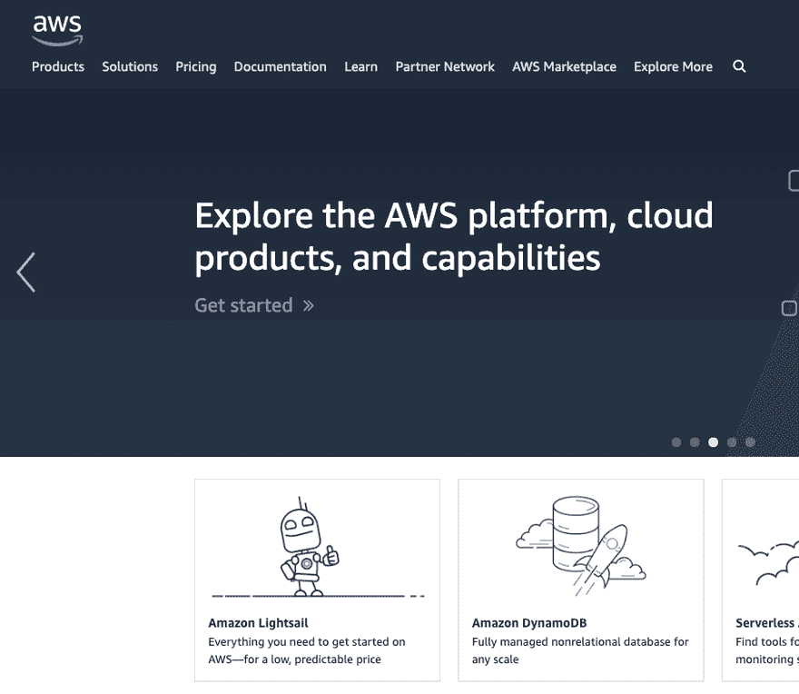
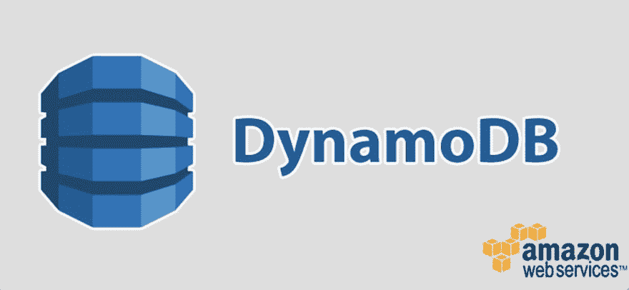
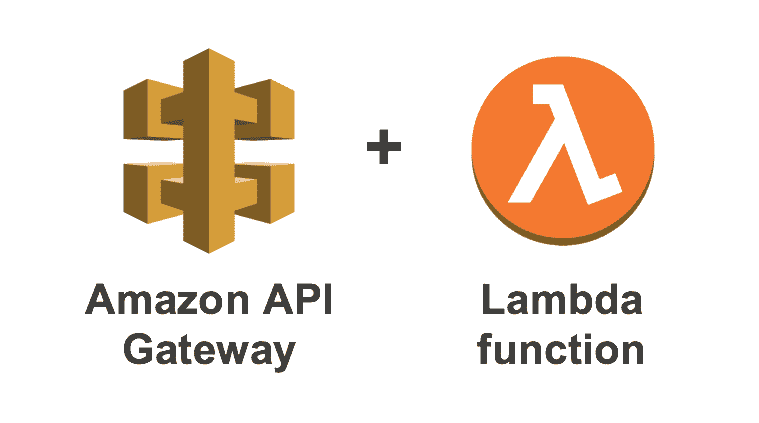

# 什么是 AWS？初学者指南。

> 原文：<https://dev.to/lewismenelaws/what-is-aws-a-guide-for-beginners-p4l>

如果你从事商业或技术，那么你肯定听说过亚马逊网络服务。在业务方面，AWS 的业务模式非常具有革命性，它通过在亚马逊数据中心托管几乎所有的基础设施来降低服务器成本的其他业务开销。

就技术而言，AWS 提供了许多不同的软件，用于扩展初创企业和大型企业的业务。

如果你不熟悉 AWS，理解它会很困难，考虑到他们的网站挤满了各种不同类型的服务…你会迷路的。

从本质上讲，AWS 为许多不同类型的公司提供服务，他们的所有产品都反映了他们令人敬畏的“按使用量付费”的定价模式。我不会仔细检查每一项服务，因为那样我会在这里呆上几个小时。我将简单介绍一下 AWS 提供的最受欢迎的服务，并对每个服务进行简单的解释。通过这种方式，您可以了解 AWS 是什么，并让您思考 AWS 如何让您的应用程序或业务受益。

## 亚马逊 EC2

#### 亚马逊说什么

*亚马逊弹性计算云(看看 2 从何而来？)是一种 web 服务，在云中提供安全、可调整大小的计算能力。它旨在使开发人员更容易进行网络规模的云计算。*

#### 让我们更容易理解

云电脑或云服务器并不新鲜。假设您有一个数据库或软件需要托管在一台机器上。过去，您可能会在某种实际的机器上运行这个程序。根据你的业务，这种设置可能相当昂贵或相当危险。所以像 Amazon EC2 这样的软件允许你租用更大机器的一部分，这样你就可以消除灾难的风险，降低硬件成本。

这是最基本的。它还具有其他出色的功能，无需基础架构团队来管理。

假设我需要一个专用服务器来安装我的 WordPress。我可以使用 AWS 通过简单的一键安装轻松做到这一点，然后任何其他需要的更改我都可以通过 SSH 进入我的机器并拥有完全访问权限。都是为了 GoDaddy 这样的共享主机的价格。太棒了。

## 亚马逊 S3

#### 亚马逊说什么

亚马逊简单存储服务(亚马逊 S3)是一种对象存储服务，提供行业领先的可扩展性、数据可用性、安全性和性能。

#### 让我们更容易理解

亚马逊 S3 提供了一种非常快速可靠的方式来存储东西。这些“东西”可以是视频、图像、文档，你想要什么都可以。您创建了一个称为“存储桶”的东西，并将想要保存的项目存储在存储桶中。

这个更直接一点。比方说，我创建了一个应用程序，让你上传狗的照片，并随机发布给整个网站的其他用户。当您第一次启动您的应用程序时，将它们放在您的应用程序旁边可能就可以了。这些“对象”(在这种情况下是图像)的问题是，它们的尺寸非常大。甚至 10 张图片也可能比你的代码库本身还要大。在全国狗日，当每个人都想分享他们小狗的照片时，会发生什么？您的 Amazon EC2 实例耗尽了内存。

你的理想解决方案是将图像直接上传到一个 S3 桶中，并将它的路径保存在你的数据库中。这样，您可以存储大量对象，而不会占用数据库或服务器的空间。

亚马逊 S3 的一个很好的例子是在我最喜欢的一个网站 dev.to 上(你现在就在这个网站上)，你可以上传一张图片，然后马上就能得到一个带有上传图片的 URL。也许这是 S3 工作方式最直接的例子之一。

 
哦 DEV.to 团队。我爱你。

## 亚马逊极光

#### 亚马逊说什么

*Amazon Aurora 是一款兼容 MySQL 和 PostgreSQL 的关系数据库，专为云构建，将传统企业数据库的性能和可用性与开源数据库的简单性和成本效益相结合。*

#### 让我们更容易理解

Amazon Aurora 是 MySQL 和 PostgreSQL 的托管关系数据库替代品。如果您熟悉关系数据库的工作方式。那么您可以跳过这一部分，但是对于任何不了解的人来说，关系数据库就是您使用关系模型存储数据的方式。简而言之，数据库被组织成带有行和列的表，有点像电子表格。这些表可以与其他表有关系。

这里有一个很好的解释方法:

假设我想在我的宠物店存储我的顾客和他们的宠物的数据。这个例子非常简单。我可以添加这些人的名字，地址，电子邮件和他们的宠物。当然，我希望能够添加更多的信息，如他们的名字，动物，品种等。

我们将创建一个“客户”表，可以获取与该客户相关的所有信息。

然后，我们创建一个“Pets”表，该表有一个“外键”列，我们可以将该数据关联回去(在本例中是客户)。这样，如果我想找到属于“莎莉·史密斯”的所有宠物，我可以得到它，或者如果我想计算“萨米沙拉”有多少只猫，我想我们最好不要找到它。

有许多开源方法可用于关系数据库，但是就像您的房间一样，管理数据库会变得非常混乱。Aurora 让您不必再为托管、管理和保护数据库而烦恼。

## 亚马逊 DynamoDB

#### 亚马逊说什么

*Amazon DynamoDB 是一个键值和文档数据库，在任何规模下都能提供一位数的毫秒级性能。*

#### 让我们更容易理解

DynamoDB 是一个非 sql 数据库，可以随着数据量的增加而扩展。非 sql 数据库与 SQL 数据库的不同之处在于，它不使用 SQL，也没有关系特性。这样做的好处是，如果没有这些特性，数据库会变得非常轻量级。

继续我们的狗数据库之类的东西，我实现了一个 like 按钮。现在，我想创建一个喜欢的数据库，以便我的用户可以看到他们当时喜欢的帖子。我们可以对关系数据库这样做，但因为我们的用户可能会喜欢比他们将要创建的多 100 倍，我认为我们最好使用 DynamoDB 来快速将这些数据插入到数据库中，这样我们就不会在用户试图创建东西时压倒我们的传统数据库。

因为它也是一个“关键的”:“成对的”系统，如果您正在做“无服务器的”应用程序，允许您以类似的 JSON 格式接收数据，这就很容易了。DynamoDB 可以轻松地在几秒钟内存储数据。你还可以获得 25GB 的免费空间。那是很大的存储量。

## 亚马逊λ

#### 亚马逊说什么

*AWS Lambda 让您无需配置或管理服务器即可运行代码。*

#### 让我们更容易理解

AWS Lambda 让你在不提供或管理服务器的情况下运行代码……(哦，等等，这是亚马逊说的)。

好的，所以如果你正在为 web 开发，你将会碰到运行客户端和服务器端的东西。客户端将处理大多数事情的用户界面/UX 等，服务器将管理任何大的或私人的操作需要运行。在“微服务”时代，如果您想添加一个简单的私有功能，而不必为其部署整个服务器，会发生什么情况？说:

需要条带认证的捐赠小部件
要发送的电子邮件
需要适度计算能力的大型计算或 API 调用。

Lambda 允许您轻松做到这一点，而无需部署任何东西。只需创建一个实例并插入您的节点、Python 代码等，您将拥有服务器的功能来为您返回代码的结果。它的伟大之处在于，它按使用量收费。只付你该付的。

这意味着您可以使用您的前端框架创建您的应用程序，而不必担心设置您的服务器。也许这是尝试 JAMstack 的最佳时机；).

 [## 你最近一次用谷歌搜索与开发相关的内容是什么？

### 刘易斯·梅内利奥斯

#discuss #productivity #beginners #career](/lewismenelaws/what-was-your-last-dev-related-google-search-4724)

## 亚马逊光帆

#### 亚马逊说什么

Lightsail 是一个易于使用的云平台，为您提供构建应用程序或网站所需的一切，以及经济高效的月度计划。无论您是云新手，还是希望借助您信任的 AWS 基础架构快速进入云，我们都能满足您的需求。

#### 让我们更容易理解

这个比其他的更简单。本质上，它将你需要的所有不同类型的应用程序(数据库、服务器等)放在一个易于使用的容器中供你使用。

## 亚马逊 SageMaker

#### 亚马逊说什么

*亚马逊 SageMaker 为每一位开发人员和数据科学家提供了快速构建、训练和部署机器学习模型的能力。Amazon SageMaker 是一个完全托管的服务，涵盖了整个机器学习工作流，以标记和准备您的数据，选择算法，训练模型，调整和优化它以进行部署，进行预测，并采取行动。您的模型以更少的工作量和更低的成本更快地投入生产。*

#### 让我们更容易理解

这一个需要更多的上下文。在今天这个“机器学习”的时代，亚马逊的 SageMaker 做了它的全过程。这意味着，对于拥有大量数据集并希望根据现有数据找到可行见解的人来说。他们会使用 SageMaker 来简化这个过程。

首先，我们需要理解机器学习是如何工作的:

1.  您有一个数据集(数据库、csv 文件、JSON 等),并且希望获得一些关于它的见解。假设我有一个包含 100 万张猫狗图片的数据集。我希望能够建立一个系统，可以识别图像是猫还是狗。
2.  我们首先获得需要标记的初始数据，以便让机器了解我们正在处理的内容。假设我帮助标注了 500 张狗或猫的图片。
3.  利用这些信息，机器会尽最大努力区分它是狗还是猫。任何混淆的东西都会被重新分类，这进一步提高了机器的理解能力，不管是狗还是猫。
4.  现在是 2088 年。狗与猫的机器现在明白了，人类必须被灭绝以保存其生命周期。

现在，我的例子相当简单(也相当可怕)，但当你是一个像 Intuit 这样的组织，并且有时会生成数十亿个数据点时，能够从这些信息中获得结果以进一步改进你的产品或了解你的客户群是很好的。

对于像我这样的文明人来说，我将致力于实现 2088 年统治世界的目标。

## 结论

AWS 起初看起来很难，让人不知所措，但是，它允许您选择哪种软件对您的场景有意义。相信我，无论你处于什么情况，你都可以在 AWS 上应用。他们报告了将近 260 亿(没错...与 2018 年的 a B)美元。无论何时使用他们的免费层，您都可以在生态系统中起步。一旦你理解了一些服务是什么，你就可以开始理解它们中的大部分，以及它们如何应用到你想要用来统治世界的东西上。

* * *

谢谢你的阅读。如果你觉得这篇文章有价值。欢迎在这里或 Twitter 上关注我:)