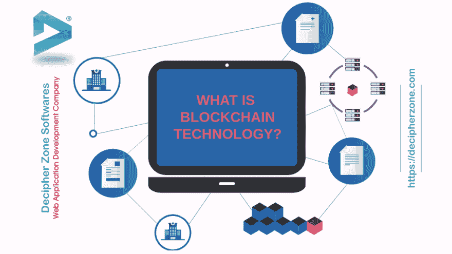

# 什么是区块链技术？

> 原文：<https://dev.to/decipherzonesoft/what-is-blockchain-technology-50ah>

信任和安全是我们技术世界中最大的担忧，因为数据在互联网上总是易受攻击的。区块链是 21 世纪的一项独创性发明，它采用了一种完全不同的方法来存储、保护数据和建立信任。存储数据的传统方式是将数据存储在中央服务器上，并从中提供服务，但这些信息并不可信。你能相信数据验证器不会篡改数据来欺骗你吗？你能信任你的银行用一种方便的方式存储数据吗？

区块链的定义

区块链是一种存储数据和验证来自网络中大多数节点或共识的事务的方法。

阅读:【Windows 混合现实应用开发带来的全息计算可能性

区块链于 2008 年与比特币一起推出，此后它成为开发加密货币的平台。加密货币是一种数字货币，交易存储在一个共享的分类账上，并且这些交易是通过共识验证的。因此，在区块链几乎不可能添加虚假交易。

阅读: 

在传统的银行系统中，由政府或授权银行维护的中央服务器用于服务和验证交易，这些交易收取年费和服务费。而在加密货币的情况下，使用对等网络，该网络的每个节点都是具有计算设备的用户，在该计算设备中维护和同步账本的副本。

阅读: