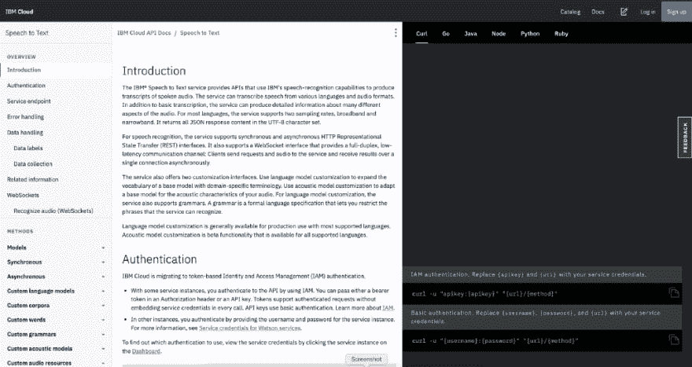
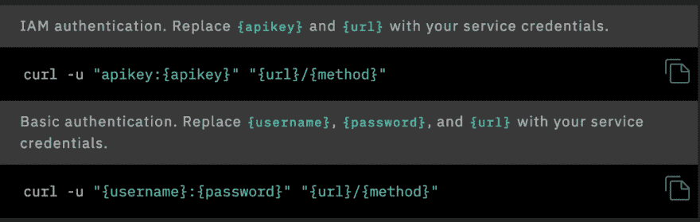
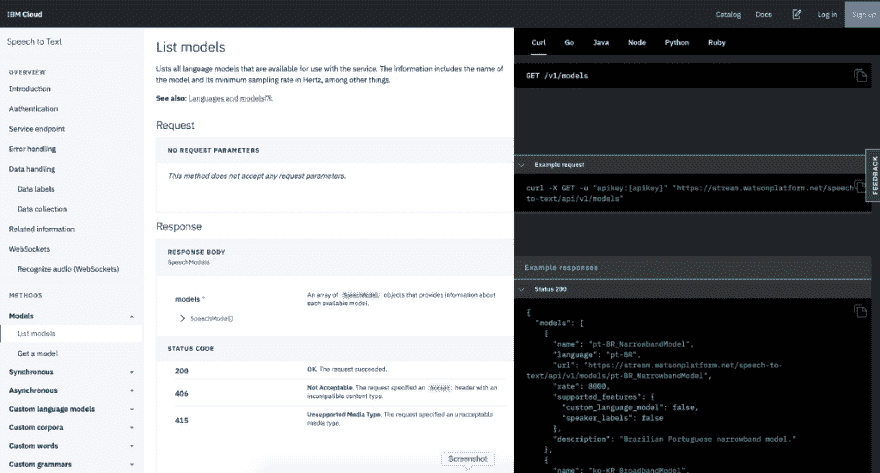
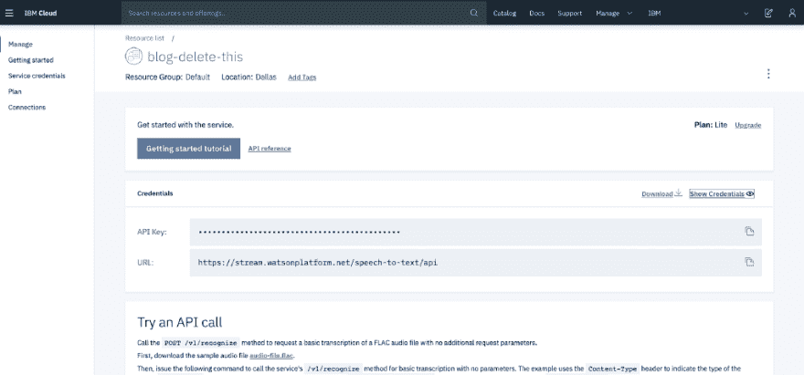
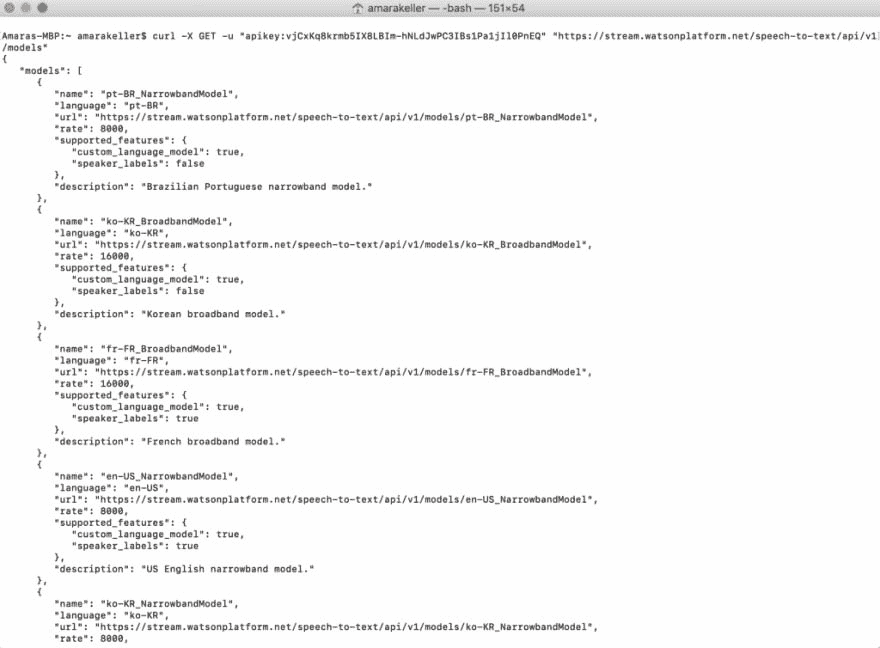
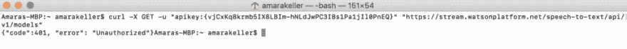

# 什么是 cURL，为什么它会出现在 API 文档中？

> 原文：<https://dev.to/ibmdeveloper/what-is-curl-and-why-is-it-all-over-api-docs-9mh>

<figure> 

<figcaption>照片由[马库斯·斯皮斯克](https://unsplash.com/photos/GDP_CXFHiuI?utm_source=unsplash&utm_medium=referral&utm_content=creditCopyText)上[下](https://unsplash.com/search/photos/web-development?utm_source=unsplash&utm_medium=referral&utm_content=creditCopyText)</figcaption>

</figure>

我不知道你的互联网角落是什么样的，但我的看起来是这样的:

> "我只想用 Python，为什么医生告诉我要用 curl . "
> 
> “我应该做一些卷曲的东西吗？我以前从来没用过。”
> 
> "我在哪里使用 curl？"
> 
> "有人能告诉我如何使用 curl 进行节点项目吗？"

我上计算机科学课已经有一段时间了，但即使在那时，我也不确定是否有人明确地教过我什么是 cURL 或者如何使用它。所以让我们现在就开始吧。

#### 什么是卷曲？

[cURL](https://curl.haxx.se/) ，代表客户端 URL，可以写成 cURL(因为我很懒，所以我将在博客的剩余部分这样写)，是一个带有 URL 语法的文件传输命令行工具。它支持许多协议，包括 HTTP、HTTPS、FTP 等等。HTTP/HTTPS 使它成为与 API 交互的绝佳选择！

curl 几乎可以在任何硬件平台上使用。这意味着，不管您在哪里运行什么，最基本的 curl 命令应该能够正常工作。没有那种常见的“在我的机器上不管用”。

#### 哪里用 cURL？

您可以在终端或命令提示符下使用 curl，但是您需要确保您的系统已经安装了它。

如果你跑的是还不到 10 岁的 OS X T2，你可能已经安装了 curl。您可以通过在终端中执行`curl --man`来调出“手册页”或手册。

<figure> 

<figcaption>卷曲终端中的手册页</figcaption>

</figure>

如果你想在浏览器中阅读文档，你也可以选择[选项](https://curl.haxx.se/docs/manpage.html)。

运行**窗口**？根据你运行的版本或者你下载的内容(比如 Git for Windows 和其他开发工具),你可能已经有 curl 了。看看[这篇文章](https://stackoverflow.com/questions/9507353/how-do-i-install-and-use-curl-on-windows)了解更多信息。

在命令提示符下运行，您还可以进行手册页健全性检查，`curl --man`。

如果你运行的是 Linux，我觉得你应该知道 curl 是什么，而且你可能已经安装了它。😄

#### 如何使用 cURL？

现在我们知道您已经安装了 curl，您可能想知道您实际上是如何使用它的。

先参考一下你大概是怎么到这里的，某人的 API 文档。我会在 IBM Cloud 上使用 [Watson 语音转文本](https://cloud.ibm.com/apidocs/speech-to-text)，因为我最近在那里花了很多时间，而且因为我们在这里都是朋友，他们给我的薪水很高。

<figure> 

<figcaption>沃森演讲到 API 文档中的文字介绍页面</figcaption>

</figure>

一些文档包括各种编程语言的代码片段，这一个也没有什么不同，但是第一个是 curl，它可能有点吓人，因为它不是编程语言，而且看起来也不像。

<figure> 

<figcaption>Auth 使用 curl 将 Watson 语音从 API 文档转换为文本</figcaption>

</figure>

您看到的第一组 curl 命令只是其他命令的一个例子，是创建它们的一个公式。因此，如果这对你没有任何意义，继续滚动。

我总是试图找到一个非常简单的“GET ”,它需要最少的信息(例如，没有参数),这样我就可以看到端点是否在工作，并且我得到一个状态代码，这并不表明我正在做一些可怕的错误。这就像用新的 API 建立信心的活动。根据 API 的授权需求，我甚至可能会尝试在浏览器中实现这一点，因为这只是一个 GET 而已。

查看语音到文本中的方法，我发现“列表模型”，它不需要参数，即使我没有模型，也应该用基本的“开箱即用”模型或什么都没有来响应，谁知道呢。太好了，我们就用那个吧。

<figure> 

<figcaption>【沃森语音转文本】以 API Docs 为方法【列表模式】</figcaption>

</figure>

在文档中，我看到了一个响应应该是什么样子的例子。

导航到我的语音到文本服务，我需要我的 api 密钥(或者用户名/密码，如果我运行的是旧服务的话)，我可以从管理页面获取它。我会复制 API 密钥。

<figure> 

<figcaption>IBM 云沃森语音转文字服务管理页面</figcaption>

</figure>

在我的终端中，我需要构建一个类似于示例请求的东西:

`curl -X GET -u “apikey:{apikey}” “[https://stream.watsonplatform.net/speech-to-text/api/v1/models](https://stream.watsonplatform.net/speech-to-text/api/v1/models)"`

不要激动，这个 API 键和整个服务已经被删除了。

`curl -X GET -u “apikey:vjCxKq8krmb5IX8LBIm-hNLdJwPC3IBs1Pa1jIl0PnEQ” “https://stream.watsonplatform.net/speech-to-text/api/v1/models"`

<figure> 

<figcaption>【卷曲执行【列表型号】</figcaption>

</figure>

看起来我得到了一些关于每种语言的基本模型的信息。整洁！它不是空的，它是成功的！

这里要特别注意，你的 API 键只是一个字符串值。不要将括号留在。如果你这样做，你会得到一个“未经授权”和非常难过/困惑。

<figure> 

<figcaption>Curl 执行未经授权用流氓括号包含在 API 键</figcaption>

</figure>

答案是正确的，因为您是未经授权的，因为您的 API 密钥可能不包括前后的括号。

#### 为什么我会用 cURL 而不用 Postman？弧？还是<插入喜欢的客户端>？

没有人会告诉你什么可以用，什么不可以用，但是正如上面提到的，curl 在功能上是相当标准的，可以跨很多平台使用。对于带身份验证的基本命令，没有用户界面可以迷失，您可以清楚地看到发生了什么。但是如果你发现用户界面更加舒适和熟悉，那就一定要使用它。

说实话，你甚至都不用旋度。它只是作为一种选择。就像 Go，Python，Java 等里面的片段一样。

一旦你熟悉了 API，你就可以开始编写使用 API 的实际代码，据我所知，这可能完全是其他语言。

无论你做什么，让我知道你什么时候在建！你用卷发吗？你有喜欢的 API 吗？你有学习新 API 的方法吗？在下面分享你的技巧和诀窍。