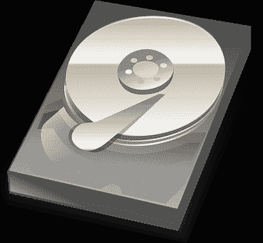

# 什么是数据科学？

> 原文：<https://dev.to/devtox/what-is-data-science-145e>

数据科学是利用科学从所有类型的数据中提取知识。这是计算机科学中一个非常大的领域，非常受欢迎。

数据科学有几个子领域:

*   **探索数据:**调查数据。这通常是新数据集探索和分析的第一步。

*   **数据可视化:**以不同的方式呈现数据，用 matplotlib 等绘图。

*   **经典机器学习:**使用数据和统计的算法。与依赖预编程规则的传统人工智能不同，机器学习算法使用数据本身。这意味着对于新的问题，可以使用新的数据。

*   **深度学习:**利用神经网络解决问题。神经网络模仿人脑，有时被称为人工神经网络。

*   **数据存储和大数据框架:**现在创建的数据比历史上任何时候都多

阅读更多:[数据科学](https://pythonbasics.org/data-science/)