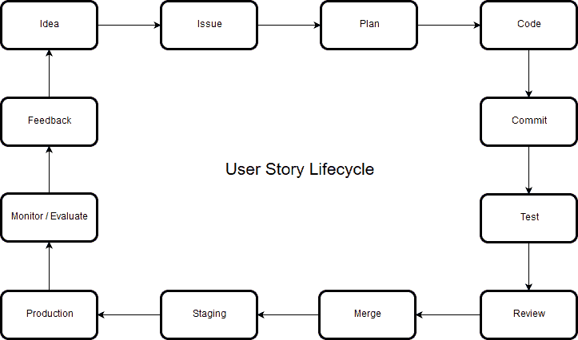

# “DevOps”到底是关于什么的？

> 原文：<https://dev.to/jmir17/what-is-devops-really-about-1lao>

也许写这篇文章有点晚了，但我找到了这样做的动力，因为我一直听到有人用错了这个词。在这一点上，已经写了许多关于这个词的文献，有数百个定义，有些比其他的更准确，但所有的基本思想都是一样的:

DevOps 通过将开发和运营合并为一个整体，缩短了敏捷反馈循环。它最大化了开发时间，自动化了工作流的某些任务。它加快了从计划用户故事到收集反馈的时间。

DevOps 不是 Kubernetes，也不是 Docker，也不是维护云中的服务器，也不是发布管理团队，……devo PS 假装为每个用户故事创建一个独立的生命周期，并重新创建一个完整项目的所有阶段。DevOps 背后的技术方面在于这个生命周期的自动化部分。在每个项目中，如何完成或者自动化的阶段可能是不同的。

在传统的软件开发模型中，一旦项目“结束”，交付和部署阶段就被置于项目生命周期的末尾:

令人好奇的是，这些图最终都处于“维护”阶段，这是第一次获得反馈后所有返工所需要的。这些都是为了满足实际客户需求而做的更改。当这种观察出现时，意味着这不是一个适合软件开发的模型。

所有敏捷方法的关键概念是反馈循环。理解软件开发是一个迭代和增量的过程。敏捷不是你用的东西，也不是你做的东西，敏捷要么是你，要么不是。敏捷方法每两周带来一次工作完成后的反馈，由你来做出反应。Devops 有助于更敏捷地支持开发和操作任务，从而更快、更轻松地更改软件。

考虑到这一点，DevOps 使用一套工具来加速流程并尽快获得反馈:

当我们谈论 devops 时，我们不应该只谈论工具，我们应该谈论它背后的哲学和敏捷原则。