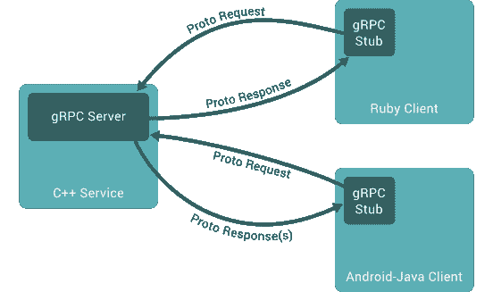

# gRPC 是什么？如何在 Node.js 中实现 gRPC

> 原文：<https://dev.to/ganeshmani/what-is-grpc-how-to-implement-grpc-in-node-js-33p5>

根据定义，

```
gRPC (gRPC Remote Procedure Calls) is an open source remote procedure call (RPC) system initially developed at Google. It uses HTTP/2 for transport, Protocol Buffers as the interface description language, and provides features such as authentication, bidirectional streaming and flow control, blocking or nonblocking bindings, and cancellation and timeouts. 
```

这么多行话..对吗？。让我们一个一个的分解。

gRPC 建立在带有协议缓冲区的远程过程调用和 Http/2 之上。

### 什么是远程过程调用(RPC)？

首先，[远程过程调用](https://www.youtube.com/watch?v=gr7oaiUsxSU)是一种协议，其中一个程序可以用来请求位于不同网络上的另一个程序中的服务，而不必了解网络细节。

它不同于正常的过程调用。它利用内核向不同网络中的另一个服务发出请求调用。

### 什么是协议缓冲区？

[协议缓冲区](https://developers.google.com/protocol-buffers/)是序列化结构化数据的语言中立方式。简单地说，它将数据转换成二进制格式，并通过网络传输数据。与 XML、JSON

### gRPC 是如何工作的？

gRPC 客户端向服务器发送请求，gRPC 服务器发回响应。最重要的是，gRPC 发送和接收请求的方式使它更加特殊

gRPC 支持**双向流**，这在任何其他通信中都不支持。双向流是发送数据流和接收数据流。发送请求/响应有不同方式

*   **一元 RPC 的** -这是一种发送单个请求和接收响应的方式
*   **服务器流 RPC 的**:从服务器端发送数据流的过程。
*   **客户端流 RPC 的**:从客户端发送数据流的过程。
*   **双向流 RPC 的**:它是一个从客户端和服务器发送数据流的过程。

<figure>[](https://res.cloudinary.com/practicaldev/image/fetch/s--JzdhYfXT--/c_limit%2Cf_auto%2Cfl_progressive%2Cq_auto%2Cw_880/https://cloudnweb.dev/wp-content/uploads/2019/05/gRPC.png) 

<figcaption>来源:[https://grpc.io/docs/guides/](https://grpc.io/docs/guides/)</figcaption>

</figure>

### 在 Node.js 中实现 gRPC

让我们看看如何在 Node.js 中使用 gRPC，用 CRUD APi 构建一个简单的待办应用程序

首先，我们需要安装应用程序的依赖项

```
npm install --save grpc
npm install --save uuid
```

之后，我们需要创建一个名为 **todo.proto** 的文件，它只是数据的协议缓冲区。

### 获取数据的 API

```
syntax = "proto3";

service TodoService {
    rpc List(Empty) returns (TodoList) {}
}

message Empty {}

message Todo {
    string id=1;
    string title = 2;
    bool iscompleted = 3;
}

message TodoList {
    repeated Todo todo = 1;
} 
```

首先，。proto file 类似于我们定义的一种构造请求和响应数据的方法。

主要来说，proto buffer 文件中有三个部分，分别是**实体**、**请求对象**和**响应对象**

```
message Empty {} 
```

它是在服务 **rpc** 中使用的请求对象

```
message TodoList {
    repeated Todo todo = 1;
}
```

**TodoList** 是**响应对象**。作为响应发送给客户机。如果你注意到，有一种叫做**的东西在重复**。它有点像数组。在这里，我们将其定义为 todo 的*数组*

现在，您需要创建一个名为 **server.js** 的文件，我们[在这里处理请求](https://cloudnweb.dev/2019/04/handle-file-upload-in-node-js/)

```
const grpc = require('grpc');
const uuid = require('uuid/v1');
const todoproto = grpc.load('todo.proto')
const server = new grpc.Server()

server.bind('127.0.0.1:50051',
grpc.ServerCredentials.createInsecure())
console.log('server is running at http://127.0.0.1:50051')
server.start()
```

如果在命令行中运行 server.js，应该会显示以下消息

**服务器运行在 http://127.0.0.1:50051**

```
node server.js
```

现在，我们需要将服务添加到服务器文件中。在 **server.js** 文件中添加以下代码

```
server.addService(todoproto.TodoService.service,{
    list : (_,callback) =>{
        callback(null,todos)
    }
})
```

之后，创建一个名为 **client.js** 的文件名，作为客户端向 gRPC 服务器发送请求。

```
const grpc = require('grpc');

const PROTO_PATH = './todo.proto'

const TodoService = grpc.load(PROTO_PATH).TodoService

const client = new TodoService('localhost:50051',
grpc.credentials.createInsecure())

module.exports = client
```

要从客户端进行调用，您需要将文件导入到调用服务的实际文件中。创建一个名为 **get_todos.js** 的文件，该文件使用客户端调用服务。

```
const client = require('./client')

client.list({},(error,todos) => {
    if(!error){
        console.log('successfully fetched todo lists');
        console.log(todos);
    }
    else{
        console.error(error);
    }
});
```

测试列表 API。您需要运行调用服务的服务器和客户机。

```
node server.js
node get_todos.js
```

### 创建插入 RPC 服务以创建新的待办事项

首先，您需要在 **todo.proto** 中添加插入服务。

```
syntax = "proto3";

service TodoService {

    rpc List(Empty) returns (TodoList) {}
    rpc Insert(Todo) returns (Todo) {}
}

message Empty {}

message Todo {
    string id=1;
    string title = 2;
    bool iscompleted = 3;
}

message TodoList {
    repeated Todo todo = 1;
} 
```

之后，我们需要在 **server.js** 中添加插入服务

```
server.addService(todoproto.TodoService.service,{
    list : (_,callback) =>{
        callback(null,todos)
    },
     insert : (call,callback) => {
            let todo = call.request;
            todo.id = uuid()
            todos.push(todo)

            callback(null,todo)
        },
})
```

现在，您需要创建一个名为 **insert_todo.js** 的文件，该文件使用客户端调用插入服务。

```
const client = require('./client')

let newTodo = {
    title : 'New checklist',
    iscompleted : false
 }

 client.insert(newTodo,(error,todo) => {
     if(!error){
         console.log('New Todo inserted successfully');

     }
     else{
         console.error(error);
     }
 })
```

之后，我们可以使用命令行运行该文件。

```
node server.js
node insert_todo.js
```

类似地，我们可以定义更新和删除服务调用，并从 gRPC 客户端使用它

完整的源代码可以在这里找到:[https://github.com/ganeshmani/grpc-node](https://github.com/ganeshmani/grpc-node)