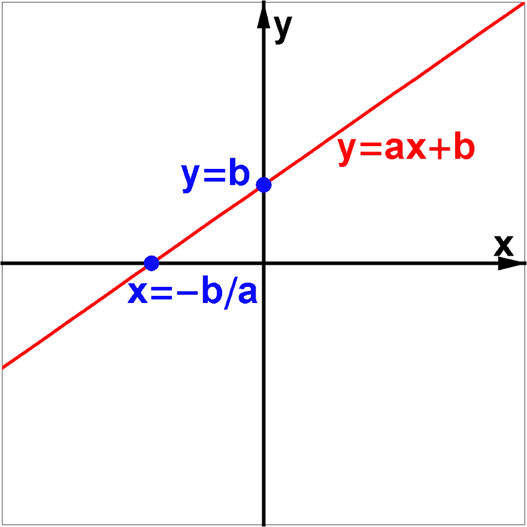

# 什么是机器学习？

> 原文：<https://dev.to/devtox/what-is-machine-learning-478n>

 
机器学习是人工智能的一个子领域。在机器学习中，使用以数据为起点的算法。

**算法**据说是“**从数据中学习**”。通过学习，他们实际上只是在使用数字数据。在学习阶段之后，**这些算法做出预测**。

## 举例

从数据中学习是什么意思？基本上是将统计模型应用于数据。

一个基本的例子是线性回归，如果一个人 12 岁时是 1 米 50，15 岁时是 1 米 50，那么这个人 20 岁时会有多长？

您可以使用一个基于 Y=ax+b 的简单模型来找出答案，然后使用它进行预测。

这里的危险是，它没有完全抓住现实，20 年后，增长停止，而模型继续。

更多阅读:[什么是机器学习](https://pythonbasics.org/what-is-machine-learning/)