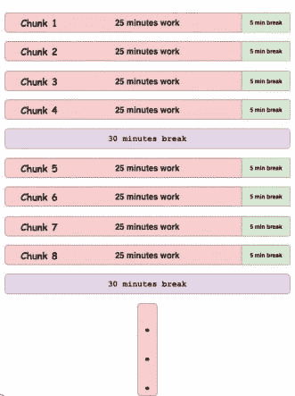

# 番茄红素是什么？

> 原文：<https://dev.to/itscoderslife/what-is-pomodoro-2pm1>

Pomodoro 基本上是一种时间管理技术，通过将一天的工作分成小块并定期休息来完成。

### 根本原则

该技术涉及的步骤:

1.  列出所有要完成的任务
2.  将计时器设置为 25 分钟——将闹钟设置为 25 分钟后响铃
3.  继续完成任务，直到计时器响起
4.  停止工作并更新任务列表
5.  休息一会儿，比如说 5 分钟
6.  重复第 2 步——这就完成了 1 块番茄
7.  每 4 块之后，休息一段时间，比如 30 分钟

这项技术背后的基本原理是计划、跟踪、记录、处理和可视化你的工作。

规划时–通过将任务记录在任务列表中来确定任务的优先级。这使得用户能够估计任务所需的工作量——这项任务需要多少番茄块。

有效使用这种技术的一种方法是将组块中剩余的时间用于学习。短暂的休息是为了避免精疲力尽。短休止符分隔连续的组块。四个组块构成一组。在两局之间有一个较长的休息时间。

番茄块是不可分割的；当在组块期间被中断时。如果中断，要么必须记录并推迟活动(使用通知-协商-安排-回电策略),要么必须放弃该块。

1.  告诉对方你正在做某件事
2.  商定一个你可以回来的时间
3.  **立即安排**跟进
4.  当你的番茄块完成后，再打电话给

该技术的一个目标是关注和流动，减少内部和外部干扰的影响。

番茄是意大利语中番茄的意思。