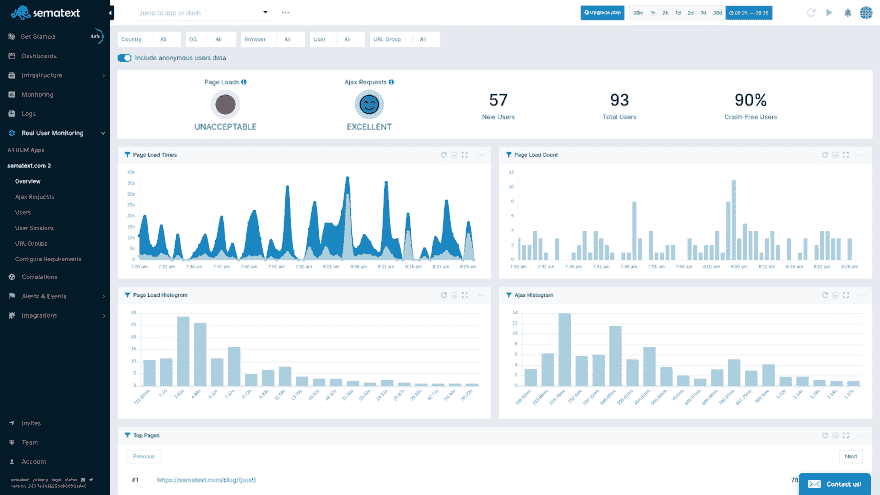
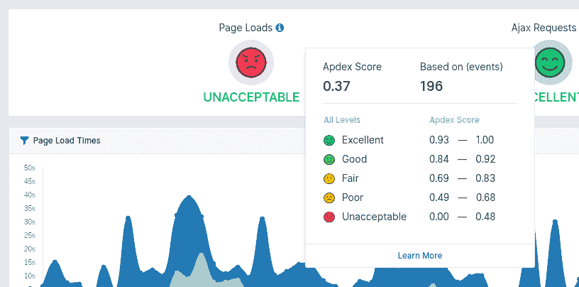

# 什么是真实用户监控？

> 原文：<https://dev.to/esther_lozano_/what-is-real-user-monitoring-2f8b>

真实用户监控(Real User Monitoring，简称 RUM)是一种针对数字业务的监控技术，它通过查看在线访问者与网站或应用程序的确切交互方式来分析客户的数字体验，分析从页面加载事件到 AJAX 请求再到前端应用程序崩溃的一切。RUM 最常见的例子是 Google Analytics，或 GA，它跟踪用户与网站或 webapp 之间交互的某些光谱。GA 可以跟踪浏览量、点击路径、浏览器类型和流量来源，但它真的能告诉你用户的满意度吗？

与综合监控相反，RUM 的唯一目的是根据您的网站或 webapp 的性能来监控我们用户的真实满意度。虽然 GA 在为您提供有关最终用户数字体验的高/水平数据方面做得很好，但它并没有以一种允许您轻松了解用户总体满意度的方式来布局数据。该监控软件是 APM (应用性能监控)的[部分，它允许您控制用户的数字体验，进而控制他们的满意度。想了解更多关于 APM 的知识？查看我们关于](https://sematext.com/blog/rum-vs-apm/?utm_source=dev.to&utm_medium=blogpost&utm_campaign=Crossposting&utm_content=WhatisRUM)[朗姆酒 vs. APM 的文章。](https://sematext.com/blog/rum-vs-apm/?utm_source=dev.to&utm_medium=blogpost&utm_campaign=Crossposting&utm_content=WhatisRUM)

因此需要朗姆酒。**真实用户监控可以帮助组织更快地转化在线客户，减少客户流失，并改善客户的整体数字体验。**今天，我们将分解综合朗姆酒解决方案中最常见的功能，以帮助您[充分利用朗姆酒](https://sematext.com/blog/5-best-practices-for-getting-the-most-out-of-rum/?utm_source=dev.to&utm_medium=blogpost&utm_campaign=Crossposting&utm_content=WhatisRUM)。这些功能的结合使你能够分解数据，了解用户与你的网站或 webapp 的交互质量。**我们今天将回顾的一些功能**包括:

1.  [Apdex](https://sematext.com/blog/how-to-use-your-apdex-score-to-measure-user-satisfaction/?utm_source=dev.to&utm_medium=blogpost&utm_campaign=Crossposting&utm_content=WhatisRUM)
2.  页面加载事件
3.  监控单页和多页应用程序
4.  AJAX 请求
5.  发信号
6.  会话化
7.  发布跟踪

*[语义体验的例子](https://sematext.com/experience/?utm_source=dev.to&utm_medium=blogpost&utm_campaign=Crossposting&utm_content=WhatisRUM)*

## 真实用户监控的好处

首先，让我们从您的 RUM 解决方案可以/应该帮助您完成的一些基本任务开始:

1.  **解决问题** - RUM 帮助您(通过数据)了解是什么阻碍了您的用户获得近乎完美的体验，并解决这些问题以改善他们的数字体验。
2.  **细分**——不是每个人都使用相同的浏览器、连接类型等。因此，将您的性能改进或测试限制在特定的操作系统、浏览器、位置等。并没有真正涵盖与你的网站或 webapp 互动的大量用户的基础。
3.  **更快的可操作洞察** -立即了解影响您的 UX(用户体验)的因素。您的 RUM 解决方案中的警报功能允许您实时监控您的 UX，并获得对用户网站或应用体验的可操作性洞察。

## 朗姆酒的特性和指标

那么朗姆酒是如何工作的呢？让我们开始分解真实用户监控解决方案可能包含的一些特性和指标。

### **Apdex**

应用程序性能指数(Application Performance Index)或 [Apdex](https://en.wikipedia.org/wiki/Apdex) ，是根据与您的网站或应用程序交互时的请求响应时间来衡量您的用户满意度。

Apdex 方法采用您定义的响应时间阈值(T ),即满意的响应时间加上可容忍的响应时间的一半的总和除以样本总数(采样的请求),以便计算一个从 0 到 1 的比率。以下是您可能会发现您的网站或应用程序可以通过 Apdex 进行评分的一些级别:

*   1.00-0.94 =优秀
*   0.93-0.85 =良好
*   0.84-0.70 =一般
*   69 和 0.49 =差
*   > 0.49 =不良

*[sema text 体验 Apdex 评分的例子](https://sematext.com/experience/?utm_source=dev.to&utm_medium=blogpost&utm_campaign=Crossposting&utm_content=WhatisRUM)*

Apdex 的平均分数是 0.85，所以如果你接近这个范围，你就做对了。点击阅读更多关于[如何使用 Apdex 衡量用户满意度的信息。](https://sematext.com/blog/how-to-use-your-apdex-score-to-measure-user-satisfaction/?utm_source=dev.to&utm_medium=blogpost&utm_campaign=Crossposting&utm_content=WhatisRUM)

### **用户活动监控通过 P** **年龄负载事件**

使用浏览器计时 API 记录页面加载事件。每个页面加载事件都会被记录下来，并在以后显示在图表上，这些图表显示了在后端(网络和 web 应用程序)和浏览器中花费的时间。

除了加载时间，您的 RUM 解决方案还应该记录加载的资源(图像、字体、样式表、javascript 文件)和相关的加载时间。页面加载事件通过 url、浏览器类型和版本、操作系统、地理位置等过滤 web 性能来帮助您。

### **监控** **单页应用**

建议找到一个支持 SPA 或单页面应用程序的 RUM 解决方案。因为水疗包含许多不同的组件、功能等。到一个页面中，监控它们的复杂性就增加了。为了监控 spa，需要监控 JavaScript 错误、错误的细节、样本数量、视图的加载时间和卸载。

监控 JavaScript 错误不利于监控 SPAs，因为它会导致整个页面崩溃。让我们将 MPA JavaScript 错误与 SPA 进行比较:如果 JavaScript 在 MPA 上失败，它会导致某些页面崩溃，但在 SPA 中，它会导致整个页面崩溃，导致您的用户可能朝着您的竞争对手的方向逃跑。使用 RUM，不需要寻找根本原因，直接进入特定的脚本并修复它，这样就可以让你的用户与一个没有错误的脚本进行交互。

监控 spa 的另一部分是 AJAX 请求，让我们在下面了解更多。

### **跟踪** **AJAX 调用/请求**

加载资源(也称为 AJAX 请求)的任何延迟都会导致加载整个页面的时间延迟，或者限制用户完成事务。任何 SPA 或 MPA 的可视部分都是要监控的最重要的指标之一，它衡量 SPA 或 MPA 实际上对用户可见需要多长时间。

请记住，失败的 AJAX 请求会影响您的 Apdex 分数，进而影响您的整个 UX。**提示:**建议将您的 RUM 解决方案与事务跟踪解决方案集成在一起，这样您就可以准确地看到这些缓慢或失败的 AJAX 请求在后端花费了多少时间。

### **负责警戒**

您应该能够根据 Apdex 分数和页面加载时间为自己创建警报。任何 RUM 解决方案都应该包括这种警报功能，因为这对于解决 Apdex 分数低、页面加载时间等问题是有害的。

### **会话化**

该特性允许您检查单个用户会话，并查看会话期间页面加载事件、页面上事务和 AJAX 请求的时间线。该会话理想地还包括用户信息和任何其他元数据，例如浏览器信息)。此视图的目标是帮助解决用户报告的问题(或崩溃报告)。

有很多流行的帮助会话化的 RUM 工具，比如 Inspeclet、HotJar 等等。然而，跟踪用户会话的一部分或*仅*用户会话并不能为您提供了解影响用户数字体验的因素所需的洞察力。

### **发布追踪**

每当开发人员发布他们网站或 webapp 的新版本时，他们应该能够通知他们的 RUM 解决方案，可能是通过发送特定类型的“发布事件”，并上传该特定发布的源地图。通过跟踪发布事件，您可以了解是否有新的发布影响了最终用户的体验。

## 结论

我们的特性列表和描述到此结束。我们希望这个列表能够帮助您理解真正的用户监控能够给组织带来的价值。如果您想了解更多关于 RUM 如何帮助各种规模的组织提高 UX 的信息，我们建议您查看 [Sematext Experience](https://sematext.com/experience/?utm_source=dev.to&utm_medium=blogpost&utm_campaign=Crossposting&utm_content=WhatisRUM) ,它支持:

*   页面加载事件，包括对单页应用程序(spa)的支持
*   AJAX 请求
*   基于 Apdex 分数和/或页面加载时间的警报
*   URL 分组
*   会话化
*   按发布版本、浏览器、版本、地理位置等过滤数据。
*   基于位置的热图

除了加载时间， [Sematext Experience](https://sematext.com/experience/?utm_source=dev.to&utm_medium=blogpost&utm_campaign=Crossposting&utm_content=WhatisRUM) 还记录加载的资源(图片、字体、样式表、javascript 文件)和相关的加载时间。有兴趣试试吗？ [**点击此处，立即注册免费独家测试邀请。**](https://sematext.com/experience/?utm_source=dev.to&utm_medium=blogpost&utm_campaign=Crossposting&utm_term=invitetobeta&utm_content=WhatisRUM)