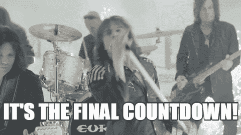

# React 中的状态是什么？

> 原文：<https://dev.to/kritirai/what-is-state-in-react-4im6>

在英语中， ***状态*** 指的是“某人或某物在特定时间所处的特定状态”，React 也是如此。状态基本上是一个 JavaScript 对象，它存储组件中容易发生变化的数据，使组件能够跟踪呈现之间不断变化的信息。这就是为什么组件*在本质上是有反应的。*

## **这个为什么**

如果你有一个静态 app，**不要用状态**。然而，如果你希望你的应用程序是交互式的，比如一个显示和更新时间的时钟部件，或者一个可以登录和退出、添加、删除和更新资源的应用程序——这将涉及状态。

**但是，等一下我们不是用道具在组件中存储数据吗？**是的，但是这里的关键区别是*属性*是不可变的(只读的),因为组件不能改变它们的属性，因为它们是从父组件传下来的。相比之下，组件可以完全控制自己的状态，并可以修改它。

## **该如何如何**

让我们看一个例子(受 [React docs](https://reactjs.org/docs/state-and-lifecycle.html) 中滴答作响的时钟例子的启发)来看看*状态*是如何工作的。

我们将构建一个简单的`Countdown`组件来呈现新年的最后倒计时。

[](https://res.cloudinary.com/practicaldev/image/fetch/s--HhUN4S4B--/c_limit%2Cf_auto%2Cfl_progressive%2Cq_66%2Cw_880/https://i.pinimg.com/originals/1f/9f/43/1f9f43d0d06374e4bfbe441f2c2ab876.gif)

请记住，

> *状态*是仅在*类*中可用的功能

因此，让我们从为组件构建一个 ES6 类开始，并在其中编写一些伪代码来展示它应该做什么。

```
import React from 'react'
import ReactDOM from 'react-dom';

export default class Countdown extends React.Component {

 timer () {
 // some function that updates the  countdown
 }

 render () {
  return ( 
  // shows the countdown 10 through 1 and renders the message HAPPY NEW YEAR!!
  )
 }
}

const element = <Countdown />

ReactDOM.render(element, document.getElementById('root')); 
```

现在，为了操纵国家，你应该有一些东西开始，对不对？没错，一个**初始状态。**那么，让我们开始吧——让我们声明组件的初始状态，并赋予它一个属性`secondsLeft`。我们将从 10 `secondsLeft`开始倒数，直到 0 `secondsLeft`。现在，我们在哪里声明初始状态？它是构造函数！因为这是在我们的组件挂载之前触发的，这使得它成为设置包括初始状态在内的默认设置的完美候选。让我们在组件类中添加下面的代码块。

```
constructor() {
  super();
  this.state = { secondsLeft: 10}
} 
```

> 如果您希望在类中使用`this.props`，请确保将`props`作为参数传递给`constructor()`和`super()`。

现在，让我们工作在我们的`timer()`函数上，通过从它减去 1 来更新我们的组件的状态`secondsLeft`。

```
timer = () => {
 if (this.state.secondsLeft > 0) {
  this.setState({ secondsLeft: this.state.secondsLeft - 1 })
 }
} 
```

> 我们使用`this.setState()`来更新组件的状态，而不是像`this.state = someValue`那样做

调用`this.setState()`告诉 React 组件的状态已经更新，组件需要重新渲染。

另外，请注意，我使用了一个箭头函数来定义`timer`。这是为了将关键字`this`绑定到我们正在处理的组件的实例。

继续，让我们添加一个生命周期方法`componentDidMount()`，它将在组件输出在 DOM 中呈现后运行。这也是一个叫`timer()`的好地方。因此，从初始状态开始，随着`timer()`的触发，组件的状态每秒都在更新，从而每秒重新呈现组件。

```
componentDidMount() {
 setInterval(
  () => this.timer(),
   1000
   );
 } 
```

下面是最终代码:

```
import React from 'react';
import ReactDOM from 'react-dom';

export default class Countdown extends React.Component {
  constructor() {
    super();
    this.state = { secondsLeft: 10 }
  }

  componentDidMount() {
    setInterval(
      () => this.timer(),
      1000
    );
  }

 timer = () => {
  if (this.state.secondsLeft > 0) {
     this.setState({ secondsLeft: this.state.secondsLeft - 1 })
  }
 }

  render() {
    const message =  (this.state.secondsLeft === 0 )? <font color="red">Happy New Year!!!</font> : this.state.secondsLeft 
    return <h1>{ message }</h1>
  }
}

const el = <Countdown  />

ReactDOM.render(el, document.getElementById('root')); 
```

## T2】...aaaaand 开始！！

[](https://i.giphy.com/media/u0ag71wII1yBjMAOAc/giphy.gif)

## ***TL；*博士**

*   如果您想要交互式组件，请使用状态
*   状态是仅在类组件中可用的特性
*   React 将状态作为一个可以通过`this.state`访问的对象来维护
*   状态类似于 props，但它是私有的，完全由组件控制，不能在组件之外访问和修改(*想想封装*)
*   不要像`this.state = someValue`那样直接设置状态，而是使用`this.setState()`

### 资源:

*   [道具和状态](https://github.com/uberVU/react-guide/blob/master/props-vs-state.md)
*   [思考在反应](https://reactjs.org/docs/thinking-in-react.html)
*   [组件和道具](https://reactjs.org/docs/components-and-props.html)
*   [状态和生命周期](https://reactjs.org/docs/state-and-lifecycle.html)