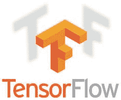
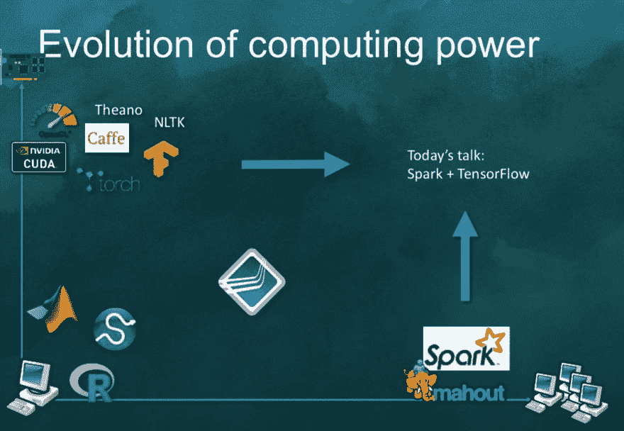

# 什么是张量框架？TensorFlow + Apache Spark

> 原文：<https://dev.to/azure/what-is-tensorframes--tensorflow--apache-spark-4ih6>

* * *

**首先，什么是张量框架？**

TensorFrames 是由 Apache Spark contributers 创建的开源软件。它的功能和参数与 TensorFlow 框架中的相同。它是 Apache Spark 数据帧的 Apache Spark DSL(领域特定语言)包装器。它允许我们用 TensorFlow 功能操作数据帧。而且不，它是**而不是** [熊猫数据帧](https://medium.com/r/?url=https%3A%2F%2Fwww.tutorialspoint.com%2Fpython_pandas%2Fpython_pandas_dataframe.htm)，它是基于阿帕奇 Spark 数据帧。

**..但是等等，TensorFlow (TF)是什么？**

TensorFlow 是一个开源软件库，用于数据流和跨一系列任务的差异化编程。它是一个符号数学库，也用于机器学习应用，如神经网络。

[](https://res.cloudinary.com/practicaldev/image/fetch/s--5gE_ZyIu--/c_limit%2Cf_auto%2Cfl_progressive%2Cq_auto%2Cw_880/https://cdn-images-1.medium.com/max/1600/1%2Af5ySeQqn5E8SpRBZXKcvCQ.jpeg)

**..还有阿帕奇 Spark？**

Apache Spark 是一个开源的分布式通用集群计算框架。

[](https://res.cloudinary.com/practicaldev/image/fetch/s--kQH2JLR3--/c_limit%2Cf_auto%2Cfl_progressive%2Cq_auto%2Cw_880/https://cdn-images-1.medium.com/max/1600/0%2AYgOQ8BsHBSg4BAMJ.png)

#### 关于规模的一句话

今天当我们提到规模时，我们通常会谈到两种选择；水平缩放和垂直缩放。

*   **水平比例**–添加计算能力大致相同的额外机器
*   **垂直比例** -为我们目前正在使用的机器增加更多资源。它可以是从 CPU 升级到 GPU 的处理器、更多内存(RAM)等等。

有了 TensorFrames，我们可以两者兼得，更多的处理器计算能力，更多的机器。在只有 TensorFlow 的情况下，我们通常专注于通过垂直扩展来增加更多功能，现在有了 Apache Spark 支持，我们可以同时进行垂直和水平扩展。但是，我们怎么知道我们实际上需要多少呢？要回答这个问题，我们需要了解应用程序的全部使用情况，并相应地进行规划。

对于每个变化，比如增加一台机器或者从 CPU 升级到 GPU，我们都有*停机时间。*在云中，调整集群大小或增加更多计算能力只需几分钟，而在本地，我们需要添加新机器和升级机器处理器，这可能需要几天，有时甚至几个月。

因此，更灵活的解决方案是公共云。

在下图中，水平缩放是 X 轴，垂直缩放是 Y 轴。

[](https://res.cloudinary.com/practicaldev/image/fetch/s--j_MHAmpX--/c_limit%2Cf_auto%2Cfl_progressive%2Cq_auto%2Cw_880/https://cdn-images-1.medium.com/max/1600/1%2AANnCcyS8zH3FBi0n7T7eFA.png)* * Apache Spark conf 上蒂姆·亨特演示的幻灯片

#### 在跳到函数之前，让我们先了解一些重要的 TensorFlow 词汇:

#### 张量

一个静态类型的多维数组，其元素属于泛型类型。

#### GraphDef

`Graph`或`Computional Graph`是 TensorFlow 呈现计算的核心概念。当我们使用 TensorFlow 时，我们首先创建自己的`Computation Graph`，并将`Graph`传递给 TensorFlow。`GraphDf`是`Graph`的连载版。

#### 操作

对张量执行计算的图形节点。操作是`Graph`中的一个节点，它将零个或多个`Tensors`(由图中的其他操作产生)作为输入，并产生零个或多个`Tensor`作为输出。

#### 身份

当我们想要在设备之间显式传输张量时使用`tf.identity`(例如，从 GPU 到 CPU)。该操作将节点添加到图中，当输入和输出的设备不同时，该操作会生成一个副本。

#### 常数

常量有以下参数，可以根据需要调整这些参数以获得所需的函数。它和变量一样，但是它的值不能改变。常数可以是:

*   `value`:输出类型`dtype`的常量值(或列表)。
*   `dtype`:得到的张量的元素的类型。
*   `shape`:结果张量的可选维度。
*   `name`:张量的可选名称。
*   `verify_shape`:允许验证值的形状的布尔值。

#### 占位符

为数据分配存储空间(例如，在输入期间为图像像素数据分配存储空间)。初始值不是必需的(但可以设置，见`tf.placeholder_with_default`)。相对于变量，你需要声明初始值。\

#### 一些阿帕奇星火词汇

#### [数据帧](#dataframe%C2%A0)

这是一个*分布式的*数据集合，这些数据被组织到指定的列中，提供过滤、分组或计算集合的操作。Dataframe 数据通常分布在多台机器上。它可以在内存数据中，也可以在磁盘上。

#### 关系组数据集

在`DataFrame`上聚合的一组方法，由 [groupBy](https://medium.com/r/?url=http%3A%2F%2Fmaxpumperla.com%2Fjava-book%2Fapi%2Fscala%2Forg%2Fapache%2Fspark%2Fsql%2FDataset.html%23groupBy%28col1%3AString%2Ccols%3AString*%29%3Aorg.apache.spark.sql.RelationalGroupedDataset) 、 [cube](https://medium.com/r/?url=http%3A%2F%2Fmaxpumperla.com%2Fjava-book%2Fapi%2Fscala%2Forg%2Fapache%2Fspark%2Fsql%2FDataset.html%23cube%28col1%3AString%2Ccols%3AString*%29%3Aorg.apache.spark.sql.RelationalGroupedDataset) 或 [rollup](https://medium.com/r/?url=http%3A%2F%2Fmaxpumperla.com%2Fjava-book%2Fapi%2Fscala%2Forg%2Fapache%2Fspark%2Fsql%2FDataset.html%23rollup%28col1%3AString%2Ccols%3AString*%29%3Aorg.apache.spark.sql.RelationalGroupedDataset) 创建。

主要方法是`agg`函数，它有多个变量。为了方便起见，该类还包含一些一阶统计量，如`mean`、`sum`。

现在我们更好地理解了术语，让我们看看功能。

### 功能— TensorFlow 版本 0.6.0

众所周知，Apache Spark 是一个大规模数据分析平台，与 TensorFlow 一起，我们得到了 TensorFrames，其中包含三类数据操作:

*   绘图
*   减低
*   聚合

让我们来了解一下每个功能。

```
  -1- Mapping 
```

映射操作将列转换和/或添加到给定的数据帧中。

每个功能都通过两个 API 来访问，一个接收 Operation，另一个接收 DataFrame、GraphDef 和 ShapeDescription。

公开的 API: