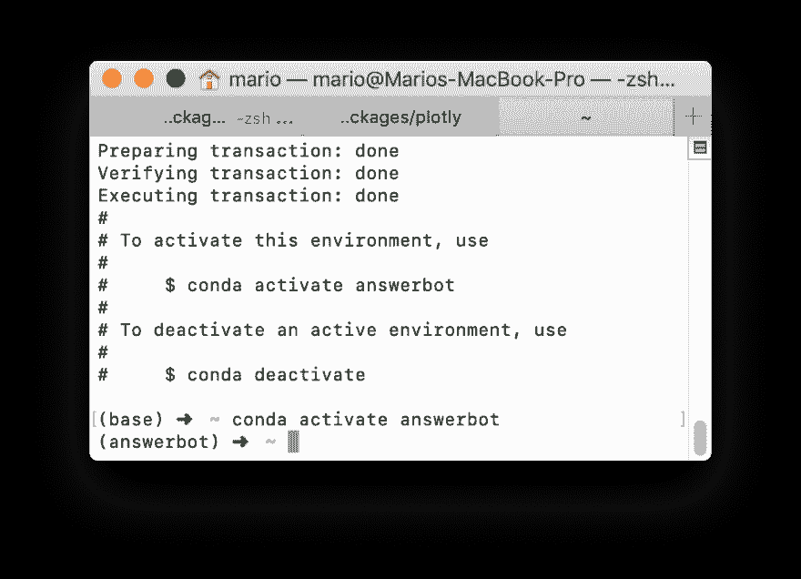
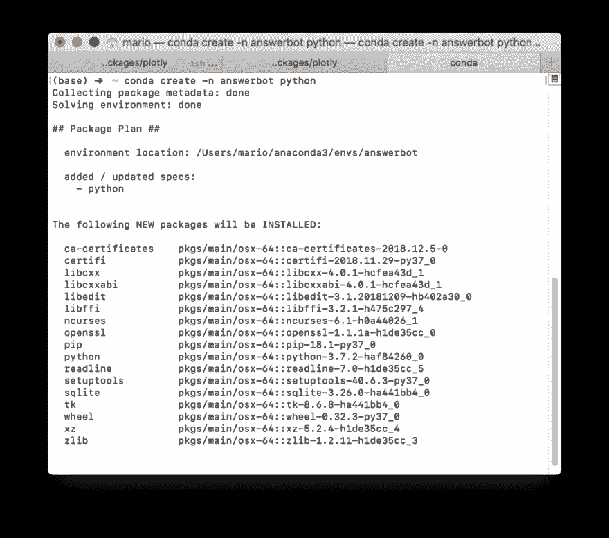

# 康达和 pip 有什么区别，如何不再次打破你的环境？

> 原文：<https://dev.to/mariokostelac/what-is-the-difference-between-conda-and-pip-and-how-not-to-break-your-environment-again-4bhi>

当我进入机器学习工程师的角色时，我首先注意到的事情之一是包管理混乱。经常有人问我*“我应该用 conda 还是 pip 安装包？”。" conda 只是预装了包的 python 吗？"。“我得到了一些编译器错误。我以为我们只用 python？!"。*

我不知道该怎么回答。每个人都在混合和匹配单词 pip、conda 和 install，直到它开始工作！它通常是有效的，直到它完全打破你的环境。而且你不知道它为什么坏了，所以你从零开始移除并安装所有的软件包。我在那里。我可以保证事情不一定是那样的！

在你阅读了 pip 和 conda 的工作原理后，你就不会再破坏你的环境了。

## 皮普

pip(递归“pip 安装包”)是一个 Python 包安装程序。它会下载并安装您想要使用的软件包。康达也是如此。不同之处在于 pip 只做这个，不做其他任何事情！

皮普很简单:

*   它不支持安装同一个包的多个版本——这就是为什么你不能使用同一个包的不同版本的项目！
*   对于许多包，它使用你的编译器，这可能是不兼容的——这就是你的编译器错误的来源
*   它对 python 版本一无所知——python 2，python 3？Python 3.5 还是 3.6？这也没办法。

## 康达

康达做的远不止皮普！它是为像你和我一样的人，做机器学习和数据科学的人制作的。

*   它允许你使用同一个包的不同版本。
*   它给了你使用任何你想要的 python 版本的权力！
*   它在发布到包存储库之前编译包，所以您不会得到编译错误。

(它实际上做得更多，但是我们将在这里停止🤓)

康达可以做到这一点，因为**是一名包装经理，也是一名环境经理**。它隔离了不同的 python 和包版本，因此它们不会相互影响。

## 每个项目用一个康达，远离麻烦！

*如果没有安装，[去安装 anaconda](https://www.anaconda.com/distribution/) ！*

帮助我远离麻烦的系统是为每个项目创建一个 conda 环境。每当您开始一个新项目时，只需运行 conda env create -n。

如果您想要使用特定版本的 python，请运行`conda env create -n <project_name> python=3.5`(针对 3.5 版)。

它将安装一些基本的软件包，并给出激活创建的环境的指令。记住这一点很重要。每次想要在新的控制台会话中使用环境时，您都必须显式激活它。不过很简单，输入`conda activate <project_name>`就可以了。

### 安装软件包

一旦你激活了 conda 环境，你就可以安装任何你想要的包——只需输入`conda install <package_name>`。就像你对皮普做的一样。

### 但是我经常有这些一次性的笔记本，不适合任何项目！🔧

没问题，只是创造一个一次性的环境！(提示:`conda env create -n onceoff`)。你可能会破坏它，但是你可以用 conda env remove onceoff 移除它。这比卸载所有 pip 包或所有 conda 要快得多🍻。

### 我忘了环境名🤦🏼‍♂️

`conda env list`将列出所有现有的环境。

这种设置为我节省了几个小时的调试时间，找出错误的包版本，然后从头开始重新安装。我很想听听它是如何为您工作的！如果不是，那是什么？🗣